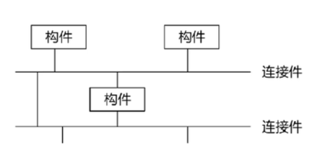

# 架构风格都有哪些？C2风格是什么？它的适应场景？

### 一、常见架构风格（一网打尽）

先给总览（软考 / 教科书主流分类）：

#### 1）数据流风格

- **批处理**：整体数据一步到位（如 ETL、报表）
- **管道 - 过滤器**：数据流式处理（如 Unix 命令、日志分析）

#### 2）调用 / 返回风格（最常用）

- **主程序 - 子程序**：传统结构化程序
- **面向对象**：对象 + 方法调用（Java/C#）
- **分层（Layered/N 层）**：表现层→业务层→数据层

#### 3）独立构件风格（松耦合）

- **事件驱动 / 发布 - 订阅**：消息总线、异步解耦（MQ、Kafka）
- **进程通信**：IPC、RPC、微服务基础
- **C2 风格**：下面重点讲

#### 4）虚拟机 / 解释器风格

- **解释器**：规则引擎、脚本引擎
- **基于规则**：专家系统、风控引擎

#### 5）仓库风格（以数据为中心）

- **数据库系统**：共享 DB、CRUD
- **黑板系统**：多知识源协作（AI、NLP、图像识别）
- **超文本**：网页 / 文档链（早期 Web）

#### 6）分布式 / 现代架构风格

- **SOA**：粗粒度服务 + ESB
- **微服务**：细粒度、去中心化、独立部署
- **微内核（插件）**：核心极小、功能插件化（IDE、浏览器）
- **P2P**：对等网络（区块链、BT）
- **空间基 SBA**：内存网格、无中心（高频交易）

---

### 二、C2 风格是什么（重点）

**C2 = 层次化、消息驱动、组件 - 连接件架构**，90 年代 UCI 提出，核心是**严格的 “顶 / 底” 接口 + 禁止组件直连**。

#### 1）核心组成

- **构件（Component）**：功能单元，有**顶部接口、底部接口**
- **连接件（Connector）**：消息路由 / 总线，也有**顶 / 底**
- **消息**：唯一通信方式（通知、请求）

#### 2）四条铁律（必背）

1. 构件、连接件都有**顶、底**
2. 构件**只能连连接件**，构件之间**绝对不能直连**
3. 连接件可连任意数量构件 / 连接件
4. 连接件互连：必须**底→顶**

#### 3）核心特点

- **完全松耦合**：构件互不感知，只认消息
- **异步消息驱动**：无强时序，易并行
- **可动态插拔**：运行时增删 / 替换构件
- **层次化**：消息上下流转，结构清晰

---

### 三、C2 适用场景（软考高频）

一句话：**需要高模块化、动态扩展、异构集成、GUI 为主的系统**。

#### 典型场景

1. **复杂 GUI 系统**
    
    - 多独立 UI 组件（图表、地图、告警、工具栏）
    - 如：监控大屏、IDE（VS Code 插件）、微前端
    
2. **可插拔 / 插件化平台**
    
    - 核心稳定、功能模块动态加载
    - 如：Eclipse、浏览器扩展、智能家居网关
    
3. **异构系统集成**
    
    - 多厂商、多技术栈组件拼接
    - 如：企业集成平台、医疗系统（设备 + HIS+LIS）
    
4. **分布式 / 实时控制系统**
    
    - 传感器、控制器、UI 分离，异步协作
    - 如：工业物联网、自动驾驶模块通信
    
5. **需频繁演化、重配置的系统**
    
    - 需求多变、模块常替换
    - 如：低代码平台、动态报表系统
    

#### 不适合场景

- 强同步、高吞吐、低延迟（消息开销大）
- 简单 CRUD（过度设计）
- 全局状态强一致（调试难、行为难预测）

---

### 四、C2 vs 黑板（易混点）

- **C2**：组件**对称**、消息**上下层路由**、无共享数据；适合 GUI / 插件
- **黑板**：**共享数据区（黑板）**、知识源只读 / 写黑板；适合 AI / 信号处理

---

### 五、速记口诀

- 架构风格：**数调独虚仓，分微 P2 插**
- C2：**构件连接件，顶底不能乱；组件不直连，消息走总线；GUI 插件集，异构集成赞**