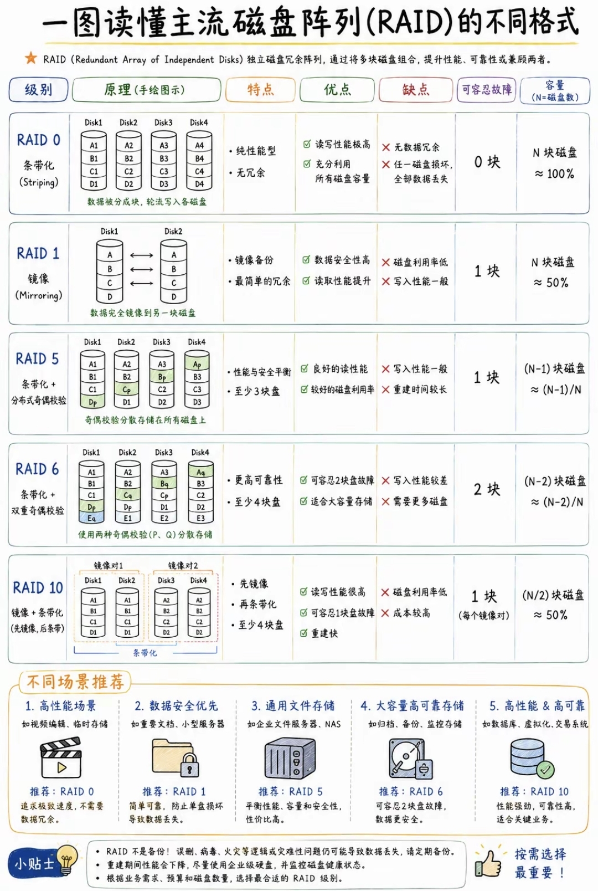

# 每日打卡 2026-06-11

## 单选题（共9题）

### 第1题

**题目：** 一个进程被唤醒意味着（）。

**选项：**
- A. 该进程重新占有了CPU
- B. 它的优先权变为最大
- C. 其PCB移至就绪队列队首
- D. 进程变为就绪状态

**正确答案：** D

**你的答案：** D

**解析：** 进程主要有运行、就绪、阻塞三种状态。当一个进程被唤醒时，意味着它从阻塞状态变为就绪状态，等待被调度执行。唤醒操作不会使进程直接占有CPU（A错误），不会改变其优先级（B错误），也不一定会将其PCB移至就绪队列队首（C错误）。

---

### 第2题

**题目：** 阿姆达尔（Amdahl）定律量化定义了通过改进系统中某个组件的性能，使系统整体性能提高的程度。假设某一功能的处理时间为整个系统运行时间的60%，若使该功能的处理速度提高至原来的5倍，则根据阿姆达尔定律，整个系统的处理速度可提高至原来的（）倍。

**选项：**
- A. 1.333
- B. 1.923
- C. 1.5
- D. 1.829

**正确答案：** B

**你的答案：** A

**解析：** 根据阿姆达尔定律，系统整体加速比计算公式为：
整体加速比 = 1 / [(1 - p) + p/s]
其中：
- p = 可改进部分的比例 = 60% = 0.6
- s = 该部分的加速比 = 5

代入公式：
整体加速比 = 1 / [(1 - 0.6) + 0.6/5] = 1 / [0.4 + 0.12] = 1 / 0.52 ≈ 1.923

所以选B。

---

### 第3题

**题目：** 系统的（）性能指标有系统的可靠性、系统的吞吐率（量）、系统响应时间、系统资源利用率、可移植性。

**选项：**
- A. 计算机
- B. 操作系统
- C. 数据库
- D. web服务器

**正确答案：** B

**你的答案：** B

**解析：** 操作系统的性能指标有系统的可靠性、系统的吞吐率（量）、系统响应时间、系统资源利用率、可移植性。

---

### 第4题

**题目：** 计算机系统的性能一般包括两个大的方面。一个方面是它的可靠性或可用性，也就是计算机系统能正常工作的时间，其指标是（9），也可以是在一段时间内，能正常工作的时间所占的百分比。

**选项：**
- A. 能够持续工作的时间长度（例如，平均无故障时间）
- B. 系统在单位时间内能处理正常作业的个数
- C. 从系统得到输入到给出输出之间的时间
- D. 在给定的时间区间中，各种部件（包括硬设备和软件系统）被使用的时间与整个时间之比

**正确答案：** A

**你的答案：** A

**解析：** 计算机系统的性能一般包括两个大的方面。一个方面是它的可靠性或可用性，也就是计算机系统能正常工作的时间，其指标可以是能够持续工作的时间长度（例如，平均无故障时间），也可以是在一段时间内，能正常工作的时间所占的百分比；另一个方面是它的处理能力或效率，这又可分为三类指标，第一类指标是吞吐率（例如，系统在单位时间内能处理正常作业的个数），第二类指标是响应时间（从系统得到输入到给出输出之间的时间），第三类指标是资源利用率，即在给定的时间区间中，各种部件（包括硬设备和软件系统）被使用的时间与整个时间之比。当然，不同的系统对性能指标的描述有所不同，例如，计算机网络系统常用的性能评估指标为信道传输速率、信道吞吐量和容量、信道利用率、传输延迟、响应时间和负载能力等。由以上描述知，A选项符合题目要求。B、C、D选项分别描述的是吞吐率、响应时间和资源利用率，这些都是计算机系统性能的处理能力方面的指标。

---

### 第5题

**题目：** 下列关于软件可靠性的叙述，不正确的是（）。

**选项：**
- A. 由于影响软件可靠性的因素很复杂，软件可靠性不能通过历史数据和开发数据直接测量和估算出来
- B. 软件可靠性是指在特定环境和特定时间内，计算机程序无故障运行的概率
- C. 在软件可靠性的讨论中，故障指软件行为与需求的不符，故障有等级之分
- D. 排除一个故障可能会引入其他的错误，而这些错误会导致其他的故障

**正确答案：** A

**你的答案：** B

**解析：** 软件可靠性是指在特定环境和特定时间内,计算机程序无故障运行的概率。在软件可靠性的讨论中,故障指软件行为与需求的不符,故障有等级之分。纠正一个故障可能会引入其他的错误,而这些错误会导致其他的故障,需要注意的是,与其他属性不同,软件可靠性能够通过历史数据和开发数据直接测量和估算出来,因此本题应该选A。

---

### 第6题

**题目：** 假如有 4 块 80T 的硬盘，采用 RAID6 的容量是（）。

**选项：**
- A. 40T
- B. 80T
- C. 160T
- D. 240T

**正确答案：** C

**你的答案：** C

**解析：** RAID6的容量是(N-2)*最低容量 = (4-2)*80T = 160T。

---

### 第7题

**题目：** 以下关于计算机性能改进的叙述中，正确的是（）。

**选项：**
- A. 如果某计算机系统的CPU利用率已经达到100%则该系统不可能再进行性能改进
- B. 使用虚存的计算机系统如果主存太小，则页面交换的频率将增加，CPU的使用效率就会降低，因此应当增加更多的内存
- C. 如果磁盘存取速度低，引起排队，此时应安装更快的CPU.以提高性能
- D. 多处理机的性能正比于CPU的数目，增加CPU是改进性能的主要途径

**正确答案：** B

**你的答案：** B

**解析：** 计算机运行一段时间后，经常由于应用业务的扩展，发现计算机的性能需要改进。计算机性能改进应针对出现的问题，找出问题的瓶颈，再寻求适当的解决方法。计算机的性能包括的面很广，不单是CPU的利用率。即使CPU的利用率已经接近100%，这只说明目前正在运行大型计算任务。其他方面的性能可能被外设阻塞着，而改进外设成为当前必须解决的瓶颈问题。如果磁盘存取速度低，则应增加新的磁盘或更换使用更先进的磁盘。安装更快的CPU不能解决磁盘存取速度问题。多处理机的性能并不能正比于CPU的数目，因为各个CPU之间需要协调，需要花费一定的开销。使用虚存的计算机系统如果主存太小，则主存与磁盘之间交换页面的频率将增加，业务处理效率就会降低，此时应当增加更多的内存。这就是说，除CPU主频外，内存大小对计算机实际运行的处理速度也密切相关。

---

### 第8题

**题目：** 下列不属于数据库管理系统性能指标的是（）。

**选项：**
- A. 最大并发事务处理能力
- B. 系统上下文切换
- C. 负载均衡能力
- D. 最大连接数

**正确答案：** B

**你的答案：** C

**解析：** A：错误，最大并发事务处理能力是数据库性能指标 B：正确，系统上下文切换是操作系统的性能指标 C：错误，负载均衡能力是数据库性能指标 D：错误，最大连接数是数据库性能指标 【教材依据】数据库管理系统性能指标包括最大并发事务处理能力、负载均衡能力、最大连接数等。

---

### 第9题

**题目：** 对计算机评价的主要性能指标有时钟频率、（1）、存储器的存取周期和内存容量等，对数据库管理系统评价的主要性能指标有（2）、数据库所允许的索引数量和最大连接数等。

**问题1【单选题】**
- A. 丢包率
- B. 端口吞吐量
- C. 可移植性
- D. 运算精度

**正确答案：** D
**你的答案：** B

**问题2【单选题】**
- A. MIPS
- B. 支持协议和标准
- C. 最大并发事务处理能力
- D. 时延抖动

**正确答案：** C
**你的答案：** C

**解析：** 性能指标是软硬件性能指标的集成，在硬件中包括计算机、各种通信交换设备、各类网络设备等；在软件中包括操作系统、协议，以及应用程序等。
对计算机评价的主要性能指标有时钟频率(主频)、运算速度、运算精度、内存的存储容量、存储器的存取周期、数据处理速率(Processing Data Rate, PDR)、吞吐率、各种响应时间、各种利用率、RASIS特性(即可靠性Reliability、可用性Availability、可维护性、完整性安全性和平均故障响应时间、兼容性、可扩充性和性能价格比)。
衡量数据库管理系统的主要性能指标包括数据库本身和管理系统两部分，即数据库的大小、数据库中表的数量、单个表的大小、表中允许的记录(行)数量、单个记录(行)的大小、表中所允许的索引数量、数据库所允许的索引数量、最大并发事务处理能力、负载均衡能力及最大连接数等。
因此，(1)空应填"运算精度"，(2)空应填"最大并发事务处理能力"。