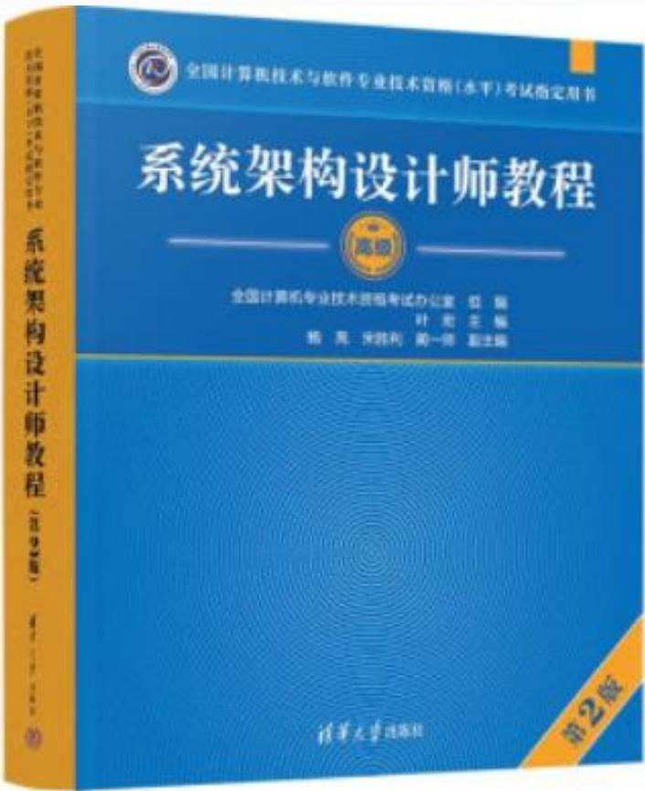

# 系统架构设计师考试介绍

## 一、考试概述

系统架构设计师在软考体系中属于**高级资格**，是非常有含金量的考试科目。

### 基本信息

- **考试时间**：每年两次
  - 5月的第三个周六
  - 10月的第三个周六
- **报名方式**：网上报名缴费
- **报名网址**：[http://www.ruankao.org.cn](http://www.ruankao.org.cn)
- **报名时间**：各省不同，一般在开考前3个月，请密切关注报名网站通知
- **成绩查询**：[http://www.ruankao.org.cn](http://www.ruankao.org.cn)（约12月15日左右）
- **合格标准**：满分75分，各科目均达到**45分**即为合格

---

## 二、考试科目设置

### 考试安排

#### 上午场：综合知识 + 案例分析（联考）

**考试时间**：8:30 - 12:30（共240分钟）

1. **综合知识**
   - 考试形式：机考
   - 题型：75道选择题
   - 作答时间：最短120分钟，最长150分钟

2. **案例分析**
   - 考试形式：机考
   - 题型：3个案例分析题（第2-5题中四选二）
   - 说明：与综合知识采用联考方式

#### 下午场：论文写作

**考试时间**：14:30 - 16:30（共120分钟）

- **考试形式**：机考
- **题型**：1个论文题目（四选一）

---

## 三、考试难点分析

### 主要挑战

1. **上午考试（综合知识）**
   - 考试范围广泛
   - 知识点繁多
   - 需要全面掌握各领域知识

2. **下午考试（案例分析与论文）**
   - 缺乏实际架构设计实践经验
   - 需要将理论知识与实际应用相结合
   - 论文写作需要体现专业深度和实践经验

---

---

## 五、推荐教程

### 官方教材

- **书名**：《系统架构设计师教程（第2版）》
- **主编**：叶宏
- **出版社**：清华大学出版社

---

## 六、备考建议

1. **制定学习计划**：提前3-6个月开始系统复习
2. **重视基础**：扎实掌握计算机系统、软件工程、数据库等基础知识
3. **实践结合**：积累架构设计实践经验，关注实际案例
4. **真题训练**：多做历年真题，熟悉考试题型和节奏
5. **论文准备**：提前准备论文素材，练习写作技巧
