# 系统架构设计师 - 系统架构概述

## 第一章 绪论

**本章内容：**
- 1.1 系统架构概述
- 1.2 系统架构设计师概述
- 1.3 如何成为一名好的系统架构设计师

---

## 一、系统架构的定义及发展历程

### 1. 系统架构的定义

**系统架构（System Architecture）** 是系统的一种整体的高层次的结构表示，是系统的骨架和根基，支撑和链接各个部分，包括组件、连接件、约束规范以及指导这些内容设计与演化的原理。它是刻画系统整体抽象结构的一种手段。

> 架构设计优劣决定了系统的健壮性和生命周期的长短。

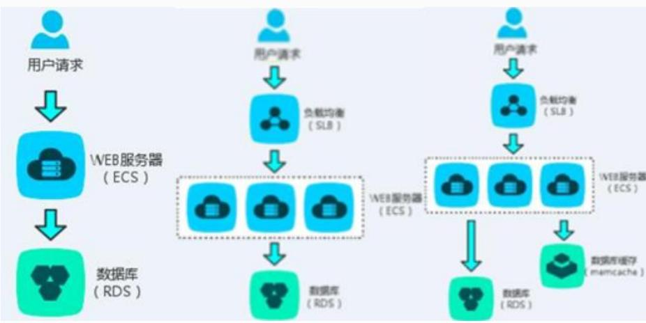

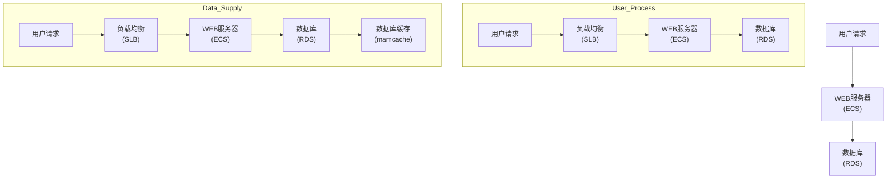

### 2. 架构设计的作用

架构设计的作用主要包括以下几点：

1. 解决相对复杂的**需求分析问题**
2. 解决**非功能属性**在系统占据重要位置的设计问题
3. 解决生命周期长、**扩展性需求高**的系统整体结构问题
4. 解决系统基于**组件**需要的集成问题
5. 解决**业务流程再造**难的问题

> 系统架构设计是成熟系统开发过程中的一个重要环节，它不仅是连接用户需求和系统进一步设计与实现的桥梁，也是系统早期阶段质量保证的关键步骤。

### 3. 发展历程

软件架构大致经历了四个发展阶段：

| 阶段 | 时间 | 主要特点 |
|------|------|----------|
| 基础研究阶段 | 1968-1994 | 逐步形成以描述软件高层次结构为目标的体系，形成软件架构的雏形，模块化开发方法被逐步采用 |
| 概念体系和核心技术形成阶段 | 1999-2000 | Booch、Runbaugh等对软件架构进行全新诠释，认为架构是一系列重要决策模式，软件组件化技术成为重要成果 |
| 理论体系完善与发展阶段 | 1996至今 | 架构研究成为软件工程领域重点，包括架构描述与表示、分析、设计与测试、发现、演化与重用等 |
| 普及应用阶段 | 2000至今 | 软件架构在实际项目中广泛应用 |

---

## 二、软件架构的常用分类及建模方法

### 1. 软件架构的常用分类

软件架构主要分为以下五种类型：

1. **分层架构**
2. **事件驱动架构**
3. **微核架构**
4. **微服务架构**
5. **云架构**

---

### (1) 分层架构

将软件分成若干个水平层，每层都有清晰的角色和分工，不需要知道其他层的细节，层与层之间通过接口进行通信。

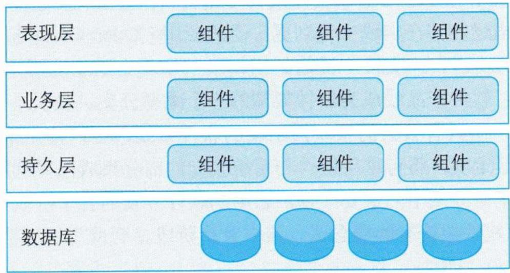

**图1-2 分层架构**

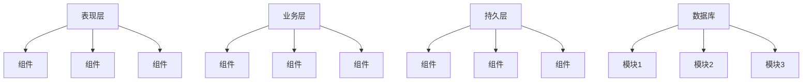

---

### (2) 事件驱动架构

**事件驱动架构（EDA）** 是通过事件进行通信的软件架构，是一种流行的分布式异步架构模式，适用于松散耦合系统。

#### 组成部分：

| 组件 | 功能 |
|------|------|
| 事件队列 | 接收事件的入口 |
| 分发器 | 将不同的事件分发到不同的业务逻辑单元 |
| 事件通道 | 分发器与处理器之间的联系渠道 |
| 事件处理器 | 实现业务逻辑，处理完成后会发出事件，触发下一步操作 |

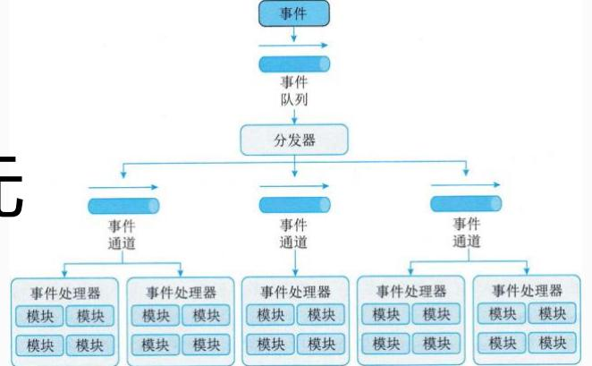

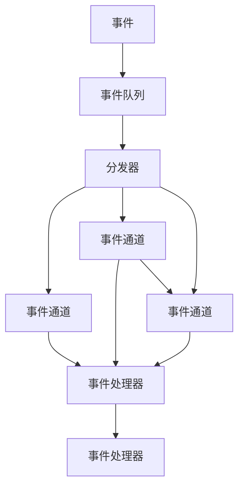

---

### (3) 微核架构

又称为**插件架构**，是一种面向功能进行拆分的可扩展性架构，软件的内核相对较小，主要功能和业务逻辑都通过插件实现。

#### 包含两类组件：

- **核心系统（内核）**：负责和具体业务功能无关的通用功能（系统运行的最小功能），例如模块加载、模块间通信等
- **插件模块**：负责实现具体的业务逻辑，插件是互相独立的，插件之间的通信应该减少到最低，避免出现互相依赖的问题

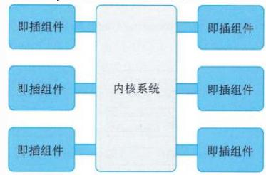

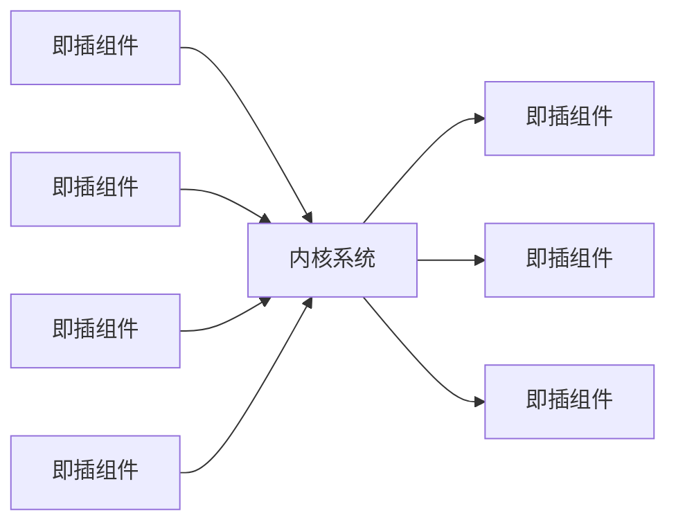

---

### (4) 微服务架构

#### 1) 单体架构

将业务的所有功能集中在一个项目中开发，打成一个包部署。

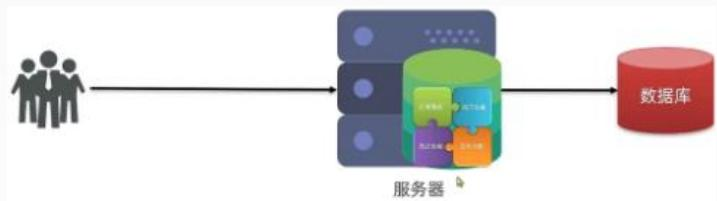

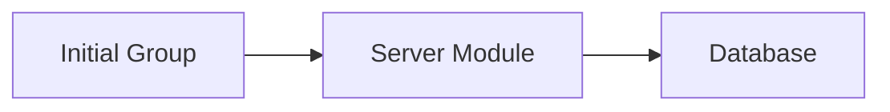

#### 2) 分布式架构

根据业务功能对系统进行拆分，每个业务模块作为独立项目开发，称为一个服务。

#### 3) 微服务架构

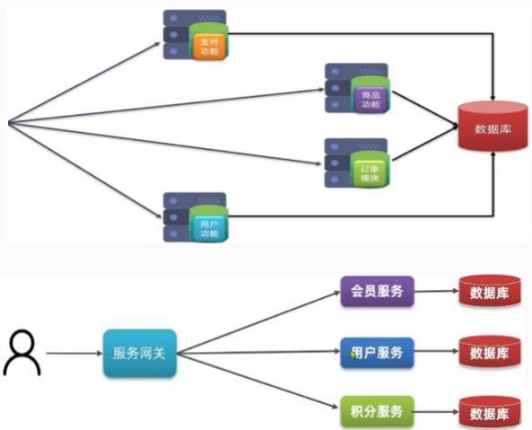

微服务架构是服务导向架构（SOA）的升级。每一个服务就是一个独立的部署单元，这些单元都是分布式互相解耦，通过远程通信协议（如REST、SOAP）联系。

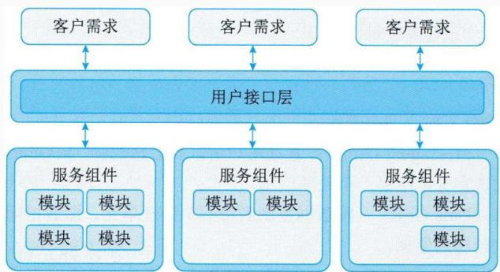

*此图展示了用户界面结构，显示客户需求如何分布在三个层级（用户界面），进而进一步分解为服务组件。*

---

### (5) 云架构

云架构指构成云系统的各种技术组件的组合。通常涉及使用虚拟化技术将多个资源放在一起并通过网络共享它们。云架构主要解决**扩展性**和**并发**的问题，是最容易扩展的架构。

#### 云架构的两个主要部分：

| 组件 | 功能 |
|------|------|
| 处理单元 | 实现业务逻辑 |
| 虚拟中间件 | 负责通信、保持会话控制、数据复制、分布式处理和处理单元的部署 |

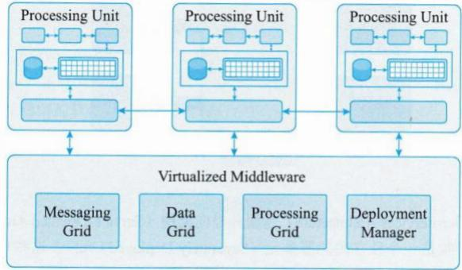

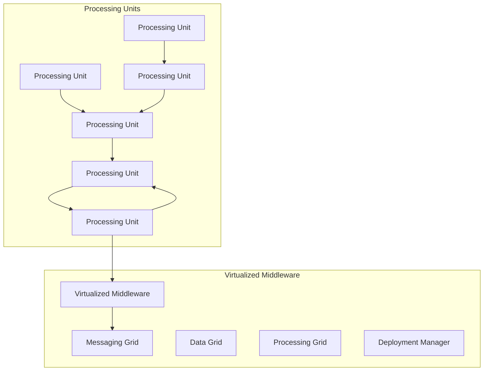

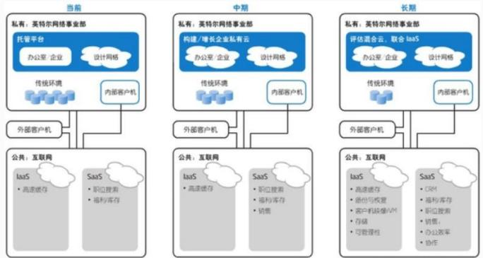

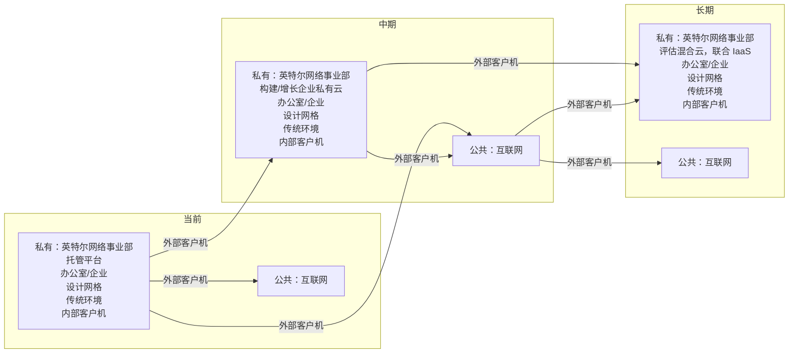

---

### 2. 系统架构的常用建模方法

软件架构的模型分成**4种**：

| 模型类型 | 说明 |
|----------|------|
| **结构模型** | 以架构的构件、连接件和其他概念来刻画结构，通过结构来反映系统的重要语义内容，包括系统的配置、约束、隐含的假设条件、风格和性质。研究核心是架构描述语言 |
| **框架模型** | 与结构模型类似，但不太侧重描述结构的细节，更侧重整体的结构，主要以特殊问题为目标建立针对和适应问题的结构 |
| **动态模型** | 对结构或框架模型的补充，主要研究系统的"大颗粒"行为的性质，例如描述系统的重新配置或演化 |
| **过程模型** | 研究构造系统的步骤和过程，其结构是遵循某些过程脚本的结果 |

> 这4种模型并不是完全独立的，通过有机的结合才可形成一个完整的模型来刻画软件架构。软件架构从不同角度来描述用户所关心架构的特征。

---

## 总结

本章介绍了系统架构的基本概念、发展历程、常用分类及建模方法，为后续深入学习系统架构设计奠定了基础。
