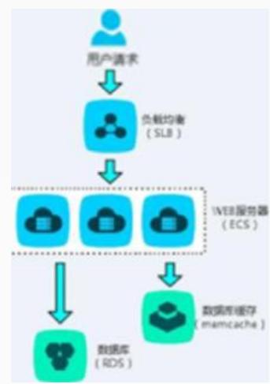
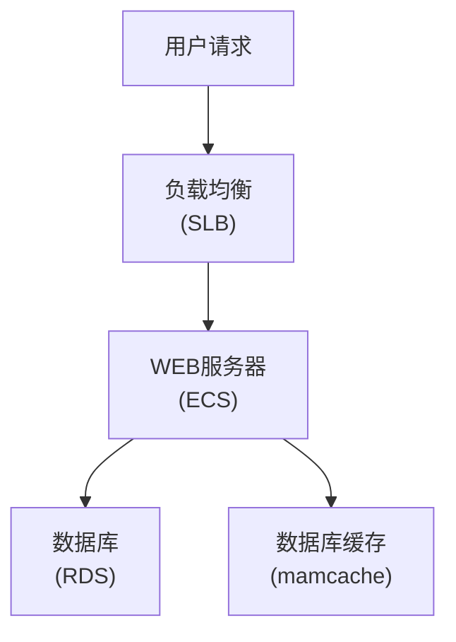
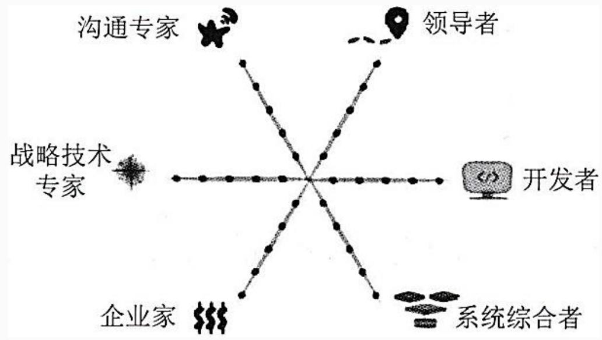

## 系统架构设计师

## 系统架构设计师概述

## 第一章 绪论

1.1 系统架构概述  
⚫ 1.2 系统架构设计师概述  
1.3 如何成为一名好的系统架构设计师

## 一、架构设计师的定义、职责和任务

## 1.架构师的定义

架构设计师是负责系统架构的人、团队或组织。

架构设计师是系统或产品线的设计责任人，是一个负责理解和管理并最终确认和评估非功能性系统需求(如软件的可维护性、性能、复用性、可靠性、有效性和可测试性等)，给出开发规范，搭建系统实现的核心构架，对整个软件架构、关键构件和接口进行总体设计并澄清关键技术细节的高级技术人员。

flowchart

## 2.架构设计师的职责

架构设计师的职责应该是技术领导，这意味着架构设计师除了拥有专门技能外，还必须拥有领导能力。

工作职责是在软件项目开发过程中，将客户的需求转换为规范的开发计划，并制定这个项目的总体架构，指导整个开发团队完成这个计划。主导系统全局分析设计与实施、负责软件架构和关键技术决策。架构设计师应能迅速抓住问题要害，并做出合理的关键决定，具备战略性和前瞻性思维能力，善于把握全局，能够在更高抽象级别上进行思考。

## 3.架构设计师的任务与组成

架构设计师在项目中的主要任务概述如下：

(1)领导与协调整个项目中的技术活动(分析、设计和实施等)  
(2)推动主要的技术决策并最终表达为系统架构。  
(3)确定系统架构，并促使其架构设计的文档化，这里的文档化应包括需求、设计、实施和部署等"视图"。  
从技术角度看，架构设计师的职责就是抽象设计、非功能设计和关键技术设计等三大任务。

## 二、架构设计师应具备的专业素质

1.掌握业务领域的知识  
2.掌握技术知识(不必是技术专家，不用掌握技术细节)  
3.掌握设计技能  
4.具备编程技能  
5.具备沟通能力  
6.具备决策能力  
7.知道组织策略  
8.应该是谈判专家

## 第一章 绪论

1.1 系统架构概述  
1.2 系统架构设计师概述  
1.3 如何成为一名好的系统架构设计师

## 一、如何衡量一名优秀架构设计师

成为一个技术全面的架构设计师必须具备的6个角色特质：

作为领导者  
作为开发者  
作为系统综合者  
具备企业家思维  
具备良好的沟通能力  
⚫ 具备战略技术专家的权衡思维与战术思维

text_image

沟通专家
领导者
战略技术专家
开发者
企业家
系统综合者

## 二、从工程师到系统架构设计师的演化

1.工程师阶段：1-3年，在别人指导下完成开发。  
2.高级工程师阶段：3-5年，能够独立完成开发。  
3.技术专家阶段：4-8年，某个领域的专家。  
4.系统架构师(初级)：5-8年，独立完成一个系统的架构设计。  
5.系统架构师(中级)：8-10年，能够完成复杂系统的架构设计。  
6.系统架构师(高级)：10年以上，创造新的架构模式。

## Thank You