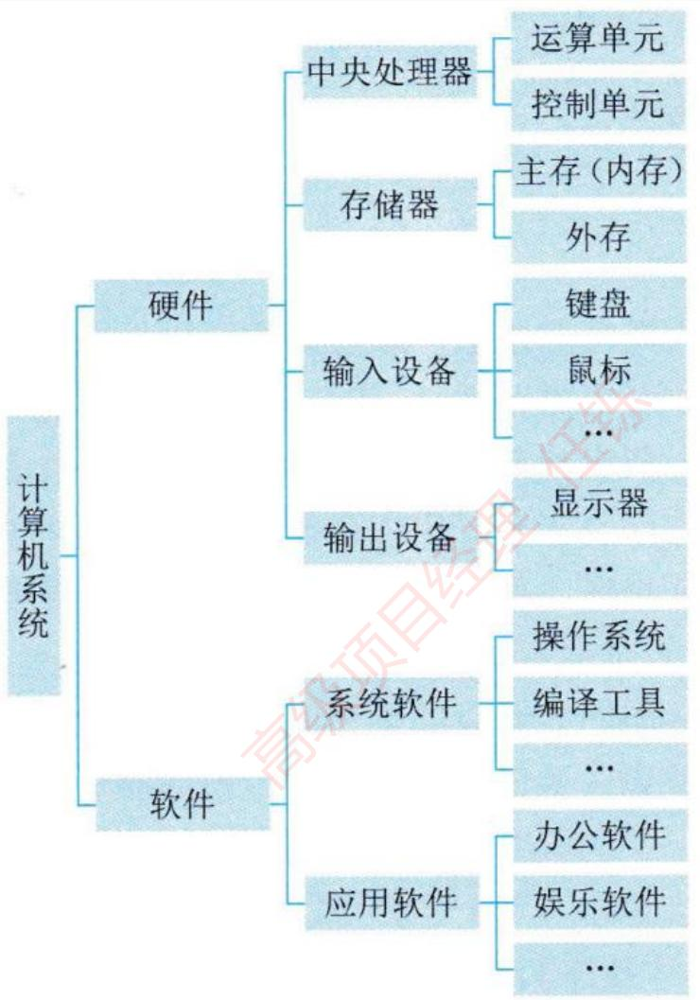
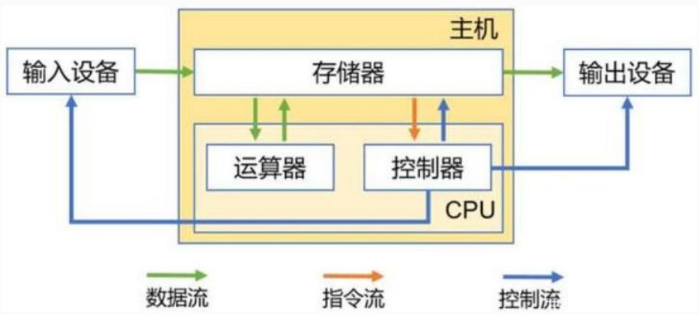
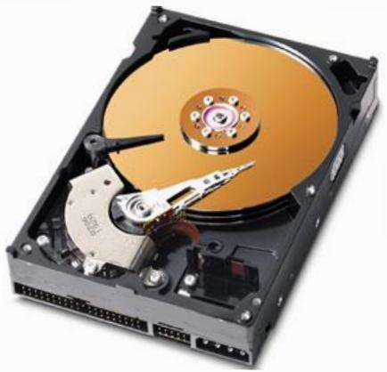
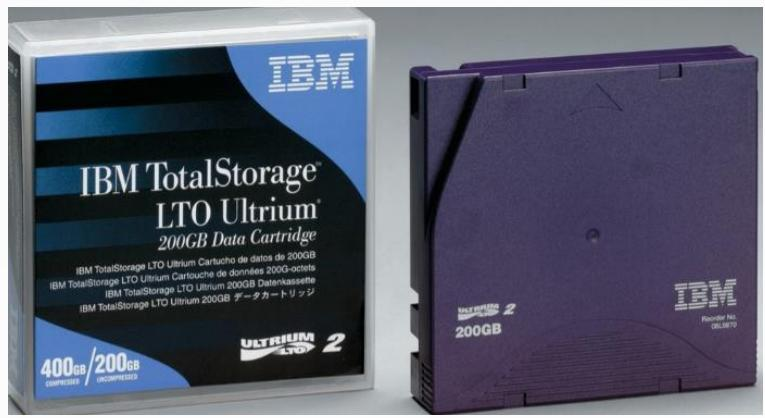
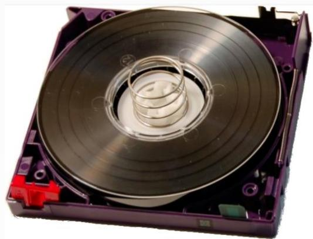
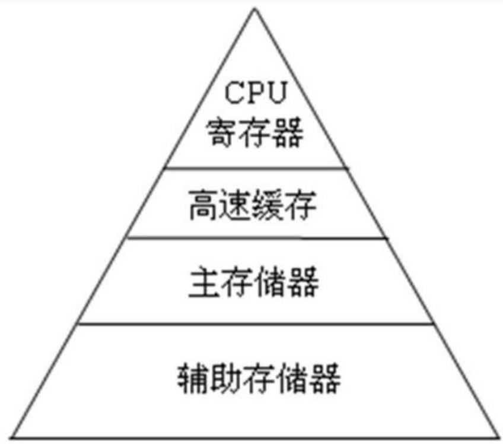

## 系统架构设计师

## 计算机系统概述


## 第二章 计算机系统基础知识

2.1 计算机系统概述  
2.2 计算机硬件  
2.3 计算机软件  
2.4 嵌入式系统及软件  
2.5 计算机网络  
2.6 计算机语言  
⚫ 2.7 多媒体  
2.8 系统工程  
2.9 系统性能


计算机系统是指用于数据管理的计算机硬件、软件及网络组成的系统。它是按人的要求接收和存储信息，自动进行数据处理和计算，并输出结果信息的机器系统。



<details>
<summary>flowchart</summary>

```mermaid
graph LR
  Root["计算机系统"] --> Hardware["硬件"]
  Root --> Software["软件"]
  
  subgraph Hardware ["硬件"]
    direction TB
  Hardware --> Central处理器["中央处理器"]
  Central["Central处理器"] --> ComputeUnit["运算单元"]
  Central --> ControlUnit["控制单元"]
  Central --> Storage["存储器"]
  Storage --> StorageMem["主存(内存)"]
  StorageMem --> StorageOut["外存"]
  StorageOut --> InputDev["输入设备"]
  InputDev --> OutputDev["输出设备"]
  OutputDev --> Display["显示器"]
  Display --> OutputDev["..."]
  OutputDev --> SystemSoftware["系统软件"]
  SystemSoftware --> SystemSys["操作系统"]
  SystemSoftware --> CompileTools["编译工具"]
  CompileTools --> CompileDev["..."]
  SystemSoftware --> AppSoftware["应用软件"]
  AppSoftware --> OfficeSoftware["办公软件"]
  AppSoftware --> EntertainmentSoftware["娱乐软件"]
  AppSoftware --> OtherDev["..."]
  end
  
  subgraph Software ["软件"]
    direction TB
  Software --> SoftwareSoftware["系统软件"]
  SoftwareSoftware --> SystemSoftware["操作系统"]
  end
```
</details>


## 第二章 计算机系统基础知识

2.1 计算机系统概述  
⚫ 2.2 计算机硬件  
2.3 计算机软件  
2.4 嵌入式系统及软件  
2.5 计算机网络  
2.6 计算机语言  
⚫ 2.7 多媒体  
2.8 系统工程  
2.9 系统性能


## 计算机硬件组成

冯·诺依曼计算机结构将计算机硬件分为五部分，但在现实的硬件构成中，控制单元和运算单元被集成为一体，封装成CPU。

按照传输过程被划分为总线、接口和外部设备。下面按照处理器、存储器、总线、接口和外部设备进行讲解。



<details>
<summary>flowchart</summary>

This diagram illustrates the data flow architecture of a system, showing the interaction between an operator (主机), CPU, and various components like the processor and server.
</details>


## 二、处理器

控制器：是分析和执行指令的部件。

✓ 指令寄存器(IR)  
✓ 指令译码器(ID)  
✓ 程序计数器(PC)

运算器：负责完成算术、逻辑运算功能。

算术逻辑单元(ALU)  
累加寄存器(AC)  
通用寄存器组

## RISC与CISC

为提高指令执行效率，选择向指令系统中添加更多、更复杂的指令来实现，导致指令集越来越大。这种类型的计算机称为复杂指令集计算机(CISC)。  
⚫ 对指令数目和寻址方式做精简，指令的指令周期相同，采用流水线技术，指令并行执行程度更好，这就是精简指令集计算机

(RISC)。

<table><tr><td></td><td>CISC</td><td>RISC</td></tr><tr><td>指令条数</td><td>多</td><td>只选取最常见的指令</td></tr><tr><td>指令复杂度</td><td>高</td><td>低</td></tr><tr><td>指令长度</td><td>变化</td><td>短、固定</td></tr><tr><td>指令执行周期</td><td>随指令变化大</td><td>大多在一个机器同期完成</td></tr><tr><td>指令格式</td><td>复杂</td><td>简单</td></tr><tr><td>寻址方式</td><td>多</td><td>极少</td></tr><tr><td>涉及访问主存指令</td><td>多</td><td>极小,大部分只有两条存指令</td></tr><tr><td>通用寄存器数量</td><td>一般</td><td>大量</td></tr><tr><td>译码方式</td><td>微程序控制</td><td>硬件电路</td></tr><tr><td>对编译系统要求</td><td>低</td><td>高</td></tr></table>


## 三、存储器

1.RAM:随机存储器，可读／写，只能暂存数据，断电后数据丢失。

SRAM:静态随机存储器，在不断电时信息能够一直保持，读写速度快，生产成本高，多用于容量较小的高速缓冲存储器。  
DRAM:动态随机存储器，需要定时刷新以维持信息不丢失，读写速度较慢，集成度高，生产成本低，多用于容量较大的主存储器。

2.ROM:只读存储器，出厂前用掩膜技术写入，常用于存放BIOS和微程序控制。


3.EPROM:可擦除的PROM，用某种方法可擦去信息，可写入多次。  
4.E<sup>2</sup>PROM:电可擦除EPROM，可以写入，但速度慢。  
5.闪速存储器(Flash Memory):其特性介于EPROM与E<sup>2</sup>PROM之间。但不能进行字节级别的删除操作。  
6.Disk和磁带



<details>
<summary>natural_image</summary>

Internal view of a hard disk drive with visible internal components and external ports (no text or labels)
</details>



<details>
<summary>text_image</summary>

IBM
IBM TotalStorage™
LTO Ultrium®
200GB Data Cartridge
IBM TotalStorage LTO Ultrium Cartucho de datos de 200GB
IBM TotalStorage LTO Ultrium Cartouche de données 200G-octets
IBM TotalStorage LTO Ultrium 200GB Datenkassette
IBM TotalStorage LTO Ultrium 200GB データカートリッジ
400GB/200GB
COMPRESSED / UNCOMPRESSED
ULTRIUM
2
ULTRIUM
2
200GB
IBM
Reader No.
DELNOTE
</details>



<details>
<summary>natural_image</summary>

Close-up of a purple hard disk drive with a metallic disc and coiled cable (no visible text or symbols)
</details>


## 存储器分级体系结构

片上缓存  
片外缓存  
主存(内存)  
外存(辅存)



<details>
<summary>text_image</summary>

CPU
寄存器
高速缓存
主存储器
辅助存储器
</details>


## 四、总线

总线(Bus)是指计算机部件间遵循某一特定协议实现数据交换的形式。按照总线在计算机中的位置划分为：

内总线用于各类芯片内部互连，也可称为片上总线 (On-ChipBus)或片内总线。  
系统总线是指计算机中CPU、主存、I/O 接口的总线。  
⚫ 外部总线是计算机板和外部设备之间，或者计算机系统之间互联的总线，又称为通信总线。

计算机总线有许多种类，常见的有并行总线和串行总线。

并行总线主要包括PCI、PCIe和ATA (IDE)等。  
串行总线主要包括USB、SATA、CAN、RS-232、RS-485、RapidIO和以太网等。

## 五、接口

接口是指同一计算机不同功能层之间的通信规则。常见的包括：

显示类接口(HDMI、DVI和DVI等)  
音频输入输出类接口(TRS、RCA、XLR等)  
网络类接口(RJ45、FC等)  
⚫ PS/2接口，USB 接口，SATA接口，LPT打印接口和RS-232 接口等。

## 六、外部设备

常见的外部设备包括：键盘、鼠标、显示器、扫描仪、摄像头、麦克风、打印机、光驱、各型网卡和各型存储卡/盘等。  
在移动和穿戴设备中，常见的包括加速计、GPS、陀螺仪、感光设备和指纹识别设备等。  
在工业控制、航空航天和医疗等领域，包括测温仪、测速仪、轨迹球、各型操作面板、红外/NFC 等感应设备、各种场强测量设备、功率驱动装置、各型机械臂、各型液压装置、油门杆和驾驶杆等。


## Thank You