## 系统架构设计师

## 计算机软件

## 第二章 计算机系统基础知识

2.1 计算机系统概述  
2.2 计算机硬件  
2.3 计算机软件  
⚫ 2.4 嵌入式系统及软件  
2.5 计算机网络  
2.6 计算机语言  
⚫ 2.7 多媒体  
2.8 系统工程  
2.9 系统性能

## 计算机软件概述

软件系统是指在计算机硬件系统上运行的程序、相关的文档资料和数据的集合。计算机软件用来扩充计算机系统的功能，提高计算机系统的效率。

计算机软件分为系统软件和应用软件两大类。

系统软件包括：操作系统、程序设计语言翻译系统、中间件、数据库管理系统和网络软件等。  
应用软件是指为某类应用需要或解决某个特定问题而设计的软件，如图形图像处理软件、财务软件等。

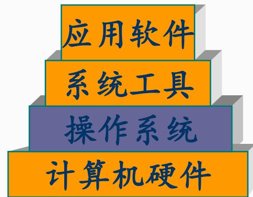

flowchart

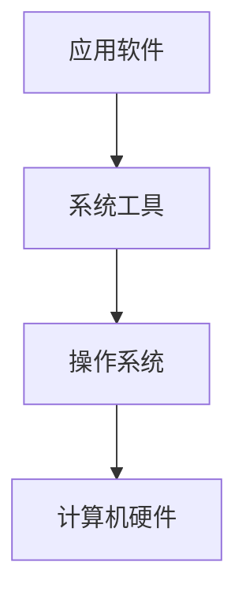

## 二、操作系统

操作系统是计算机系统的资源管理者，它包含对系统软、硬件资源实施管理的一组程序，通过 CPU管理、存储管理、设备管理和文件管理对各种资源进行合理地分配，改善资源的共享和利用程度，最大限度地发挥计算机系统的工作效率，提高计算机系统在单位时间内处理工作的能力。

## 1.操作系统的特征

(1)并发性：是指在一段时间内，宏观上有多个程序同时运行，但实际上在单CPU的运行环境，每一个时刻只有一个程序在执行。  
(2)共享性：共享是指操作系统中的资源被多个并发执行的进程共同使用，而不是被一个进程所独占。  
(3)虚拟性：是指把一个物理实体变成逻辑上的多个对应物，或把物理上的多个实体变成逻辑上的一个对应物的技术。  
(4)不确定性：是指在多道程序环境中，允许多个进程并发执行，但由于资源有限，在多数情况下进程的执行不是一贯到底的，而是“走走停停”。 高级项自经理 

## 2.操作系统的分类

批处理操作系统  
分时操作系统  
实时操作系统  
网络操作系统  
分布式操作系统  
微型计算机操作系统  
嵌入式操作系统

## 3.前趋图

前趋图是一个有向无循环图(DAG)，用于描述进程之间执行的前后关系。

结点：表示一个程序段或进程，或一条语句  
有向边：结点之间的偏序或前序关系 “→”

$$
\longrightarrow = \left\{\left(P _ {i}, P _ {j}\right) \mid P _ {i} \text {must complete before} P _ {j} \text {may start} \right\}
$$

记为 $R _ { i } \to P _ { j } ,$ ， Pi是Pj的直接前趋， $\mathsf { P } _ { \mathrm { j } }$ 是Pi的直接后继

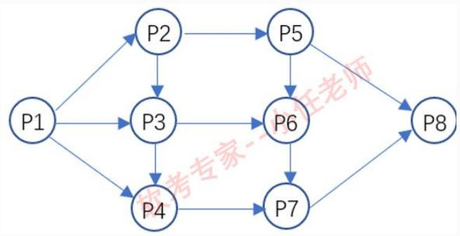

flowchart

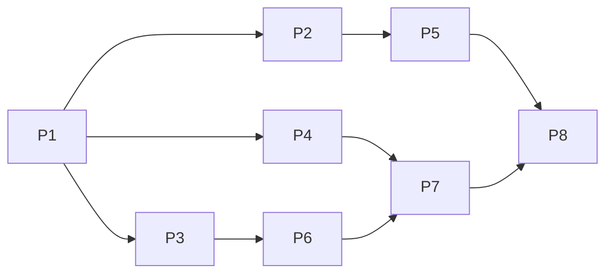

例:前趋图(Precedence Graph)是一个有向无环图，记为∶→={(Pi,Pj)} {Pi must complete before Pj may start}，假设系统中进程P={P1,P2, P3, P4, P5, P6, P7, P8}，且进程的前趋图如下图所示，那么该前趋图可记为( )。

A.→={P1,P2),(P1,P3),(P1,P4),(P2,P5),(P3,P5),(P4,P7),  
(P5,P6),(P5,P7),(P7,P6),(P4,P5),(P6,P7),(P7, P8)}  
B.→={P1,P2),(P1,P3),(P1,P4),(P2,P3),(P2,P5),(P3,P4),  
(P3,P6),(P4,P7),(P5,P6),(P5,P8),(P6,P7),(P7,P8)}

C.→={(P1,P2),(P1,P3),(P1,P4),(P2,P3),(P2,P5),(P3,P4),(P3,P5),(P4,P6),(P5,P7),(P5,P

8),(P6,P7),(P7,P8)}

高级项目经理D.→={P1,P2),(P1,P3),(P2,P3),(P2,P5),(P3,P4),(P3,P6),(P4,P7),(P5,P6),(P5,P8),(P6,P

7),(P6,P8),(P7,P8)}

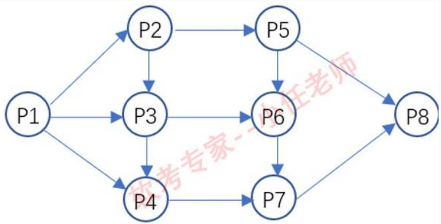

flowchart

## 三、数据库

数据库(DB)是指长期存储在计算机内、有组织的、统一管理的相关数据的集合。

常见的数据库是关系型数据库和非关系型数据库。

根据数据库存储体系分类，还可分为关系型数据库、键值 (Key-Value) 数据库、列存储数据库、文档数据库和搜索引擎数据库等类型。

## 四、文件系统

文件是指具有文件名的逻辑上具有完整意义的相关信息的集合。

现代OS中通过文件系统来组织和管理计算机中存储的数据。

## 1.文件的结构：

文件的逻辑结构。从用户观点出发所观察到的文件组织形式，它又可以分为两类：有结构的记录式文件(excel文件)；无结构的流式文件(源程序、视频文件)。  
文件的物理结构。又称为文件的存储结构，是指文件在外存上的存储组织形式。与存储介质的存储性能和采用的外存分配方式有关。

## 2.文件的物理结构(外存分配方式)：

连续分配  
链接分配  
索引分配

单级索引方式  
多级索引方式  
✓ 混合索引方式

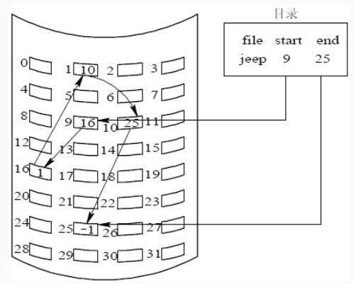

text_image

目录
file start end
jeep 9 25

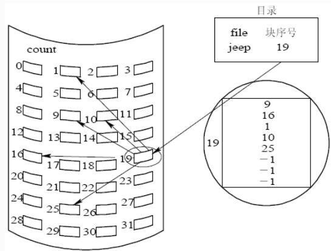

text_image

目录
file 块序号
jeep 19
count
0 1 2 3
4 5 6 7
8 9 10 11
12 13 14 15
16 17 18 19
20 21 22 23
24 25 26 27
28 29 30 31
19
9
16
1
10
25
-1
-1
-1

图6-12索引分配方式

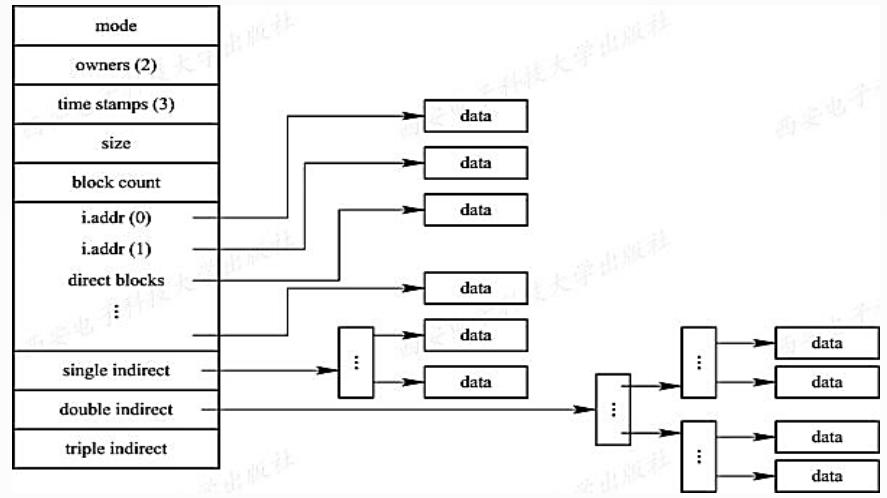

flowchart

This diagram illustrates a data processing workflow where various modes and blocks are processed through parallel processing to generate multiple final data outputs.

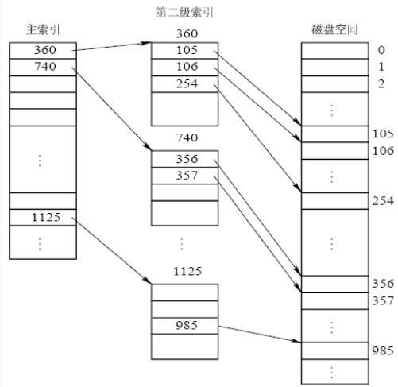

flowchart

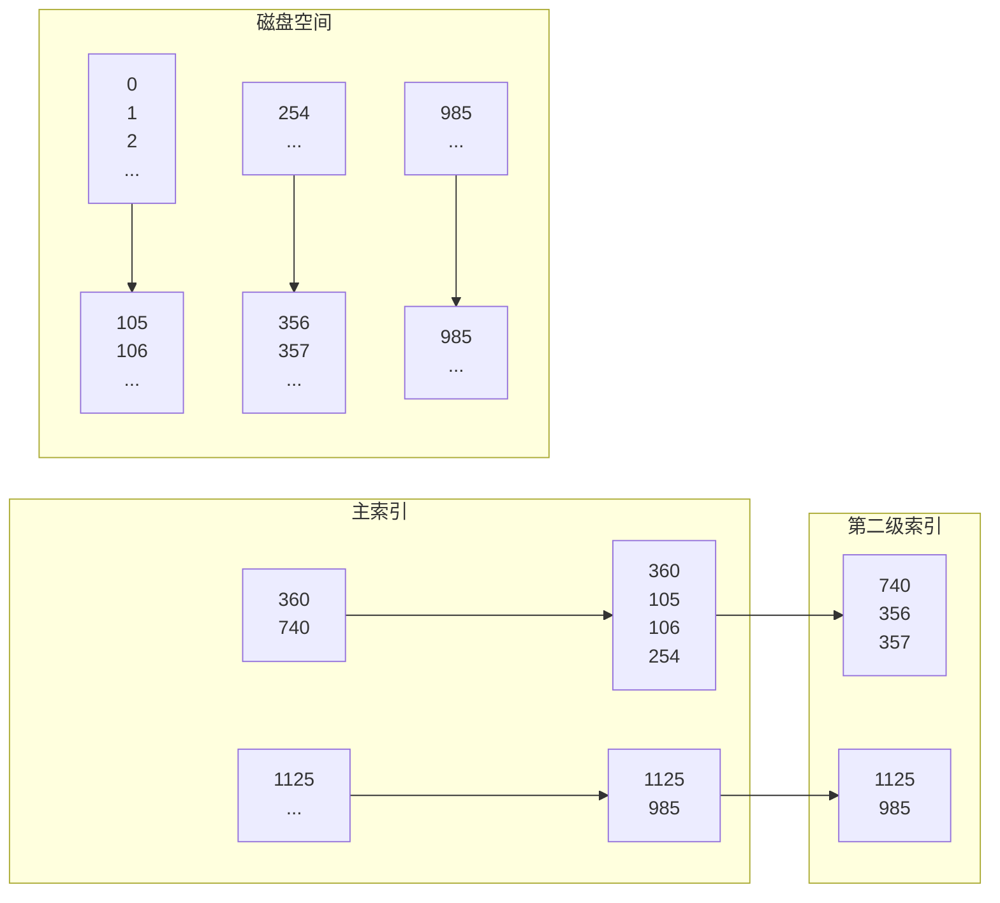

图6-13两级索引分配

例:某文件系统文件存储采用文件索引节点法。假设文件索引节点中有8个地址项iaddr[0]\~iaddr[7]，每个地址项大小为4字节，其中地址项iaddr[0]\~iaddr[4]为直接地址索引，iaddr[5]、iaddr[6]是一级间接地址索引，iaddr[7]是二级间接地址索引，磁盘索引块和磁盘数据块大小均为1KB，若要访问iclsClient.dll文件的逻辑块号分

别为1、518，则系统应分别采用( )。

A.直接地址索引、直接地址索引  
B.直接地址索引、一级间接地址索引  
C.直接地址索引、二级间接地址索引  
D.一级间接地址索引、二级间接地址索引

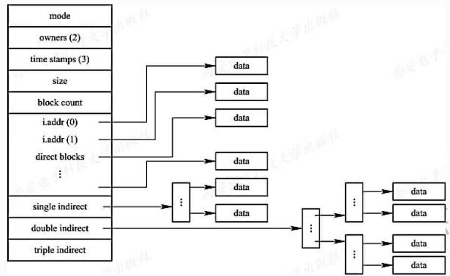

flowchart

This diagram illustrates a data processing workflow where multiple modes (owners, time stamps, block count) are processed through parallel processing blocks to generate and then feed into parallel processing blocks to produce final data outputs.

## 3.存储空间的管理

空闲区表  
位示图

表2-1空闲区表

<table><tr><td>序号</td><td>第1个空闲块号</td><td>空闲块数</td><td>状态</td></tr><tr><td>1</td><td>18</td><td>5</td><td>可用</td></tr><tr><td>2</td><td>29</td><td>8</td><td>可用</td></tr><tr><td>3</td><td>105</td><td>19</td><td>可用</td></tr><tr><td>4</td><td>—</td><td>—</td><td>未用</td></tr></table>

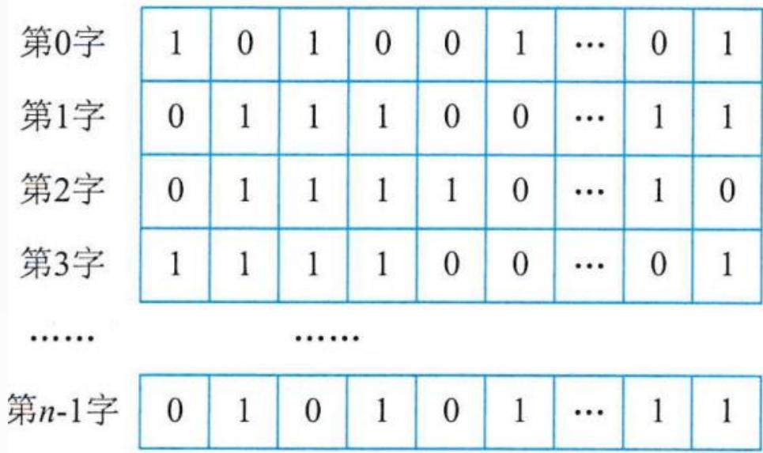

text_image

第0字 1 0 1 0 0 1 ... 0 1
第1字 0 1 1 1 0 0 ... 1 1
第2字 0 1 1 1 1 0 ... 1 0
第3字 1 1 1 1 0 0 ... 0 1
...... ......
第n-1字 0 1 0 1 0 1 ... 1 1

图2-7位示图例

例:某文件管理系统在磁盘上建立了位示图(bitmap)，记录磁盘的使用情况。若系统的字长为32位，磁盘上的物理块依次编号为：0、1、2、…，那么4096号物理块的使用情况在位示图中的第（ ）个字中描述；若磁盘的容量为200GB，物理块的大小为1MB，那么位示图的大小为（ ）个字。

A．129  
B．257  
C．513  
D．1025  
A．600  
B．1200  
C．3200  
D．6400

## 五、中间件(Middleware)

中间件，作为应用软件与各种操作系统之间使用的标准化编程接口和协议，起承上启下的作用，使应用软件的开发相对独立于计算机硬件和操作系统，并能在不同的系统上运行，实现相同的应

用功能。

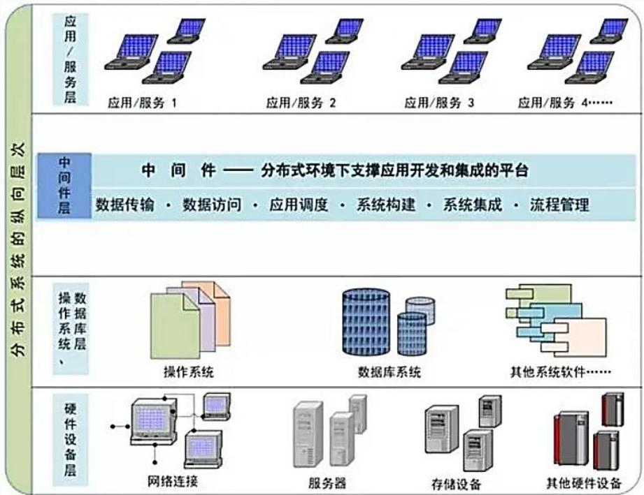

flowchart

1.常见的中间件

(1)消息中间件  
(2)事务处理(交易)中间件  
(3)数据存取管理中间件  
(4)Web服务器中间件  
(5)安全中间件  
(6)跨平台和架构的中间件  
(7)专用中间件  
(8)网络中间件

(1)消息中间件：是以消息为载体进行通信的中间件，利用高效可靠的消息机制来实现不同应用间大量的数据交换。分两类：消息队列和消息传递。通过这两种消息模型可以在复杂的网络环境中高可靠、高效率的实现安全的异步通信。

(2)事务处理(交易)中间件：主要功能是提供联机事务处理所需要的通信、并发访问控制、事务控制、资源管理、安全管理、负载平衡、故障恢复等服务。事务式中间件支持大量客户进程的并发访问，可靠性高、扩展性强，主要应用于电信、金融、飞机订票系统大量客户的领域。 

## 六、软件构件

构件又称为组件，是一个自包容、可复用的一组程序的集合，构件对外提供统一的访问接口，只能通过接口来访问构件，不能直接操作构件的内部。构件的两个最重要的特性是自包容与可重用。

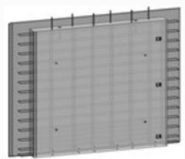

natural_image

Exterior view of a rectangular electronic device with grid pattern and mounting brackets (no visible text or symbols)

预制混凝土外墙

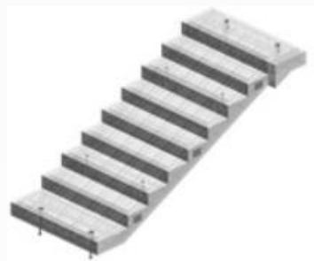

natural_image

3D rendering of a metal staircase with multiple horizontal steps (no text or symbols)

预制楼梯

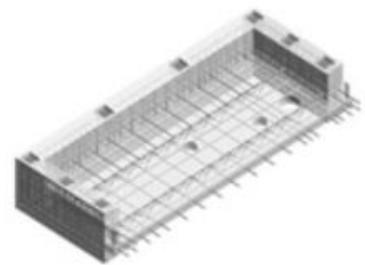

natural_image

3D rendering of a rectangular electronic component with internal grid structure and terminal pins (no text or symbols visible)

预制叠合阳台板

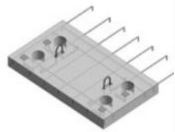

natural_image

3D rendering of a rectangular electronic component with multiple pins and mounting holes (no text or symbols visible)

预制阳台板

1.软件构件的组装模型构件组装模型的开发过程。

flowchart

## 七、应用软件

应用软件是为满足用户不同领域、不同问题的应用需求而提供的软件。按照应用软件的开发方式和适用范围，应用软件可再分成通用应用软件和定制应用软件两大类。

表2-3通用应用软件的主要类别和功能

<table><tr><td>类别</td><td>功能</td><td>流行软件举例</td></tr><tr><td>文字处理软件</td><td>文本编辑、文字处理、桌面排版等</td><td>WPS、Word、Adobe、FrontPage 等</td></tr><tr><td>电子表格软件</td><td>表格设计、数值计算、制表、绘图</td><td>Excel 等</td></tr><tr><td>图形图像软件</td><td>图像处理、几何图形绘制、动画制作等</td><td>AutoCAD、Photoshop、3DMAX、Flash 等</td></tr><tr><td>媒体播放软件</td><td>播放各种数字音频和视频文件</td><td>Microsoft Media Player、RealPlayer 等</td></tr><tr><td>网络通信软件</td><td>电子邮件、聊天、IP 电话、微博、微信等</td><td>Outlook、Express、MSN、QQ、ICQ 等</td></tr><tr><td>演示软件</td><td>投影片制作与播放</td><td>PowerPoint 等</td></tr><tr><td>信息检索软件</td><td>在因特网中查找需要的信息</td><td>百度、Google、天网等</td></tr><tr><td>个人信息管理软件</td><td>记事本、日程安排、通信录</td><td>Notepad、Lotus Notes 等</td></tr><tr><td>游戏软件</td><td>游戏和娱乐</td><td>下棋、扑克、休闲游戏、角色游戏等</td></tr></table>

## Thank You