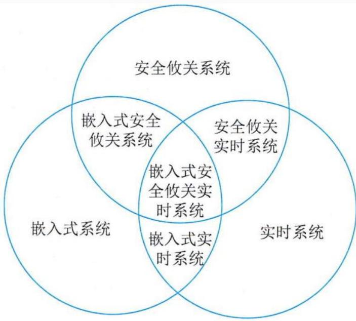
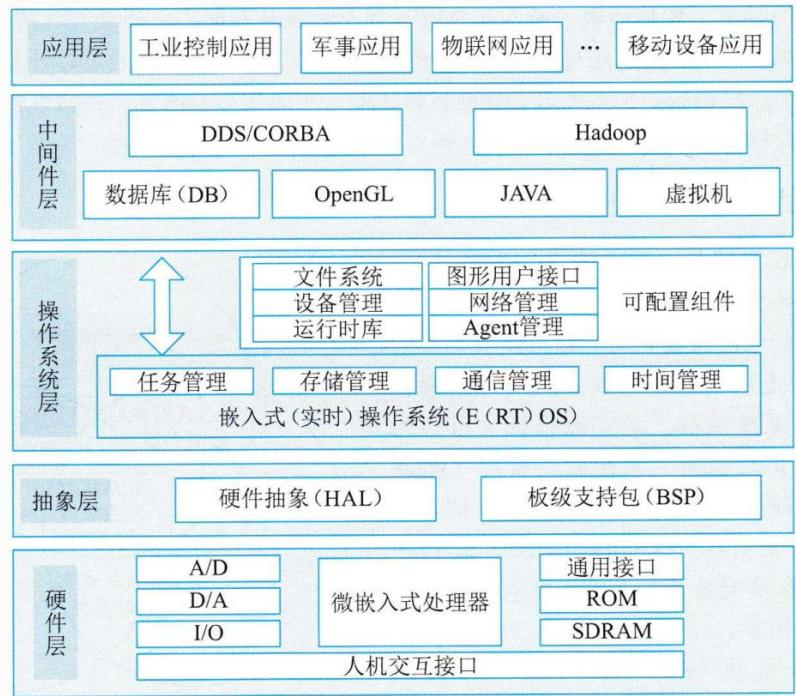
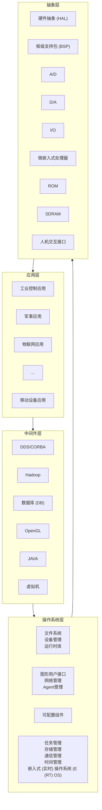

## 系统架构设计师

## 嵌入式系统及软件

## 第二章 计算机系统基础知识

2.1 计算机系统概述  
2.2 计算机硬件  
2.3 计算机软件  
⚫ 2.4 嵌入式系统及软件  
2.5 计算机网络  
2.6 计算机语言  
⚫ 2.7 多媒体  
2.8 系统工程  
2.9 系统性能

## 一、嵌入式系统的组成及特点

嵌入式系统(Embedded System)是为了特定应用而专门构建且将信息处理过程和物理过程紧密结合为一体的专用计算机系统。它对功能、可靠性、成本、体积、功耗、环境等综合性能要求严格。

嵌入式软件是指可运行在嵌入式系统中的程序代码和帮助这些软件开发所用的工具或环境软件的总称。

text_image

Street photo showing two police officers interacting, one in yellow uniform with ID badge and phone, the other in dark uniform with number 100778 visible.

1.嵌入式系统的组成

一般嵌入式系统由嵌入式处理器、相关支撑硬件、嵌入式操作系统、支撑软件以及应用软件组成。

(1)嵌入式处理器  
(2)相关支撑硬件  
(3)嵌入式操作系统  
(4)支撑软件  
(5)应用软件

2.嵌入式系统的特点

(1)专用性强。  
(2)技术融合。  
(3)软硬一体软件为主。  
(4)比通用计算机资源少。  
(5)程序代码固化在非易失存储器中。  
(6)需专门开发工具和环境。  
(7)体积小、价格低、工艺先进、性价比高、配置要求低、实时性强。  
(8)安全性和可靠性要求高。  

## 二、嵌入式系统的分类

根据不同用途可将嵌入式系统划分为：

嵌入式实时系统

强实时(Hard Real-Time)系统  
弱实时(WeakReal-Time)系统

嵌入式非实时系统

从安全性要求，嵌入式系统可分为：

安全攸关系统(Safety-Critical或 Life-Critical)  
非安全攸关系统

text_image

安全攸关系统
嵌入式安全
攸关系统
安全攸关
实时系统
嵌入式安全
攸关实时系统
嵌入式实
时系统
实时系统

图2-12嵌入式系统分类

## 三、嵌入式软件的组成及特点

嵌入式系统软件组成架构采用层次化结构，并且具备可配置、可剪裁能力。从现代嵌入式系统观看，把嵌入式系统分为硬件层、抽象层、操作系统层、中间件层和应用层。

flowchart

1.嵌入式软件的主要特点：

(1)可剪裁性  
(2)可配置性  
(3)强实时性  
(4)安全性  
(5)可靠性  
(6)高确定性

例:嵌入式实时操作系统与一般操作系统相比具备许多特点，以下不属于嵌入式实时操作系统特点的是( )。

A.可剪裁性  
B.实时性  
C.通用性  
D.可固化性

## 四、安全攸关软件的安全性设计

美国电气和电子工程协会(IEEE)将安全攸关软件定义为:“用于一个系统中，可能导致不可接受的风险的软件”。

表2-4软件安全等级与目标关系

<table><tr><td>等级</td><td>失效状态</td><td>简要说明</td><td>目标数量</td></tr><tr><td>A级</td><td>灾难性的</td><td>软件异常会导致的后果是:航空器无法安全飞行和着陆</td><td>66</td></tr><tr><td>B级</td><td>危害性的</td><td>软件异常会导致的后果是:严重降低了航空器或机组在克服不利运行情况时的能力</td><td>65</td></tr><tr><td>C级</td><td>严重的</td><td>软件异常会导致的后果是:显著降低了航空器或机组在克服不利运行情况时的能力</td><td>56</td></tr><tr><td>D级</td><td>不严重的</td><td>软件异常会导致的后果是:轻微降低了航空器或机组在克服不利运行情况时的能力</td><td>28</td></tr><tr><td>E级</td><td>没有影响的</td><td>软件异常会导致的后果是:不会影响航空器或机组任何能力</td><td>0</td></tr></table>

## Thank You