## 系统架构设计师

## 计算机网络(一)

## 第二章 计算机系统基础知识

2.1 计算机系统概述  
2.2 计算机硬件  
2.3 计算机软件  
2.4 嵌入式系统及软件  
2.5 计算机网络  
2.6 计算机语言  
⚫ 2.7 多媒体  
2.8 系统工程  
2.9 系统性能

## 一、 网络的基本概念

计算机网络是利用通信线路将地理上分散的、具有独立功能的计算机系统和通信设备按不同的形式连接起来，并依靠网络软件及通信协议实现资源共享和信息传递的系统。

计算机网络技术涵盖通信技术、网络技术、组网技术和网络工程等四个方面。

## 1.计算机网络的功能

⚫ 数据通信：依照一定的通信协议，利用数据传输技术在通信结点间传递信息的一种通信方式。  
资源共享：包括硬件资源、软件资源和数据资源。  
⚫ 管理集中化：通过管理信息系统、办公自动化系统实现日常工作的集中管理。  
⚫ 实现分布式处理：通过算法将大型的综合性问题交给不同的计算机同时进行处理。  
⚫ 负载均衡：指工作负荷被均匀地分配给网络上各台计算机系统。

## 2.网络有关指标

1)性能指标

(1)速率。网络速率指的是连接在计算机网络上的主机或通信设备在数字信道上传送数据的速率，速率的单位是 b/s 。  
(2)带宽。 “带宽”有两种不同的意义。

指一个信号具有的频带宽度。如，在传统的通信线路上传送的电话信号的标准带宽是 3.1kHz。单位是赫兹。  
表示网络通信线路传送数据的能力，单位时间内从一个结点到另一个结点所能通过的"最高数据率"。此处带宽单位是 b/s。

(3)吞吐量。表示单位时间内通过某个网络(或信道、接口)的数据量。吞吐量受网络的带宽或网络额定速率的限制。  
(4)时延。时延是指数据(报文、分组)从网络(链路)的一端传送到另一端所需的时间。网络中的时延由以下部分组成：

⚫ 发送时延：又称为传输时延，指从数据块的第一个比特开始发送算起，到最后一个比特发送完毕所需的时间。  
传播时延：电或光信号在传输介质传播一定距离所花费的时间。  
⚫ 处理时延：检查分组首部和决定将分组导向何处所需要的时间。  
⚫ 排队时延：在队列中，分组在等待传输时，它经受排队时延。

(5)往返时间。往返时间(RTT)也是一个重要的网络性能指标，它表示从发送方发送数据开始，到发送方收到来自接收方的确认(接受方收到数据后便立即发送确认)总共经历的时间。  
(6)利用率。利用率有信道利用率和网络利用率两种。

信道利用率指信道被利用的概率(即有数据通过)，通常以百分数表示。完全空闲的信道利用率是零。  
网络利用率是全网络的信道利用率的加权平均值。

2)非性能指标

(1)费用  
(2)质量  
(3)标准化  
(4)可靠性  
(5)可扩展性和可升级性  
(6)易管理和维护性

## 二、通信技术

计算机网络是利用通信技术将数据从一个结点传送到另一结点的。通信技术是计算机网络的基础。

信道可分为物理信道和逻辑信道：

物理信道由传输介质和设备组成，根据传输介质的不同，分为有线信道和无线信道。  
逻辑信道是指在数据发送端和接收端之间存在的一条虚拟线路，可以是有连接的或无连接的。逻辑信道以物理信道为载体。

## 1.香农公式

信道容量就是信道的最大传输速率，可通过香农公式计算得到。

$$
C = B \times \log_ {2} (1 + \frac {S}{N})
$$

C代表信道容量，单位是 b/s

B代表信号带宽，单位是 Hz

S代表信号平均功率，单位是 W

N代表噪声平均功率，单位是 W

S/N代表信噪比，单位是 dB(分贝)

向上人生路!

例：设信道带宽为4000Hz，信噪比为30dB，按照香农定理，信道容量为（ ）。

A．4Kb/s  
B．1.6Kb/s  
C．40Kb/s  
D．120Kb/s

$$
C = B \times \log_ {2} (1 + \frac {S}{N})
$$

由于S/N(信噪比)的比值太大，通常使用分贝数(dB)表示

$$
\mathrm{dB} = 10 \times \lg (S / N)
$$

例如，S/N=1000时，用分贝表示就是30dB。

向上人生路!

## 3.复用技术和多址技术

## 1)复用技术

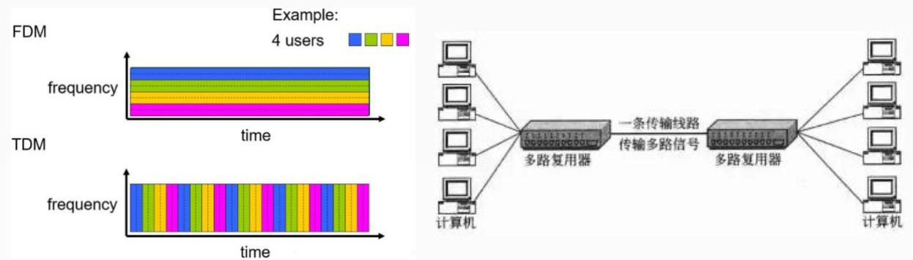

flowchart

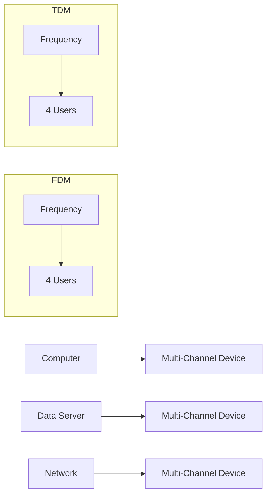

复用技术是指在一条信道上同时传输多路数据的技术，如 TDM时分复用、FDM 频分复用和CDM 码分复用等。ADSL 使用了 FDM的技术，语音的上行和下行占用了不同的带宽。

## 2)多址技术

多址技术是指在一条线上同时传输多个用户数据的技术，在接收端把多个用户的数据分离(TDMA 时分多址、FDMA 频分多址和CDMA 码分多址)。 高级项目经理

## 三、网络技术

网络通常按照网络的覆盖区域和通信介质等特征来分类，分为:

局域网(LAN)  
无线局域网(WLAN)  
城域网(MAN)  
广域网(WAN)  
移动通信网

1.局域网(LAN)

局域网中常见的传输媒介有双绞线、细同轴电缆、微波、射频信号和红外线等。主要特点：

距离短  
速度快  
高可靠性  
成本较低

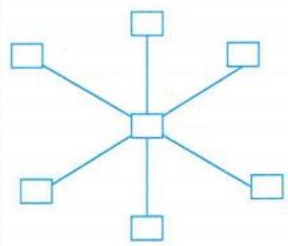

natural_image

Simple diagram of a central node connected to six peripheral nodes, each with a single square at its center (no text or labels)

图2-17星状结构网络

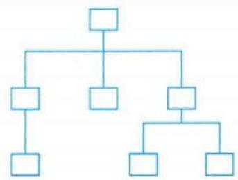

flowchart

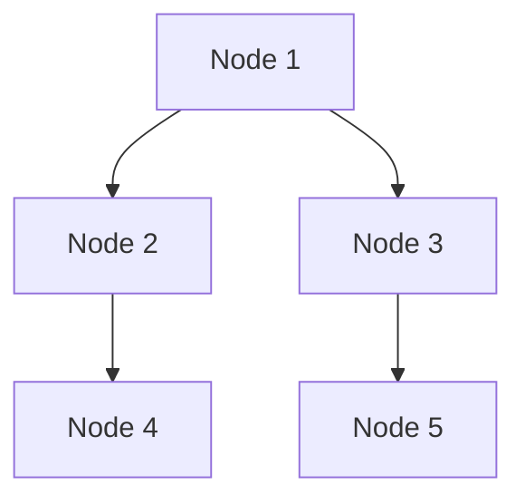

图2-18树状结构网络

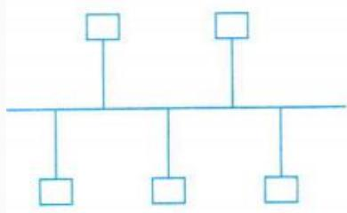

natural_image

Simple line diagram with three connected squares and lines, no text or symbols present

（a）总线结构

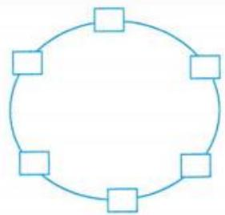

natural_image

Simple circular diagram with six square nodes arranged in a ring (no text or symbols)

（b）环形结构

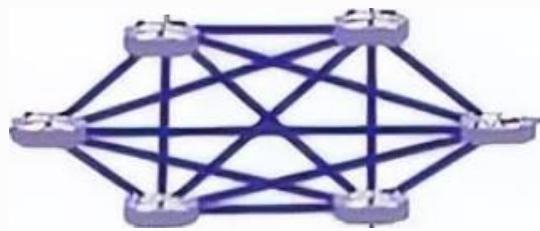

natural_image

Abstract geometric network diagram with interconnected nodes and lines (no text or symbols)

## 1.以太网技术

以太网(Ethernet)是一种计算机局域网组网技术。IEEE 802.3 标准给出了以太网的技术标准。

以太网是当前应用最普遍的局域网技术。

## (1)以太网结构

最大帧长为1518字节（最大的数据帧为1500字节），最小帧长为64字节，如果不足则需要加入填充位。

帧头设有32位用于进行CRC32校验，参与校验的是帧头中除前导字段和帧起始符之外的部分。

<table><tr><td>7</td><td>1</td><td>2或6</td><td>2或6</td><td>2</td><td>0~1500</td><td>0~46</td><td>4</td></tr><tr><td>前导字段</td><td>帧起始符</td><td>目的地址</td><td>源地址</td><td>长度</td><td>数据</td><td>填充</td><td>校验和</td></tr></table>

以太网帧结构

## 2.无线局域网(WLAN)

无线局域网是以无线通信为传输方式的局域网，是实现移动计算机网络的关键技术之一。

无线局域网以微波、激光与红外线等无线电波作为传输介质，来部分或全部代替传统局域网中的有线传输介质。架设无线局域网需要无线网卡和访问接入点AP。

与有线网络相比，无线局域网具有安装便捷、使用灵活、经济节约、易于扩展等优点。

1)WLAN标准

<table><tr><td>名称</td><td>发布时间</td><td>工作频段</td><td>调制技术</td><td>数据速率</td></tr><tr><td>802.11</td><td>1997年</td><td>2.4GHz ISM 频段</td><td>BD/SK DQPSK</td><td>1 MbPS 2 Mbps</td></tr><tr><td>802.11a</td><td>1999年</td><td>5GHz U-NII 频段</td><td>OFDM</td><td>54 MbPS</td></tr><tr><td>802.11b</td><td>1998年</td><td>2.4GHz ISM 频段</td><td>CCK</td><td>5.5 MbPS 11 MbPS</td></tr><tr><td>802.11g</td><td>2003年</td><td>2.4GHz ISM 频段</td><td>OFDM</td><td>54 MbPS</td></tr><tr><td>802.11n</td><td>2009年</td><td>2.4GHz /5GHz 频段</td><td>OFDM 64QAM MIMO</td><td>600 MbPS</td></tr><tr><td>802.11ac</td><td>2013年</td><td>5GHz 频段</td><td>OFDM 256QAM MIMO</td><td>6.9Gbps</td></tr><tr><td>802.11ax</td><td>2019年</td><td>2.4GHz /5GHz/6GHz 频段</td><td>UL/DL OFDMA 1024QAM MU-MIMO</td><td>9.6Gbps</td></tr></table>

## 3.广域网(WAN)

广域网是一种将分布于更广区域(如一个城市、一个国家甚至国家间) 的计算机设备联接起来的网络。由通信子网与资源子网组成。

通信子网由通信结点设备和连接这些设备的链路组成。  
资源子网主要指网络资源设备，如业务服务器、用户计算机、网络存储系统、网络上运行的各种软件资源、数据资源等。

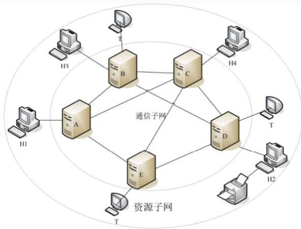

flowchart

This diagram illustrates the architecture of a communication network, showing connections between multiple servers (H1-H4) and modules (A-E), with central nodes labeled as '通信子网' (Communication Network) and '资源子网' (Resource Network).

1)广域网的特点

⚫ 主要提供面向数据通信的服务，支持用户使用计算机进行远距离的信息交换。  
⚫ 覆盖范围广，通信的距离远，广域网没有固定拓扑结构。  
由电信部门或公司负责组建、管理和维护，向全社会提供有偿服务。

## 4.城域网(MAN)

在单个城市范围内所建立的计算机通信网，覆盖范围介于局域网和广域网之间。

城域网的主要技术是DQDB（分布式队列双总线），即IEEE802.6。DQDB是由双总线构成的，所有的计算机都连接在上面。

## 5.移动通信网

移动通信技术经历了五个发展时期

第一代移动通信系统是模拟通信，采用的是FDMA（频分多址）

调制技术，其频谱利用率低；

第二代移动通信系统是数字通信系统，采用的是TDMA（时分多址）的数字调制方式，对系统的容量限制较大；

第三代移动通信技术(3G)则采用了CDMA（码分多址）数字调制技术，能够提供大容量、高质量、综合业务、软切换的要求；

第四代移动通信技术(4G) 。包括TD-LTE和FDD-LTE两种制式。

第五代移动通信技术(5G)。

1) 第五代移动通信(5G)

5G是具有高速率、低时延和大连接特点的新一代宽带移动通信技术，是实现人机物互联的网络基础设施。

与4G相比，5G可以提供小于1ms的端到端时延，以及99.9999%的可靠性，极大地丰富了网络应用场景。5G的三大类应用场景：

增强移动宽带(eMBB)，面向移动互联网流量爆炸式增长，为移动互联网用户提供更加极致的应用体验；  
超高可靠低时延通信(uRLLC)，面向工业控制、远程医疗、自动驾驶等对时延和可靠性具有极高要求的垂直行业应用需求；  
海量机器类通信(mMTC)，面向智慧城市、智能家居、环境监测等以传感和数据采集为目标的应用需求。 高级项目经理

2)网络切片  
5G 网络切片可在同一物理网络基础设施上划分为多个逻辑独立的虚拟网络。每个网络切片都是一个隔离的端到端网络，包含自己独特的延迟、吞吐量、安全性和带宽特性，可以灵活应对不同的需求和服务。

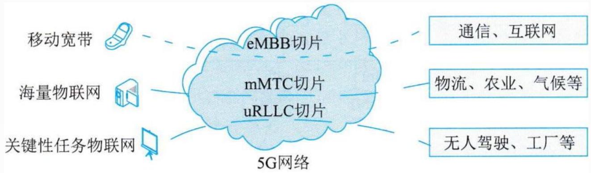

flowchart

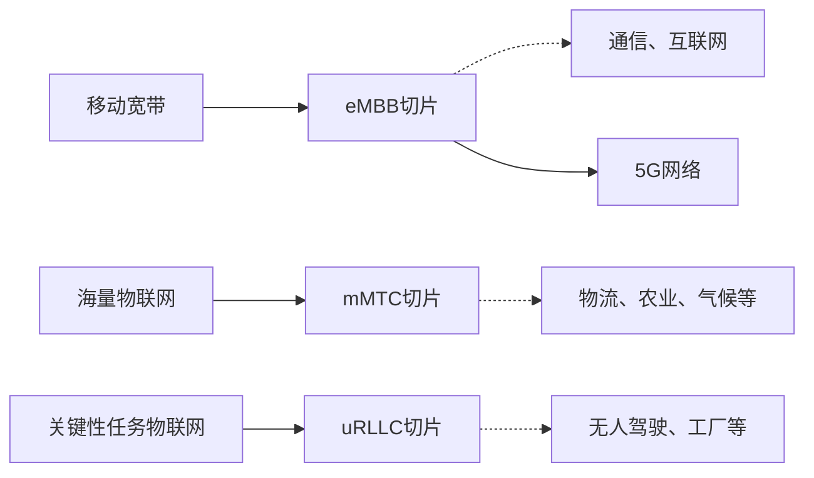

图2-225G网络切片组成

例: 5G网络采用( )可将5G网络分割成多张虚拟网络，每个虚拟网络的接入，传输和核心网是逻辑独立的，任何一个虚拟网络发生故障都不会影响到其它虚拟网络。

A.网络切片技术  
B.边缘计算技术  
C.网络隔离技术  
D.软件定义网络技术

## Thank You