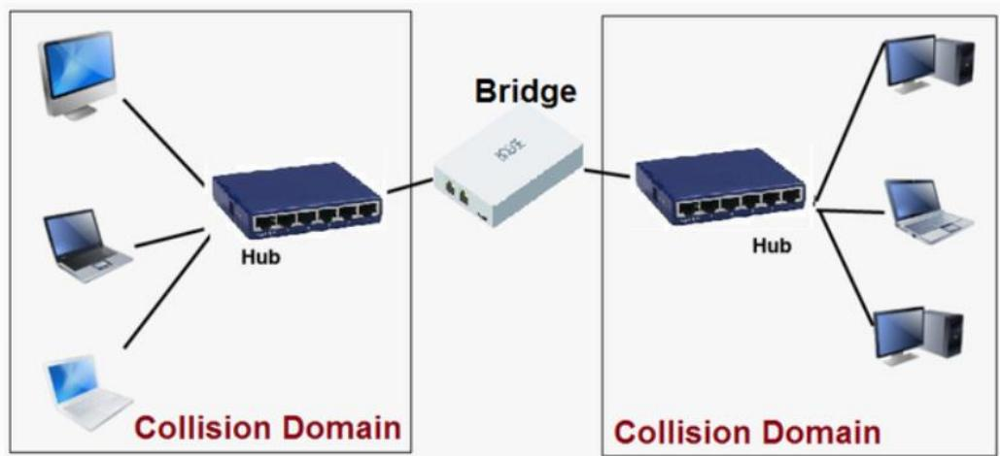
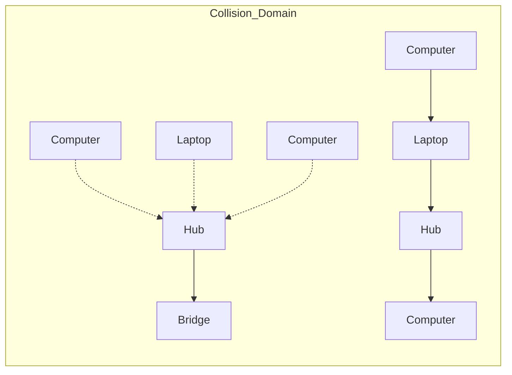
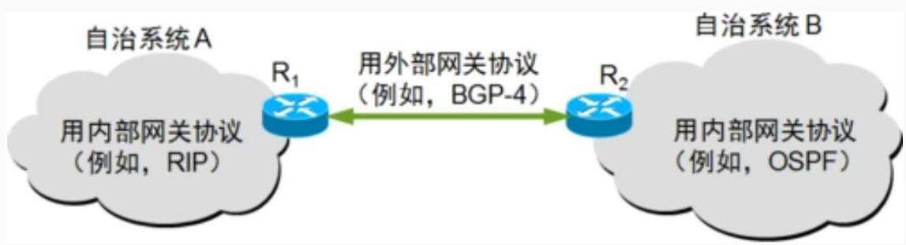
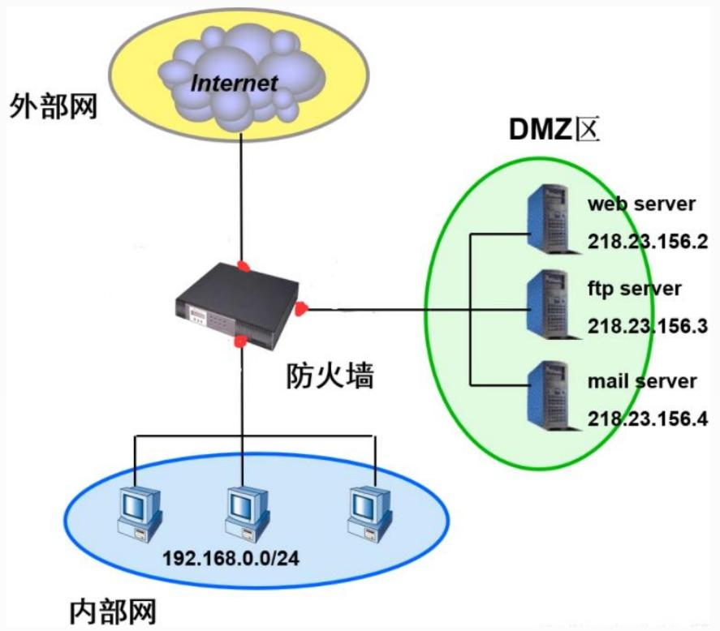
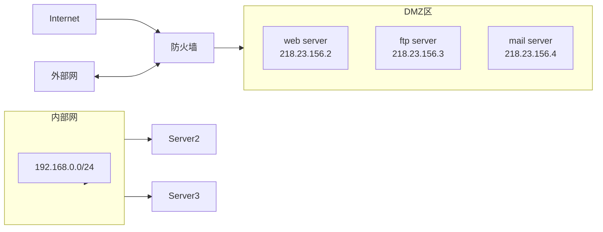
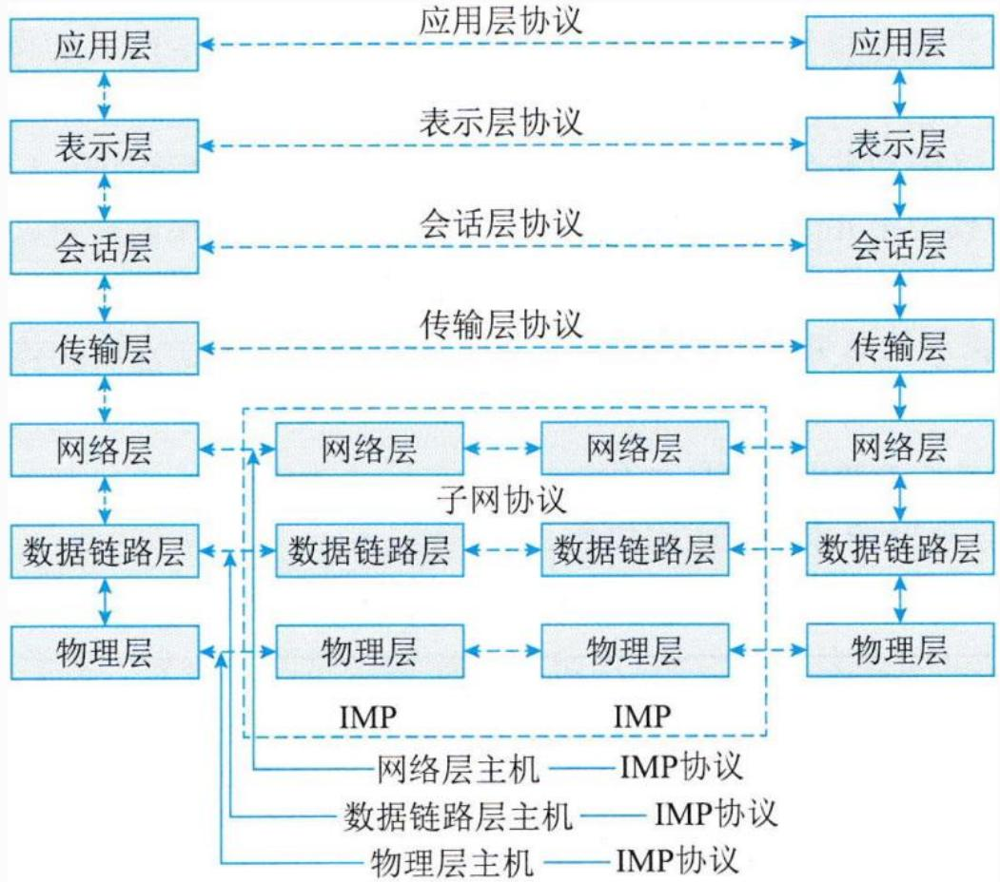
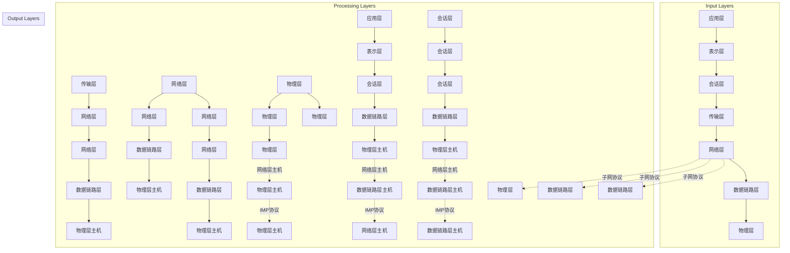
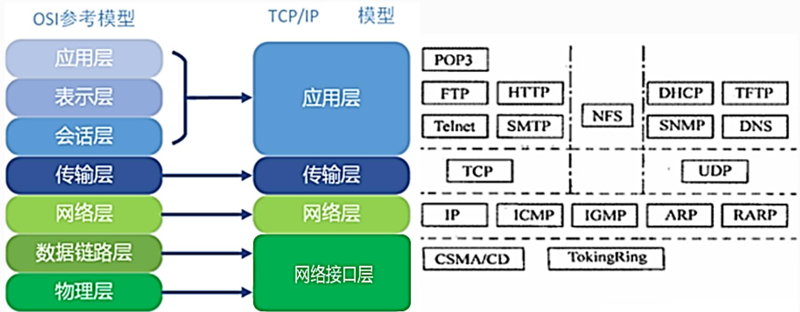
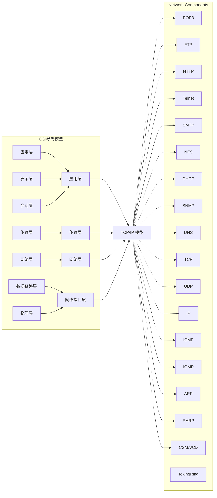

## 系统架构设计师

## 计算机网络(二)


## 第二章 计算机系统基础知识

2.1 计算机系统概述  
2.2 计算机硬件  
2.3 计算机软件  
2.4 嵌入式系统及软件  
2.5 计算机网络  
2.6 计算机语言  
⚫ 2.7 多媒体  
2.8 系统工程  
2.9 系统性能


## 四、组网技术

1.网络设备及其工作层级

常见的网络互联设备有集线器、中继器、网桥、交换机、路由器和防火墙。

(1)中继器(Repeater)

工作在物理层的设备。

适用于完全相同的两类网络(逻辑链路协议相同)的互连，主要功能是通过对数据信号的复制、整形、放大再发送，来扩大网络传输的距离。 高级项目经理

## (2)集线器(Hub)

具有中继器的功能，区别在于集线器能够提供多端口服务，也称多口中继器。集线器也是物理层设备。

集线器不具备交换机所具有的MAC地址表，所以它发送数据时是没有针对性的，而是采用广播方式发送。

(3)网桥(Bridge)

网桥也称桥接器，网桥是数据链路层的连接设备，是连接两个局域网的存储转发设备，它不但能扩展网络的距离或范围，而且可提高网络的性能、可靠性和安全性。



<details>
<summary>flowchart</summary>


</details>


(4)交换机(Switch)

也称多端口网桥，工作在数据链路层，能够识别帧的内容。

交换机在同一时刻可进行多对端口之间的数据传输。

每一端口都可视为独立的网段，连接在其上的网络设备独自享有全部的带宽，无须同其他设备竞争使用。

<table><tr><td>Vlan</td><td>Mac Address</td><td>Type</td><td>Ports</td></tr><tr><td>1</td><td>0004.9a0d.e4c2</td><td>DYNAMIC</td><td>Fa0/2</td></tr><tr><td>1</td><td>0005.5e21.69c3</td><td>DYNAMIC</td><td>Fa0/3</td></tr><tr><td>1</td><td>000c.85b5.68d1</td><td>DYNAMIC</td><td>Fa0/1</td></tr><tr><td>1</td><td>000d.bde3.0298</td><td>DYNAMIC</td><td>Fa0/4</td></tr><tr><td>1</td><td>0030.a3a1.6e9b</td><td>DYNAMIC</td><td>Fa0/1</td></tr></table>


## 交换原理

转发路径学习。根据收到数据帧中的源MAC 地址建立该地址同交换机端口的映射写入MAC 地址表中。  
数据转发。根据数据帧的目的 MAC 地址在MAC 地址表中查询到了，就向对应端口进行转发。

<table><tr><td>Vlan</td><td>Mac Address</td><td>Type</td><td>Ports</td></tr><tr><td>1</td><td>0004.9a0d.e4c2</td><td>DYNAMIC</td><td>Fa0/2</td></tr><tr><td>1</td><td>0005.5e21.69c3</td><td>DYNAMIC</td><td>Fa0/3</td></tr><tr><td>1</td><td>000c.85b5.68d1</td><td>DYNAMIC</td><td>Fa0/1</td></tr><tr><td>1</td><td>000d.bde3.0298</td><td>DYNAMIC</td><td>Fa0/4</td></tr><tr><td>1</td><td>0030.a3a1.6e9b</td><td>DYNAMIC</td><td>Fa0/1</td></tr></table>


数据泛洪。如果数据帧中的目的 MAC 地址不在 MAC 地址表中，则向所有端口转发也就是泛洪。广播帧和组播帧向所有端口(不包括源端口) 进行转发。

链路地址更新。MAC 地址表会每隔一定时间(如300s)更新一次。

<table><tr><td>Vlan</td><td>Mac Address</td><td>Type</td><td>Ports</td></tr><tr><td>1</td><td>0004.9a0d.e4c2</td><td>DYNAMIC</td><td>Fa0/2</td></tr><tr><td>1</td><td>0005.5e21.69c3</td><td>DYNAMIC</td><td>Fa0/3</td></tr><tr><td>1</td><td>000c.85b5.68d1</td><td>DYNAMIC</td><td>Fa0/1</td></tr><tr><td>1</td><td>000d.bde3.0298</td><td>DYNAMIC</td><td>Fa0/4</td></tr><tr><td>1</td><td>0030.a3a1.6e9b</td><td>DYNAMIC</td><td>Fa0/1</td></tr></table>


## (5)路由器(Router)

路由器工作在OSI体系结构中的网络层，它可以在多个网络上交换和路由数据包。路由器会根据信道的情况自动选择和设定路由，以最佳路径，按前后顺序发送信号。

路由表包含网络目的地址、端口、下一跳地址和发送代价等属性。路由器通常用于广域网或广域网与局域网的互连

<table><tr><td>目的IP地址</td><td>掩码</td><td>协议</td><td>优先级</td><td>下一跳</td><td>接口</td></tr><tr><td>0.0.0.0</td><td>0.0.0.0</td><td>Static</td><td>60</td><td>117.158.85.193</td><td>GigabitEthernet0/0</td></tr><tr><td>0.0.0.0</td><td>0.0.0.0</td><td>Static</td><td>60</td><td>10.187.138.97</td><td>GigabitEthernet0/4</td></tr><tr><td>10.187.138.0</td><td>255.255.255.0</td><td>Direct</td><td>0</td><td>10.187.138.98</td><td>GigabitEthernet0/4</td></tr><tr><td>10.187.138.98</td><td>255.255.255.255</td><td>Direct</td><td>0</td><td>127.0.0.1</td><td>InLoopBack0</td></tr><tr><td>117.158.85.192</td><td>255.255.255.224</td><td>Direct</td><td>0</td><td>117.158.85.204</td><td>GigabitEthernet0/0</td></tr><tr><td>117.158.85.204</td><td>255.255.255.255</td><td>Direct</td><td>0</td><td>127.0.0.1</td><td>InLoopBack0</td></tr><tr><td>127.0.0.0</td><td>255.0.0.0</td><td>Direct</td><td>0</td><td>127.0.0.1</td><td>InLoopBack0</td></tr><tr><td>127.0.0.1</td><td>255.255.255.255</td><td>Direct</td><td>0</td><td>127.0.0.1</td><td>InLoopBack0</td></tr><tr><td>192.168.1.0</td><td>255.255.255.0</td><td>Direct</td><td>0</td><td>192.168.1.1</td><td>Vlan-interface1</td></tr><tr><td>192.168.1.1</td><td>255.255.255.255</td><td>Direct</td><td>0</td><td>127.0.0.1</td><td>InLoopBack0</td></tr></table>


## 路由协议可分为两类：

## 内部网关协议(IGP)



<details>
<summary>flowchart</summary>

```mermaid
graph LR
  subgraph A["自治系统A"]
    A["用内部网关协议\n(例如, RIP)"]
  end
  subgraph B["自治系统B"]
    B["用内部网关协议\n(例如, OSPF)"]
  end
  A -->|"用外部网关协议\n例如, BGP-4"| B
  B -->|"用内部网关协议\n例如, OSPF"| A
```
</details>

✓ RIP-1、RIP-2(路由信息协议) 基于距离矢量算法的路由协议，利用跳数来作为计量标准。  
✓ IGRP (内部网关路由协议)距离矢量算法，思科的专有协议  
✓ EIGRP(增强型 IGRP)当拓扑结构变化时才发送路由更新  
✓ IS-IS(中间系统到中间系统)基于链路状态路由协议  
✓ OSPF(开放式最短路径优先)属于链路状态路由协议。提出了区域（area）的概念

⚫ 外部网关协议(EGP)目前使用的是BGP协议。

## (6)防火墙

是一种位于内部网络与外部网络之间的网络安全系统。它依照特定的规则，实现对进出网络的数据进行监视和过滤。防火墙不能阻止内部发起的攻击。



<details>
<summary>flowchart</summary>


</details>


<table><tr><td>互联设备</td><td>工作层次</td><td>主要功能</td></tr><tr><td>中继器</td><td>物理层</td><td>对接收信号进行再生和发送,只起到扩展传输距离用,对高层协议是透明的,但使用个数有限(以太网是4个)</td></tr><tr><td>网桥</td><td>数据链路层</td><td>根据帧物理地址进行网络间信息转发,可缓解网络通信繁忙度,提高效率。只能够连接相同MAC层的网络</td></tr><tr><td>路由器</td><td>网络层</td><td>通过逻辑地址进行网络间的信息转发,可完成异构网络之间的互连互通,只能连接使用相同网络层协议的子网</td></tr><tr><td>网关</td><td>高层(4~7)</td><td>最复杂的网络互联设备,用于连接网络层上执行不同协议的子网(例如Novell与SNA)</td></tr><tr><td>集线器</td><td>物理层</td><td>多端口中继器</td></tr><tr><td>二层交换机</td><td>数据链路层</td><td>多端口网桥</td></tr><tr><td>三层交换机</td><td>网络层</td><td>带路由功能的二层交换机</td></tr><tr><td>多层交换机</td><td>高层(4~7)</td><td>带协议转换的交换机</td></tr></table>


## 2.网络协议

1)开放系统互连模型OSI  


<details>
<summary>flowchart</summary>


</details>


## 2)TCP/IP协议集

TCP/IP协议簇分为应用层、传输层、网际层和网络接口层四层。



<details>
<summary>flowchart</summary>


</details>


## 五、网络工程

网络建设工程可分为网络规划、网络设计和网络实施三个环节。

1.网络规划：包括网络需求分析、可行性分析以及对现有网络的分析(需对现有网络进行优化升级时)。  
2.网络设计：是在网络规划基础上设计一个能解决用户问题的方案。网络设计包括网络总体目标确定、总体设计原则确定以及通信子网设计，设备选型，网络安全设计等。  
3.网络实施：是依据网络设计结果进行设备采购、安装、调试和系统切换(改造升级时)等。网络实施包括工程实施计划、网络设<sup>高级项目经理</sup> 备验收、设备安装和调试、系统试运行和切换、用户培训等。

## Thank You