## 系统架构设计师

## 计算机语言

## 第二章 计算机系统基础知识

2.1 计算机系统概述  
2.2 计算机硬件  
2.3 计算机软件  
2.4 嵌入式系统及软件  
2.5 计算机网络  
2.6 计算机语言  
⚫ 2.7 多媒体  
2.8 系统工程  
2.9 系统性能

## 计算机语言的分类

计算机语言分成机器语言、汇编语言和高级语言三大类，

1.机器语言

机器语言是用二进制代码表示的，计算机能直接识别和执行的语言，由操作码和操作数两部分组成。

优点是可以被计算机直接理解和执行，执行速度快、占用内存少。  
缺点是难于记忆、编程困难、可读性差。机器语言是面向机器的可移植性极差。

## 2.汇编语言

汇编语言是用助记符来表示各个基本操作的程序设计语言。如用ADD表示加法操作，MOV表示数据传递等。

汇编语言大大减少了程序编写、阅读、修改方面的工作量，但汇编语言也是一种面向机器的语言，计算机不能直接执行，通用性和可移植性差，必须经过汇编程序翻译成机器语言程序后才能在计算机上执行，需要程序员对计算机内部结构非常了解。

## 3.高级语言

高级语言是一种用接近自然语言和数学语言的语法、符号描述基本操作的程序设计语言。简单易学、编程效率高、可移植性好。

但需用专门的翻译程序将其转换成机器语言程序后才能执行。

高级语言种类繁多，风格迥异，各有所长。常见的高级语言有C、C++、Visual Basic、Java、JSP、PHP、C#、Python、Ruby等。

## 二、建模语言

UML (统一建模语言)是一个支持模型化和软件系统开发的图形化语言，UML是面向对象设计的建模工具，独立于任何具体程序设计语言。它不仅支持面向对象的分析与设计，还支持从需求分析开始的软件开发的全过程。

UML 成为"标准"建模语言的原因之一在于与程序设计语言无关。

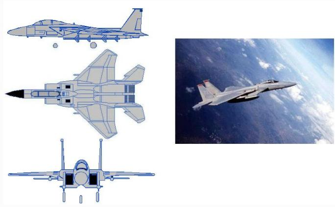

计算机图形学名言：一幅图顶得上一千个字

## (1)UML 组成要素

## UML由3个要素构成:

基本构造块(事物、关系)  
运用于整个语言的公用机制  
图(支配基本构造块如何放置的规则)

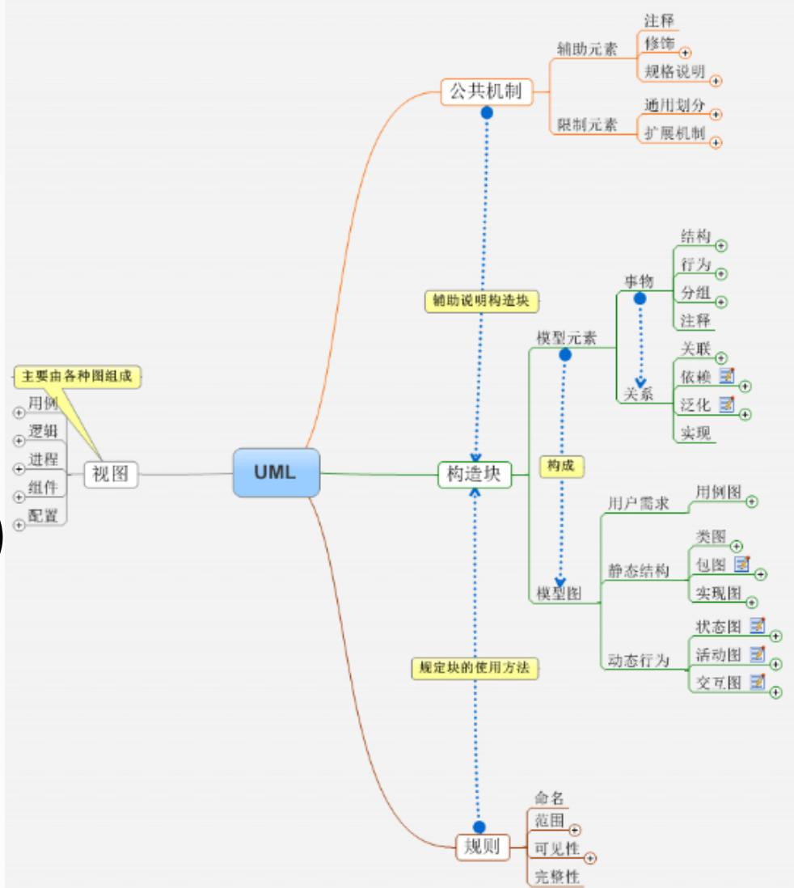

flowchart

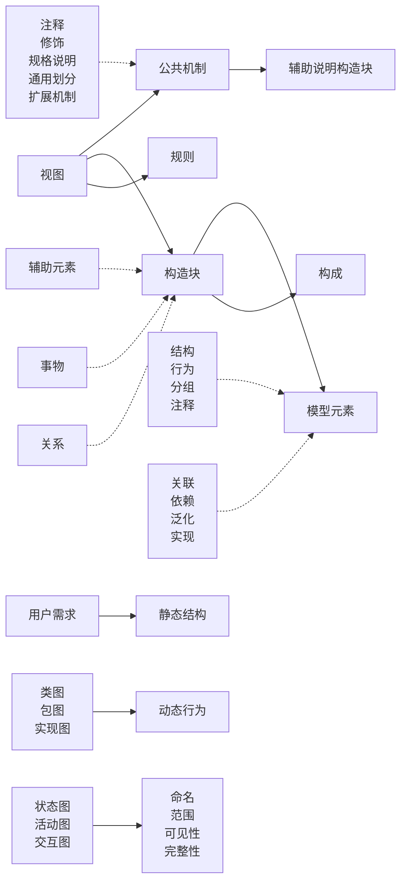
```mermaid
graph LR
  A["视图"] --> B["公共机制"]
  A --> C["构造块"]
  A --> D["规则"]
  
  B --> E["辅助说明构造块"]
  C --> F["模型元素"]
  C --> G["构成"]
  
  H["注释\n修饰\n规格说明\n通用划分\n扩展机制"] -.-> B
  I["辅助元素"] -.-> C
  J["事物"] -.-> C
  K["关系"] -.-> C
  
  L["结构\n行为\n分组\n注释"] -.-> F
  M["关联\n依赖\n泛化\n实现"] -.-> F
  
  N["用户需求"] --> O["静态结构"]
  P["类图\n包图\n实现图"] --> Q["动态行为"]
  
  R["状态图\n活动图\n交互图"] --> S["命名\n范围\n可见性\n完整性"]
```

## 1.事物

UML 中有 4 种事物：结构事物、行为事物、分组事物和注释事物。

①结构事物

结构事物是UML 模型中的名词。它们通常是模型的静态部分，描述概念或物理元素。结构事物包括类(Class)、接口(Interface)、协作 (Collaboration)、用例(UseCase)、主动类(Active Class)、构件(Component)、制品 (Artifact)和结点(Node)。

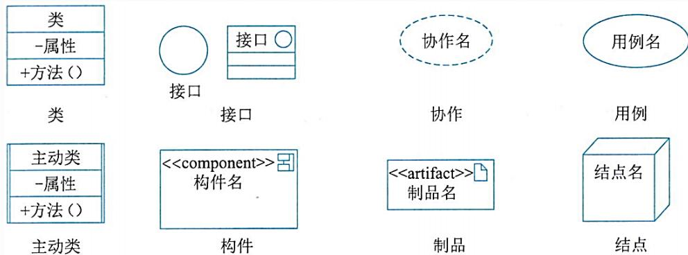

text_image

类
-属性
+方法()
类
接口
接口
协作名
用例名
主动类
-属性
+方法()
构件名
协作
制品名
结点名
结点

图2-25结构事物的图形表示

②行为事物

行为事物是 UML模型的动态部分。它们是模型中的动词，描述了跨越时间和空间的行为。行为事物包括交互(Interaction)、状态机(State Machine)和活动(Activity)。

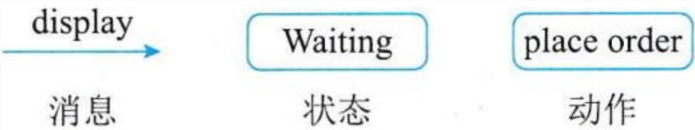

flowchart

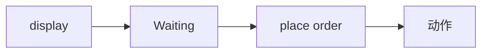
```mermaid
graph LR
  A["display"] --> B["Waiting"]
  B --> C["place order"]
  C --> D["动作"]
```

图2-26行为事务的图形表示

③分组事物

分组事物是 UML 模型的组织部分，UML中的容器，用来组织模型，使模型更加的结构化。可以把它看作一个一个的盒子，每个盒子里面的对象关系相对复杂，而盒子与盒子之间的关系相对简单。最主要的分组事物是包 (Package)。包是把元素组织成组的机制，这种机制具有多种用途。结构事物、行为事物甚至其他分组事物都可以放进包内。

Businessrules

图2-27包

④注释事物

注释事物是UML 模型的解释部分。这些注释事物用来描述、说明和标注模型的任何元素。

注解 (Note) 是一种主要的注释事物。注解是一个依附于一个元素或者一组元素之上，对它进行约束或解释的简单符号。

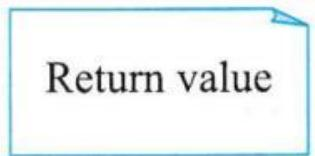

text_image

Return value

图2-28注解

## 2.关系

UML 中有4 种关系：依赖、关联、泛化和实现。

⚫ 依赖是两个事物间的语义关系，其中一个事物(独立事物) 发生变化会影响另一个事物(依赖事物)的语义。  
关联是一种结构关系，它描述了一组链，链是对象之间的连接。关联提供了不同类之间的对象可以相互作用的连接。

图2-29依赖  
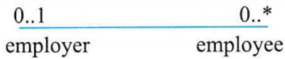

text_image

0..1
employer
0..*
employee

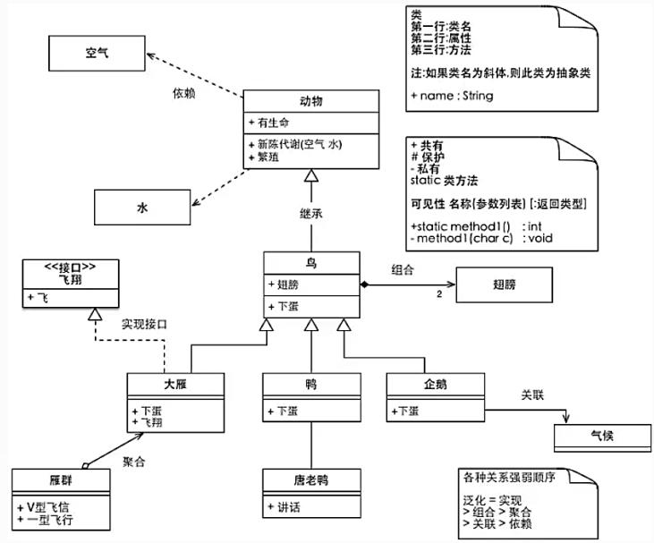

flowchart

This flowchart illustrates the classification and interaction process of a bird species, showing relationships between animals (airplane, water), birds, birds, birds, birds, birds, birds, birds, birds, birds, birds, birds, birds, birds, birds, birds, birds, birds, birds, birds, birds, birds, birds, birds, birds, birds, birds, birds, birds, birds, birds, birds, birds, birds, birds, birds, birds, birds, birds, birds, birds, birds, birds, birds, birds, birds, birds, birds, birds, birds, birds, birds in air, and birds in water.

关联关系又包括两种特殊的关系：聚合关系和组合关系。

聚合关系是关联关系的一种特例，是强的关联关系。聚合表示类之间的关系是整体与部分的关系，但整体与部分之间是可分离的，他们具有各自的生命周期。使用 表示聚合关系，空心菱形指向的是代表“整体”的类。  
✓ 组合关系也是关联关系的一种特例，这种关系比聚合更强，也称为强聚合；他同样体现整体与部分间的关系，但此时整体与部分是不可分的，整体的生命周期结束也就意味着部分的生命周期结束。使用带有实心菱形的实线 表示组合关系。

泛化是一种特殊 /一般关系，即OO语言中，类之间的继承关系。特殊元素 (子元素)的对象可替代一般元素 (父元素)的对象。用这种方法，子元素共享了父元素的结构和行为。泛化关系画成条带有空心箭头的实线，它指向父元素。

实现是类元之间的语义关系，其中一个类元指定了由另一个类元保证执行的契约。两种情况下会使用实现关系：一种是在接口和实现它们的类或构件之间；另一种是在用例和实现它们的协作之间。

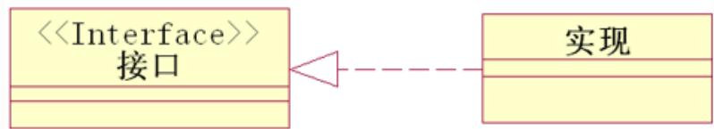

flowchart

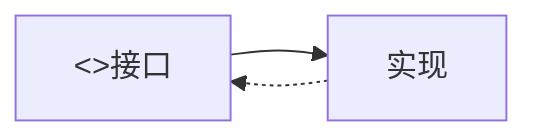
```mermaid
graph LR
  A["<<Interface>>接口"] --> B["实现"]
  B -.-> A
```

## 3.UML中的图

UML 2.0 提供了13 种图，分别是类图、对象图、用例图、序列图、通信图、状态图、活动图、构件图、部署图、组合结构图、包图、

交互概览图和计时图。

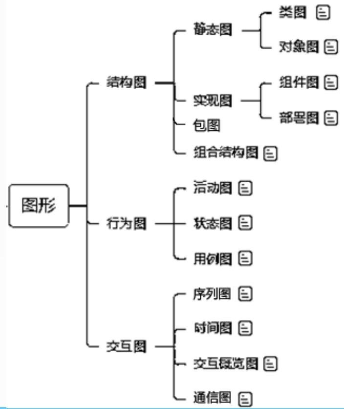

flowchart

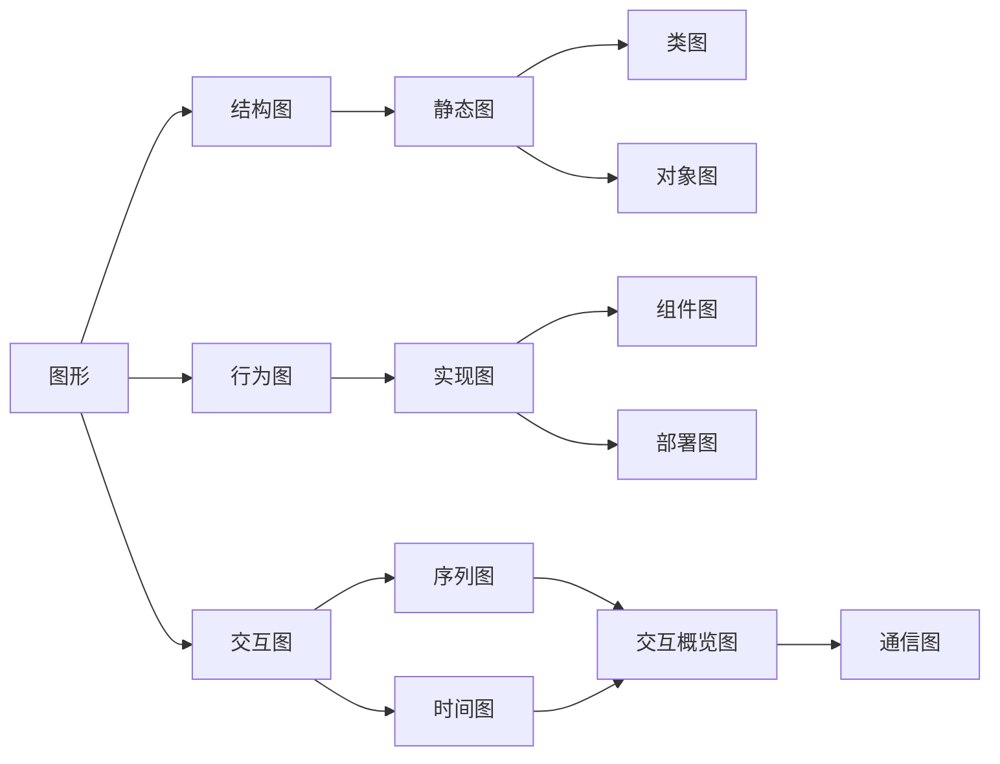
```mermaid
graph LR
  Root["图形"] --> Structure["结构图"]
  Root --> Behavior["行为图"]
  Root --> Interaction["交互图"]
  
  Structure --> Static["静态图"]
  Static --> Type1["类图"]
  Static --> Type2["对象图"]
  
  Behavior --> Action["实现图"]
  Action --> Type3["组件图"]
  Action --> Type4["部署图"]
  
  Interaction --> Sequence["序列图"]
  Interaction --> Time["时间图"]
  
  Sequence --> InteractionType["交互概览图"]
  Time --> InteractionType
  
  InteractionType --> Communication["通信图"]
```

(1)用例图（use case diagram）

描述一组用例、参与者（一种特殊的类）及它们之间的关系。

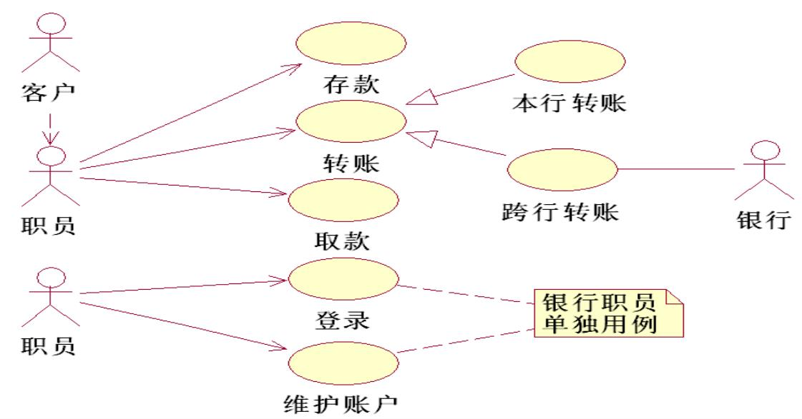

flowchart

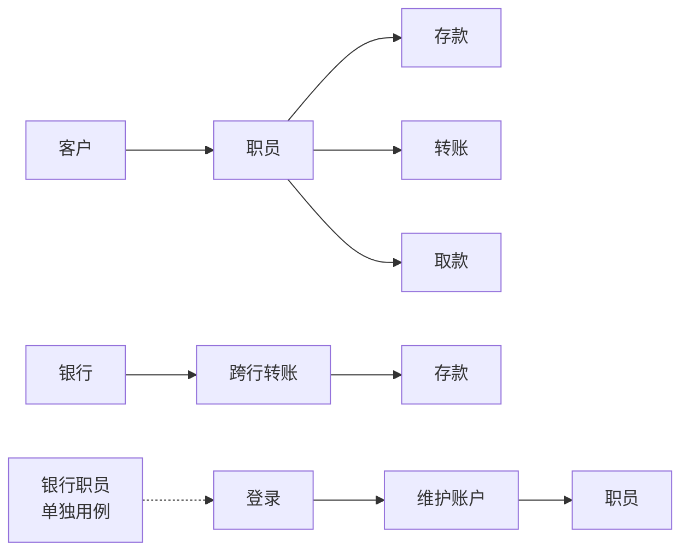
```mermaid
graph LR
  A["客户"] --> B["职员"]
  B --> C["存款"]
  B --> D["转账"]
  B --> E["取款"]
  F["银行"] --> G["跨行转账"]
  G --> H["存款"]
  I["银行职员\n单独用例"] -.-> J["登录"]
  J --> K["维护账户"]
  K --> L["职员"]
```

## 用例之间的关系

1)包含（include） （是一种依赖关系，加了版型<<include>>）

⚫ 两个以上用例有共同功能，可分解到单独用例形成包含依赖；  
箭头方向由基本用例指向被包含用例；  
执行基本用例时，每次都必须调用被包含的用例（吃饭前洗手）；  
被包含用例也可以单独执行；

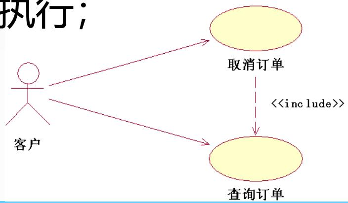

flowchart

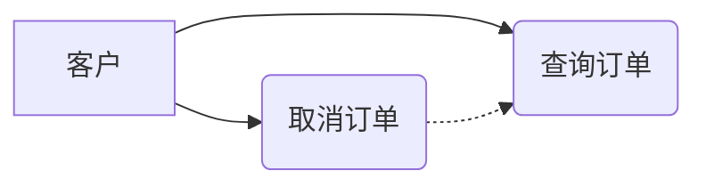
```mermaid
graph LR
  A["客户"] --> B("取消订单")
  A --> C("查询订单")
  B -.-> C
```

2)扩展（extend） （是一种依赖关系，加了版型<<extend>>）

⚫ 如果一个用例明显地混合了两种或两种以上的不同场景，即根据情况可能发生多种事情，则可以断定将这个用例分为一个主用例和一个或多个辅用例进行描述可能更加清晰。

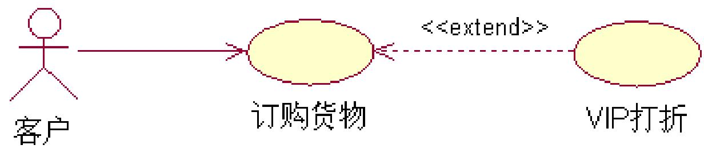

flowchart

```mermaid
graph LR
  A["客户"] --> B["订购货物"]
  B --> C["<<extend>>"]
  C -.-> D["VIP打折"]
```

(2)类图（class diagram）

描述一组类、接口、协作和它们之间的关系。类图给出了系统的静态设计视图

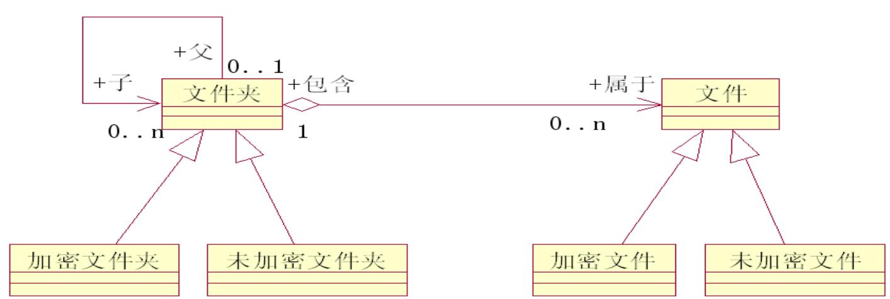

flowchart

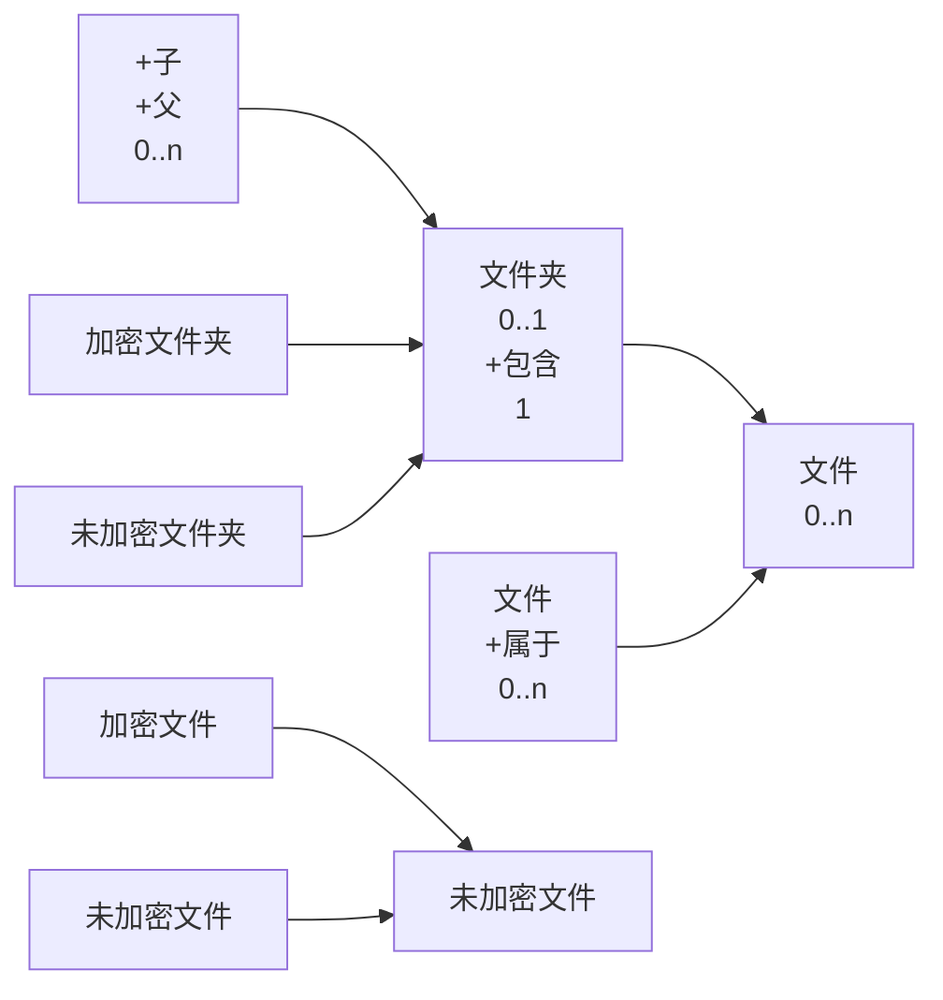
```mermaid
graph LR
  A["+子\n+父\n0..n"] --> B["文件夹\n0..1\n+包含\n1"]
  C["加密文件夹"] --> B
  D["未加密文件夹"] --> B
  B --> E["文件\n0..n"]
  F["文件\n+属于\n0..n"] --> E
  G["加密文件"] --> H["未加密文件"]
  I["未加密文件"] --> H
```

(3)顺序图（sequence diagram）

是一种交互图（interaction diagram），交互图展现了一种交互，它由一组对象或角色以及它们之间可能发送的消息构成。

交互图专注于系统的动态视图。顺序图是强调消息的时间次序的交互图。

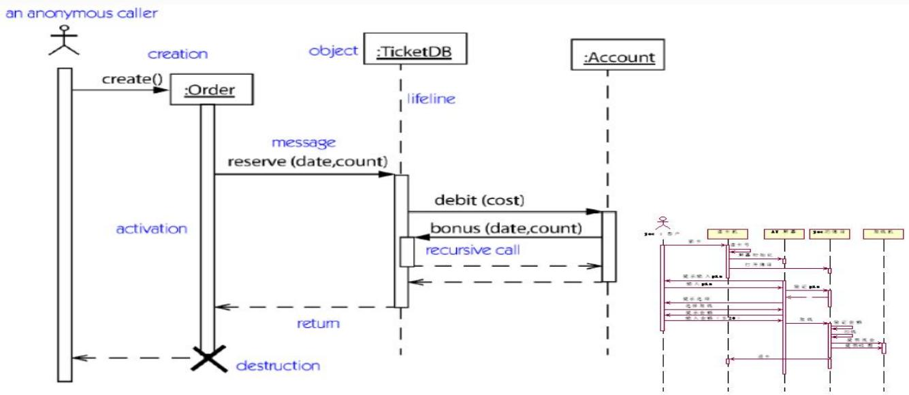

flowchart

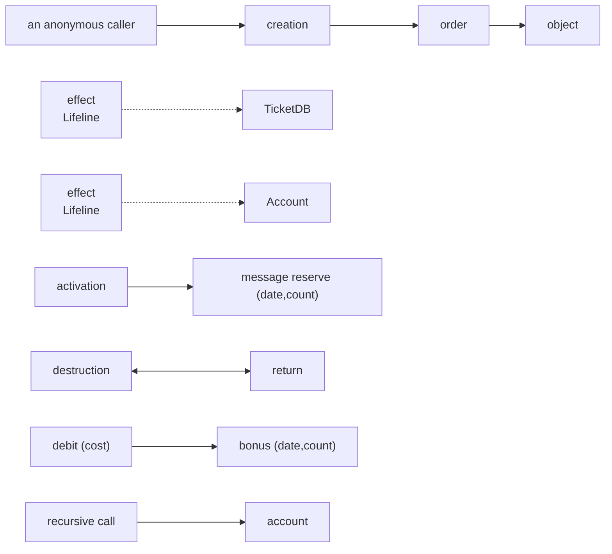
```mermaid
graph LR
  A["an anonymous caller"] --> B["creation"]
  B --> C["order"]
  C --> D["object"]
  E["effect\nLifeline"] -.-> F["TicketDB"]
  G["effect\nLifeline"] -.-> H["Account"]
  I["activation"] --> J["message reserve (date,count)"]
  K["destruction"] <--> L["return"]
  M["debit (cost)"] --> N["bonus (date,count)"]
  O["recursive call"] --> P["account"]
```

(4)协作图（通信图，UML2.0后的名称）

是一种交互图，强调的是发送和接收消息的对象之间的组织结构。

一个协作图显示了一系列的对象和在这些对象之间的联系以及对象间发送和接收的消息。

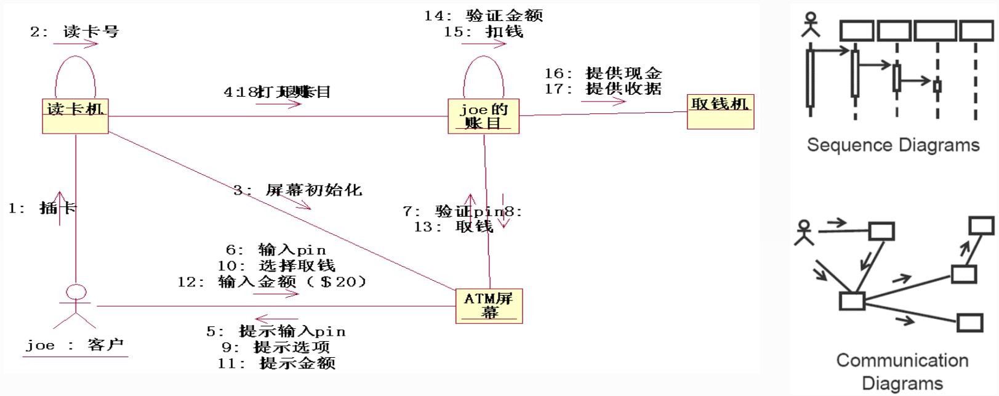

## (5)活动图（activity diagram）

将进程或其他计算的结构展示为计算内部一步步的控制流和数据流。活动图专注于系统的动态视图。

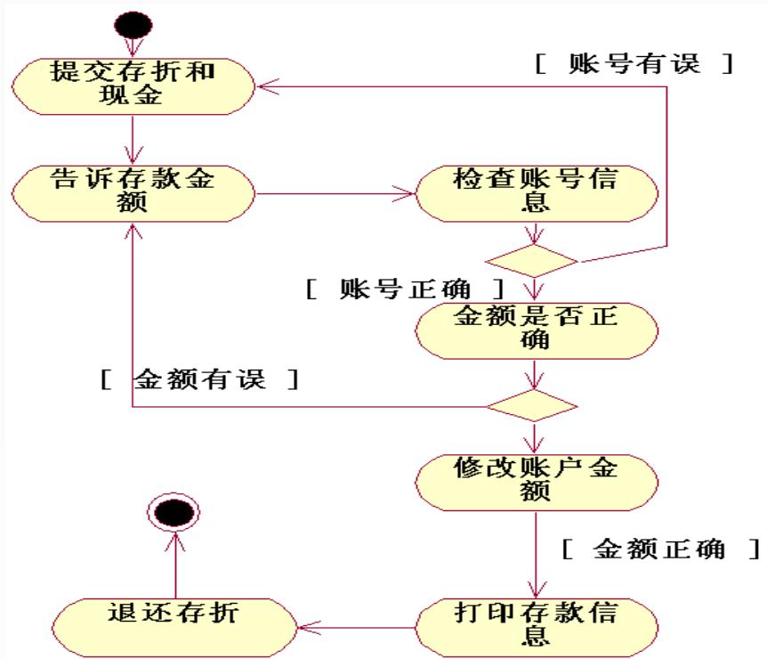

flowchart

```mermaid
graph TD
  A["提交存折和现金"] --> B["告诉存款金额"]
  B --> C["检查账号信息"]
  C --> D{"[ 账号正确 ]"}
  D --> E{"[ 金额有误 ]"}
  E --> F["修改账户金额"]
  F --> G["打印存款信息"]
  G --> H["退还存折"]
  H --> I(("结束"))
  D -->|[ 账号有误 ]| A
```

## (6)状态图（state chart diagram）

它由状态、转移、事件和活动组成。状态图给出了对象的动态视图

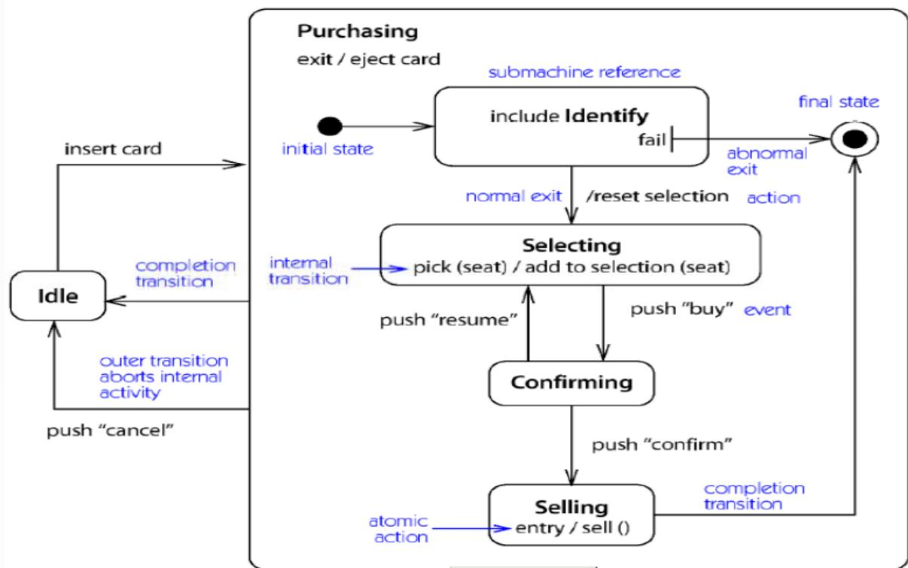

flowchart

This flowchart illustrates the state transition process for a purchasing machine, showing how an idle card is replaced by a purchase and then distributed through various steps like selection, confirmation, and selling.

(7)构件图（component diagram）

描述一个封装的类和它的接口、端口，以及由内嵌的构件和连接件构成的内部结构。

构件图用于表示系统的静态设计实现视图。

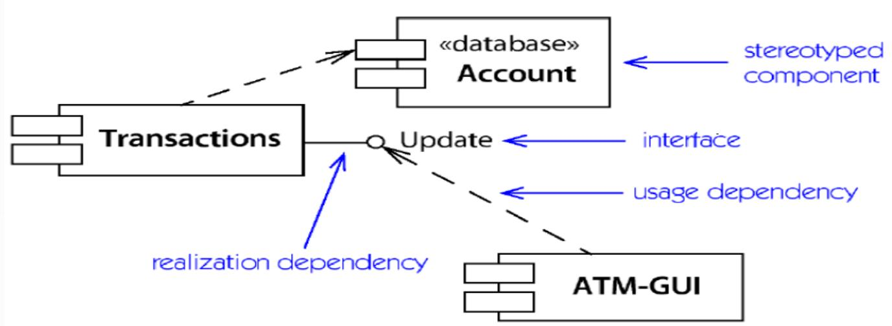

flowchart

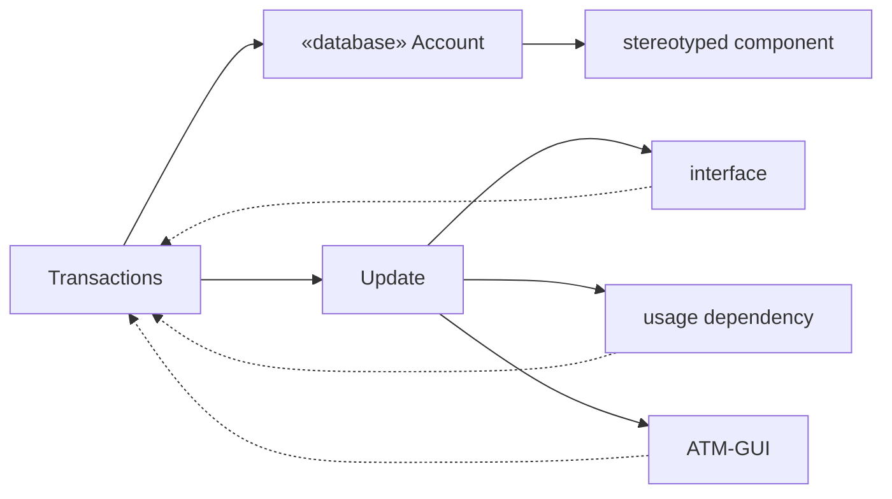
```mermaid
graph LR
  A["Transactions"] --> B["«database» Account"]
  A --> C["Update"]
  B --> D["stereotyped component"]
  C --> E["interface"]
  C --> F["usage dependency"]
  C --> G["ATM-GUI"]
  E -.-> A
  F -.-> A
  G -.-> A
```

(8)部署图（deployment diagram）

用来显示系统中软件和硬件的物理架构。

从部署图中，可以了解到软件和硬件组件之间的物理关系以及处理节点的组件分布情况。

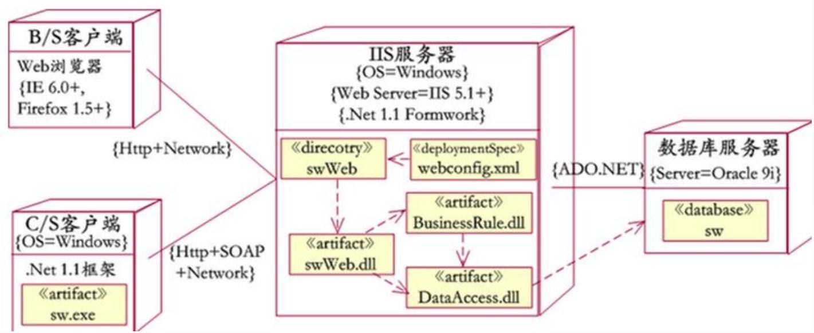

flowchart

This diagram illustrates the architecture and data flow of a web server system, showing interactions between B/S and C/S clients, IIS servers, and database servers.

例：UML(Unified Modeling Language)是面向对象设计的建模工具，独立于任何具体程序设计语言，以下( )不属于UML中的模型。

A.用例图  
B.协作图  
C.活动图  
D. PAD图

用例视图 （UML是用例驱动的）描述系统的功能需求  
逻辑视图表示系统的概念设计和子系统结构  
进程视图 （并发视图）系统中并发执行和同步的情况  
实现视图系统构件、代码的组成结构  
部署视图系统硬件节点的物理结构

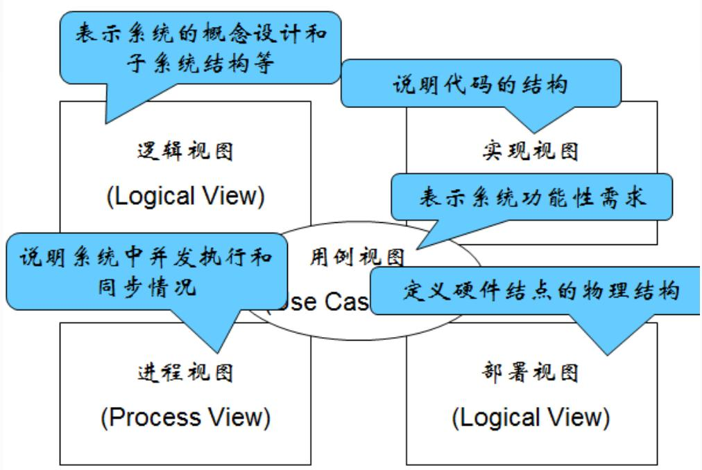

flowchart

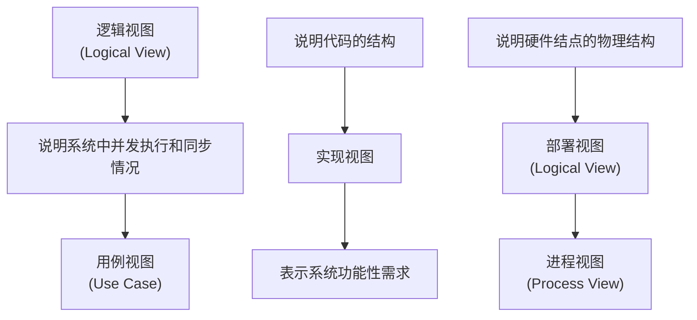
```mermaid
graph TD
  A["逻辑视图\n(Logical View)"] --> B["说明系统中并发执行和同步情况"]
  C["说明代码的结构"] --> D["实现视图"]
  E["说明硬件结点的物理结构"] --> F["部署视图\n(Logical View)"]
  B --> G["用例视图\n(Use Case)"]
  D --> H["表示系统功能性需求"]
  F --> I["进程视图\n(Process View)"]
```

## Thank You