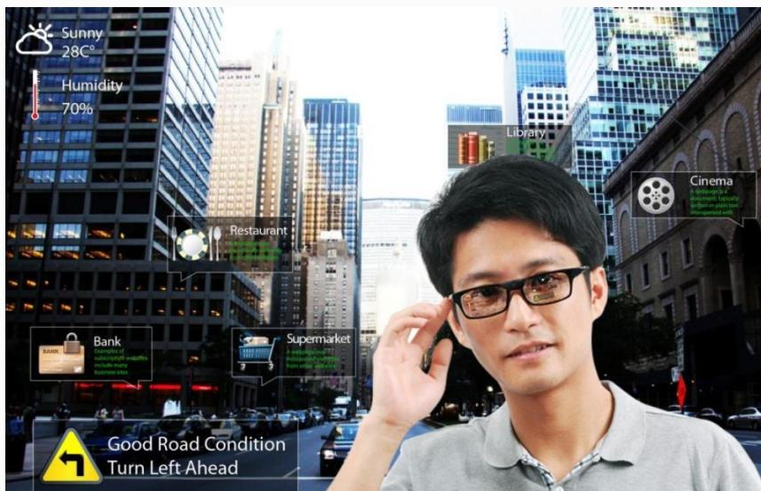

## 系统架构设计师

## 多媒体

## 第二章 计算机系统基础知识

2.1 计算机系统概述  
2.2 计算机硬件  
2.3 计算机软件  
2.4 嵌入式系统及软件  
2.5 计算机网络  
2.6 计算机语言  
2.7 多媒体  
2.8 系统工程  
2.9 系统性能

## 一、 多媒体概述

媒体是承载信息的载体，即信息的表现形式。如文字、声音、图像、动画、视频等。

媒体分为感觉媒体、表示媒体、表现媒体、存储媒体和传输媒体。

(1)感觉媒体：指用户接触信息的感觉形式，直接作用于人的感官，产生感觉(视、听、嗅、味、触觉)的媒体，如视觉、听觉、触觉。  
(2)表示媒体：是指信息的表示形式。如图像、声音、视频等。感觉媒体转换成表示媒体后，能够在计算机上进行加工处理和传输。

(3)表现媒体：也称为显示媒体，是表现和获取信息的物理设备。如键盘、鼠标、扫描仪、话筒、数码相机、摄像机为输入表现媒体，显示器、打印机、音箱、投影仪为输出表现媒体。  
(4)存储媒体：指用于存储表示媒体的物理介质。如硬盘、软盘、光盘、ROM及RAM等。  
(5)传输媒体：是指传输表示媒体（即数据编码）的物理介质。如电缆、光缆、电磁波等。

## 二、多媒体系统的关键技术

1.视音频技术  
1)视音频编码

编解码器指的是能够对一个信号或者一个数据流进行变换的设备或者程序。视音频编码的目的是对视音频数据进行传输和存储。

常见的视频文件格式 .mpg、.avi、.mov、.mp4、.rm、.ogg和.tta等

## 2)视音频压缩方法

## 视音频压缩方法可分为

无损压缩：解压缩后的数据和压缩前完全一致。多数无损压缩都采用RLE 行程编码算法。常见的格式有 WAV、PCM、TTA、FLAC、AU、APE、TAK 和 WavPack (WV) 等;  
有损压缩：解压缩后的数据与压缩前的数据不一致，压缩过程中要丢失一些人眼和耳不敏感的图像或音频信息，这些丢失的信息是不可恢复的。常见的格式有 MP3、WMA、Ogg Vorbis(OGG)等。

## 2.数据压缩技术

数据压缩分为以下 3 类：

(1)即时压缩和非即时压缩。即时/非即时压缩的区别在于信息在传输过程中被压缩还是信息压缩后再传输。即时压缩一般应用在影像、声音数据的传送中。即时压缩常用到专门的硬件设备，如压缩卡等。  
(2)数据压缩和文件压缩。数据压缩是专指一些具有时间性的数据，这些数据常常是即时采集、即时处理或传输的。而文件压缩是指对将要保存在磁盘等物理介质的数据进行压缩。  
(3)无损压缩与有损压缩。  

## 3.虚拟现实(VR)/增强现实(AR)技术

虚拟现实 (VR) 又称人工现实、临境等，是一种可以创建和体验虚拟世界的计算机仿真系统，它利用计算机生成一种模拟环境，使用户沉浸到该环境中让人有种身临其境的感觉。

## 其概念包含 3 层含义：

虚拟实体是用计算机生成的一个逼真的实体。  
用户可以通过人的自然技能(头部转动、眼动、手势或其他身体动作) 与该环境交互。  
要借助一些三维传感设备来完成交互动作，常用的有头盔立体显示器、数据手套、数据服装和三维鼠标等。 高级项目经理

增强现实(AR)技术是指把原本在现实世界的一定时间和空间范围内很难体验到的实体信息(视觉信息、声音、味道和触觉等)，通过模拟仿真后，再叠加到现实世界中被人类感官所感知，从而达到超越现实的感官体验。

增强现实的出现与计算机图形图像技术、空间定位技术和人文智能等技术的发展密切相关。

text_image

Sunny
28°C
Humidity
70%
Restaurant
Bank
Examples of
automated industry
include many
business sites
Supermarket
Cinema
A challenge for
catering, safety
fortest on plain test
transported with
Good Road Condition
Turn Left Ahead

## VR/AR 技术主要分为桌面式、分布式、沉浸式和增强式4种。

<table><tr><td>名称</td><td>定义</td><td>特点</td></tr><tr><td>桌面式 VR</td><td>利用计算机形成三维交互场景,通过鼠标、力矩球等输入设备交互,由屏幕呈现出虚拟环境</td><td>易实现、应用广泛、成本较低,但因会受到环境干扰而缺乏体验感</td></tr><tr><td>分布式 VR</td><td>将 VR 与网络技术相融合,在同一 VR 环境下,多用户之间可以相互共享任何信息</td><td>忽略地域限制因素,共享度高,同时研发成本极高,适合专业领域</td></tr><tr><td>沉浸式 VR</td><td>借助各类型输入设备与输出设备,给予用户一个可完全沉浸,全身心参与的环境</td><td>良好的实时交互性和体验感,但对硬件配置、混合技术要求较高,开发成本高</td></tr><tr><td>增强式 VR (AR)</td><td>将虚拟现实模拟仿真的世界与现实世界叠加到一起,用户无须脱离真实世界即可提高感知</td><td>体验更完美,但对混合技术要求更高,开发成本高,起步晚</td></tr></table>

## Thank You