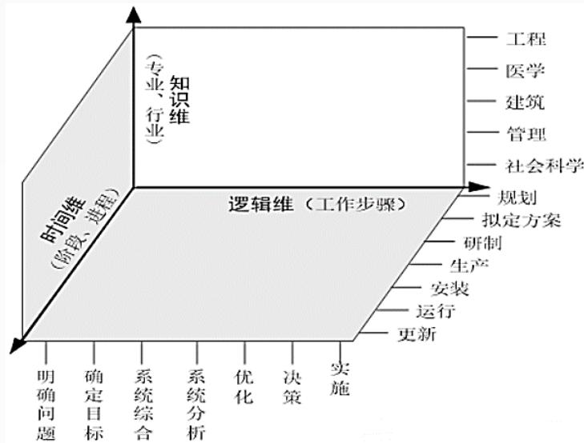

## 系统架构设计师

## 系统工程

## 第二章 计算机系统基础知识

2.1 计算机系统概述  
2.2 计算机硬件  
2.3 计算机软件  
2.4 嵌入式系统及软件  
2.5 计算机网络  
2.6 计算机语言  
⚫ 2.7 多媒体  
2.8 系统工程  
2.9 系统性能

## 一、 系统工程概述

系统工程是为了最好地实现系统的目的，对系统的组成要素、组织结构、信息流、控制机构等进行分析研究的科学方法。它运用各种组织管理技术，使系统的整体与局部之间的关系协调和相互配合，实现总体的最优运行。(实现系统最优化管理工程技术)钱学森教授在1978年指出："系统工程"是组织管理"系统"的规划、研究、设计、制造、试验和使用的科学方法，是一种对所有"系统"都具有普遍意义的科学方法。

## 二、系统工程方法

系统工程方法的特点:整体性、综合性、协调性、科学性和实践性。

常见的系统工程方法：

霍尔的三维结构  
切克兰德方法  
并行工程方法  
综合集成法  
WSR系统方法

## 1.霍尔的三维结构

霍尔三维结构是指时间维、逻辑维和知识维。

时间维表示系统工程活动从开始到结束按时间顺序排列的全过程，分为规划、拟订方案、研制、生产、安装、运行、更新7个时间阶段。  
逻辑维是指时间维的每个阶段内要进行的工作内容和应该遵循的思维程序，包括明确问题、确定目标、系统综合、系统分析、优化、决策、实施7个逻辑步骤。  
知识维需要运用包括工程、医学、建筑、商业、法律、管理、高级项目经理 社会科学、艺术等各种知识和技能。

text_image

工程
医学
建筑
管理
社会科学
规划
拟定方案
研制
生产
安装
运行
更新
逻辑维（工作步骤）
知识维
（专业、行业）
时间维
（阶段、进程）
明确问题
确定目标
系统综合
系统分析
优化
决策
实施

2.切克兰德方法  
P.切克兰德把霍尔方法论称为"硬科学"方法论，他自己的方法论称为"软科学"方法论。切克兰德方法将工作过程分为 7 个步骤：

认识问题  
根底定义  
建立概念模型  
比较及探寻  
选择  
设计与实施  
评估与反馈

## 3.并行工程方法

并行工程是对产品及其相关过程（包括制造过程和支持过程）进行并行、集成化处理的系统方法和综合技术。它要求产品开发人员从设计开始就考虑产品生命周期的全过程，不仅要考虑产品的各项性能，如质量、成本和用户要求，还应考虑与产品有关的各工艺过程的质量及服务的质量。

具体做法：在产品开发初期，组织多种职能协同工作的项目组，使有关人员从一开始就获得对新产品需求的要求和信息，积极研究涉及本部门的工作业务，并将相应的要求提供给设计人员，使许多问题在开发早期就得到解决，从而保证了设计的质量，避免了大量的返工浪费。 

## 4.综合集成法

1990年初，钱学森等首次把处理开放的复杂巨系统的方法命名为从定性到定量的综合集成法。综合集成是从整体上考虑并解决问题的方法论。根据组成子系统及子系统种类的多少和它们之间关联关系的复杂程度，把系统分为简单系统和巨系统两大类。

(1) 如果组成系统的子系统数量比较少，它们之间的关系比较单纯的系统称为简单系统，如一台测量仪器。  
(2)如果子系统数量非常巨大(如成千上万)，则称作巨系统。  
(3)如巨系统中子系统种类不太多 (几种、几十种)，且它们之间的关联关系又比较简单，就称作简单巨系统，如激光系统。  
(4)如果子系统种类很多并有层次结构，它们之间的关联关系又很高级项目经理复杂，这就是复杂巨系统。如果这个系统又是开放的，就称作开放的复杂巨系统。

## 5.WSR系统方法

WSR 是物理 (Wuli)、事理 (Shili)、人理(Renli) 方法论的简称，它既是一种方法论，又是一种解决复杂问题的工具。WSR 是物理、事理和人理三者如何巧妙配置、有效利用以解决问题的一种系统方法论。“懂物理、明事理、通人理”就是 WSR 方法论的实践准则

WSR 方法论工作过程包括七步：理解意图、制定目标、调查分析、构造策略、选择方案、协调关系和实现构想。

这些步骤不一定严格依照顺序，协调关系始终贯穿于整个过程。

## 三、系统工程的生命周期

1.生命周期阶段  
1)探索性研究阶段  
2)概念阶段  
3)开发阶段  
4)生产阶段  
5)使用阶段  
6)保障阶段  
7)退役阶段

2.生命周期方法  
1)计划驱动方法  
2)渐进迭代式开发  
3)精益开发  
4)敏捷开发

1)计划驱动方法

计划驱动方法提供一种基础的框架，为生命周期流程(需求、设计、构建、测试、部署)提供规程。

计划驱动方法的特征在于整个过程始终遵守规定流程的系统化方法。特别关注文档的完整性、需求的可追溯性以及每种表示的事后验证。

## 2)渐进迭代式开发

渐进迭代式开发(IID)方法允许为项目提供初始能力，随之提供连续交付以达到期望的系统。目标在于快速产生价值并提供快速响应能力。

当需求不清晰不确定或者客户希望在系统中引入新技术时，可使用 IID 方法。基于一系列最初的假设，开发候选的系统，然后对其评估以确定是否满足用户需求。若不满足，则启另一轮演进，并重复该流程，直到交付的系统满足利益攸关者的要求。

IID 方法适用于较小的、不太复杂的系统。

## 3)精益开发

精益开发的目标是通过彻底消除生产线上的浪费、不一致性及不合理需求，高效率地生产出优质产品

精益思想是一个动态的、知识驱动的、以客户为中心的过程，通过这一过程使特定企业的所有人员以创造价值为目标不断地消除浪费。

## 4)敏捷开发

敏捷联盟致力于开发迭代和敏捷的方法，寻求更快、更好的软件开发方法，挑战更多的传统模型。敏捷的关键目标在于灵活性，当风险可接受时允许从序列中排除选定的事件。

## Thank You