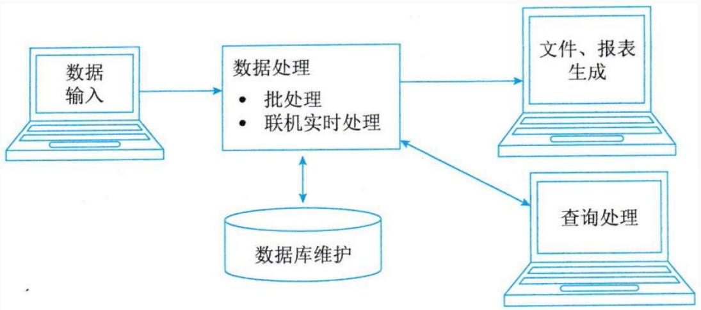
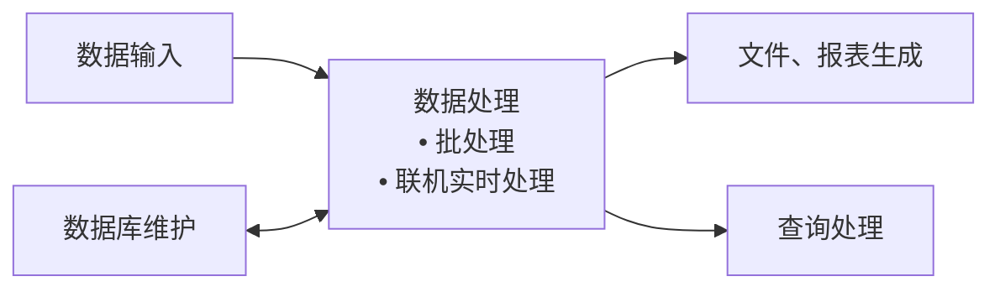
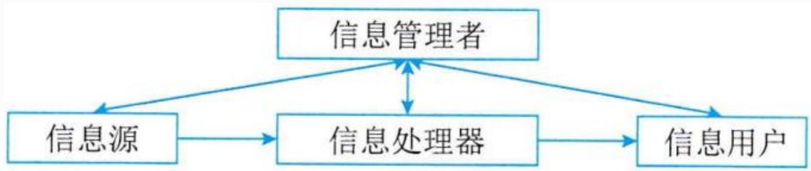
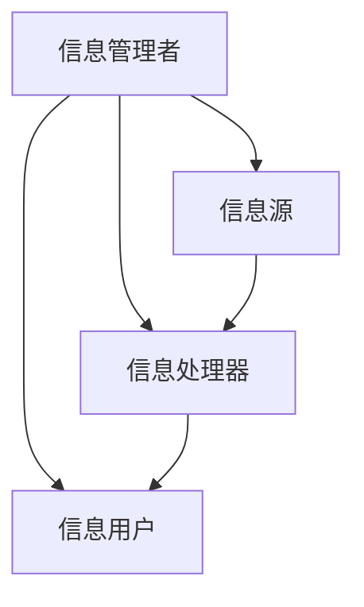
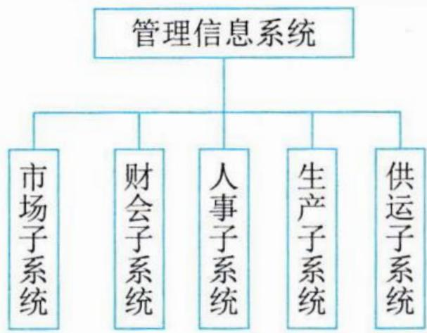
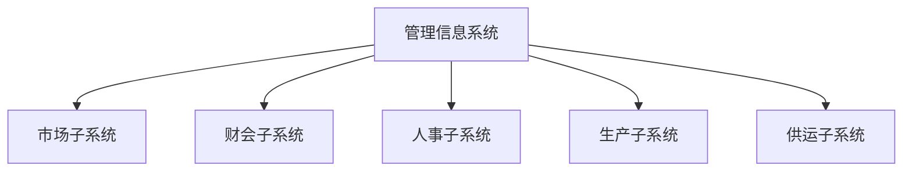
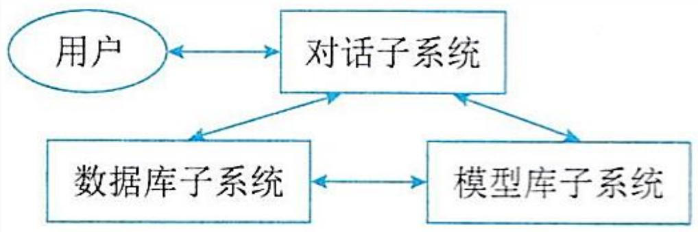
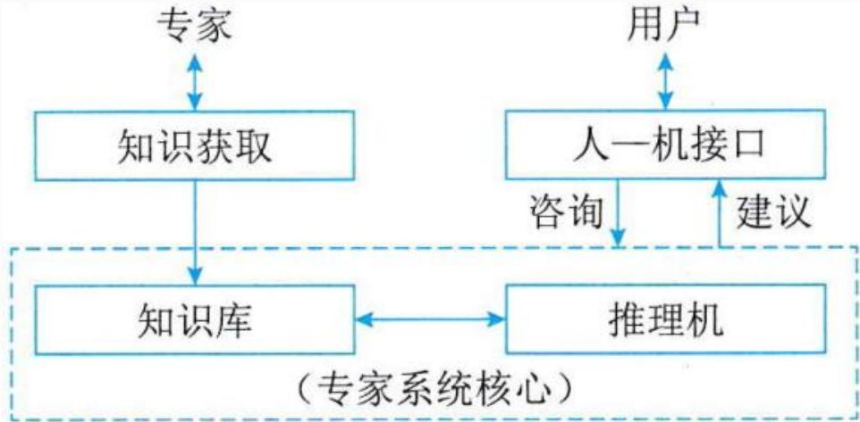
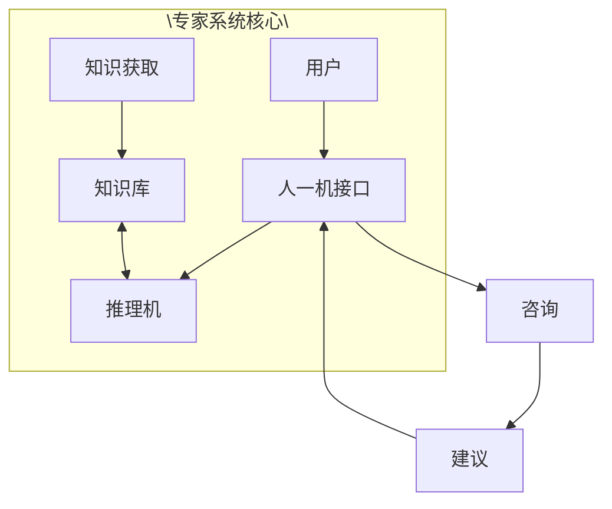

## 系统架构设计师

## 业务处理系统

## 第三章 信息系统基础知识

3.1 信息系统概述  
⚫ 3.2 业务处理系统(TPS)  
3.3 管理信息系统(MIS)  
3.4 决策支持系统(DSS)  
3.5 专家系统(ES)  
3.6 办公自动化系统(OAS)  
3.7 企业资源规划(ERP)  
3.8 典型信息系统架构模型

## 一、业务处理系统的概念

业务处理系统(TPS)，是针对管理中具体的事务(如财会、销售、库存等)来辅助管理人员将所发生的数据进行记录、传票、记账、统计和分类，并制成报表等活动，为经营决策提供有效信息的基于计算机的信息系统。

业务处理系统是服务于组织管理层次中最低层、最基础的信息系统。它的主要目的是帮助作业层管理人员减轻处理原始数据负担，提高处理效率。

## 二、业务处理系统的功能

TPS的主要功能就是对企业管理中日常事务发生的数据进行输入、处理和输出。

TPS的数据处理周期由以下5个阶段构成：数据输入、数据处理、数据库的维护、文件报表的生成和查询处理。

flowchart

图3-2 TPS的构成

## 第三章 信息系统基础知识

3.1 信息系统概述  
⚫ 3.2 业务处理系统(TPS)  
⚫ 3.3 管理信息系统(MIS)  
3.4 决策支持系统(DSS)  
3.5 专家系统(ES)  
3.6 办公自动化系统(OAS)  
3.7 企业资源规划(ERP)  
3.8 典型信息系统架构模型

## 管理信息系统的概念

管理信息系统(MIS)是由业务处理系统发展而成的，是在TPS基础上引进大量管理方法对企业整体信息进行处理，并利用信息进行预测、控制、计划、帮助企业全面管理的信息系统。MIS是一个高度集成化的人机信息系统。

管理信息系统由四大部件组成：信息源、信息处理器、信息用户和信息管理者。

flowchart

图3-4管理信息系统总体结构

## 二 、管理信息系统的功能

管理信息系统从使用者的角度看，它总是有一个目标，具有多种功能，各种功能之间又有各种信息联系，构成一个有机结合的整体，形成一个功能结构。

flowchart

图3-7管理信息系统的功能结构

## 第三章 信息系统基础知识

3.1 信息系统概述  
⚫ 3.2 业务处理系统(TPS)  
3.3 管理信息系统(MIS)  
3.4 决策支持系统(DSS)  
3.5 专家系统(ES)  
3.6 办公自动化系统(OAS)  
3.7 企业资源规划(ERP)  
3.8 典型信息系统架构模型

## 一、决策支持系统的概念

决策支持系统(DSS)是一个由语言系统、知识系统和问题处理系统三个互相关联的部分组成的，基于计算机的系统。

DSS应具有的特征是：

数据和模型是DSS的主要资源  
DSS用来支援用户作决策而不是代替用户作决策  
DSS主要用于解决半结构化及非结构化问题  
⚫ DSS的作用在于提高决策的有效性而不是提高决策的效率

1.决策支持系统的结构

DSS的两种基本结构形式是两库结构和基于知识结构。

两库结构由数据库子系统、模型库子系统和对话子系统形成三角形分布的结构。

flowchart

图3-12DSS的两库结构

## 第三章 信息系统基础知识

3.1 信息系统概述  
⚫ 3.2 业务处理系统(TPS)  
3.3 管理信息系统(MIS)  
3.4 决策支持系统(DSS)  
⚫ 3.5 专家系统(ES)  
3.6 办公自动化系统(OAS)  
3.7 企业资源规划(ERP)  
3.8 典型信息系统架构模型

## 专家系统的概念

## 1.专家系统

专家系统(ES)是一个智能计算机程序系统，其内部含有大量的某个领域专家水平的知识与经验，它能够应用人工智能技术和计算机技术，根据系统中的知识与经验，进行推理和判断，模拟人类专家的决策过程，以便解决那些需要人类专家处理的复杂问题。简而言之，专家系统是一种模拟人类专家解决领域问题的计算机程序系统。

## 2.人工智能

人工智能(AI)是计算机科学的一个分支，它企图了解智能的实质，并生产出一种新的能与人类智能相似的方式做出反应的智能机器，该领域的研究包括机器人、语言识别、图像识别、自然语言处理和专家系统等。

text_image

person: 0.979
car: 0.985
umbrella: 0.955
person: 0.993
person: 0.999
bicycle: 0.988
handbag: 0.517
motorbike: 0.773
bicycle: 0.954
car: 0.999

## 二、专家系统的组成

由于专家系统的应用领域不同，求解问题的类型不同，专家系统的结构也略有差别。但专家系统的核心部分基本相同，其一般结构如图所示。

专家系统组成三要素：描述问题状态的综合数据库、存放启发式经验知识的知识库和对知识库的知识进行推理的推理机。

flowchart

## 1.知识库

专家系统的知识库用来存放系统求解实际问题的领域知识。知识库中的知识可分成两类：

事实性知识：又叫事实，是指学习者通晓一门学科或解决其中的问题所必须知道的基本要素。  
启发性知识：指与问题有关且能够加快推理过程、求解问题最优解的知识。

知识库是专家系统质量是否优越的关键所在，即知识库中知识的质量和数量决定着专家系统的质量水平。 高级项目经理

## 2.综合数据库

综合数据库是专家系统在执行与推理过程中用来存放所需要和产生的各种信息的工作存储器，通常包括欲解决问题的初始状态描述、中间结果、求解过程的记录、用户对系统提问的回答等信息，因此，综合数据库又叫动态知识库，其内容在系统运行过程中是不断变化的。对应的把专家系统的知识库称为静态知识库。

## 3.推理机

推理机也称为控制结构或规则解释器，推理机和知识库一起构成专家系统的核心。有人认为专家系统=知识库+推理机。

推理机通常包括推理机制和控制策略，是一组用来控制系统的运行、执行各种任务、根据知识库进行各种搜索和推理的程序模块。

专家系统中常用的推理方式有3 种：

正向推理或前向推理  
反向推理或逆向推理  
双向推理或混合推理

## Thank You