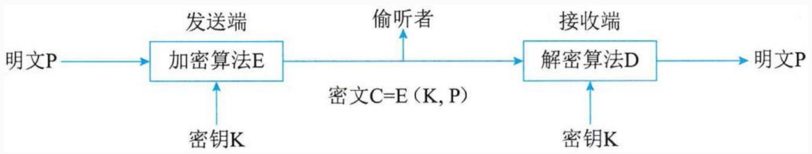
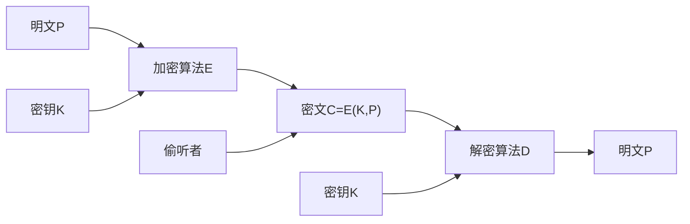

## 系统架构设计师

## 之 信息安全系统的组成框架

## 第四章 信息安全技术基础知识

4.1 信息安全基础知识  
4.2 信息系统安全的作用与意义  
4.3 信息安全系统的组成框架  
4.4 信息加解密技术  
4.5 密钥管理技术  
4.6 访问控制及数字签名技术  
4.7 信息安全的抗攻击技术  
⚫ 4.8 信息安全的保障体系与评估方法

信息安全系统框架由技术体系、组织机构体系和管理体系构建。

## 一、技术体系

从实现技术来看，信息安全系统涉及基础安全设备、计算机网络安全、操作系统安全、数据库安全、终端设备安全等多方面技术。

(1)基础安全设备。包括密码芯片、加密卡、身份识别卡等，还涵盖运用到物理安全的物理环境保障技术，建筑物、机房条件及硬件设备条件满足信息系统的机械防护安全，通过电力供应设备以及信息系统组件的抗电磁干扰和电磁泄漏性能的选择性措施达到相应的安全目的。 高级项目经理

(2)计算机网络安全。指信息在网络传输过程中的安全防范，用于防止和监控未经授权破坏、更改和盗取数据的行为。涉及物理隔离，防火墙及访问控制，加密传输、认证、数字签名、摘要，隧道及VPN 技术，病毒防范及上网行为管理，安全审计等实现技术。  
(3)操作系统安全。指操作系统的无错误配置、无漏洞、无后门、无特洛伊木马等，能防上非法用户对计算机资源的非法存取。

操作系统的安全机制包括标识与鉴别机制、访问控制机制、最小特权管理、可信通路机制、运行保障机制、存储保护机制、文件保护机制、安全审计机制等。

(4)数据库安全。分为数据库管理系统安全和数据库应用系统安全两部分，涉及物理数据库的完整性、逻辑数据库的完整性、元素安全性、可审计性、访问控制、身份认证、可用性、推理控制、多级保护以及消除隐通道等相关技术。  
(5)终端设备安全。从电信网终端设备的角度分为电话密码机、传真密码机、异步数据密码机等。

## 二、组织机构体系

组织机构体系是信息系统安全的组织保障系统，由机构、岗位和人事机构三个模块构成一个体系。

机构的设置分为3 个层次：决策层、管理层和执行层。  
岗位是信息系统安全管理机关根据系统安全需要设定的负责某一个或某几个安全事务的职位。  
⚫ 人事机构是根据管理机构设定的岗位，对岗位上在职、待职和离职的雇员进行素质教育、业绩考核和安全监管的机构。

## 三、管理体系

信息系统安全的管理体系由法律管理、制度管理和培训管理3个部分组成。

(1)法律管理是根据相关的国家法律、法规对信息系统主体及其与外界关联行为的规范和约束。  
(2)制度管理是信息系统内部依据国家、团体的安全需求制定的系列内部规章制度。  
(3)培训管理是确保信息系统安全的前提。

## 第四章 信息安全技术基础知识

4.1 信息安全基础知识  
4.2 信息系统安全的作用与意义  
4.3 信息安全系统的组成框架  
⚫ 4.4 信息加解密技术  
4.5 密钥管理技术  
4.6 访问控制及数字签名技术  
4.7 信息安全的抗攻击技术  
4.8 信息安全的保障体系与评估方法

## 一、数据加密

数据加密技术是利用数学或物理手段，对电子信息在传输过程和存储体内进行保护，以防止信息泄漏的技术。

包括：

对称密钥技术  
非对称密钥技术

flowchart

## 1.对称密钥技术

对称密钥技术是指加密密钥和解密密钥相同，或者虽然不同，但从其中一个可以很容易地推导出另一个。

优点是加密效率高，但密钥的传输需要经过安全可靠的途径。常见的对称密钥技术：

DES(数据加密标准)：使用56位的密钥对数据进行加密  
⚫ 3DES(三重数据加密算法)：使用112位密钥对数据进行加密  
⚫ IDEA算法：密钥长度为128位，其明文和密文都是64位  
⚫ AES、SM4、RC2、RC4、RC5

## 2.非对称密钥技术（公钥算法）

非对称密钥技术是指加密密钥和解密密钥完全不同，并且不可能从任何一个推导出另一个。

⚫ 优点是适应开放性的使用环境，可以实现数字签名与验证。  
最常见的非对称密钥技术是RSA。它的理论基础是数论中大素数分解。  
使用RSA来加密大量的数据则速度太慢，因此RSA广泛用于密钥的分发。

## Thank You