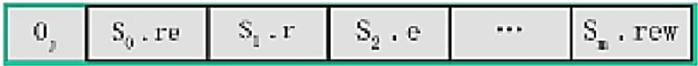
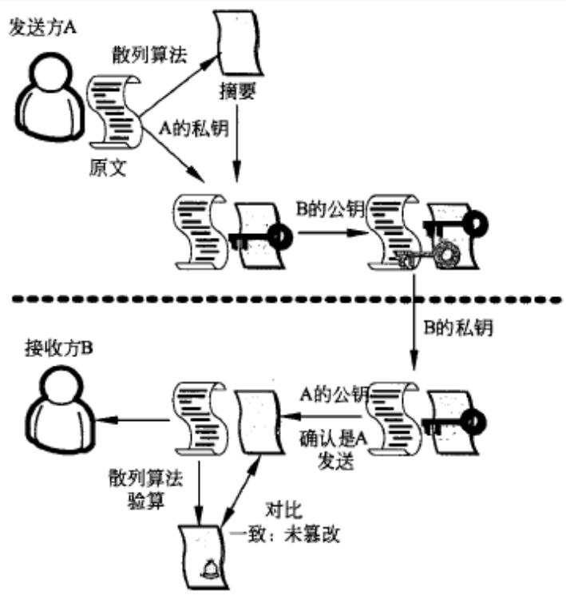
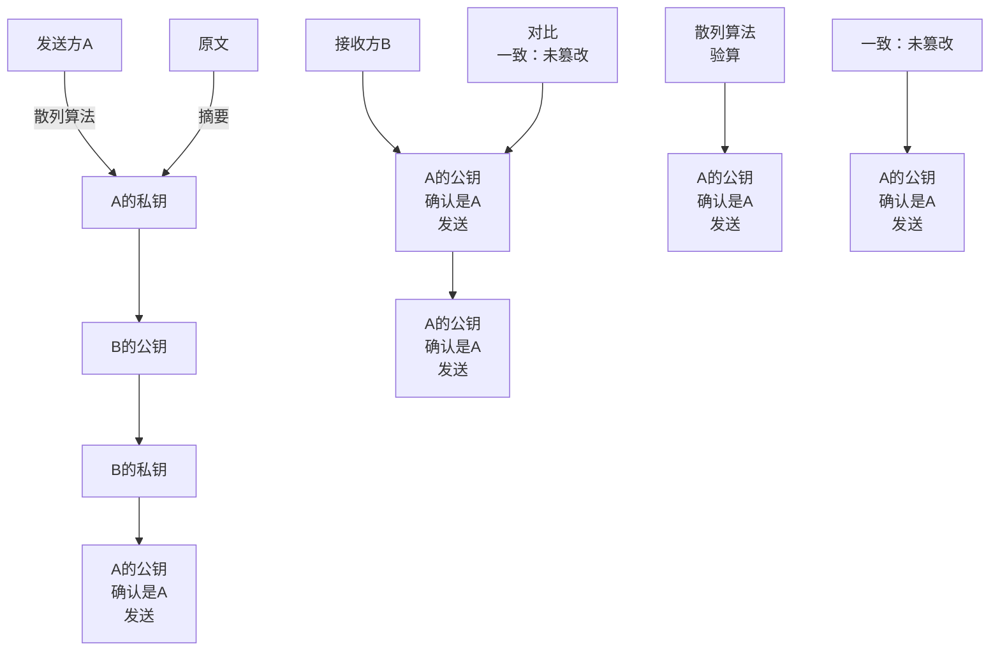
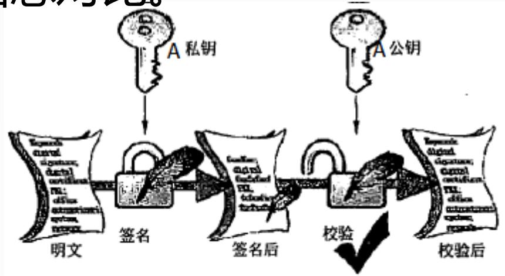
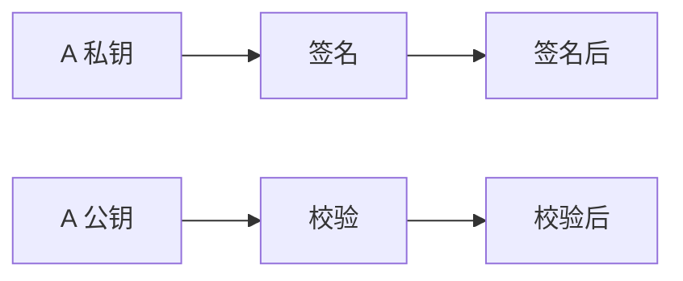

## 系统架构设计师

## 之

## 访问控制与数字签名技术

## 第四章 信息安全技术基础知识

4.1 信息安全基础知识  
4.2 信息系统安全的作用与意义  
4.3 信息安全系统的组成框架  
4.4 信息加解密技术  
4.5 密钥管理技术  
4.6 访问控制及数字签名技术  
4.7 信息安全的抗攻击技术  
⚫ 4.8 信息安全的保障体系与评估方法

## 访问控制技术

访问控制是指主体依据某些控制策略或权限对客体本身或是其资源进行的不同授权的访问。

1.访问控制的基本模型

访问控制包括3 个要素，即主体、客体和控制策略。

主体(Subject):是可以对其他实体施加动作的主动实体，简记为S。可以是用户所在的组织(用户组)、用户本身，也可是用户使用的计算机终端、卡机、手持终端(无线)等，甚至可以是应用服务程序或进程。

客体(Object):是接受其他实体访问的被动实体，简记为O。凡是可以被操作的信息、资源、对象都可以认为是客体。  
控制策略:是主体对客体的操作行为集和约束条件集，简记为KS。控制策略是主体对客体的访问规则集，这个规则集直接定义了主体对客体的作用行为和客体对主体的条件约束。访问策略是一种授权行为。

访问控制包括认证、控制策略和审计三个方面的内容。

2.访问控制的实现技术

1)访问控制矩阵  
2)访问控制表  
3)能力表  
4)授权关系表

1)访问控制矩阵

访问控制矩阵(ACM)以主体为行索引，以客体为列索引的矩阵，矩阵中的每一个元素表示一组访问方式，是若干访问方式的集合。即每个主体对哪些客体有哪些访问权限。查找、实现不方便。

<table><tr><td></td><td>File1</td><td>File2</td><td>File3</td><td>File4</td></tr><tr><td>John</td><td>Own、R、W</td><td></td><td>Own、R、W</td><td></td></tr><tr><td>Alice</td><td>R</td><td>Own、R、W</td><td>W</td><td>R</td></tr><tr><td>Bob</td><td>R、W</td><td>R</td><td></td><td>Own、R、W</td></tr></table>

2)访问控制表

访问控制表(ACLs)是使用最多的访问控制实现技术。每个客体有一个访问控制表，是系统中每一个有权访问这个客体的主体的信息。实际上是按列保存访问矩阵。

访问控制表提供了针对客体的方便的查询方法，但是用访问控制表来查询一个主体对所有客体的所有访问权限是很困难。

text_image

0, S₀ . re S₁ . r S₂ . e ... Sₘ . re w

## 3)能力表

能力表(Capabilities)实际上是按行保存访问矩阵。每个主体有一个能力表，是该主体对系统中每一个客体的访问权限信息。

使用能力表可以很方便地查询某一个主体的所有访问权限，只需要遍历这个主体的能力表即可。但查询对某一个客体具有访问权限的主体信息就很困难了，必须查询系统中所有主体的能力表。

## 4)授权关系表

每一行表示主体和客体的一个授权关系。

对表按主体进行排序，可以得到能力表的效率  
对表按客体进行排序，可以得到访问控制表的效率  
适合采用关系数据库来实现。

<table><tr><td>主体</td><td>访问权限</td><td>客体</td></tr><tr><td>John</td><td>Own</td><td>File1</td></tr><tr><td>John</td><td>R</td><td>File1</td></tr><tr><td>John</td><td>W</td><td>File1</td></tr><tr><td>John</td><td>Own</td><td>File3</td></tr><tr><td>John</td><td>R</td><td>File3</td></tr><tr><td>John</td><td>W</td><td>File3</td></tr><tr><td>Alice</td><td>R</td><td>File1</td></tr><tr><td>Alice</td><td>Own</td><td>File2</td></tr><tr><td>Alice</td><td>R</td><td>File2</td></tr><tr><td>Alice</td><td>W</td><td>File2</td></tr></table>

## 二、数字签名

数字签名是指通过一个单向函数对要传送的报文进行处理，得到用以认证报文来源并核实报文是否发生变化的一个字母数字串。它与数据加密技术一起，构建起了安全的商业加密体系。

传统的数据加密是保护数据的最基本方法，它只能够防止第三者获得真实的数据(数据的机密性)，而数字签名则可以解决否认、伪造、篡改和冒充的问题(数据的完整性和不可抵赖性)。  
数字签名使用的是公钥算法（非对称密钥技术）。

## 数字签名的过程：

(1)发送者A先通过散列函数对要发送的信息(M)计算消息摘要(MD)，也就是提取原文的特征。  
(2)发送者A将原文(M)和消息摘要(MD)用自己的私钥(PrA)进行加密，就是完成签名动作，其信息可以表示为PrA (M+MD)。  
(3)然后以接收者B的公钥(PB)作为密钥，对这个信息包进行再次加密，得到PB(PrA(M+MD))。  
(4)当接收者收到后，首先用自己的私钥PrB进行解密，从而得到$P r A ( M + M D )$ 。 

(5)再利用A的公钥(PA)进行解密，如果能够解密，显然说明该数据是A发送的，同时也就将得到原文M和消息摘要MD。  
(6)然后对原文M计算消息摘要，得到新的MD，与收到MD进行比较，如果一致，说明该数据在传输时未被篡改。

flowchart

图14-2实际应用中的公钥加密和数字签名流程

## 数字加密和数字签名的区别

⚫ 数字加密是用接收者的公钥加密，接收者用自己的私钥解密。  
数字签名是：将摘要信息用发送者的私钥加密，与原文一起传送给接收者。接收者只有用发送者的公钥才能解密被加密的摘要信息，然后用HASH函数对收到的原文产生一个新摘要信息，与解密的摘要信息对比。

flowchart

例：下面不属于数字签名作用的是（ ） 。

A．接收者可验证消息来源的真实性  
B．发送者无法否认发送过该消息  
C．接收者无法伪造或篡改消息  
D．可验证接收者的合法性

## 数字签名的条件

可用的数字签名应保证以下几个条件：

签名是可信的。签名使文件的接收者相信签名者是慎重地在文件上签字的。  
⚫ 签名不可伪造。签名证明是签字者而不是其他人在文件上签字。  
⚫ 签名不可重用。签名是文件的一部分，不可能将签名移到不同的文件上。  
⚫ 签名的文件是不可改变的。在文件上签名后，文件不能再改变。  
签名是不可抵赖的。签名和文件是物理的东西，签名者事后不能声称他没有签过名。 

## Thank You