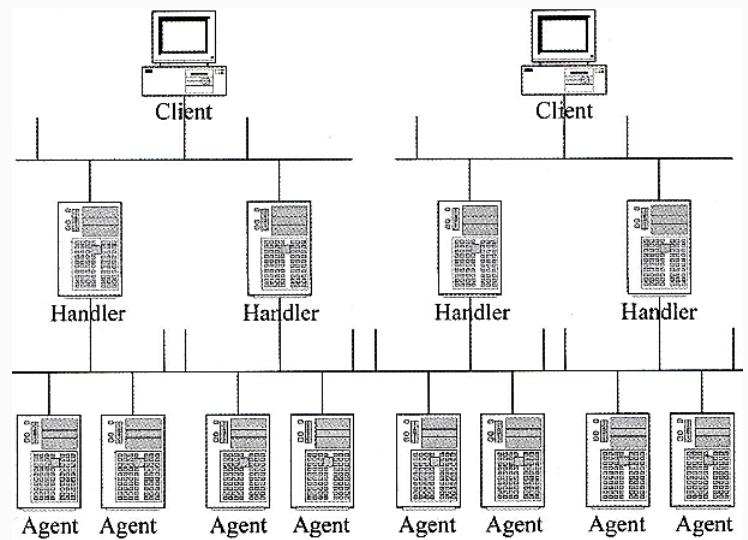
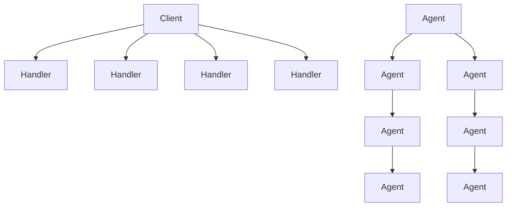
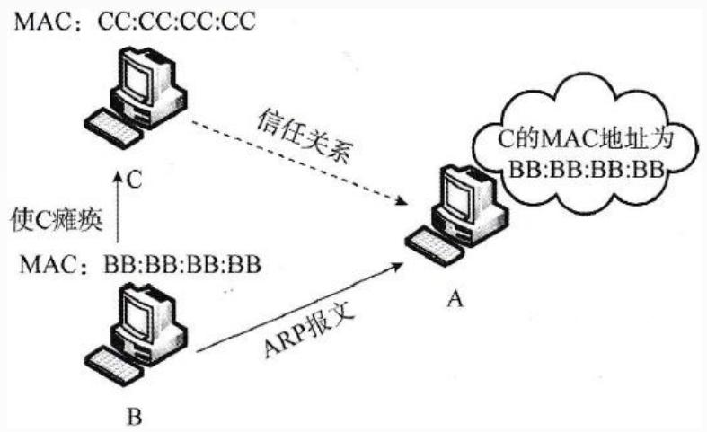
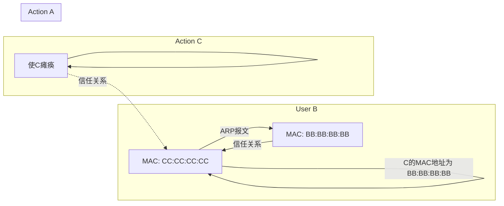
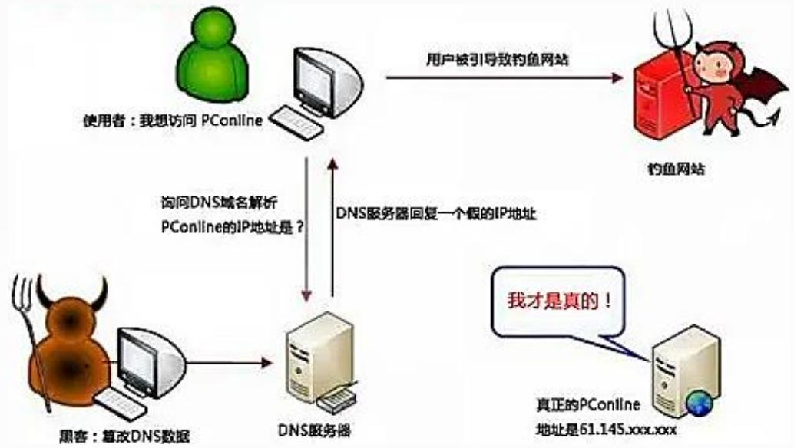
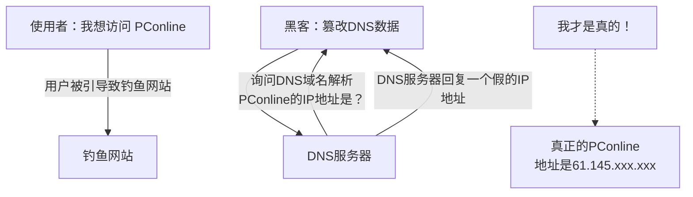
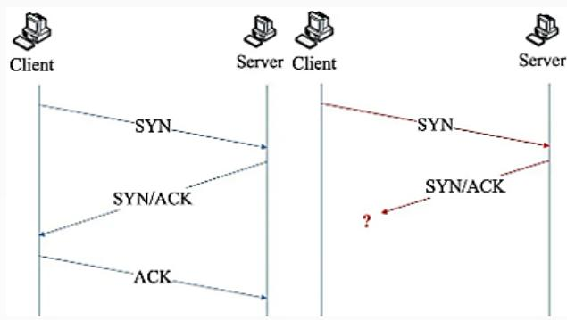
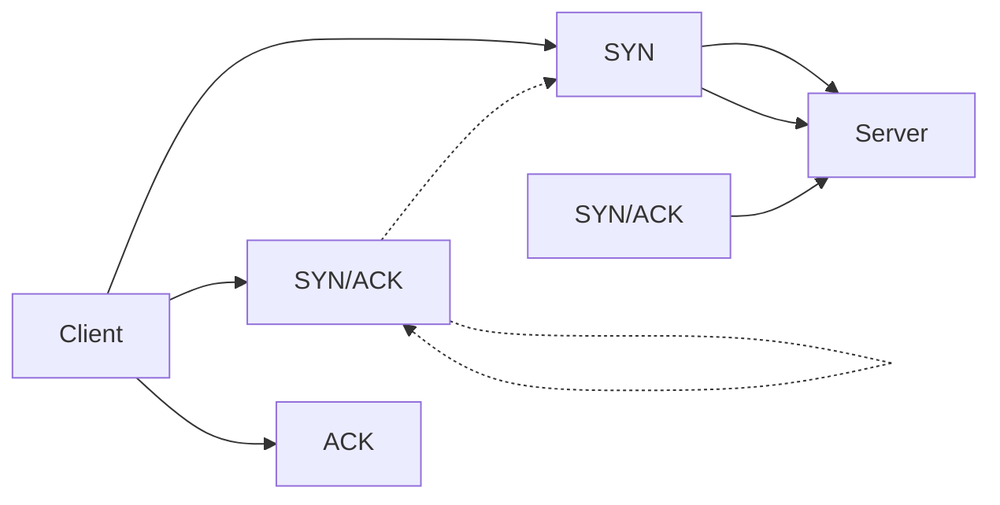

## 系统架构设计师

## 之 信息安全的抗攻击技术

## 第四章 信息安全技术基础知识

4.1 信息安全基础知识  
4.2 信息系统安全的作用与意义  
4.3 信息安全系统的组成框架  
4.4 信息加解密技术  
4.5 密钥管理技术  
4.6 访问控制及数字签名技术  
4.7 信息安全的抗攻击技术  
⚫ 4.8 信息安全的保障体系与评估方法

## 密钥的选择

密钥在概念上被分成两大类：数据加密密钥(DK)和密钥加密密钥(KK)。前者直接对数据进行加密，后者用于保护密钥，使之通过加密而安全传递。算法的安全性在于密钥。

为对抗攻击者的攻击，密钥的生成需要考虑 3 个方面的因素：

1.增大密钥空间  
2.选择强钥  
3.密钥的随机性

<table><tr><td>Key size (bits)</td><td>Cipher</td><td>Number of Alternative Keys</td><td>Time Required at  ${10}^{9}$ decryptions/s</td><td>Time Required at  ${10}^{13}$ decryptions/s</td></tr><tr><td>56</td><td>DES</td><td> ${2}^{56} \approx {7.2} \times {10}^{16}$ </td><td> ${2}^{55}\mathrm{{ns}} = {1.125}$  years</td><td>1 hour</td></tr><tr><td>128</td><td>AES</td><td> ${2}^{128} \approx {3.4} \times {10}^{38}$ </td><td> ${2}^{127}\mathrm{{ns}} = {5.3} \times {10}^{21}$ years</td><td> ${5.3} \times {10}^{17}$  years</td></tr><tr><td>168</td><td>Triple DES</td><td> ${2}^{168} \approx {3.7} \times {10}^{50}$ </td><td> ${2}^{167}\mathrm{{ns}} = {5.8} \times {10}^{33}$ years</td><td> ${5.8} \times {10}^{29}$  years</td></tr><tr><td>192</td><td>AES</td><td> ${2}^{192} \approx {6.3} \times {10}^{57}$ </td><td> ${2}^{191}\mathrm{{ns}} = {9.8} \times {10}^{40}$ years</td><td> ${9.8} \times {10}^{36}$  years</td></tr></table>

1.对称密钥技术

对称密钥技术是指加密密钥和解密密钥相同，或者虽然不同，但从其中一个可以很容易地推导出另一个。

·优点是加密效率高，但密钥的传输需要经过安全可靠的途径。常见的对称密钥技术：  
·DES(数据加密标准)：使用56位的密钥对数据进行加密  
·3DES(三重数据加密算法)：使用112位密钥对数据进行加密  
·IDEA算法：密钥长度为128位，其明文和密文都是64位  
•AES、SM4、RC2、RC4、RC5

向上人生路！

## 二、拒绝服务攻击与防御

拒绝服务攻击(DoS)是借助于网络系统或网络协议的缺陷和配置漏洞进行网络攻击，使网络拥塞、系统资源耗尽或者系统应用死锁，妨碍目标主机和网络系统对正常用户服务请求的及时响应，造成服务的性能受损甚至导致服务中断。

目前常见的拒绝服务攻击为分布式拒绝服务攻击(DDoS)。

1)拒绝服务攻击的分类

拒绝服务攻击主要有以下几种模式:

(1)消耗资源。攻击者利用系统资源有限这一特征，或者是大量地申请系统资源，并长时间地占用；或是不断地向服务程序发出请求，使系统忙于处理攻击者的请求，而无暇为其他用户提供服务。攻击者可以针对以下几种资源发起拒绝服务攻击:

①针对网络连接的拒绝服务攻击。  
②消耗磁盘空间。  
③消耗CPU资源和内存资源。

(2)破坏或更改配置信息。计算机系统配置上的错误也可能造成拒绝服务攻击，尤其是服务程序的配置文件以及系统、用户的启动文件。攻击者修改配置文件，从而改变系统向外提供服务的方式。  
(3)物理破坏或改变网络部件。这种拒绝服务针对的是物理安全，其通过物理破坏或改变网络部件以达到拒绝服务的目的。其攻击的目标有计算机、路由器、网络配线室、网络主干段、电源、冷却设备，及其他的网络关键设备。  
(4)利用服务程序中的处理错误使服务失效。

## 2)分布式拒绝服务攻击

分布式拒绝服务攻击的攻击者首先侵入并控制一些计算机，然后控制这些计算机同时向一个特定的目标发起拒绝服务攻击。

分布式拒绝服务攻击克服了传统拒绝服务攻击的受网络资源限制和隐蔽性差两大缺点，危害性更大。

分布式拒绝服务攻击工具一般采用三级控制结构：

⚫ Client (客户端)运行在攻击者的主机上，用来发起和控制分布式拒绝服务攻击。  
⚫ Handler(主控端)运行在已被攻击者侵入并获得控制的主机上，用来控制代理端。  
Agent(代理端)运行在已被攻击者侵入并获得控制的主机上，从主控端接收命令，负责对目标实施实际的攻击。

flowchart

图5-2分布式拒绝服务攻击的三级控制结构

3)拒绝服务攻击的防御方法

使用下面的方法尽量阻止拒绝服务攻击：

(1)加强对数据包的特征识别，通过搜寻特征字符串，就可以确定攻击服务器和攻击者的位置。  
(2)设置防火墙监视本地主机端口的使用情况。对本地主机中的敏感端口进行监视，如UDP 31335、 UDP 27444、 TCP 27665。如果外部主机主动向网络内部高标号端口发起连接请求,则系统也很可能受到侵入。

(3)对通信数据量进行统计也可获得有关攻击系统的位置和数量信息。例如，在攻击之前，目标网络的域名服务器往往会接收到远远超过正常数量的反向和正向的地址查询。在攻击时，攻击数据的来源地址会发出超出正常极限的数据量。  
(4)尽可能地修正已经发现的问题和系统漏洞。

## 三、欺骗攻击与防御

1.ARP欺骗  
2.DNS欺骗  
3.IP欺骗

## 1)ARP欺骗

又称ARP毒化或ARP攻击，是针对以太网地址解析协议(ARP)的一种攻击技术，通过欺骗局域网内访问者PC的网关MAC地址，使访问者PC错以为攻击者更改后的MAC地址是网关的MAC，导致网络不通。此种攻击可让攻击者获取局域网上的数据包甚至可篡改数据包，且可让网络上特定计算机或所有计算机无法正常连线。

flowchart

## ARP欺骗的防范措施：

(1)在WinXP下输入命令 arp -s gate-way-ip gate-way-mac固化ARP表，阻止ARP欺骗。  
(2)使用ARP服务器。通过该服务器查找自己的ARP转换表来响应其他机器的ARP广播。确保这台ARP服务器不被黑。  
(3)采用双向绑定的方法解决并且防止ARP欺骗。  
(4)使用ARP防护软件--ARP Guard。

## 2) DNS欺骗

DNS欺骗首先是冒充域名服务器，然后把查询的IP地址设为攻击者的IP地址，用户上网就只能看到攻击者的主页，而不是用户想要取得的网站的主页了。DNS欺骗其实并不是真的"黑掉"了对方的网站，而是冒名顶替、招摇撞骗罢了。

flowchart

## 1.DNS欺骗的检测

根据检测手段的不同，将其分为被动监听检测、虚假报文探测和交叉检查查询三种。

①被动监听检测:该检测手段是通过旁路监听的方式，捕获所有DNS请求和应答数据包，并为其建立一个请求应答映射表。如果在一定的时间间隔内，一个请求对应两个或两个以上结果不同的应答包，则怀疑受到了DNS欺骗攻击，因为DNS服务器不会给出多个结果不同的应答包。

②虚假报文探测:该检测手段采用主动发送探测包的方式来检测网络内是否存在DNS欺骗攻击者。这种探测手段基于一个简单的假设:攻击者为了尽快地发出欺骗包，不会对域名服务器IP地址的有效性进行验证。如果向一个非DNS服务器发送请求包，正常来说不会收到任何应答，但是由于攻击者不会验证目标IP地址是否是合法DNS服务器，他会继续实施欺骗攻击，因此，如果收到了应答包，则说明受到了攻击。

③交叉检查查询:所谓交叉检查即在客户端收到DNS应答包之后，向DNS服务器反向查询应答包中返回的IP地址所对应的DNS名字，如果二者一致说明没有受到攻击，否则说明被欺骗。

## 3)IP欺骗

IP 欺骗是指创建源地址经过修改的IP数据包，目的要么是隐藏发送方的身份，要么是冒充其他计算机系统。恶意用户往往采用这项技术对目标设备或周边基础设施发动 DDoS 攻击。

虽然无法预防 IP 欺骗，但可以采取措施来阻止伪造数据包渗透网络。入口过滤是防范欺骗的一种常见的防御措施，入口过滤是一种数据包过滤形式，通常在网络边缘设备上实施，用于检查传入的 IP 数据包并确定其源标头。如果这些数据包的源标头与其来源不匹配或者看上去很可疑，则拒绝这些数据包。

## 4.端口扫描

端口扫描就是尝试与目标主机的某些端口建立连接，如果目标主机该端口有回复，则说明该端口开放，即为"活动端口"。

通过端口扫描可以判断目标主机上开放了哪些服务，判断目标主机的操作系统。

## 5.强化TCP/IP堆栈以抵御拒绝服务攻击

## 1)同步风暴(SYN Flooding)

flowchart

SYN Flood攻击中，利用TCP三次握手协议的缺陷，攻击者向目标主机发送大量伪造源地址的TCP SYN报文，目标主机分配必要的资源，然后向源地址返回SYN＋ACK包，并等待源端返回ACK包。由于源地址是伪造的，所以源端永远都不会返回ACK报文，受害主机继续发送SYN＋ACK包，并将半连接放入端口的积压队列中，虽然一般的主机都有超时机制和默认的重传次数，但由于端口的半连接队列的长度是有限的很快被填满，服务器拒绝新的连接，导致该端口无法响应其他机器的连接请求。 

例：SYN Flooding 攻击的原理是（ ）。

A.利用TCP三次握手，恶意造成大量TCP半连接，耗尽服务器资源，导致系统拒绝服务  
B.有些操作系统在实现TCP/IP协议栈时，不能很好地处理TCP报文的序列号的查找问题，导致系统崩溃  
C.有些操作系统在实现TCP/IP协议栈时，不能很好地处理IP分片包的重叠情况，导致系统崩溃  
D.有些操作系统协议栈在处理IP分片时，对于重组后超大的IP数据报不能很好地处理，导致缓存溢出而系统崩溃

## 2)ICMP攻击

利用操作系统规定的ICMP数据包最大尺寸不超过64KB这一规定，向主机发起"Ping of Death"(死亡之Ping)攻击。"Ping of Death"攻击的原理是：如果ICMP数据包的尺寸超过64KB上限时，主机就会出现内存分配错误，导致TCP/IP堆栈崩溃，致使主机死机。

此外，向目标主机长时间、连续、大量地发送ICMP数据包，会形成"ICMP风暴"，使得目标主机耗费大量的CPU资源处理，最终使系统瘫痪。

## 3)SNMP攻击

SNMP是TCP/IP网络中标准的管理协议，它允许网络中的各种设备和软件，包括交换机、路由器、防火墙、集线器、甚至操作系统、服务器产品和部件等，能与管理软件通信，汇报其当前的行为和状态。但是，SNMP还能被用于控制这些设备和产品，重定向通信流，改变通信数据包的优先级，甚至断开通信连接。入侵者如果具备相应能力，就能完全接管你的网络。

## 6.系统漏洞扫描

系统漏洞扫描是对重要计算机信息系统进行检查，发现其中可能被黑客利用的漏洞。

系统漏洞扫描从底层技术来划分，可以分为：

基于网络的扫描  
基于主机的扫描

1)基于网络的漏洞扫描

基于网络的漏洞扫描器是通过网络来扫描远程计算机中的漏洞。

基于网络的漏洞扫描器的优点:

(1)价格相对来说比较便宜。  
(2)在操作过程中，不需要涉及目标系统的管理员。  
(3)在检测过程中，不需要在目标系统上安装任何东西。  
(4)维护简便。

2)基于主机的漏洞扫描

基于主机的漏洞扫描器通常在目标系统上安装一个代理(Agent)或者是服务(Services)，以便能够访问所有的文件与进程，这也使得基于主机的漏洞扫描器能够扫描更多的漏洞。

基于主机的漏洞扫描器具有如下优点:

(1)扫描的漏洞数量多。  
(2)集中化管理。  
(3)网络流量负载小。

## Thank You