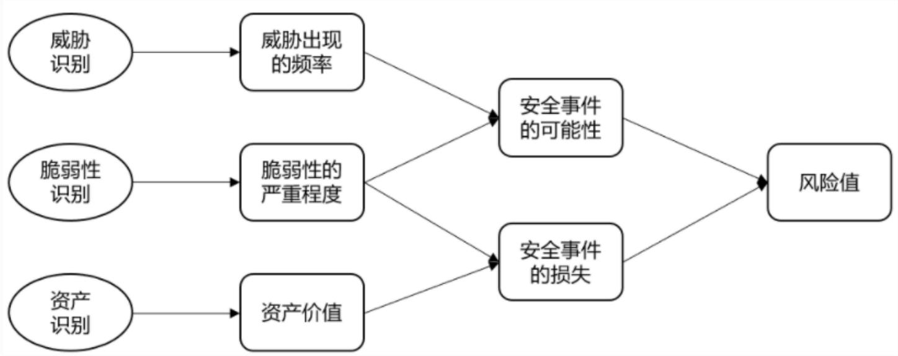
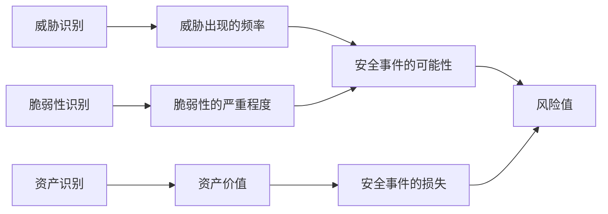

## 系统架构设计师

## 之 信息安全保障体系与评估方法

## 第四章 信息安全技术基础知识

4.1 信息安全基础知识  
4.2 信息系统安全的作用与意义  
4.3 信息安全系统的组成框架  
4.4 信息加解密技术  
4.5 密钥管理技术  
4.6 访问控制及数字签名技术  
4.7 信息安全的抗攻击技术  
⚫ 4.8 信息安全的保障体系与评估方法

一、 计算机信息系统安全保护等级

<table><tr><td>层次</td><td>名称</td><td>措施</td><td>对象</td></tr><tr><td>一级</td><td>用户自主保护</td><td>对用户实施访问控制,即为用户提供可行的手段,保护用户和用户组信息,避免其他用户对数据的非法读写与破坏。</td><td>该级适用于普通内联网用户</td></tr><tr><td>二级</td><td>系统审计保护</td><td>实施粒度更细的自主访问控制,它通过登录规程、审计安全性相关事件和隔离资源,使用户对自己的行为负责。</td><td>内联网或国际网进行商务活动,需要保密的非重要单位。</td></tr><tr><td>三级</td><td>安全标记保护</td><td>提供有关安全策略模型、数据标记以及主体对客体强制访问控制的非形式化描述;具有准确地标记输出信息的能力;消除通过测试发现的任何错误。</td><td>地方各级国家机关、金融机构、邮电通信、能源与水源供给部门、交通运输、大型工商与信息技术企业、重点工程建设等单位</td></tr><tr><td>四级</td><td>结构化保护</td><td>建立在一个明确定义的形式化安全策略模型之上,它要求将第三级系统中的自主和强制访问控制扩展到所有主体与客体。此外,还要考虑隐蔽通道。它加强了鉴别机制;支持系统管理员和操作员的职能;提供可信设施管理;增强了配置管理控制。系统具有相当的抗渗透能力。</td><td>中央级国家机关、广播电视部门、重要物质储备单位、社会应急服务部门、尖端科技企业集团、国家重点科研单位机构和国防建设的部门</td></tr><tr><td>五级</td><td>访问验证保护</td><td>满足访问监控器需求。访问监控器仲裁主体对客体的全部访问。访问监控器本身是抗篡改的;必须足够小,能够分析和测试。排除了那些对实施安全策略来说并非必要的代码;在设计和实现时,将其复杂性降低到最小程度。支持安全管理员职能;扩充审计机制,当发生与安全相关的事件时发出信号;提供系统恢复机制。系统具有很高的抗渗透能力。</td><td>国防关键部门和依法需要对技术及信息系统实施隔离单位。</td></tr></table>

## 二、安全风险管理

信息安全风险是指各类应用系统及其赖以运行的基础网络、处理的数据和信息，由于其可能存在的软硬件缺陷、系统集成缺陷等，以及信息安全管理中潜在的薄弱环节，而导致的不同程度的安全风险。

信息安全风险评估是从风险管理的角度，运用科学的手段，系统的分析网络与信息系统所面临的威胁及其存在的脆弱性，评估安全事件一旦发生可能造成的危害程度，制定有针对性的抵御威胁的防护对策、整改措施，以最大限度的保障网络和信息安全。

## 1.风险评估的实施流程

确定风险评估的范围  
确定风险评估的目标  
建立适当的组织结构  
建立系统的风险评估方法

获得最高管理者对风险评估策划的批准

## 2.风险评估

风险评估是对信息资产存在的脆弱性，面临的威胁， 造成的影响，及三者综合作用所带来的风险的可能性评估。

flowchart

## (1)资产识别

<table><tr><td>分类</td><td>说明</td></tr><tr><td>物理环境</td><td>机房、UPS、变电设备、空调、门禁、消防设施等</td></tr><tr><td>网络设备</td><td>路由器、交换机</td></tr><tr><td>安全设备</td><td>防火墙、IPS、IDS、上网行为管理、流控、堡垒机等</td></tr><tr><td>服务器及软件</td><td>大小型机、服务器、工作站、虚拟化;操作系统、数据库、中间件等</td></tr><tr><td>业务应用</td><td>内外网网站、业务系统</td></tr><tr><td>相关人员</td><td>掌握重要信息和核心业务的人员,如主机维护主管、网络维护主管及应用项目经理等</td></tr><tr><td>安全管理文档</td><td>信息安全管理体系、制度、规范及记录文档</td></tr></table>

## (2)脆弱性识别

<table><tr><td>类型</td><td>识别对象</td><td>识别内容</td></tr><tr><td rowspan="5">技术脆弱性</td><td>物理环境</td><td>从机房场地、机房防火、机房供配电、机房防静电、机房接地与防雷、电磁防护、通信线路的保护、机房区域防护、机房设备管理等方面进行识别</td></tr><tr><td>网络结构</td><td>从网络结构设计、边界保护、外部访问控制策略、内部访问控制策略、网络设备安全配置等方面进行识别</td></tr><tr><td>系统软件</td><td>从补丁安装、物理保护、用户账号、口令策略、资源共享、事件审计、访问控制、新系统配置、注册表加固、网络安全、系统管理等方面进行识别</td></tr><tr><td>应用中间件</td><td>从协议安全、交易完整性、数据完整性等方面进行识别</td></tr><tr><td>应用系统</td><td>从审计机制、审计存储、访问控制策略、数据完整性、通信、鉴别机制、密码保护等方面进行识别</td></tr><tr><td rowspan="2">管理脆弱性</td><td>技术管理</td><td>从物理和环境安全、通信与操作管理、访问控制、系统开发与维护、业务连续性等方面进行识别</td></tr><tr><td>组织管理</td><td>从安全策略、组织安全、资产分类与控制、人员安全、符合性等方面进行识别</td></tr></table>

## (3)风险计算

可能性计算

<table><tr><td></td><td>脆弱性严重程度</td><td>1</td><td>2</td><td>3</td><td>4</td><td>5</td></tr><tr><td rowspan="5">威胁发生频率</td><td>1</td><td>2</td><td>4</td><td>7</td><td>11</td><td>14</td></tr><tr><td>2</td><td>3</td><td>6</td><td>10</td><td>13</td><td>17</td></tr><tr><td>3</td><td>5</td><td>9</td><td>12</td><td>16</td><td>20</td></tr><tr><td>4</td><td>7</td><td>11</td><td>14</td><td>18</td><td>22</td></tr><tr><td>5</td><td>8</td><td>12</td><td>17</td><td>20</td><td>25</td></tr></table>

安全事件损失

<table><tr><td></td><td>脆弱性严重程度</td><td>1</td><td>2</td><td>3</td><td>4</td><td>5</td></tr><tr><td rowspan="5">资产价值</td><td>1</td><td>2</td><td>4</td><td>6</td><td>10</td><td>13</td></tr><tr><td>2</td><td>3</td><td>5</td><td>7</td><td>12</td><td>16</td></tr><tr><td>3</td><td>4</td><td>7</td><td>11</td><td>15</td><td>20</td></tr><tr><td>4</td><td>5</td><td>8</td><td>14</td><td>19</td><td>22</td></tr><tr><td>5</td><td>6</td><td>10</td><td>16</td><td>21</td><td>25</td></tr></table>

风险值及风险等级

<table><tr><td></td><td>可能性</td><td>1</td><td>2</td><td>3</td><td>4</td><td>5</td></tr><tr><td rowspan="5">损失</td><td>1</td><td>3</td><td>6</td><td>9</td><td>12</td><td>16</td></tr><tr><td>2</td><td>5</td><td>8</td><td>11</td><td>15</td><td>18</td></tr><tr><td>3</td><td>6</td><td>9</td><td>13</td><td>17</td><td>21</td></tr><tr><td>4</td><td>7</td><td>11</td><td>16</td><td>20</td><td>23</td></tr><tr><td>5</td><td>9</td><td>14</td><td>20</td><td>23</td><td>25</td></tr></table>

安全事件损失等级划分

<table><tr><td>安全事件发生可能性值</td><td>1-5</td><td>6-11</td><td>12-16</td><td>17-21</td><td>22-25</td></tr><tr><td>发生可能性等级</td><td>1</td><td>2</td><td>3</td><td>4</td><td>5</td></tr></table>

<table><tr><td>安全事件损失值</td><td>1-5</td><td>6-10</td><td>11-15</td><td>16-20</td><td>21-25</td></tr><tr><td>安全事件损失等级</td><td>1</td><td>2</td><td>3</td><td>4</td><td>5</td></tr></table>

<table><tr><td>风险值</td><td>1-6</td><td>7-12</td><td>13-18</td><td>19-23</td><td>24-25</td></tr><tr><td>风险等级</td><td>1</td><td>2</td><td>3</td><td>4</td><td>5</td></tr></table>

## Thank You