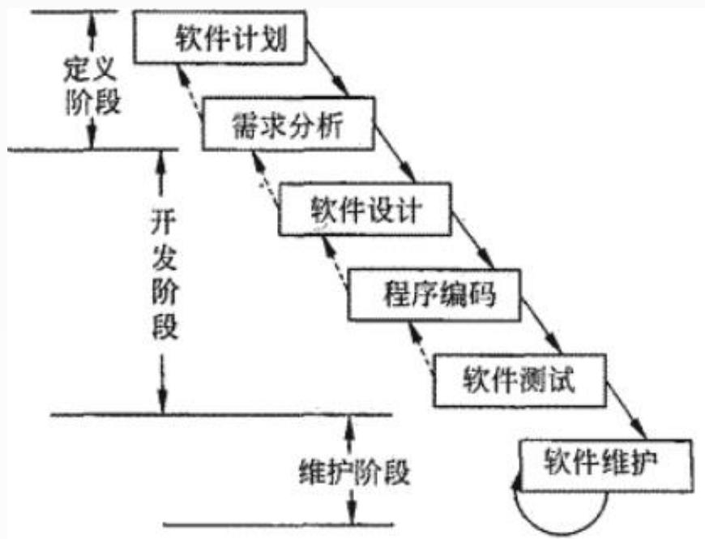
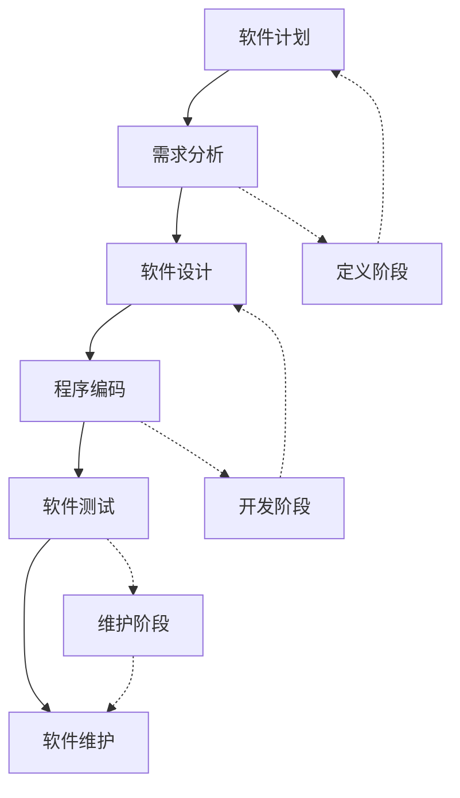
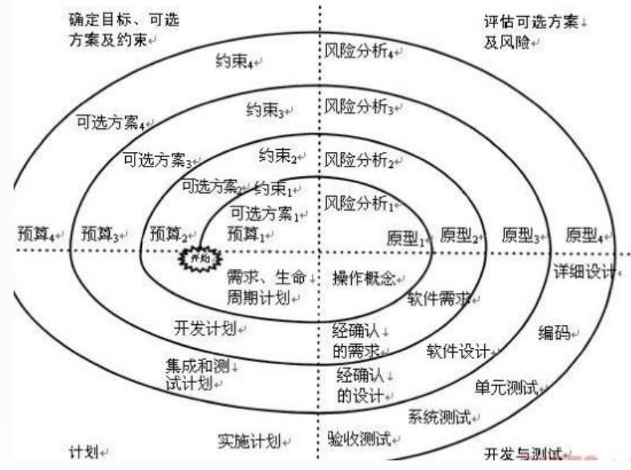
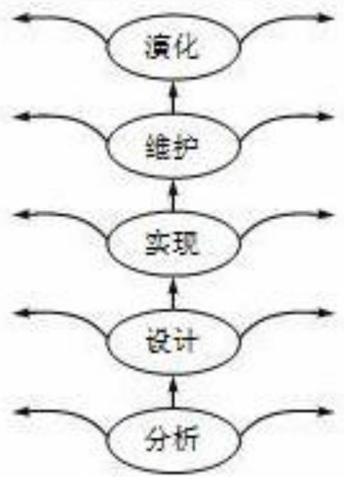
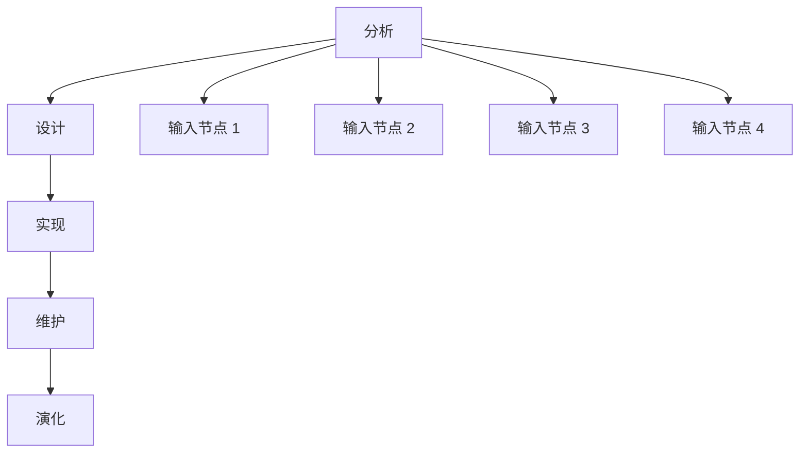
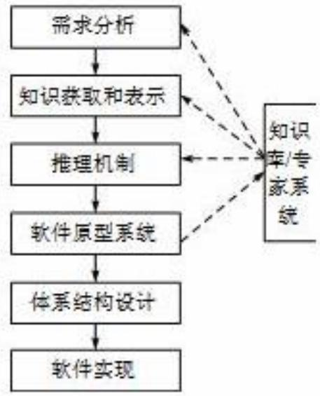
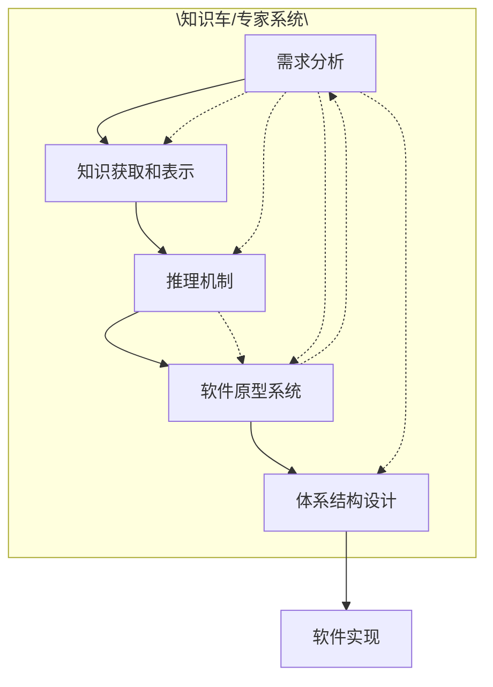

## 系统架构设计师

## 软件工程(一)

## 第五章 软件工程基础知识

5.1 软件工程  
5.2 需求工程  
5.3 系统分析与设计  
5.4 软件测试  
5.5 净室软件工程  
5.6 基于构件的软件工程  
5.7 软件项目管理

软件工程是将系统化的、严格约束的、可量化的方法应用于软件的开发、运行和维护，即将工程化应用于软件并对上述方法的研究。

软件要经历从需求分析、软件设计、软件开发、运行维护，直至被淘汰这样的全过程，这个过程称为软件的生命周期。

为了使软件生命周期中的各项任务能够有序地按照规程进行，需要一定的工作模型对各项任务给予规程约束，这样的工作模型称之为软件生命周期模型。

## 主要的开发模型有：

瀑布模型  
原型化模型  
螺旋模型  
喷泉模型  
智能模型  
增量模型  
迭代模型  
构件组装模型  
V模型  
敏捷方法  
统一过程(UP)

快速应用开发模型

## 一、瀑布模型

瀑布模型也称为生命周期法，是结构化方法中最常用的开发模型，它把软件开发的过程分为软件计划、需求分析、软件设计、程序编码、软件测试和运行维护6个阶段。

flowchart

## 瀑布模型的优点：

(1)为项目提供了按阶段划分的检查点。  
(2)当前一阶段完成后，只需要去关注后续阶段。  
(3)它提供了一个模板，这个模板使得分析、设计、编码、测试和支持的方法可以在该模板下有一个共同的指导。

## 瀑布模型的缺点：

(1)各个阶段之间产生大量的文档，极大地增加了工作量。  
(2)由于开发模型是线性的，用户只有等到整个过程的末期才能见到开发成果，从而增加了开发风险。  
(3)不适应用户需求的变化，并且在需求分析阶段不可能完全获取。  
(4)在软件开发前期未发现的错误传到后面的开发活动中时，可能会扩散，进而可能会导致整个软件项目开发失败。  
所以，瀑布模型适用于需求明确或很少变更的项目

## 二、原型化模型

指在获取一组基本的需求定义后，利用高级软件工具可视化的开发环境，快速地建立一个目标系统的最初版本，并把它交给用户试用、补充和修改，再进行新的版本开发。反复进行这个过程，直到得出系统的“精确解”，即用户满意为止。

## 1.原型的分类

从原型是否实现功能来分，软件原型可分为：

水平原型  
垂直原型

从原型的最终结果来分，软件原型可分为：

抛弃型原型  
演化型原型

原型法适合于用户需求不明确的场合。

它是先根据已给的和分析的需求，建立一个原始模型，这是一个可以修改的模型。在软件开发的各个阶段都把有关信息相互反馈，直至模型的修改，使模型渐趋完善。

在这个过程中，用户的参与和决策加强了，缩短了开发周期，降低了开发风险，最终的结果是更适合用户的要求。

原型法成败的关键及效率的高低，在于模型的建立及建模的速度。

## 三、螺旋模型

将瀑布模型和演化模型相结合，综合了两者的优点，并增加了风险分析。它以原型为基础，沿着螺线自内向外旋转，每旋转一圈

都要经过制订计划、风险分析、实施工程及客户评价等活动，并开发原型的一个新版本。经过若干次螺旋上升的过程，得到最终的系统。

flowchart

## 螺旋模型的优点：

(1)设计上灵活，可以在项目的各个阶段进行变更；  
(2)以小的分段来构建大型系统，使成本计算变得简单容易；  
(3)客户始终参与每个阶段的开发，保证了项目不偏离正确方向；  
(4) 随着项目推进，客户始终掌握项目的最新信息 , 从而能够和管理层有效地交互。

## 螺旋模型的缺点：

(1) 需要具有相当丰富的风险评估经验和专门知识，如果未能够及时标识风险，势必造成重大损失；  
(2)过多的迭代次数会增加开发成本，延迟提交时间。

## 四、喷泉模型

是一种以用户需求为动力，以对象为驱动的模型，主要用于描述面向对象的软件开发过程，该模型认为软件开发过程自下而上的，

各阶段是相互迭代和无间隙的。

无间隙是指在开发活动中，分析、设计和编码之间不存在明显的边界。

flowchart

## 五、智能模型

是基于知识的软件开发模型，它把瀑布模型和专家系统结合在一起，利用专家系统来帮助软件开发人员的工作。该模型应用基于规则的系统，采用归约和推理机制，帮助软件人员完成开发工作，并使维护在系统规格说明中一级进行。

该模型在实施过程中要建立知识库，将模型本身、软件工程知识与特定领域的知识分别存入数据库。

flowchart

## 六、增量模型

融合了瀑布模型的基本成分和原型实现的迭代特征。

当使用增量模型时，第一个增量往往是核心的产品，即第一个增量实现了基本的需求。客户对每一个增量的使用和评估都作为下一个增量发布的新特征和功能，这个过程在每一个增量发布后不断重复，直到产生了最终的完善产品。

增量模型与原型实现模型和其他演化方法一样，本质上是迭代的，但与原型实现不一样的是其强调每一个增量均发布一个可操作产品。

增量模型的特点是引进了增量包的概念，无须等到所有需求都出来，只要某个需求的增量包出来即可进行开发。

## 增量模型优点：

(1) 人员分配灵活，初期不用太大投入。  
(2) 每隔一小段时间就提交用户部分功能，用户可以直观感受项目进展，及时试用产品功能。  
(3) 有利于风险的把控。

增量模型将功能细化、分别开发的方法适应于需求经常改变的软件开发过程。

## 增量模型缺点：

(1)由于各个构件是逐渐并入已有的软件体系结构中的，所以加入构件必须不破坏已构造好的系统部分，这需要软件具备开放式的体系结构。  
(2)需求的变化是不可避免的。增量模型的灵活性使其适应这种变化，但也很容易退化为边做边改，使软件过程的控制失去整体性。  
(3)如果增量包之间存在相交的情况且未很好处理，则必须做全盘系统分析。

## 七、迭代模型

迭代模型，摒弃了传统的需求分析，设计，编码，测试的流程，而是将整个生命周期变成若干个冲刺（Sprint）阶段，每一个阶段都是由以上若干或者全部传统的流程组成，在每一个阶段中，都包含下面阶段：初始阶段，细化阶段，构建阶段，交付阶段。

在迭代模型中，每一次的迭代都会产生一个可以发布的产品，这个产品是最终产品的一个子集。  
迭代模型适用于项目事先不能完整定义产品所有需求、计划多期开发的软件开发。

## Thank You