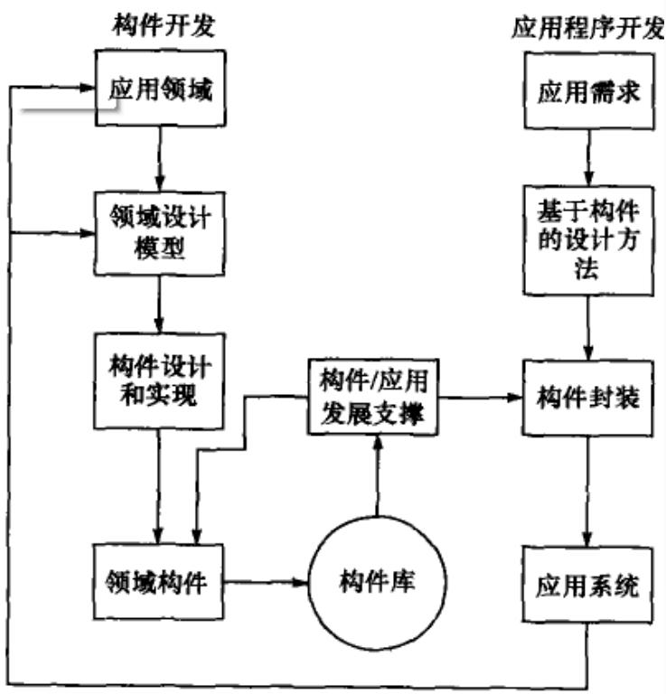
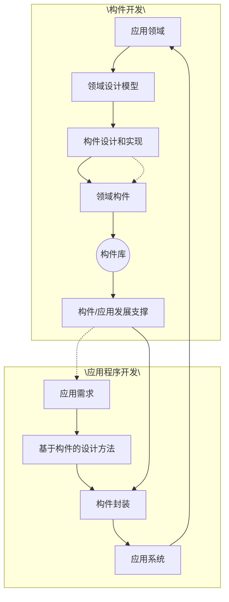
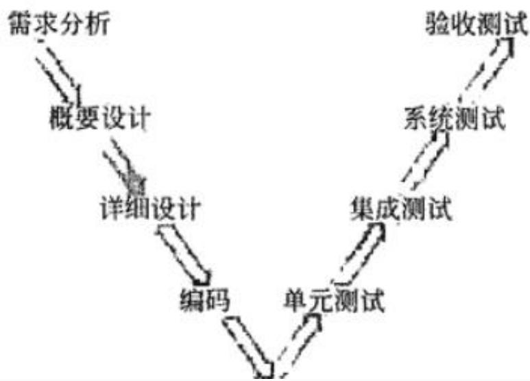
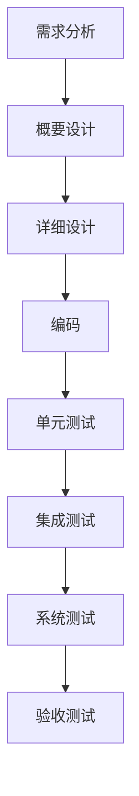
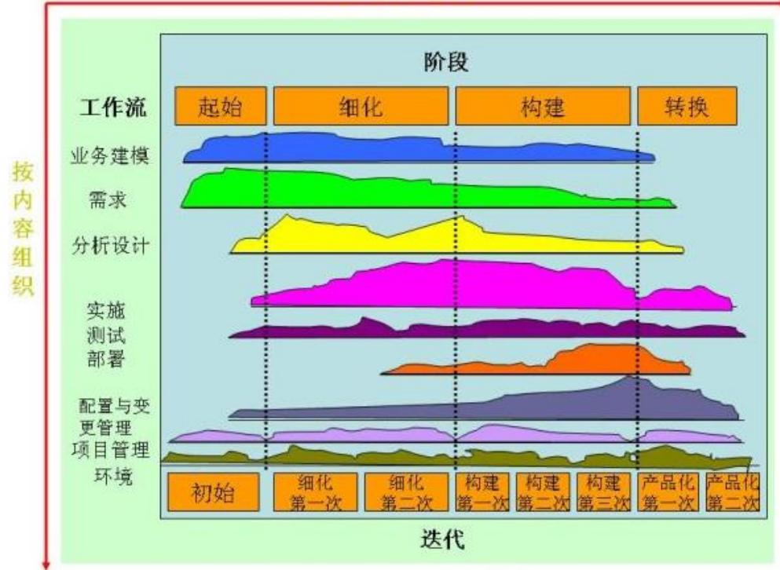

## 系统架构设计师

## 之 软件工程(二)

## 第五章 软件工程基础知识

5.1 软件工程  
5.2 需求工程  
5.3 系统分析与设计  
5.4 软件测试  
5.5 净室软件工程  
5.6 基于构件的软件工程  
5.7 软件项目管理

## 八、构件组装模型

基于构件的软件开发(CBSD)模型是利用模块化方法，将整个系统模块化，并在一定构件模型的支持下，复用构件库中的一个或多个软件构件，通过组合手段高效率、高质量地构造应用软件系统的过程。

CBSD模型融合了螺旋模型的许多特征，本质上是演化型的，开发过程是迭代的。

## 基于构件的软件开发方法由5个阶段组成：

需求分析和定义  
体系结构设计  
构件库的建立  
应用软件构建  
测试和发布

flowchart

基于构件的软件开发的优点：

(1)提高了软件开发的效率。  
(2)CBSD允许多个项目同时开发，降低了费用。  
(3)提高了可维护性和产品质量。

基于构件的软件开发的缺点：

(1)由于采用自定义的组装结构标准，缺乏通用的组装结构标准引入具有较大的风险。  
(2)可重用性和软件高效性不易协调，需要精干的、有经验的分析人员和开发人员。  
(3)构件库的质量影响着产品的质量。

## 九、V模型

单元测试是检测代码的开发是否符合详细设计的要求。单元测试的计划是在软件详细设计阶段完成的。

集成测试是检测测试过的各组成部分是否能完好地结合到一起。

系统测试是检测已集成在一起的产品是否符合系统规格说明书的要求。

验收测试是检测产品是否符合最终用户的需求。

flowchart

## 十、快速应用开发

快速应用开发（RAD）模型是一个增量型的软件开发过程模型，强调极短的开发周期。

RAD模型是瀑布模型的一个高速变种，通过大量使用可复用构件，采用基于构件的建造方法赢得快速开发。

## 快速应用开发模型的流程：

业务建模  
数据建模  
过程建模  
应用生成  
测试与交付

## 十一、敏捷方法

敏捷开发是从20世纪90年代开始逐渐引起广泛关注的一些新型软件开发方法，以应对快速变化的需求。

敏捷开发更强调程序员团队与业务专家之间的紧密协作、面对面沟通、频繁交付新的软件版本、紧凑而自我组织型的团队、能够很好地适应需求变化的代码编写和团队组织方法，也更注重人的作用。

## 常见的敏捷开发方法：

极限编程（XP）  
自适应软件开发  
水晶方法  
特性驱动开发

## 从开发者的角度，主要的关注点：

短平快会议(Stand Up)  
小版本发布(Frequent Release)  
较少的文档(Minimal Documentation)  
合作为重(Collaborative Focus)  
客户直接参与(Customer Engagement)  
自动化测试(Automated Testing)  
适应性计划调整(Adaptiye Planning)  
结对编程(Pair Programming)

## 从管理者的角度，主要的关注点：

测试驱动开发(Test-Driven Development)  
持续集成(Continuous Integration)  
重构(Refactoring)

敏捷方法适用于中小型软件开发团队，并且客户的需求模糊或需求多变。

这些方法所提出来的一些所谓的“最佳实践”并非对每个项目都是最佳的，需要项目团队根据实际情况来决定。而且，敏捷方法的有些原则在应用中不一定能得到贯彻和执行。

## 十二、统一过程（UP/RUP）

是一个通用过程框架，可以用于种类广泛的软件系统、不同的应用领域、不同的组织类型、不同的性能水平和不同的项目规模。

UP是基于构件的，软件系统建模时，UP使用的是UML。

与其他软件过程相比，UP具有三个显著的特点：

用例驱动  
以体系结构为中心  
迭代和增量

## UP中的软件过程在时间上被分解为四个顺序的阶段

初始阶段  
细化阶段  
构建阶段  
交付阶段

每个阶段结束时都要安排一次技术评审，以确定这个阶段的目标是否已经达到。

表9-2RUP各阶段的工作量和进度分配

<table><tr><td></td><td>初始阶段</td><td>细化阶段</td><td>构建阶段</td><td>交付阶段</td></tr><tr><td>工作量</td><td>5%</td><td>20%</td><td>65%</td><td>10%</td></tr><tr><td>进度</td><td>10%</td><td>30%</td><td>50%</td><td>10%</td></tr></table>

area

| Stage | Work Flow |
| --- | --- |
| 起始 | 业务建模, 需求 |
| 细化 | 分析设计, 实施测试部署 |
| 构建 | 配置与变更管理, 项目管理环境 |
| 转换 | N/A |

## 一、CMM（能力成熟度模型）

(1)初始级：软件过程的特点是无秩序的，有时甚至是混乱的。软件过程定义几乎处于无章法和无步骤可循的状态，软件产品所取得的成功往往依赖于极个人的努力和机遇。  
(2)可重复级：已经建立了基本的项目管理过程，可用于对成本、进度和功能特性进行跟踪。对类似的应用项目，有章可循并能重复以往所取得的成功。

(3)已定义级：用于管理和工程的软件过程均已文档化、标准化，并形成整个软件组织的标准软件过程。  
(4)已管理级：软件过程和产品质量有详细的度量标准。软件过程和产品质量得到了定量的认识和控制。  
(5)优化级：通过对来自过程、新概念和新技术等方面的各种有用信息的定量分析，能够不断地、持续地进行过程改进。

## 二、CMMI（软件能力成熟度模型集成）

与CMM相比，CMMI涉及面更广，专业领域覆盖软件工程、系统工程、集成产品开发和系统采购。CMMI模型分为5个级别：

(1)初始级  
(2)已管理级  
(3)严格定义级  
(4)定量管理级  
(5)优化级

## Thank You