## 系统架构设计师

## 系统分析与设计(一)

## 第五章 软件工程基础知识

5.1 软件工程  
5.2 需求工程  
5.3 系统分析与设计  
5.4 软件测试  
5.5 净室软件工程  
5.6 基于构件的软件工程  
5.7 软件项目管理

系统分析的基本任务是在充分了解用户需求的基础上，把对新系统的理解表达为系统需求规格说明书。

系统设计的目标是根据系统分析的结果，完成系统的构建过程。其主要目的是绘制系统的蓝图，权衡和比较各种技术和实施方法的利弊，合理分配各种资源，构建新系统的详细设计方案和相关模型，指导系统实施工作的顺利开展。

## 三、需求分析

(1)结构化分析方法。  
(2)面向对象分析方法。  
(3)面向问题域的分析（PDOA）方法。

## 一、结构化方法

结构化方法也称为面向功能的软件开发方法或面向数据流的软件开发方法。它利用图形表达用户需求，强调开发方法的结构合理性以及所开发软件的结构合理性。

结构化开发方法提出了一组提高软件结构合理性的准则，如分解与抽象、模块独立性、信息隐蔽等。

针对软件生存周期的不同阶段，结构化方法又包括结构化分析(SA)、结构化设计(SD)和结构化编程(SP)等方法。

## 1.结构化分析(SA)

结构化分析方法给出一组帮助系统分析人员产生功能规约的原理与技术。它一般利用图形表达用户需求，使用的手段主要有数据流图、数据字典、结构化语言、判定表以及判定树等。

结构化分析的常用手段是数据流图(DFD)和数据字典(DD)。

## 1)数据流图DFD

DFD 建模方法的核心是数据流，从应用系统的数据流着手以图形方式描述一个业务系统中的数据流从输入到输出的变换过程。

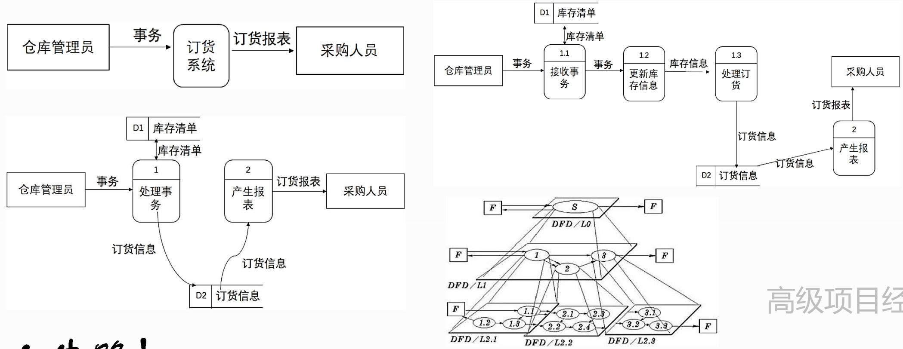

数据流图DFD由4种基本元素(模型对象)构成:

(1)数据流(Data Flow)。数据流用一个带有名字的箭线表示，名字表示流经的数据，箭头表示流向。如“订货信息”，它由商品名、订购数量、产地、单价等数据组成。  
(2)加工(处理)。表示对数据的加工和转换，加工名包含一个动词。用圆角矩形或圆表示。

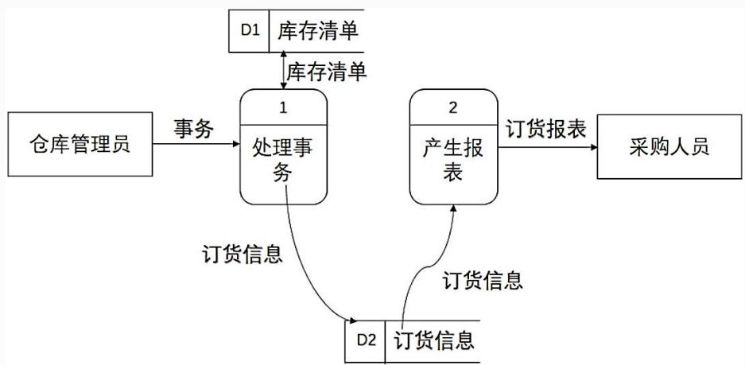

flowchart

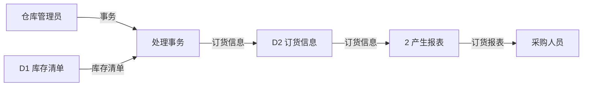

(3)数据存储。表示用数据库或文件的形式存储的数据。用开口矩形表示。  
(4)外部实体。也称数据源或者数据终点。描述系统数据的提供者或者数据的使用者。外部实体指系统之外的人、物或者其它系统。

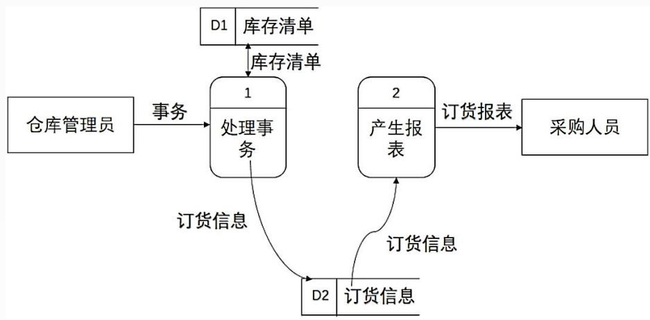

flowchart

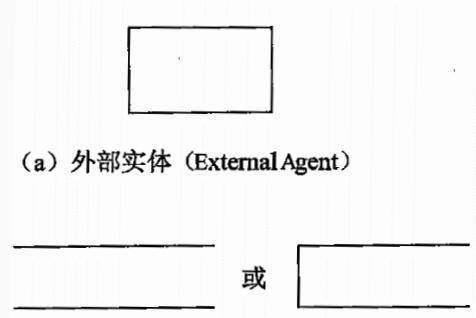

text_image

(a) 外部实体 (ExternalAgent)
或

（c）数据存储（Data Store）

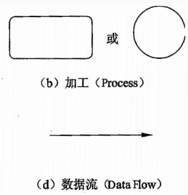

flowchart

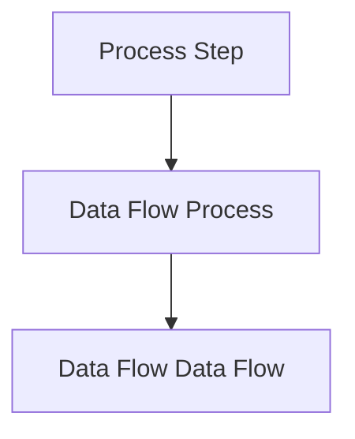

## 2)数据字典

数据字典(DD)对数据流程图中的各个元素做出详细的说明和解释。数据流图上所有元素的定义和解释的文字集合就是数据字典。

数据字典包括：

(1)数据结构：数据流图中数据块的数据结构说明，反映了数据之间的组合关系。数据结构描述={数据结构名，含义说明，组成:{数据项或数据结构}}  
(2)数据项：数据流图中数据块的数据结构中的数据项说明。数据项是不可再分的数据单位。数据项描述={数据项名，数据项含义

说明，别名，数据类型，长度，取值范围，取值含义，与其他数据项的逻辑关系}

(3)数据流：数据流图中流线的说明。数据流是数据结构在系统内传输的路径。数据流描述={数据流名，说明，数据流来源，数据流去向，组成:{数据结构}，平均流量，高峰期流量}

(4)数据存储：数据流图中数据块的存储特性说明。数据存储是数据结构停留或保存的地方，一般是数据流的来源和去向之一。

数据存储描述={数据存储名，说明，编号，流入的数据流，流出的数据流，组成:{数据结构}，数据量，存取方式}

(5)处理过程：数据流图中功能块的说明。数据字典中只需要描述处理过程的说明性信息。处理过程描述={处理过程名，说明，输入:{数据流}，输出:{数据流}，处理:{简要说明}}

## 业务流程分析的步骤:

(1)通过调查掌握基本情况。  
(2)描述现有业务流程 (绘制业务流程图)  
(3)确认现有业务流程。  
(4)对业务流程进行分析。  
(5)发现问题，提出解决方案。  
(6)提出优化后的业务流程。

## 2.结构化设计

结构化设计(SD)是一种面向数据流的设计方法，它以SRS 和SA阶段产生的数据流图和数据字典等文档为基础，是一个自顶向下、逐步求精和模块化的过程。

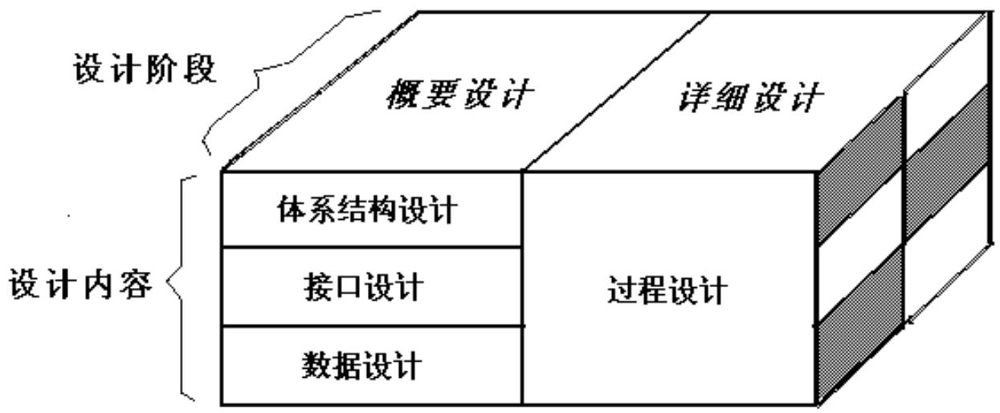

flowchart

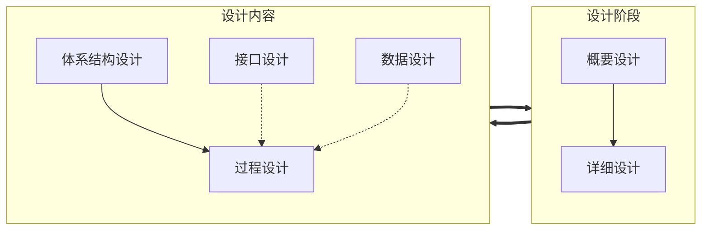

## 1)概要设计

也称为高层设计或总体设计，即将软件需求转化为数据结构和软件的系统结构。

## 概要设计包括：

设计软件的结构  
确定系统由哪些模块组成  
每个模块之间的关系

## 2)详细设计

也称为低层设计，即对结构图进行细化，得到详细的数据结构与算法。详细设计的任务就是为每个模块进行设计。

采用自顶向下、逐步求精的设计方式和单入口单出口的控制结构。

使用的工具包括：

程序流程图  
盒图(NS流程图)  
PAD图(Problem Analysis Diagram,问题分析图)  
⚫ PDL (ProgrmDesign Language,伪代码)

## 3)模块结构

模块结构是指将程序或系统按照功能或其他原则划分为若干个具有一定独立性和大小的模块，每个模块具有某方面的功能。

模块是组成系统的基本单位，它的特点是可自由组合、分解和变换，系统中任何一个处理功能都可以看成一个模块。

由于模块之间的互相联系越多，模块的独立性就越少，因此，引入衡量模块独立程度的两个标准：耦合和内聚。

我们要求模块之间是"高内聚、低耦合"。

## (1)内聚

内聚表示模块内部各代码成分之间联系的紧密程度。一个好的内聚模块应当恰好做目标单一的一件事情。

表5-2模块的内聚类型

<table><tr><td>内聚类型</td><td>描述</td></tr><tr><td>功能内聚</td><td>完成一个单一功能,各个部分协同工作,缺一不可</td></tr><tr><td>顺序内聚</td><td>处理元素相关,而且必须顺序执行</td></tr><tr><td>通信内聚</td><td>所有处理元素集中在一个数据结构的区域上</td></tr><tr><td>过程内聚</td><td>处理元素相关,而且必须按特定的次序执行</td></tr><tr><td>时间内聚</td><td>所包含的任务必须在同一时间间隔内执行</td></tr><tr><td>逻辑内聚</td><td>完成逻辑上相关的一组任务</td></tr><tr><td>偶然内聚</td><td>完成一组没有关系或松散关系的任务</td></tr></table>

## (2)耦合

## 耦合表示模块之间联系的程度。

表5-1模块的耦合类型

<table><tr><td>耦合类型</td><td>描述</td></tr><tr><td>非直接耦合</td><td>两个模块之间没有直接关系,它们之间的联系完全是通过上级模块的控制和调用来实现的</td></tr><tr><td>数据耦合</td><td>一组模块借助参数表传递简单数据</td></tr><tr><td>标记耦合</td><td>一组模块通过参数表传递记录等复杂信息(数据结构)</td></tr><tr><td>控制耦合</td><td>模块之间传递的信息中包含用于控制模块内部逻辑的信息</td></tr><tr><td>通信耦合</td><td>一组模块共用了一组输入信息,或者它们的输出需要整合以形成完整数据,即共享了输入或输出</td></tr><tr><td>公共耦合</td><td>多个模块都访问同一个公共数据环境,公共的数据环境可以是全局数据结构、共享的通信区、内存的公共覆盖区等</td></tr><tr><td>内容耦合</td><td>一个模块直接访问另一个模块的内部数据;一个模块不通过正常入口转到另一个模块的内部;两个模块有一部分程序代码重叠;一个模块有多个入口等</td></tr></table>

例:软件设计过程中，可以用耦合和内聚两个定性标准来衡量模块的独立程度，耦合衡量不同模块彼此间互相依赖的紧密程度，应采用以下设计原则( )，内聚衡量一个模块内部各个元素彼此结合的紧密程度，以下属于高内聚的是( )。

A.尽量使用内容耦合、少用控制耦合和特征耦合、限制公共环境耦合的范围、完全不用数据耦合  
B.尽量使用数据耦合、少用控制耦合和特征耦合、限制公共环境耦合的范围、完全不用内容耦合  
C.尽量使用控制耦合、少用数据耦合和特征耦合、限制公共环境耦合的范围、完全不用内容耦合  
D.尽量使用特征耦合、少用数据耦合和控制耦合、限制公共环境耦合的范围、完全不用内容耦合 高级项目经理 任

A.偶然内聚 B.时间内聚 C.功能内聚 D.逻辑内聚

## (3)信息隐藏与抽象

信息隐藏原则要求采用封装技术，将程序模块的实现细节(过程或数据) 隐藏起来，通过接口按要求来访问。按照信息隐藏的原则，系统中的模块应设计成“黑盒”，模块外部只能使用模块接口说明中给出的信息，例如，操作和数据类型等。模块之间相对独立，既易于实现，也易于理解和维护。

抽象原则要求抽取事物最基本的特性和行为，忽略非本质的细节，采用分层次抽象的方式可以控制软件开发过程的复杂性，有利于软件的可理解性和开发过程的管理。抽象层次包括过程抽象、数据抽象和控制抽象。 

## 4)系统结构图

又称模块结构图，是概要设计阶段的工具，反映系统的功能实现和模块之间的联系与通信，包括各模块之间的层次结构，即反映了系统的总体结构。

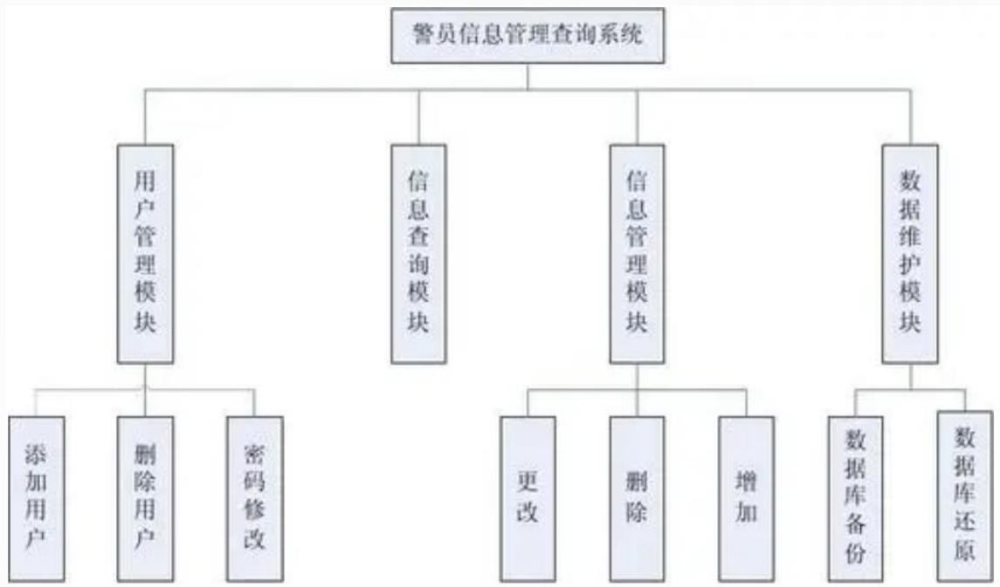

flowchart

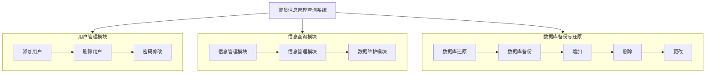

## 3.数据库设计

数据库设计的内容包括：需求分析、概念结构设计、逻辑结构设计、物理设计、数据库的实施和数据库的运行和维护。

## Thank You