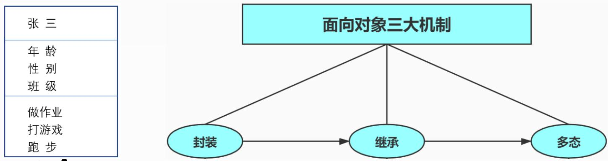
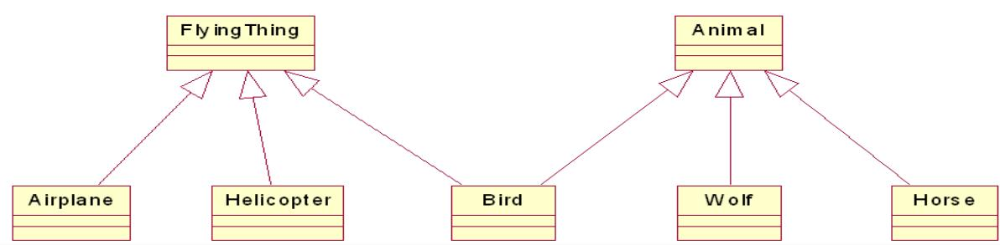
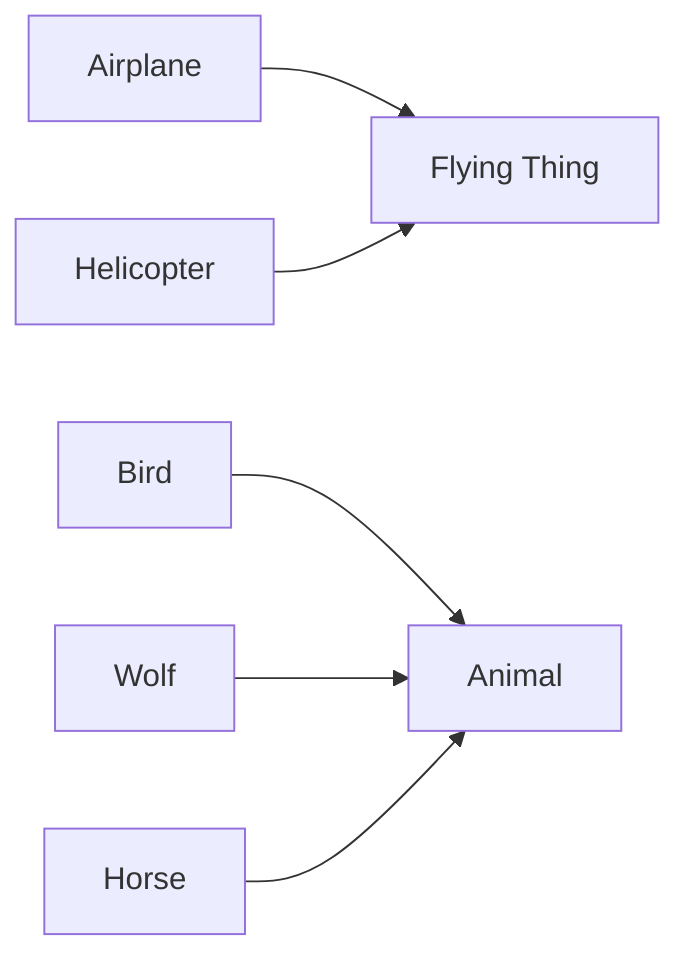
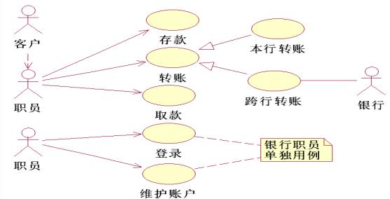
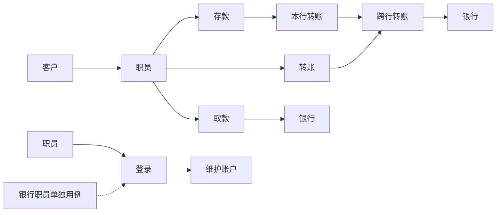
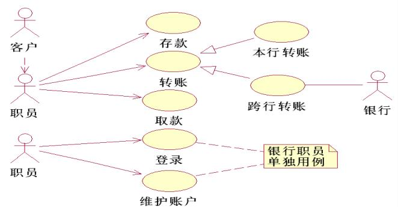
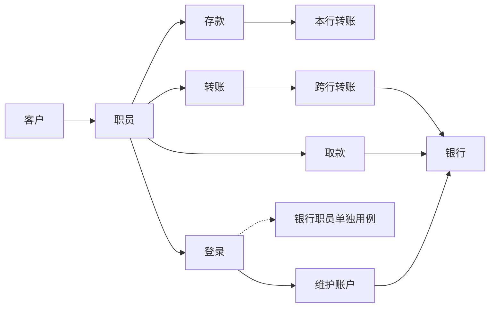

## 系统架构设计师

## 系统分析与设计(二)

## 第五章 软件工程基础知识

5.1 软件工程  
5.2 需求工程  
5.3 系统分析与设计  
5.4 软件测试  
5.5 净室软件工程  
5.6 基于构件的软件工程  
5.7 软件项目管理

## 二、面向对象方法

面向对象 (OO)开发方法将面向对象的思想应用于软件开发过程中，指导开发活动，是建立在“对象”概念基础上的方法学。

面向对象开发方法认为客观世界是由对象组成的，对象由对象名、属性和操作(方法)组成，对象可按其属性进行分类，对象之间的联系通过传递消息来实现，对象具有封装性、继承性和多态性。

面向对象开发方法是以用例驱动的、以体系结构为中心的、迭代的和渐增式的开发过程。

面向对象的方法由OOA(面向对象分析)、OOD(面向对象设计)和OOP(面向对象编程)三个部分组成。

OOA和OOD的统一采用UML（统一建模语言）来描述并记录。

## 1.面向对象分析OOA

OOA 模型由5个层次(主题层、对象类层、结构层、属性层和服务层)和5个活动(标识对象类、标识结构、定义主题、定义属性和定义服务) 组成。

OOA定义了两种对象类之间的结构：

分类结构：就是一般与特殊的关系。  
组装结构：反映了对象之间的整体与部分的关系。

## 1)OOA原则

(1)抽象：从许多事物中舍弃个别的、非本质的特征，抽取共同的、本质性的特征叫作抽象。抽象原则包括过程抽象和数据抽象两方面。

过程抽象是指任何一个完成确定功能的操作序列，其使用者都可以把它看作一个单一的实体，尽管实际上它可能是由一系列更低级的操作完成的。  
数据抽象是根据施加于数据之上的操作来定义数据类型，并限定数据的值只能由这些操作来修改和观察。数据抽象是OOA的核心原则。它强调把数据（属性）和操作（服务）结合为一个不可分的系统单位（即对象），对象的外部只需要知道它做什么，而不必知道它如何做。 高级项目经理任 

(2)封装：把对象的属性和操作结合为一个不可分的系统单位，并尽可能隐蔽对象的内部细节。

(3)继承：特殊类的对象拥有的其一般类的全部属性与操作，称特殊类对一般类的继承。继承的好处：使系统模型比较简练、清晰。

flowchart

(4)多态(polymorphism)

在OO技术中，多态性是指同一个操作作用于不同的对象时可以有不同的解释，并产生不同的执行结果。

(5)分类：就是把具有相同属性和操作的对象划分为一类，用类作为这些对象的抽象描述。

分类原则实际上是抽象原则运用于对象描述时的一种表现形式。

(6)聚合：又称组装，其原则是把一个复杂的事物看成若干比较简单的事物的组装体，从而简化对复杂事物的描述。 高级项目经理 任(7)关联：是人类思考问题时经常运用的思想方法，通过一个事物联想到另外的事物。能使人发生联想的原因是事物之间确实存在着某些联系。

(8)消息通信：指对象之间只能通过消息进行通信，而不允许在对象之外直接地存取对象内部的属性。

通过消息进行通信是由于封装原则而引起的。在OOA中要求用消息连接表示出对象之间的动态联系。

(9)粒度控制：人在面对一个复杂的问题域时，不可能在同一时刻既能纵观全局，又能洞察秋毫。因此需要控制自己的视野：考虑全局时，注意其大的组成部分，暂时不详察每一部分的细节；考虑某部分的细节时则暂时撇开其余的部分。这就是粒度控制原则。

(10)行为分析：现实世界中事物的行为是复杂的。由大量的事物所构成的问题域中各种行为往往相互依赖、相互交织。

## 2.面向对象设计OOD

类封装了信息和行为，是面向对象的重要组成部分，它是具有相同属性、方法和关系的对象集合的总称。在定义类时，将类的职责分解为类的属性和方法，其中属性用于封装数据，方法用于封装行为。

设计类是OOD中最重要的组成部分，也是最复杂和最耗时的部分。

在OOD 中，类分为三种类型：实体类、控制类和边界类。

## 1)实体类

实体类映射需求中的每个实体，实体类是指需要存储在永久存储体中的信息，例如在线教育平台系统可以提取出学员类和课程类，它们都属于实体类。

实体类对用户来说是最有意义的类，通常采用业务领域术语命名，一般是一个名词。在用例模型向领域模型的转化中，一个参与者一般对应于实体类。通常可以从SRS 中的那些数据库表(需要持久存储)对应的名词来找寻实体类。实体类一定有属性但不一定有操作。

flowchart

## 2)控制类

控制类是用于控制用例工作的类，一般是由动宾结构的短语 ("动词+名词"或"名词+动词"转化来的名词，例如，用例"身份验证"对应一个控制类"身份验证器"，它提供了与身份验证有关的所有操作。

控制类将用例的特有行为进行封装，控制对象的行为与特定用例的实现密切相关，当系统执行用例的时候，就产生了一个控制对象，控制对象经常在它对应的用例执行完毕后消亡。

控制类没有属性，但一定有方法(操作)。

## 3)边界类

边界类位于系统与外界的交接处，用于封装在用例内、外流动的信息或数据流。常见的边界类有窗体、报表、通信协议、打印机和扫描仪接口、传感器，以及与其他系统的接口。

要寻找和定义边类，可以检查用例模型，每个参与者和用例交互至少要有一个边界类，边界类使参与者能与系统交互。

边界类可以既有属性也有方法。

flowchart

## Thank You