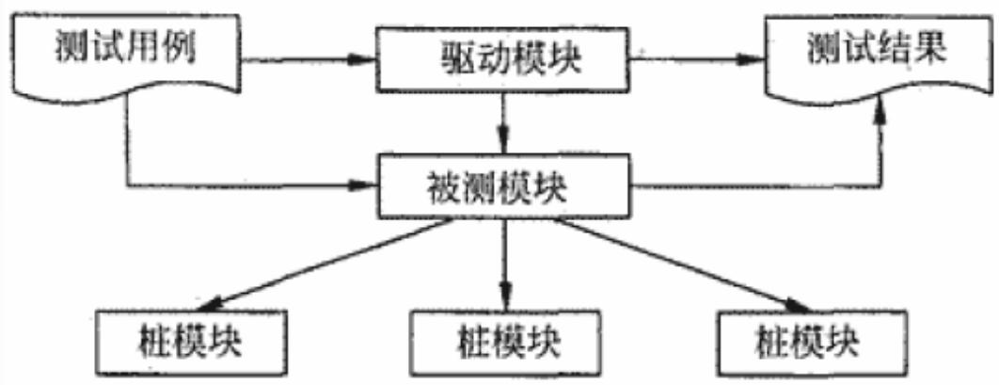
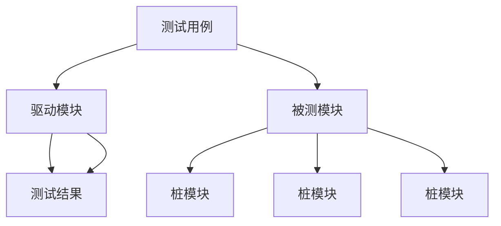
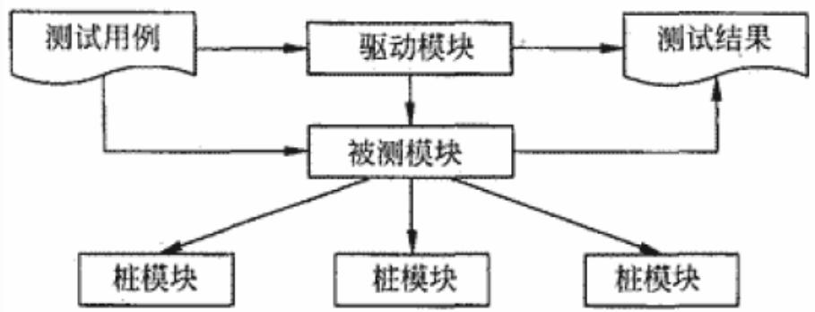
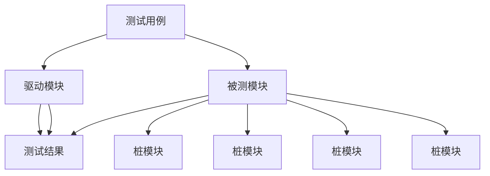

## 系统架构设计师

## 软件测试

## 第五章 软件工程基础知识

5.1 软件工程  
5.2 需求工程  
5.3 系统分析与设计  
5.4 软件测试  
5.5 净室软件工程  
5.6 基于构件的软件工程  
5.7 软件项目管理

软件测试是贯穿整个软件开发生命周期、对软件产品（包括阶段性产品）进行验证和确认的活动过程。

⚫ 目前，软件的正确性证明尚未得到根本的解决，软件测试仍是发现软件错误和缺陷的主要手段。  
软件测试的目的就是在软件投入生产性运行之前，尽可能多地发现软件产品（主要是指程序）中的错误和缺陷。

## 测试是对软件质量的度量：

(1)软件测试是为了发现错误而执行程序的过程。  
(2)测试是为了证明程序有错，而不是证明程序无错误。  
(3)一个好的测试用例在于它能发现至今未发现的错误。  
(4)一个成功的测试是发现了至今未发现的错误的测试。

软件测试只是软件质量保证的手段之一，不能单凭测试来保证软件质量。

## 测试的类型

软件测试分为两大类，分别为动态测试和静态测试。

## 1.动态测试

动态测试指通过运行程序发现错误，分为：

黑盒测试法  
白盒测试法  
灰盒测试法

## (1)黑盒法

黑盒测试又称为功能测试或数据驱动测试。把被测试对象看成一个黑盒子，测试人员完全不考虑程序的内部结构和处理过程，只在软件的接口处进行测试，依据需求规格说明书，检查程序是否满足功能要求。

常用的黑盒测试用例的设计方法：

等价类划分  
边界值分析  
错误推测  
因果图

向上人生路！

## (2)白盒法

又称结构测试、透明盒测试、逻辑驱动测试或基于代码的测试。把测试对象看做一个打开的盒子，测试人员必须了解程序的内部结构和处理过程，以检查处理过程的细节为基础，对程序中尽可能多的逻辑路径进行测试，检验内部控制结构和数据结构是否有错，实际的运行状态与预期的状态是否一致。

## 常用的白盒测试用例设计方法有：

基本路径测试  
循环覆盖测试  
逻辑覆盖测试

逻辑覆盖是以程序内部逻辑为基础的测试技术，常用的有语句覆盖、判定覆盖、条件覆盖、条件判定覆盖、条件组合覆盖、路径覆盖等，发现错误的能力呈由弱至强的变化。

语句覆盖每条语句至少执行一次。  
判定覆盖每个判定的每个分支至少执行一次。  
条件覆盖每个判定的每个条件应取到各种可能的值。  
判定/条件覆盖同时满足判定覆盖条件覆盖。  
⚫ 条件组合覆盖每个判定中各条件的每一种组合至少出现一次。  
⚫ 路径覆盖使程序中每一条可能的路径至少执行一次。

## (3)灰盒法

灰盒测试是一种介于白盒测试与黑盒测试之间的测试，它关注输出对于输入的正确性，同时也关注内部表现，但这种关注不像白盒测试那样详细且完整，而只是通过一些表征性的现象、事件及标志来判断程序内部的运行状态。

灰盒测试结合了白盒测试和黑盒测试的要素，考虑了用户端、特定的系统知识和操作环境，在系统组件的协同性环境中评价应用软件的设计。

## 2.静态测试

静态测试指被测试程序不在机器上运行，而采用人工检测和计算机辅助静态分析的手段对程序进行检测。

静态分析中进行人工测试的主要方法：

桌前检查(Desk Checking)  
代码审查  
代码走查

## (1)桌前检查

由程序员自己检查自己编写的程序。程序员在程序通过编译之后，进行单元测试设计之前，对源程序代码进行分析、检验，并补充相关的文档，目的是发现程序中的错误。

## (2)代码审查

代码审查是由若干程序员和测试员组成一个会审小组，通过阅读、讨论和争议，对程序进行静态分析的过程。代码审查分两步。

⚫ 小组负责人提前把设计规格说明书、控制流程图、程序文本及有关要求、规范等分发给小组成员，作为评审的依据。小组成员充分阅读这些材料。  
召开程序审查会。在会上，首先由程序员逐句讲解程序的逻辑。在此过程中，程序员或其他小组成员可以提出问题，展开讨论，审查错误是否存在。 

## (3)代码走查

代码走查与代码审查基本相同，其过程也分为两步。

⚫ 把材料先发给走查小组成员，认真研究程序，再开会。  
开会的程序与代码会审不同，不是简单地读程序和对照错误检查表进行检查，而是让与会者“充当”计算机。让测试用例沿程序的逻辑运行一遍，随时记录程序的踪迹，供分析和讨论使用。数据标准化、数据命名合理、文件格式转换、数据库格式转换等。

## 二、测试的阶段

根据测试的目的、阶段的不同，把测试分为：

单元测试  
集成测试  
确认测试  
系统测试

## 1.单元测试

单元测试又称为模块测试，是针对软件设计的最小单位（模块）进行正确性检验的测试工作。

目的在于检查每个程序单元能否正确实现详细设计说明中的模块功能性能、接口和设计约束等要求，以及发现各模块内部可能存在的各种错误。

单元测试通常由开发人员自己负责。  
单元测试要借助驱动模块（相当于用于测试模拟的主程序）和桩模块（子模块）来完成。  
⚫ 单元测试的计划是在软件详细设计阶段完成的。  
单元测试一般使用白盒测试方法。

flowchart

## 2.集成测试

集成测试也称为组装测试、联合测试。它将已通过单元测试的模块集成在一起，主要测试模块之间的协作性。

从组装策略而言，可以分为一次性组装和增量式组装（包括自顶向下、自底向上及混合式）两种。

集成测试计划是在软件概要设计阶段完成的。  
集成测试一般采用黑盒测试方法。

模块并不是一个独立的程序，在考虑测试模块时，同时要考虑它和外界的联系，用一些辅助模块去模拟与被测模块相联系的其他模块。这些辅助模块分为两种。

(1)驱动模块：相当于被测模块的主程序。它接收测试数据，把这些数据传送给被测模块，最后输出实测结果。  
(2)桩模块：用于代替被测模块调用的子模块。桩模块可以做少量的数据操作，不需要把子模块所有功能都带进来，但不允许什么  
事情也不做。

flowchart

自顶向下进行组装，不需要驱动模块。  
自底向上进行组装，不需要桩模块。  
在每个版本提交时，都需要进行“冒烟”测试，即对程序主要功能进行验证。冒烟测试也称为版本验证测试或提交测试。

## 3.确认测试

确认测试也称为有效性测试，主要包括验证软件的功能、性能及其他特性是否与用户要求（需求）一致。

确认测试计划是在需求分析阶段完成的。

根据用户的参与程度，包括以下4种类型：

(1)内部确认测试：由软件开发组织内部按软件需求说明书进行测试。  
(2) Alpha测试：由用户在开发环境下进行测试。  
(3) Beta测试：由用户在实际使用环境下进行测试。  
(4) 验收测试：针对软件需求说明书，在交付前以用户为主进行测试。

## 4.系统测试

是将已经确认的软件、计算机硬件、外设、网络等其他元素结合在一起，进行信息系统的各种组装测试和确认测试，系统测试是针对整个产品系统进行的测试，目的是验证系统是否满足了需求规格的定义，找出与需求规格不符或与之矛盾的地方，从而提出更加完善的方案。

系统测试计划在系统分析阶段（需求分析阶段）完成。

## 系统测试的内容包括：

功能测试  
健壮性测试  
性能测试  
用户界面测试  
安全性测试  
安装与反安装测试

## 三、性能测试

性能测试是通过自动化的测试工具模拟多种正常、峰值及异常负载条件来对系统的各项性能指标进行测试。

负载测试和压力测试都属于性能测试。

负载测试，确定在各种工作负载下系统的性能。  
压力测试是通过确定一个系统的瓶颈或不能接收的性能点，来获得系统能提供的最大服务级别的测试。

## 1.性能测试的目的

是验证软件系统是否能够达到用户提出的性能指标，同时发现软件系统中存在的性能瓶颈，并优化软件，达到优化系统的目的。

(1)评估系统的能力  
(2)识别体系中的弱点  
(3)系统调优  
(4)检测软件中的问题  
(5)验证稳定性和可靠性

## 2.性能测试的类型

性能测试类型包括负载测试、强度测试和容量测试等。

(1)负载测试：指数据在超负荷环境中运行，程序是否能够承担。  
(2)强度测试：在系统资源特别低的情况下考查软件系统运行情况。  
(3)容量测试：确定系统可处理的同时在线的最大用户数。

## 3.负载压力测试

负载压力测试是在一定约束条件下（指定软件、硬件及网络环境）测试系统所能承受的并发用户数、运行时间、数据量，以确定系统所能承受的最大负载压力。

并发用户数是负载压力的重要体现。  
在网络应用系统中，负载压力测试重点关注客户端、网络及服务器（包括应用服务器和数据库服务器）的性能。

## 四、测试自动化

为了提高软件测试的效率，运用既有的测试工具或开发相应的测试程序进行测试，这个过程称为自动化测试。

(1)提高测试执行的速度  
(2)提高运行效率  
(3)保证测试结果的准确性。  
(4)连续运行测试脚本。  
(5)模拟现实环境下受约束的情况。

## Thank You