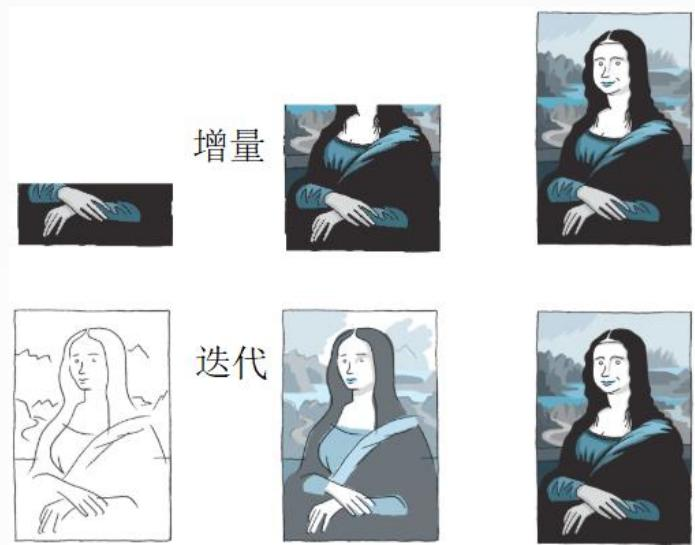

## 系统架构设计师

## 净室软件工程

## 第五章 软件工程基础知识

5.1 软件工程  
5.2 需求工程  
5.3 系统分析与设计  
5.4 软件测试  
5.5 净室软件工程  
5.6 基于构件的软件工程  
5.7 软件项目管理

净室软件工程CSE是一种应用数学与统计学理论以经济的方式生产高质量软件的工程技术，力图通过严格的工程化的软件过程达到开发中的零缺陷或接近零缺陷。净室方法不是先制作一个产品，再去消除缺陷，而是要求在规约和设计中消除错误，以"净"的方式制作，可以降低软件开发中的风险，以合理的成本开发出高质量的软件。

净室软件工程使用盒结构规约进行分析和设计建模，并且强调将正确性验证（而不是测试）作为发现和消除错误的主要机制，使用统计的测试来获取交付软件时所必需的可靠性(出错率)信息。

## 一、 理论基础

净室软件工程的理论基础是函数理论和抽样理论。

## 1.函数理论

一个函数定义了从定义域到值域的映射。一个特定的程序好似定义了一个从定义域(所有可能的输入序列的集合) 到值域(所有对应于输入的输出集合)的映射。这样，一个程序的规范就是一个函数的规范。一个明确定义的函数应当具有以下特性：

完备性:对定义域中的每个元素，值域中至少有一个元素与之对应。对程序而言，每种可能的输入都必须定义，并有一个输出与之对应。 

一致性:在值域中最多有一个元素与定义域中的同一元素对应。对程序而言，每个输入只能对应一个输出。  
正确性:函数的正确性可以由上述性质判断。对程序而言，某项设计的正确性可以通过基于函数理论的推理来验证。

## 2.抽样理论

不可能对软件的所有可能应用都进行测试。把软件所有可能的使用情况看作总体，通过统计学手段对其进行抽样，并对样本进行测试，根据测试结果分析软件的性能和可靠性。

## 二、技术手段

1.统计过程控制下的增量式开发

增量开发不是把整个开发过程作为一个整体，而是将其划分为一系列较小的累积增量。小组成员在任何时刻只须把注意力集中于工作的一部分，而无须一次考虑所有的事情。

text_image

增量
迭代

## 2.基于函数的规范与设计

盒子结构方法按照函数理论定义了三种抽象层次：行为视图(黑盒)、有限状态机视图(状态盒)、过程视图(清晰盒或明盒)。

(1)黑盒。刻划系统或系统的某部分的行为。通过运用由激发得到反应的一组变迁规则，系统对特定的激发（事件）作出反应。  
(2)状态盒。以类似于对象的方式封装状态数据和服务(操作)。在这个规约视图中，表示出状态盒的输入（激发）和输出（反应）  
(3)清晰盒。在清晰盒中定义状态盒所蕴含的变迁功能，简单地说，清晰盒包含了对状态盒的过程设计。

## 3.正确性验证

正确性验证是净室软件工程的核心，正是由于采用了这一技术，净室项目的软件质量才有了极大的提高。

## 4.统计测试和软件认证

净室测试方法采用统计学的基本原理，即当总体太大时必须采取抽样的方法。首先确定一使用模型来代表系统所有可能使用的(一般是无限的)总体。然后由使用模型产生测试用例。因为测试用例是总体的一个随机样本，所以可得到系统预期操作性能的有效统计推导。 

## 三、净室软件工程的缺点

1)CSE 太理论化，需要更多的数学知识。其正确性验证的步骤比较困难且耗时多。CSE要求采用增量式开发、盒子结构、统计测试方法，普通工程师必须经过加强训练才能掌握，开发软件的成本比较高昂。  
2)CSE 不进行传统的模块测试，这是不现实的。工程师可能对编程语言和开发环境还不熟悉，而且编译器或操作系统的Bug 也可能导致未预期的错误。  
3)CSE毕竟脱胎于传统软件工程，不可避免地带有传统软件工程的些弊端。 

## Thank You