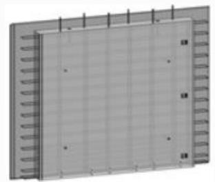
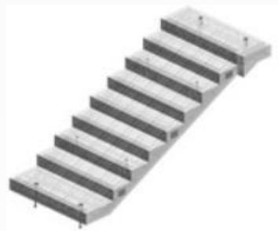
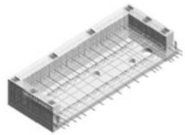
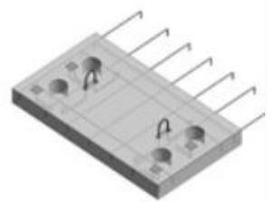
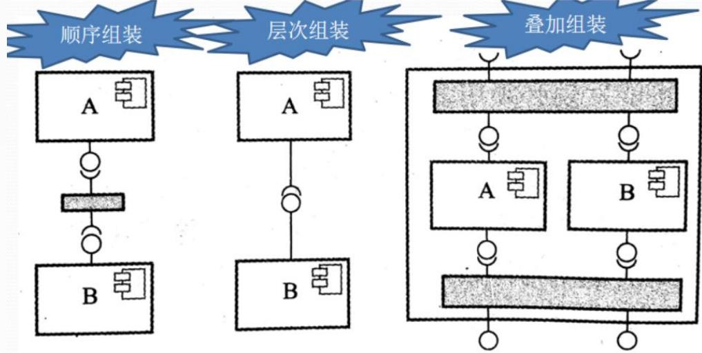
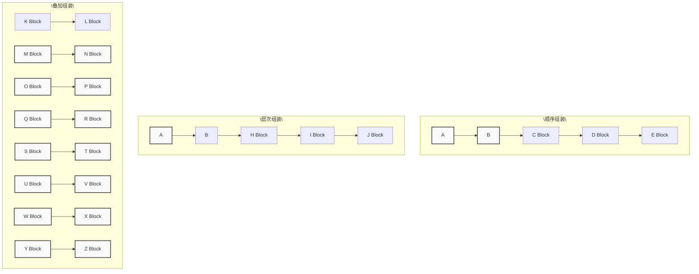

## 系统架构设计师

## 基于构件的软件工程

## 第五章 软件工程基础知识

5.1 软件工程  
5.2 需求工程  
5.3 系统分析与设计  
5.4 软件测试  
5.5 净室软件工程  
5.6 基于构件的软件工程  
5.7 软件项目管理

基于构件的软件工程(CBSE)是一种基于分布对象技术、强调通过可复用构件设计与构造软件系统的软件复用途径。

基于构件的软件系统中构件可以是 COTS(商用现货)构件，也可以是自行开发构件。CBSE 体现了"购买而不是重新构造"的哲学，将软件开发的重点从程序编写转移到了基于已有构件的组装，以便更快地构造系统，减轻系统的维护负担，降低软件开发的费用。

natural_image

Exterior view of a rectangular electronic component with grid pattern and side connectors (no text or symbols visible)

预制混凝土外墙

natural_image

3D rendering of a metal staircase with multiple horizontal steps (no text or symbols)

预制楼梯

natural_image

3D rendering of a rectangular electronic component with internal grid structure and terminal pins (no text or symbols visible)

预制合阳台板

natural_image

3D rendering of a rectangular electronic component with multiple pins and mounting holes (no text or symbols visible)

预制阳台板

## 一、构件和构件模型

构件是一个独立的软件单元，可以与其他构件构成一个软件系统。

构件的特征：

(1)可组装：对于可组装的构件，所有外部交互都必须通过公开定义的接口进行。  
(2)可部署：软件必须是自包含的，必须能作为一个独立实体在提供其构件模型实现的构件平台上运行。构件总是二进制形式，无须在部署前编译。

(3)文档化：构件必须是完全文档化的，用户根据文档来判断构件是否满足需求。  
(4)独立性：构件应该是独立的，可以在无其他特殊构件的情况下进行组装和部署，如确实需要其他构件提供服务，则应显示声明。  
(5)标准化：构件标准化意味着在基于构件的软件开发过程中使用的构件必须符合某种标准化的构件模型。

目前主流的构件模型有Web Services 模型、Sun 公司的EJB 模型、微软的.NET 模型。

## 二、CBSE过程

(1)系统需求概览  
(2)识别候选构件  
(3)根据发现的构件修改需求  
(4)体系结构设计  
(5)构件定制与适配  
(6)组装构件创建系统

## 三、构件组装

构件组装是指构件相互之间集成或是用专门编写的"胶水代码"将它们整合在一起来创造一个系统或另一个构件的过程。

常见的构件组装有3 种方式：

## 1.顺序组装

通过按顺序调用已经存在的构件，可以用两个已经存在的构件来创造一个新的构件。顺序组装适用于作为程序元素的构件或是作为服务的构件。需要特定的胶水代码，来保证两个构件的组装：上一个构件的输出与下一个构件的输入相兼容。

## 2.层次组装

这种情况发生在一个构件直接调用由另一个构件所提供的服务时。被调用的构件为调用的构件提供所需的服务。因此，被调用构件的"提供"接口必须和调用构件的"请求"接口兼容。如果接口相匹配，则调用构件可以直接调用被调用构件，否则就需要编写专门的胶水代码来实现转换。

flowchart

## 3.叠加组装

这种情况发生在两个或两个以上构件放在一起来创建一个新构件的时候。这个新构件合并了原构件的功能，从而对外提供了新的接口。外部应用可以通过新接口来调用原有构件的接口。原有构件不互相依赖，也不互相调用。

## Thank You