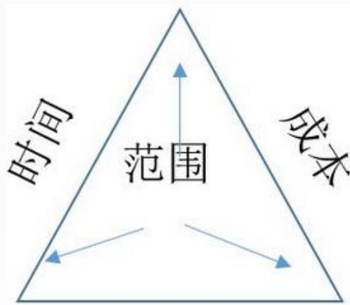
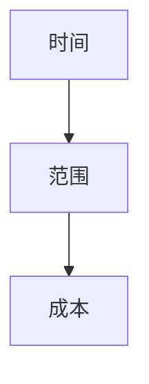
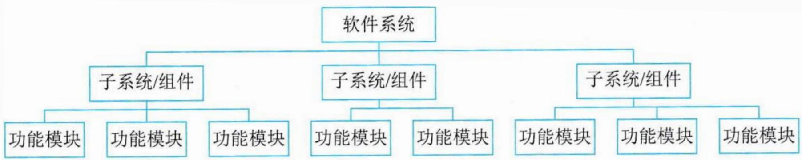
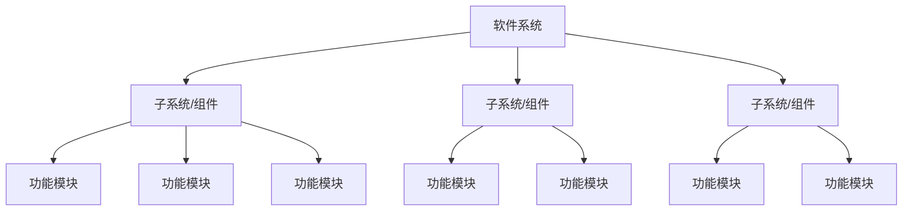
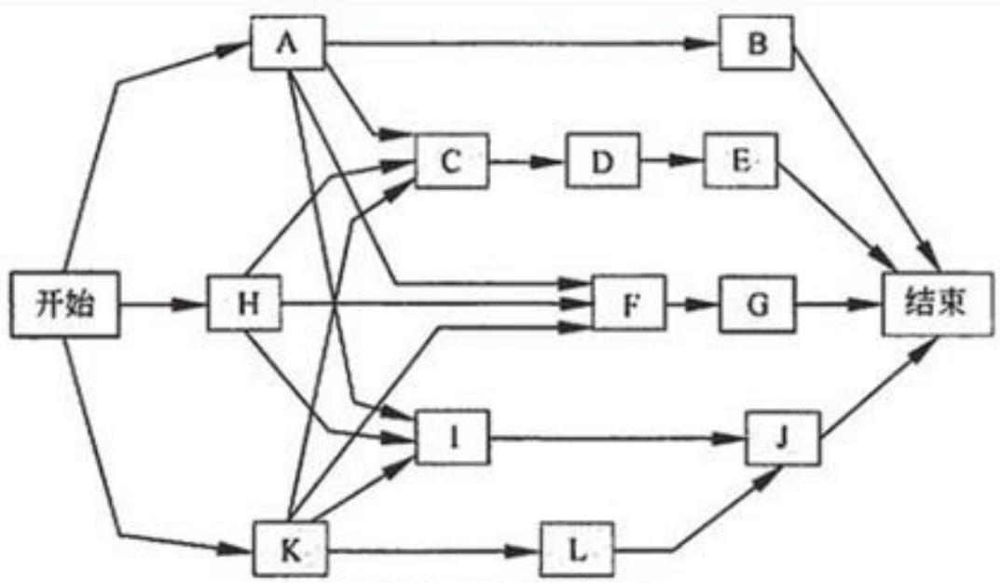
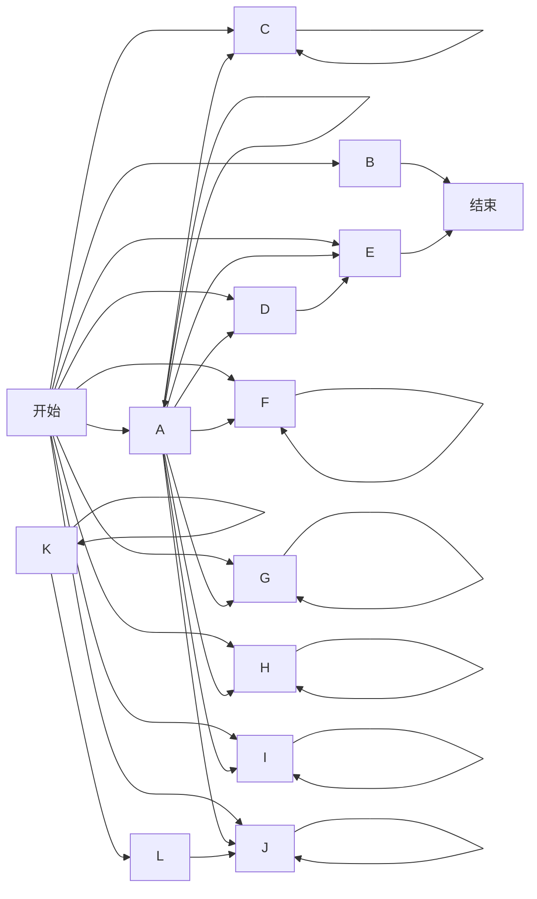
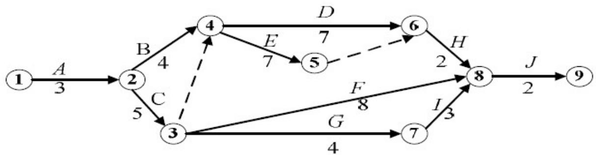
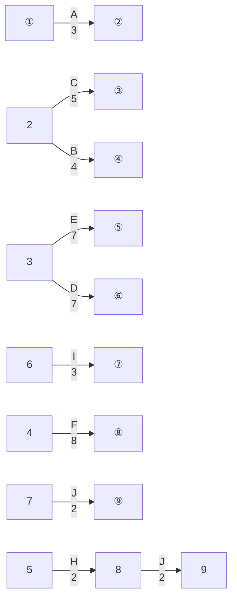

## 系统架构设计师

## 软件项目管理(一)

## 第五章 软件工程基础知识

5.1 软件工程  
5.2 需求工程  
5.3 系统分析与设计  
5.4 软件测试  
5.5 净室软件工程  
5.6 基于构件的软件工程  
5.7 软件项目管理

## 项目管理概述

软件项目管理是为了使软件项目能够按照预定的成本、进度、质量顺利完成，而对人员(People)、产品(Product)、过程(Process) 和项目 (Project) 进行分析和管理的活动。

flowchart

质量

## 二、进度管理(时间管理)

进度管理指的是为了确保项目按期完成所需要的管理过程。

进度管理的主要活动过程：

1. 活动定义  
2. 活动排序  
3. 活动资源估算  
4. 活动历时估算  
5. 制定进度计划  
6. 进度控制

## 1.工作分解结构

工作分解结构 (WBS)就是把一个项目，按一定的原则分解成任务，任务再分解成一项项工作，再把一项项工作分配到每个人的日常活动中。即项目→任务→工作→日常活动。

flowchart

## 2.工作分解的基本要求(原则)

(1)WBS的工作包是可控和可管理的，不能过于复杂。  
(2)任务分解也不能过细，一般原则WBS的树形结构不超过6层。  
(3)每个工作包要有一个交付成果。  
(4)每个任务必须有明确定义的完成标准。  
(5)WBS必须有利于责任分配。

## 3.任务活动图

活动定义是指确定完成项目的各个交付成果所必须进行的各项具体活动，明确每个活动的前驱、持续时间、必须完成日期、里程碑或交付成果。

任务活动图的表示方法：

前导图法(单代号网络图法)  
箭线图法(双代号网络图法)

1)前导图法

前导图法(PDM)也称为单代号网络图法(AON)，使用方框或者长方形（被称作节点）代表活动，用箭头连接表示它们之间逻辑关系。

flowchart

12个活动23个依赖关系

## 2)箭线图法

箭线图法(ADM)也称为双代号网络图法(AOA) ，用箭线表示工作，节点表示工作的逻辑关系。

⚫ 箭线：使用箭线表示工作，箭线都需要占用时间，消耗资源。  
虚箭线：为了正确表达工作之间的逻辑关系，而虚设的一项并不存在的工作，因此不占用资源，不消耗时间。  
节点：反映的是前后工作的交接点，体现了各工作之间的逻辑关系。

flowchart

## 3)网络图的绘制

<table><tr><td>活动编号</td><td>直接前驱</td><td>工期(天)</td></tr><tr><td>A</td><td>--</td><td>3</td></tr><tr><td>B</td><td>A</td><td>5</td></tr><tr><td>C</td><td>B</td><td>1</td></tr><tr><td>D</td><td>A</td><td>3</td></tr><tr><td>E</td><td>D</td><td>5</td></tr><tr><td>F</td><td>C,E</td><td>4</td></tr><tr><td>G</td><td>C,E</td><td>3</td></tr><tr><td>H</td><td>F,G</td><td>4</td></tr></table>

4)每个活动有四个和时间相关的参数：

(1)最早开始时间（ES)。某项活动能够开始的最早时间。  
(2)最早结束时间（EF)。某项活动能够完成的最早时间。

$$
\mathrm{EF} = \mathrm{ES} + \text {工期估计}
$$

(3)最迟结束时间（LF)。为了使项目按时完成，某项工作必须完成的最迟时间。  
(4)最迟开始时间（LS)。为了使项目按时完成，某项工作必须开始的最迟时间。

$$
\mathrm{LS} = \mathrm{LF} - \text {工期估计}
$$

5)计算出工程的最早完工时间。通过正向计算（从第一个活动到最后一个活动）推算出最早完工时间，步骤如下：

(1) 从网络图始端向终端计算。  
(2) 第一任务的开始为项目开始。  
(3) 任务完成时间为开始时间加持续时间（工期）。  
(4) 后续任务的开始时间根据前置任务的时间和搭接时间而定。  
(5) 多个前置任务存在时，根据最迟任务时间来定。

6)通过反向计算（从最后一个活动到第一个活动）推算出最晚完工时间，步骤如下：

(1) 从网络图终端向始端计算。  
(2) 最后一个任务的完成时间为项目完成时间。  
(3) 任务开始时间为完成时间减持续时间（工期）。  
(4) 前置任务的完成时间根据后续任务的时间和搭接时间而定。  
(5) 多个后续任务存在时，根据最早任务时间来定。

总时差TF：不影响总工期的前提下，本工作可以利用的机动时间。

自由时差FF：不影响紧后工作最早开始时间的前提下，本工作可以利用的机动时间。

⚫ 总时差=该工作最晚结束时间(LF) - 该工作最早结束时间(EF)  
总时差=该工作最晚开始时间(LS) - 该工作最早开始时间(ES)  
⚫ 自由时差=该工作的紧后工作最早开始时间(ES)的最小值-该工作最早结束时间(EF)

自由时差总是小于等于总时差。

总时差为零或负的活动，就是关键活动。

例:项目包含的活动如下所示，完成整个项目的工期（ ）天。不能通过缩短活动（ ）的工期，来缩短整个项目完成时间。

A.16

B.17

C.18

D.19

A. A

B. B

C. D

D.F

<table><tr><td>活动编号</td><td>直接前驱</td><td>工期(天)</td></tr><tr><td>A</td><td>--</td><td>3</td></tr><tr><td>B</td><td>A</td><td>5</td></tr><tr><td>C</td><td>B</td><td>1</td></tr><tr><td>D</td><td>A</td><td>3</td></tr><tr><td>E</td><td>D</td><td>5</td></tr><tr><td>F</td><td>C,E</td><td>4</td></tr><tr><td>G</td><td>C,E</td><td>3</td></tr><tr><td>H</td><td>F,G</td><td>4</td></tr></table>

例:某项目包括A\~G七个作业，各作业之间的衔接关系和所需时间如下表，其中，作业C所需的时间，乐观估计为5天，最可能为14天，保守估计为17天。假设其他作业都按计划进度实施，为使该项目按进度计划如期全部完成。作业C( )。

A.必须在期望时间内完成  
B.必须在14天内完成  
C.比期望时间最多可拖延1天  
D.比期望时间最多可拖延2天

<table><tr><td>作业</td><td>A</td><td>B</td><td>C</td><td>D</td><td>E</td><td>F</td><td>G</td></tr><tr><td>紧前作业</td><td>--</td><td>A</td><td>A</td><td>B</td><td>C D</td><td>--</td><td>E F</td></tr><tr><td>所需天数</td><td>5</td><td>7</td><td></td><td>8</td><td>3</td><td>20</td><td>4</td></tr></table>

## Thank You