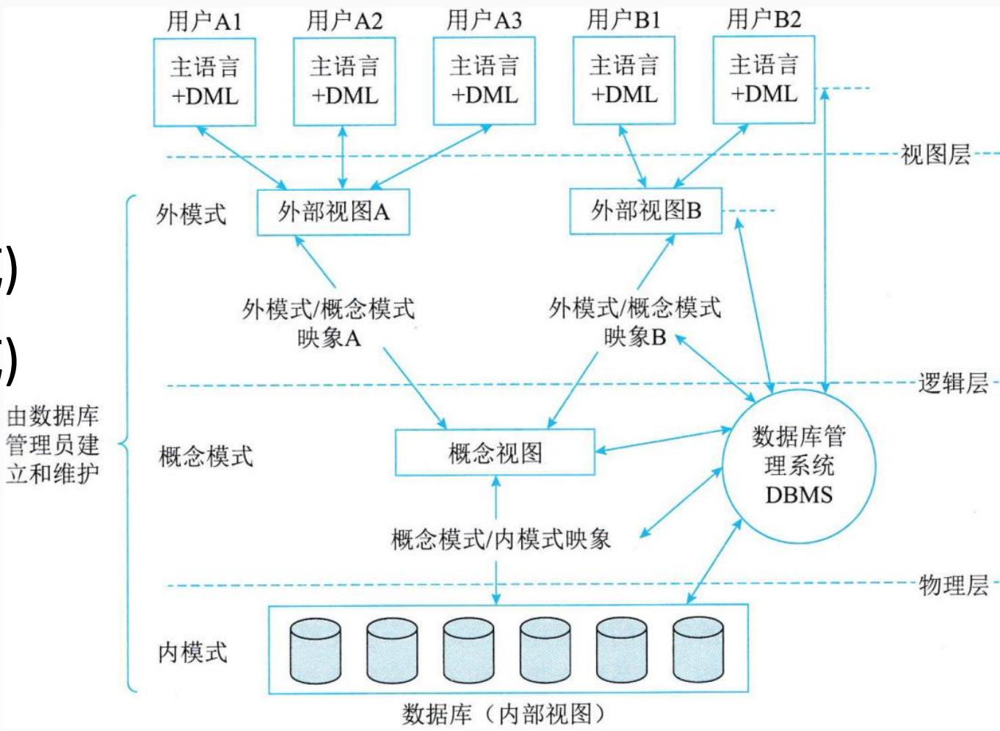
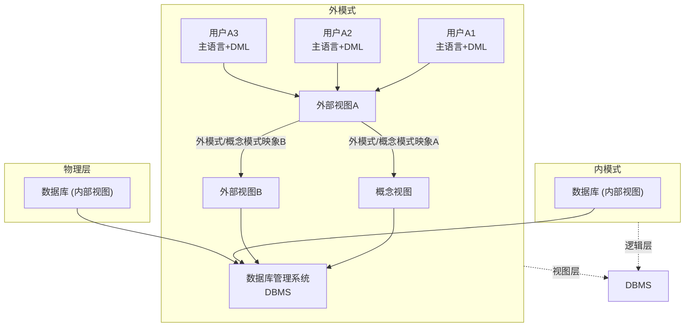
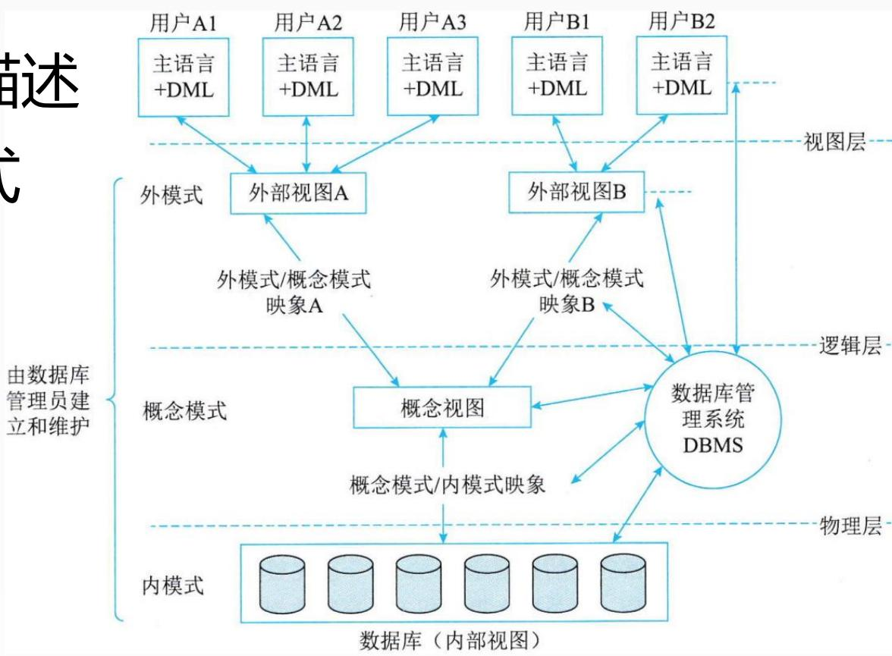
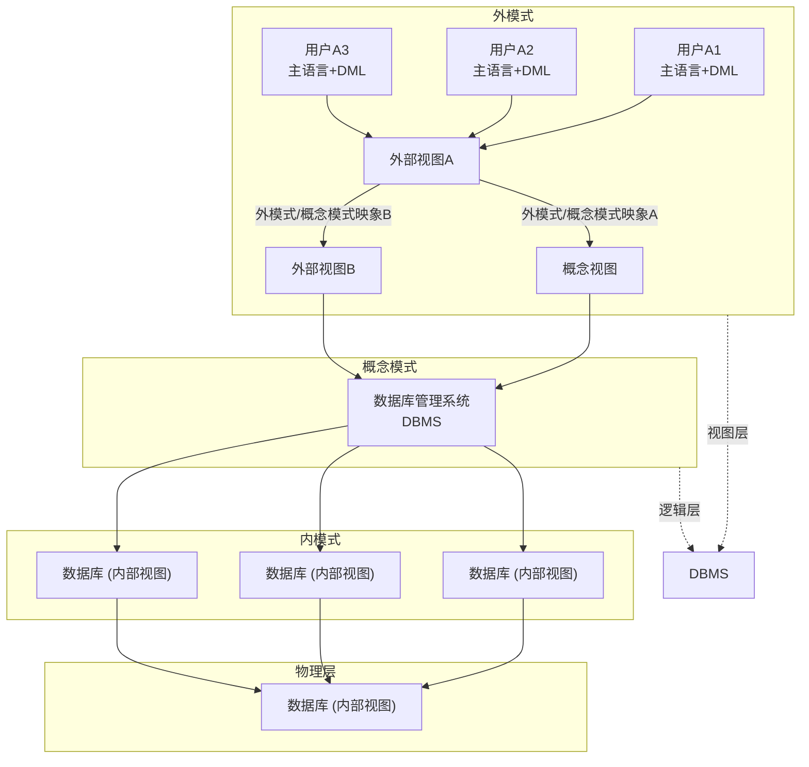
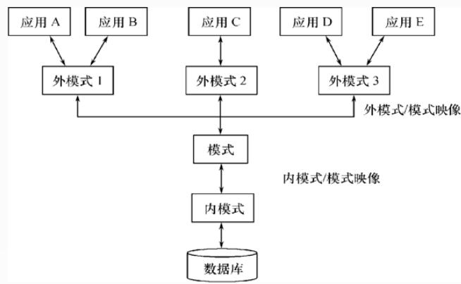
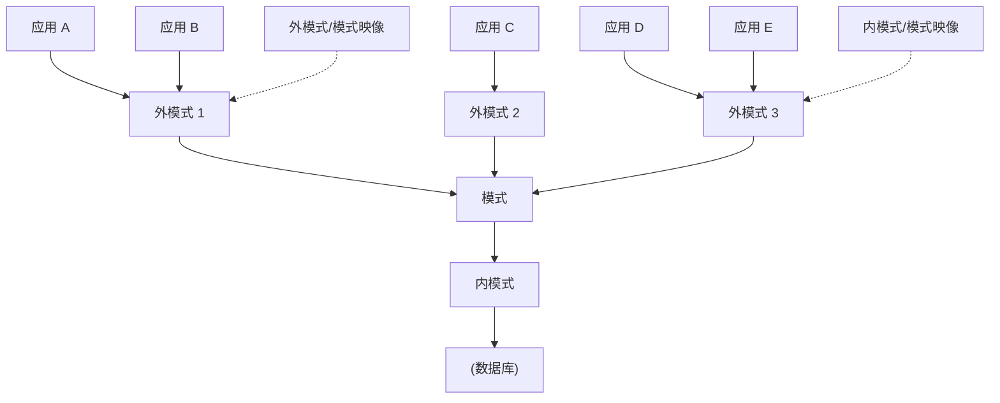
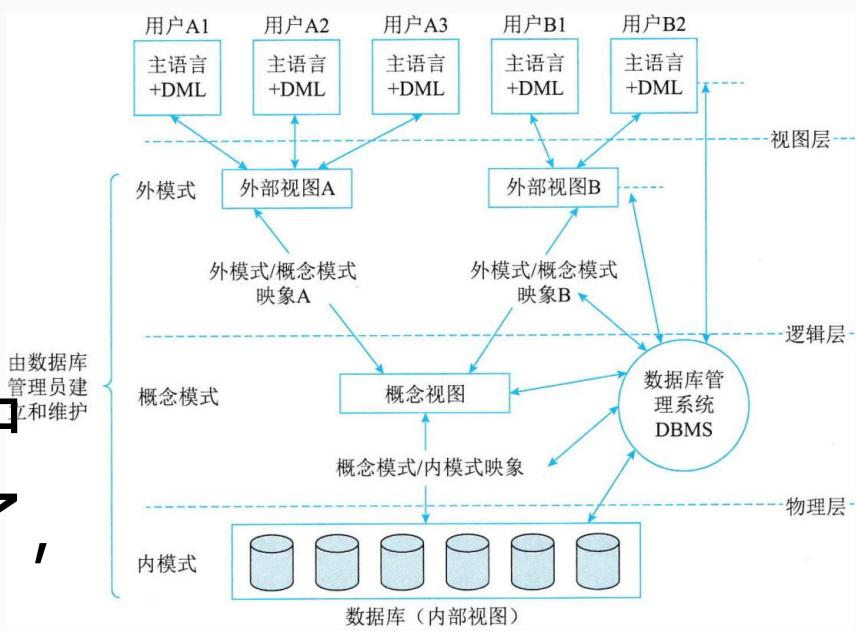
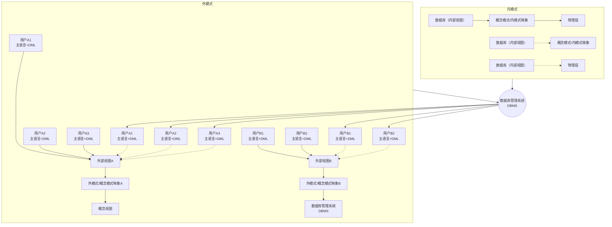

## 系统架构设计师

## 数据库基本概念

## 第六章 数据库设计基础知识

6.1 数据库基本概念  
⚫ 6.2 关系数据库  
⚫ 6.3 数据库设计  
6.4 应用程序与数据库的交互  
⚫ 6.5 NoSQL数据库

## 一、基本概念

数据(Data)  
数据库(Database)  
数据库管理系统(DBMS)  
数据库系统(DBS)

1.数据(Data)

是数据库中存储的基本对象，是描述事物的符号记录。

数据的种类：

文本、图形、图像、音频、视频等。

## 2.数据库(Database, DB)

数据库是统一管理的、长期储存在计算机内的，有组织的相关数据的集合。

数据库的基本特征：

数据按一定的数据模型组织、描述和储存  
数据间联系密切、冗余度较小  
数据独立性较高  
易扩展  
可为各种用户共享

## 3.数据库管理系统(DBMS)

DBMS 是数据库系统的核心软件，是由一组相互关联的数据集合和一组用以访问这些数据的软件组成。它是一种解决如何科学地组织和储存数据如何高效地获取和维护数据的系统软件。

## 主要功能包括：

数据定义功能(DDL)  
数据操纵功能(DML)  
数据库的运行管理  
数据库的建立与维护

4.数据库系统(Database System，DBS)

由数据库及其管理软件组成的系统。

数据库系统的构成：

数据库  
硬件平台  
软件（应用程序）  
数据库管理员

## 二、数据模型

数据模型是数据特征的抽象，它从抽象层次上描述了系统的静态特征、动态行为和约束条件，为数据库系统的信息表示与操作提供一个抽象的框架。数据模型的三要素：

数据结构：对象类型的集合，是对系统静态特性的描述。  
数据操作：对数据库中各种对象的实例(值)允许执行的操作集合，包括操作及操作规则。如检索、插入、删除和修改，操作规则有优先级等。  
数据的约束条件：一组完整性规则的集合。对具体的应用数据必须遵循特定的语义约束条件。 高级项目经理

## 常见的基本数据模型：

层次模型  
网状模型  
关系模型  
面向对象数据模型(第三代数据库系统)

## 三、数据库管理系统

DBMS 功能主要包括数据定义，数据库操作，数据库运行管理，数据组织、存储和管理，数据库的建立和维护。

## (1)数据定义

DBMS 提供数据定义语言 (DDL)，可以对数据库的结构进行描述，包括外模式、模式和内模式的定义；数据库的完整性定义；安全保密定义，如口令、级别和存取权限等。

这些定义存储在数据字典中，是 DBMS运行的基本依据。

(2)数据库操作

DBMS 向用户提供数据操纵语言 (DML)，实现对数据库中数据的基本操作，如检索、插入、修改和删除。

(3)数据库运行管理。数据库在运行期间，多用户环境下的并发控制、安全性检查和存取控制、完整性检查和执行、运行日志的组织管理、事务管理和自动恢复等都是 DBMS 的重要组成部分。这些功能可以保证数据库系统的正常运行。

## 四、数据库三级模式数据库系统可以分为：

外模式(子模式、用户模式)  
模式(概念模式、逻辑模式)  
内模式(存储模式)

flowchart

## 1.模式（概念模式、逻辑模式）

数据库中全体数据的逻辑结构和特征的描述  
所有用户的公共数据视图，综合了所有用户的需求  
一个数据库只有一个模式

<table><tr><td>编号</td><td>姓名</td><td>语文</td><td>数学</td><td>英语</td><td>历史</td><td>地理</td><td>生物</td></tr><tr><td>1</td><td>郭思懿</td><td>92</td><td>86</td><td>98</td><td>76</td><td>95</td><td>80</td></tr><tr><td>2</td><td>翟若冰</td><td>82</td><td>80</td><td>98</td><td>75</td><td>74</td><td>62</td></tr><tr><td>3</td><td>李倩怡</td><td>82</td><td>75</td><td>97</td><td>80</td><td>81</td><td>61</td></tr><tr><td>4</td><td>郑嘉诗</td><td>76</td><td>63</td><td>91</td><td>79</td><td>64</td><td>50</td></tr><tr><td>5</td><td>彭晓如</td><td>81</td><td>82</td><td>86</td><td>50</td><td>57</td><td>51</td></tr><tr><td>6</td><td>黄伦蜜</td><td>71</td><td>14</td><td>49</td><td>35</td><td>55</td><td>22</td></tr><tr><td>7</td><td>陈春林</td><td>49</td><td>33</td><td>45</td><td>33</td><td>34</td><td>35</td></tr><tr><td>8</td><td>叶少锦</td><td>62</td><td>25</td><td>23</td><td>64</td><td>53</td><td>29</td></tr><tr><td>9</td><td>骆水源</td><td>46</td><td>43</td><td>20</td><td>18</td><td>33</td><td>19</td></tr><tr><td>10</td><td>李新荣</td><td>73</td><td>18</td><td>50</td><td>45</td><td>36</td><td>35</td></tr></table>

## 2.外模式（子模式、用户模式）

⚫ 数据库用户（包括应用程序员和最终用户）使用的局部数据的逻辑结构和特征的描述  
数据库用户的数据视图，是与某一应用有关的数据的逻辑表示

<table><tr><td>编号</td><td>姓名</td><td>语文</td><td>数学</td><td>英语</td><td>历史</td><td>地理</td><td>生物</td></tr><tr><td>1</td><td>郭思懿</td><td>92</td><td>86</td><td>98</td><td>76</td><td>95</td><td>80</td></tr><tr><td>2</td><td>擢若冰</td><td>82</td><td>80</td><td>98</td><td>75</td><td>74</td><td>62</td></tr><tr><td>3</td><td>李倩怡</td><td>82</td><td>75</td><td>97</td><td>80</td><td>81</td><td>61</td></tr><tr><td>4</td><td>郑嘉诗</td><td>76</td><td>63</td><td>91</td><td>79</td><td>64</td><td>50</td></tr><tr><td>5</td><td>彭晓如</td><td>81</td><td>82</td><td>86</td><td>50</td><td>57</td><td>51</td></tr><tr><td>6</td><td>黄伦蜜</td><td>71</td><td>14</td><td>49</td><td>35</td><td>55</td><td>22</td></tr><tr><td>7</td><td>陈春林</td><td>49</td><td>33</td><td>45</td><td>33</td><td>34</td><td>35</td></tr><tr><td>8</td><td>叶少锦</td><td>62</td><td>25</td><td>23</td><td>64</td><td>53</td><td>29</td></tr><tr><td>9</td><td>骆水源</td><td>46</td><td>43</td><td>20</td><td>18</td><td>33</td><td>19</td></tr><tr><td>10</td><td>李新荣</td><td>73</td><td>18</td><td>50</td><td>45</td><td>36</td><td>35</td></tr></table>

<table><tr><td>编号</td><td>姓名</td><td>语文</td><td>数学</td><td>英语</td><td>历史</td><td>地理</td><td>生物</td></tr><tr><td>1</td><td>郭思懿</td><td>92</td><td>86</td><td>98</td><td>76</td><td>95</td><td>80</td></tr><tr><td>2</td><td>瞿若冰</td><td>82</td><td>80</td><td>98</td><td>75</td><td>74</td><td>62</td></tr><tr><td>3</td><td>李倩怡</td><td>82</td><td>75</td><td>97</td><td>80</td><td>81</td><td>61</td></tr><tr><td>4</td><td>郑嘉诗</td><td>76</td><td>63</td><td>91</td><td>79</td><td>64</td><td>50</td></tr><tr><td>5</td><td>彭晓如</td><td>81</td><td>82</td><td>86</td><td>50</td><td>57</td><td>51</td></tr><tr><td>6</td><td>黄伦蜜</td><td>71</td><td>14</td><td>49</td><td>35</td><td>55</td><td>22</td></tr><tr><td>7</td><td>陈春林</td><td>49</td><td>33</td><td>45</td><td>33</td><td>34</td><td>35</td></tr><tr><td>8</td><td>叶少锦</td><td>62</td><td>25</td><td>23</td><td>64</td><td>53</td><td>29</td></tr><tr><td>9</td><td>骆水源</td><td>46</td><td>43</td><td>20</td><td>18</td><td>33</td><td>19</td></tr><tr><td>10</td><td>李新荣</td><td>73</td><td>18</td><td>50</td><td>45</td><td>36</td><td>35</td></tr></table>

## 外模式的地位：介于模式与应用之间

模式与外模式的关系：一对多

外模式通常是模式的子集  
一个数据库可以有多个外模式。反映了不同的用户的应用需求、看待数据的方式、对数据保密的要求

## 外模式的用途

保证数据库安全性的一个有力措施  
⚫ 每个用户只能看见和访问所对应的外模式中的数据

## (3)内模式（存储模式）

是数据物理结构和存储方式的描  
是数据在数据库内部的表示方式  
一个数据库只有一个内模式

flowchart

例.采用三级模式结构的数据库系统中，如果对一个表创建聚簇索引，那么改变的是数据库的( )。

A.外模式  
B.模式  
C.内模式  
D.用户模式

## 一、数据库系统的三级模式

数据库系统可以分为：

外模式(子模式、用户模式)  
模式(概念模式、逻辑模式)  
内模式(存储模式)

flowchart

## 五、三个级别

与三级模式相对应，数据库系统可以划分为三个抽象级：

1.用户级数据库：最高层抽象，对应于外模式，是用户看到和使用的数据库，又称用户视图。一个数据库可有多个不同的用户视图。  
2.概念级数据库：对应于概念模式，是所有用户视图的最小并集，一个数据库应用系统只有一个DBA视图。  
3.物理级数据库：对应于内模式，是数据库的低层表示，它描述数据的实际存储组织，是最接近于物理存储的，又称为内部视图。

## 六、两级独立性

1.物理独立性

指用户的应用程序与存储在磁盘上的数据库中数据是相互独立的。当数据的物理存储改变了应用程序不用改变。

2.逻辑独立性

指用户的应用程序与数据库的逻辑结构是相互独立的。数据的逻辑结构改变了，用户程序也可以不变。

独立性是由DBMS的二级映像功能来保证的

flowchart

## Thank You