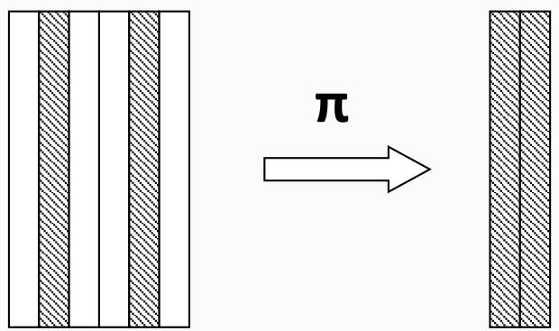
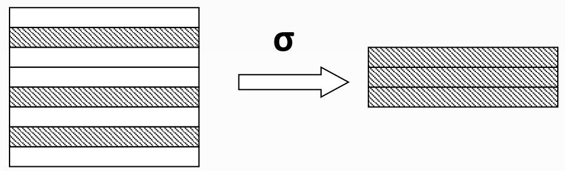
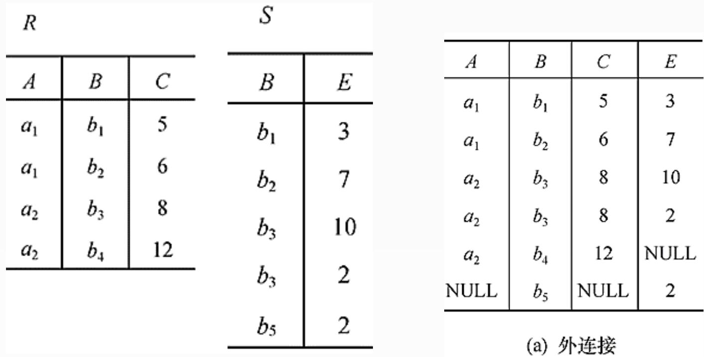
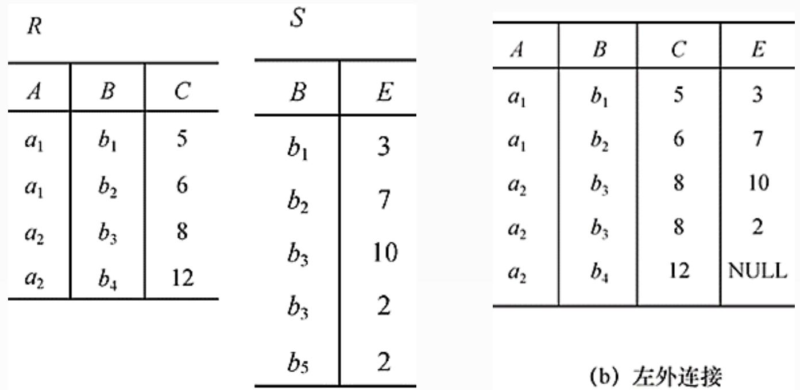

## 系统架构设计师

## 关系数据库(二)

## 第六章 数据库设计基础知识

6.1 数据库基本概念  
⚫ 6.2 关系数据库  
6.3 数据库设计  
6.4 应用程序与数据库的交互  
⚫ 6.5 NoSQL数据库

## 二、常用的关系操作

查询：选择、投影、连接、除、并、交、差  
数据更新：插入、删除、修改

查询的表达能力是其中最主要的部分

⚫ 传统的集合运算是二目运算，包括并、交、差、广义笛卡儿积  
专门的关系运算包括：选择、投影、连接、除4种运算。

<table><tr><td colspan="2">运算符</td><td>含义</td><td colspan="2">运算符</td><td>含义</td></tr><tr><td>集合运算符</td><td>∪∩-×</td><td>并差交笛卡儿积</td><td>比较运算符</td><td>&gt;≥&lt;≤=≠</td><td>大于大于等于小于小于等于等于不等于</td></tr><tr><td>专门的关系运算符</td><td>σπ⊗÷</td><td>选择投影连接除</td><td>逻辑运算符</td><td>¬∧∨</td><td>非与或</td></tr></table>

1. 并

关系R和S具有相同的目n(两个关系都有n个属性)，R和S的并是由属于R或属于S的元组组成的集合，记为RUS。 R

形式定义如下：

$$
R \bigcup S = \{t \mid t \in R \lor t \in S \}
$$

式中t是元组变量（下同）

显然， RUS = SUR。

<table><tr><td>A</td><td>B</td><td>C</td></tr><tr><td> $a_{1}$ </td><td> $b_{1}$ </td><td> $c_{1}$ </td></tr><tr><td> $a_{1}$ </td><td> $b_{2}$ </td><td> $c_{2}$ </td></tr><tr><td> $a_{2}$ </td><td> $b_{2}$ </td><td> $c_{1}$ </td></tr></table>

S

<table><tr><td>A</td><td>B</td><td>C</td></tr><tr><td> $a_{1}$ </td><td> $b_{2}$ </td><td> $c_{2}$ </td></tr><tr><td> $a_{1}$ </td><td> $b_{3}$ </td><td> $c_{2}$ </td></tr><tr><td> $a_{2}$ </td><td> $b_{2}$ </td><td> $c_{1}$ </td></tr></table>

RUS

<table><tr><td>A</td><td>B</td><td>C</td></tr><tr><td> $a_{1}$ </td><td> $b_{1}$ </td><td> $c_{1}$ </td></tr><tr><td> $a_{1}$ </td><td> $b_{2}$ </td><td> $c_{2}$ </td></tr><tr><td> $a_{2}$ </td><td> $b_{2}$ </td><td> $c_{1}$ </td></tr><tr><td> $a_{1}$ </td><td> $b_{3}$ </td><td> $c_{2}$ </td></tr></table>

2. 差

关系R和S具有相同的目n，R和S的差是由属于R 但不属于S的元组组成的集合，记为R-S。

形式定义如下：

$$
R - S = \{t \mid t \in R \land t \notin S \}
$$

<table><tr><td colspan="3">R</td></tr><tr><td>A</td><td>B</td><td>C</td></tr><tr><td> $a_1$ </td><td> $b_1$ </td><td> $c_1$ </td></tr><tr><td> $a_1$ </td><td> $b_2$ </td><td> $c_2$ </td></tr><tr><td> $a_2$ </td><td> $b_2$ </td><td> $c_1$ </td></tr><tr><td colspan="3">S</td></tr><tr><td>A</td><td>B</td><td>C</td></tr><tr><td> $a_1$ </td><td> $b_2$ </td><td> $c_2$ </td></tr><tr><td> $a_1$ </td><td> $b_3$ </td><td> $c_2$ </td></tr><tr><td> $a_2$ </td><td> $b_2$ </td><td> $c_1$ </td></tr></table>

<table><tr><td colspan="3"> $R-S$ </td></tr><tr><td> $A$ </td><td> $B$ </td><td> $C$ </td></tr><tr><td> $a_{1}$ </td><td> $b_{1}$ </td><td> $c_{1}$ </td></tr></table>

3. 交

关系R和S具有相同的目n，R和S的交是由既属于R 又属于S的元组组成的集合，记为R ∩ S。

形式定义如下：

$$
R \cap S = \{t | t \in R \land t \in S \}
$$

显然 ${ \sf R n S } = { \sf R } - \left( { \sf R } { - } { \sf S } \right)$

$$
R \cap S = S - (S - R)
$$

<table><tr><td colspan="3">R</td></tr><tr><td>A</td><td>B</td><td>C</td></tr><tr><td> $a_{1}$ </td><td> $b_{1}$ </td><td> $c_{1}$ </td></tr><tr><td> $a_{1}$ </td><td> $b_{2}$ </td><td> $c_{2}$ </td></tr><tr><td> $a_{2}$ </td><td> $b_{2}$ </td><td> $c_{1}$ </td></tr></table>

<table><tr><td>A</td><td>B</td><td>C</td></tr><tr><td> $a_{1}$ </td><td> $b_{2}$ </td><td> $c_{2}$ </td></tr><tr><td> $a_{1}$ </td><td> $b_{3}$ </td><td> $c_{2}$ </td></tr><tr><td> $a_{2}$ </td><td> $b_{2}$ </td><td> $c_{1}$ </td></tr></table>

<table><tr><td colspan="3"> $R \cap S$ </td></tr><tr><td>A</td><td>B</td><td>C</td></tr><tr><td> $a_{1}$ </td><td> $b_{2}$ </td><td> $c_{2}$ </td></tr><tr><td> $a_{2}$ </td><td> $b_{2}$ </td><td> $c_{1}$ </td></tr></table>

## 4. 笛卡儿积

R: n目关系，k1个元组

S: m目关系，k2个元组

$$
R \times S
$$

列：(n+m) 列元组的集合

元组的前n列是关系R的一个元组  
后m列是关系S的一个元组

行：k1×k2 行元组

RXS={t|t=<t",t">∧t”∈R△t"∈S}

<table><tr><td colspan="3">R</td></tr><tr><td>A</td><td>B</td><td>C</td></tr><tr><td> $a_1$ </td><td> $b_1$ </td><td> $c_1$ </td></tr><tr><td> $a_1$ </td><td> $b_2$ </td><td> $c_2$ </td></tr><tr><td> $a_2$ </td><td> $b_2$ </td><td> $c_1$ </td></tr></table>

<table><tr><td>A</td><td>B</td><td>C</td></tr><tr><td> $a_{1}$ </td><td> $b_{2}$ </td><td> $c_{2}$ </td></tr><tr><td> $a_{1}$ </td><td> $b_{3}$ </td><td> $c_{2}$ </td></tr><tr><td> $a_{2}$ </td><td> $b_{2}$ </td><td> $c_{1}$ </td></tr></table>

R×S

<table><tr><td>R.A</td><td>R.B</td><td>R.C</td><td>S.A</td><td>S.B</td><td>S.C</td></tr><tr><td> $a_{1}$ </td><td> $b_{1}$ </td><td> $c_{1}$ </td><td> $a_{1}$ </td><td> $b_{2}$ </td><td> $c_{2}$ </td></tr><tr><td> $a_{1}$ </td><td> $b_{1}$ </td><td> $c_{1}$ </td><td> $a_{1}$ </td><td> $b_{3}$ </td><td> $c_{2}$ </td></tr><tr><td> $a_{1}$ </td><td> $b_{1}$ </td><td> $c_{1}$ </td><td> $a_{2}$ </td><td> $b_{2}$ </td><td> $c_{1}$ </td></tr><tr><td> $a_{1}$ </td><td> $b_{2}$ </td><td> $c_{2}$ </td><td> $a_{1}$ </td><td> $b_{2}$ </td><td> $c_{2}$ </td></tr><tr><td> $a_{1}$ </td><td> $b_{2}$ </td><td> $c_{2}$ </td><td> $a_{1}$ </td><td> $b_{3}$ </td><td> $c_{2}$ </td></tr><tr><td> $a_{1}$ </td><td> $b_{2}$ </td><td> $c_{2}$ </td><td> $a_{2}$ </td><td> $b_{2}$ </td><td> $c_{1}$ </td></tr><tr><td> $a_{2}$ </td><td> $b_{2}$ </td><td> $c_{1}$ </td><td> $a_{1}$ </td><td> $b_{2}$ </td><td> $c_{2}$ </td></tr><tr><td> $a_{2}$ </td><td> $b_{2}$ </td><td> $c_{1}$ </td><td> $a_{1}$ </td><td> $b_{3}$ </td><td> $c_{2}$ </td></tr><tr><td> $a_{2}$ </td><td> $b_{2}$ </td><td> $c_{1}$ </td><td> $a_{2}$ </td><td> $b_{2}$ </td><td> $c_{1}$ </td></tr></table>

## 三、关系运算

关系数据库还有一些专门的运算，主要有投影、选择、连接、除法和外连接。

在关系代数中，由五种基本代数操作经过有限次复合的式子称为关系代数运算表达式。表达式的运算结果仍是一个关系。

<table><tr><td colspan="2">运算符</td><td>含义</td><td colspan="2">运算符</td><td>含义</td></tr><tr><td>集合运算符</td><td>∪∩-×</td><td>并差交笛卡儿积</td><td>比较运算符</td><td>&gt;≥&lt;≤=≠</td><td>大于大于等于小于小于等于等于不等于</td></tr><tr><td>专门的关系运算符</td><td>σπ⊗÷</td><td>选择投影连接除</td><td>逻辑运算符</td><td>¬∧∨</td><td>非与或</td></tr></table>

1. 投影

投影操作从关系R中选择出若干属性列组成新的关系，该操作对关系进行垂直分割，消去某些列，并重新安排列的顺序，再删去重复元组。记作： $\pi _ { \mathsf { A } } ( { \mathsf { R } } )$

其形式定义 ： $\pi _ { \mathsf { A } } ( { \mathsf { R } } ) = \{ { \mathsf { t } } [ { \mathsf { A } } ] \mid { \mathsf { t } } \in { \mathsf { R } } \}$

其中A为R的属性列。

text_image

π

注意：

投影之后不仅取消了原关系中的某些列，而且还可能取消某些元组（避免重复行）。

例：查询学生的姓名和所在系

即求Student关系上学生姓名和所在系两个属性上的投影。

$$
\pi_ {\text {Sname, Sdept}} (\text {Student})
$$

或 $\pi _ { 2 , \updownarrow } ( { \mathsf { S t u d e n t } } )$

<table><tr><td>学号Sno</td><td>姓名Sname</td><td>性别Ssex</td><td>年龄Sage</td><td>所在系Sdept</td></tr><tr><td>200215121</td><td>李勇</td><td>男</td><td>20</td><td>CS</td></tr><tr><td>200215122</td><td>刘晨</td><td>女</td><td>19</td><td>IS</td></tr><tr><td>200215123</td><td>王敏</td><td>女</td><td>18</td><td>MA</td></tr><tr><td>200215125</td><td>张立</td><td>男</td><td>19</td><td>IS</td></tr></table>

<table><tr><td>Sname</td><td>Sdept</td></tr><tr><td>李勇</td><td>CS</td></tr><tr><td>刘晨</td><td>IS</td></tr><tr><td>王敏</td><td>MA</td></tr><tr><td>张立</td><td>IS</td></tr></table>

2. 选择

选择操作在关系R中选择满足给定条件的所有元组，记作 $\sigma _ { \mathsf { F } } ( { \mathsf { R } } )$

其形式定义 ： $\sigma _ { \mathsf { F } } ( \mathsf { R } ) = \{ { \sf t } | { \sf t } \in \mathsf { R } \land \mathsf { F } ( { \sf t } ) =$ '真'}

其中F表示选择条件，是一个逻辑表达式（逻辑运算符+算术表达式）。选择运算是从行的角度进行的运算。

text_image

σ

向上人生路!

例：查询信息系（IS系）全体学生。

$$
\sigma_ {\text {Sdept} = ^ {\prime} \text {IS} ^ {\prime}} (\text {Student})
$$

或 $\mathbf { O } _ { 5 } = " | \mathsf { S } ^ { \prime } \left( \mathsf { S t u d e n t } \right)$

<table><tr><td>学号Sno</td><td>姓名Sname</td><td>性别Ssex</td><td>年龄Sage</td><td>所在系Sdept</td></tr><tr><td>200215121</td><td>李勇</td><td>男</td><td>20</td><td>CS</td></tr><tr><td>200215122</td><td>刘晨</td><td>女</td><td>19</td><td>IS</td></tr><tr><td>200215123</td><td>王敏</td><td>女</td><td>18</td><td>MA</td></tr><tr><td>200215125</td><td>张立</td><td>男</td><td>19</td><td>IS</td></tr></table>

<table><tr><td>Sno</td><td>Sname</td><td>Ssex</td><td>Sage</td><td>Sdept</td></tr><tr><td>200215122</td><td>刘晨</td><td>女</td><td>19</td><td>IS</td></tr><tr><td>200215125</td><td>张立</td><td>男</td><td>19</td><td>IS</td></tr></table>

## 3. 连接

连接分为θ连接、等值连接及自然连接 3 种。

连接运算是指从两个关系R和S的笛卡儿积中选取属性间满足一定

条件的元组。记作：

$$
R \bowtie_ {A \theta B} S \equiv \{t _ {r} t _ {s} \mid t _ {r} \in R \land t _ {s} \in S \land t _ {r} [ A ] \theta t _ {s} [ B ] \}
$$

A和B：分别为R和S上度数相等且可比的属性组

θ：比较运算符

(1) θ连接

θ连接是从R与S的笛卡尔积中选取属性满足一定条件的元组。

其形式定义如下： ${ \underset { \lambda \ \mathbf { 0 } Y } { \min } } = \left\{ t \vert t = < t ^ { n } , t ^ { m } > { \wedge } t ^ { n } \in R { \wedge } t ^ { m } \in S { \wedge } t ^ { n } [ X ] \Theta t ^ { m } [ Y ] \right\}$

例：关系R和关系S 如下所示，一般连接 ${ \sf R } _ { \scriptscriptstyle  { c < } \scriptscriptstyle \epsilon } ^ { \mathrm { ~ \tiny ~ \times ~ } \sf S }$ 的结果如下：

<table><tr><td colspan="3">R</td><td colspan="2">S</td><td colspan="5"> $R \bowtie S$  $C < E$ </td></tr><tr><td>A</td><td>B</td><td>C</td><td>B</td><td>E</td><td>A</td><td>R.B</td><td>C</td><td>S.B</td><td>E</td></tr><tr><td> $a_1$ </td><td> $b_1$ </td><td>5</td><td> $b_1$ </td><td>3</td><td> $a_1$ </td><td> $b_1$ </td><td>5</td><td> $b_2$ </td><td>7</td></tr><tr><td> $a_1$ </td><td> $b_2$ </td><td>6</td><td> $b_2$ </td><td>7</td><td> $a_1$ </td><td> $b_1$ </td><td>5</td><td> $b_3$ </td><td>10</td></tr><tr><td> $a_2$ </td><td> $b_3$ </td><td>8</td><td> $b_3$ </td><td>10</td><td> $a_1$ </td><td> $b_2$ </td><td>6</td><td> $b_2$ </td><td>7</td></tr><tr><td> $a_2$ </td><td> $b_4$ </td><td>12</td><td> $b_3$ </td><td>2</td><td> $a_1$ </td><td> $b_2$ </td><td>6</td><td> $b_3$ </td><td>10</td></tr><tr><td colspan="3"></td><td> $b_5$ </td><td>2</td><td> $a_2$ </td><td> $b_3$ </td><td>8</td><td> $b_3$ </td><td>10</td></tr></table>

向上人生路！

(2) 等值连接（equijoin）

θ为"＝"时的连接运算称为等值连接。

等值连接的含义是指从关系R与S的广义笛卡尔积中选取A、B属性值相等的那些元组，即等值连接为：

$$
R \bowtie_ {A = B} S \equiv \{t _ {r} t _ {s} \mid t _ {r} \in R \land t _ {s} \in S \land t _ {r} [ A ] = t _ {s} [ B ] \}
$$

例：关系R和关系S 如下所示，等值连接R $\bigstar \bigstar _ { R . B = S . B } \mathsf { S }$ 的结果如下：

<table><tr><td colspan="3">R</td><td colspan="2">S</td></tr><tr><td>A</td><td>B</td><td>C</td><td>B</td><td>E</td></tr><tr><td> $a_1$ </td><td> $b_1$ </td><td>5</td><td> $b_1$ </td><td>3</td></tr><tr><td> $a_1$ </td><td> $b_2$ </td><td>6</td><td> $b_2$ </td><td>7</td></tr><tr><td> $a_2$ </td><td> $b_3$ </td><td>8</td><td> $b_3$ </td><td>10</td></tr><tr><td> $a_2$ </td><td> $b_4$ </td><td>12</td><td> $b_3$ </td><td>2</td></tr><tr><td colspan="3"></td><td> $b_5$ </td><td>2</td></tr></table>

<table><tr><td>A</td><td>R.B</td><td>C</td><td>S.B</td><td>E</td></tr><tr><td> $a_{1}$ </td><td> $b_{1}$ </td><td>5</td><td> $b_{1}$ </td><td>3</td></tr><tr><td> $a_{1}$ </td><td> $b_{2}$ </td><td>6</td><td> $b_{2}$ </td><td>7</td></tr><tr><td> $a_{2}$ </td><td> $b_{3}$ </td><td>8</td><td> $b_{3}$ </td><td>10</td></tr><tr><td> $a_{2}$ </td><td> $b_{3}$ </td><td>8</td><td> $b_{3}$ </td><td>2</td></tr></table>

(3) 自然连接（Natural join）

自然连接是一种特殊的等值连接

两个关系中进行比较的分量必须是相同的属性组  
在结果中把重复的属性列去掉

自然连接的含义

R和S具有相同的属性组B

$$
R \bowtie S \equiv \{t _ {r} t _ {s} \mid t _ {r} \in R \land t _ {s} \in S \land t _ {r} [ A ] = t _ {s} [ B ] \}
$$

向上人生路!

例：关系R和关系S 如下所示，自然连接R S的结果如下：

<table><tr><td colspan="3">R</td></tr><tr><td>A</td><td>B</td><td>C</td></tr><tr><td> $a_1$ </td><td> $b_1$ </td><td>5</td></tr><tr><td> $a_1$ </td><td> $b_2$ </td><td>6</td></tr><tr><td> $a_2$ </td><td> $b_3$ </td><td>8</td></tr><tr><td> $a_2$ </td><td> $b_4$ </td><td>12</td></tr></table>

<table><tr><td colspan="2">S</td></tr><tr><td>B</td><td>E</td></tr><tr><td> $b_{1}$ </td><td>3</td></tr><tr><td> $b_{2}$ </td><td>7</td></tr><tr><td> $b_{3}$ </td><td>10</td></tr><tr><td> $b_{3}$ </td><td>2</td></tr><tr><td> $b_{5}$ </td><td>2</td></tr></table>

<table><tr><td>A</td><td>B</td><td>C</td><td>E</td></tr><tr><td> $a_{1}$ </td><td> $b_{1}$ </td><td>5</td><td>3</td></tr><tr><td> $a_{1}$ </td><td> $b_{2}$ </td><td>6</td><td>7</td></tr><tr><td> $a_{2}$ </td><td> $b_{3}$ </td><td>8</td><td>10</td></tr><tr><td> $a_{2}$ </td><td> $b_{3}$ </td><td>8</td><td>2</td></tr></table>

例:给定关系R(A, B, C, D)和S(A, C, E, F)，以下( )与 $\sigma _ { R , \tt B > S , E } ( \ntriangle { \sf R }$ S)等价。

A. $\sigma _ { 2 > 7 } ( \mathsf { R } \mathsf { X } \mathsf { S } )$  
B. $\pi _ { 1 , 2 , 3 , 4 , 7 , 8 } ( \sigma _ { 1 = 5 \wedge 2 > 7 \wedge 3 = 6 } ( \mathsf { R } \times \mathsf { S } ) )$  
C. $\sigma _ { 2 > " 7 " } ( \mathsf { R } \mathsf { X } \mathsf { S } )$  
D. $\bar { \boldsymbol { \pi } } _ { 1 , 2 , 3 , 4 , 7 , 8 } \big ( \sigma _ { 1 = 5 \wedge 2 > " 7 " \wedge 3 = 6 } \big ( \mathsf { R X S } \big ) \big )$

3.自然连接（Natural join)

自然连接是一种特殊的等值连接

两个关系中进行比较的分量必须是相同的属性组  
在结果中把重复的属性列去掉

自然连接的含义

R和s具有相同的属性组B

$$
R \bowtie S \equiv \{t _ {r} t _ {s} \mid t _ {r} \in R \land t _ {s} \in S \land t _ {r} [ A ] = t _ {s} [ B ] \}
$$

路！

向上人生路!

## 4. 外连接（OUTER JOIN）

关系R、S 进行自然连接时，如果把舍弃的元组也保存在结果关系中，而在其他属性上填空值(Null)，这种连接就叫做外连接。

## 5. 左外连接

关系R、S 进行自然连接时，如果只把左边关系R中要舍弃的元组保留就叫做左外连接(LEFT OUTER JOIN或LEFT JOIN)

## 6. 右外连接

关系R、S 进行自然连接时，如果只把右边关系S中要舍弃的元组保留就叫做右外连接(RIGHT OUTER JOIN或RIGHT JOIN)

<table><tr><td colspan="3">R</td></tr><tr><td>A</td><td>B</td><td>C</td></tr><tr><td> $a_1$ </td><td> $b_1$ </td><td>5</td></tr><tr><td> $a_1$ </td><td> $b_2$ </td><td>6</td></tr><tr><td> $a_2$ </td><td> $b_3$ </td><td>8</td></tr><tr><td> $a_2$ </td><td> $b_4$ </td><td>12</td></tr></table>

<table><tr><td colspan="2">S</td></tr><tr><td>B</td><td>E</td></tr><tr><td> $b_{1}$ </td><td>3</td></tr><tr><td> $b_{2}$ </td><td>7</td></tr><tr><td> $b_{3}$ </td><td>10</td></tr><tr><td> $b_{3}$ </td><td>2</td></tr><tr><td> $b_{5}$ </td><td>2</td></tr></table>

<table><tr><td>A</td><td>B</td><td>C</td><td>E</td></tr><tr><td> $a_1$ </td><td> $b_1$ </td><td>5</td><td>3</td></tr><tr><td> $a_1$ </td><td> $b_2$ </td><td>6</td><td>7</td></tr><tr><td> $a_2$ </td><td> $b_3$ </td><td>8</td><td>10</td></tr><tr><td> $a_2$ </td><td> $b_3$ </td><td>8</td><td>2</td></tr><tr><td>NULL</td><td> $b_5$ </td><td>NULL</td><td>2</td></tr></table>

(c）右外连接

## 7. 除法

给定关系R (X，Y) 和S (Y，Z)，其中X，Y，Z为属性组。

R中的Y与S中的Y可以有不同的属性名，但必须出自相同的域集。

R与S的除运算得到一个新的关系P(X)，

P是R中满足下列条件的元组在 X 属性列上的投影：

元组在X上分量值x的象集 $Y _ { x }$ 包含S在Y上投影的集合，记作：

$$
R \div S = \left\{t _ {r} [ X ] \mid t _ {r} \in R \wedge \pi_ {Y} (S) \in Y _ {x} \right\}
$$

$\Upsilon _ { \times } \colon$ ：x在R中的象集， $\mathsf { x } = \mathsf { t } _ { \mathsf { r } } [ \mathsf { X } ]$

例：设关系R、S分别为下图的(a)和(b)，R÷S的结果为图(c)在关系R中，A可以取四个值{a1，a2，a3，a4}

a1的象集为 {(b1，c2)，(b2，c3)，(b2，c1)}  
a2的象集为 {(b3，c7)，(b2，c3)}  
a3的象集为 {(b4，c6)}  
a4的象集为 {(b6，c6)}

S在(B，C)上的投影为

$$
\{(b 1, c 2), (b 2, c 1), (b 2, c 3) \}
$$

只有a1的象集包含了S在(B，C)属性组上的投影。所以 R÷S ={a1}

<table><tr><td colspan="3">R</td></tr><tr><td>A</td><td>B</td><td>C</td></tr><tr><td> $a_{1}$ </td><td> $b_{1}$ </td><td> $c_{2}$ </td></tr><tr><td> $a_{2}$ </td><td> $b_{3}$ </td><td> $c_{7}$ </td></tr><tr><td> $a_{3}$ </td><td> $b_{4}$ </td><td> $c_{6}$ </td></tr><tr><td> $a_{1}$ </td><td> $b_{2}$ </td><td> $c_{3}$ </td></tr><tr><td> $a_{4}$ </td><td> $b_{6}$ </td><td> $c_{6}$ </td></tr><tr><td> $a_{2}$ </td><td> $b_{2}$ </td><td> $c_{3}$ </td></tr><tr><td> $a_{1}$ </td><td> $b_{2}$ </td><td> $c_{1}$ </td></tr></table>

(a)

<table><tr><td colspan="3">S</td></tr><tr><td>B</td><td>C</td><td>D</td></tr><tr><td> $b_{1}$ </td><td> $c_{2}$ </td><td> $d_{1}$ </td></tr><tr><td> $b_{2}$ </td><td> $c_{1}$ </td><td> $d_{1}$ </td></tr><tr><td> $b_{2}$ </td><td> $c_{3}$ </td><td> $d_{2}$ </td></tr></table>

(b)

<table><tr><td> $R \div S$ </td></tr><tr><td>A</td></tr><tr><td> $a_{1}$ </td></tr></table>

(c)

## Thank You