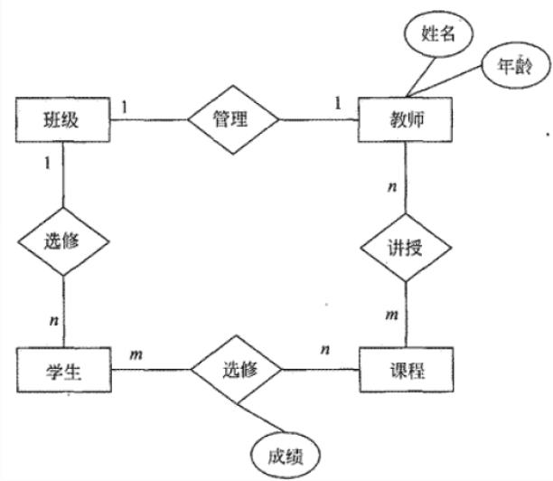
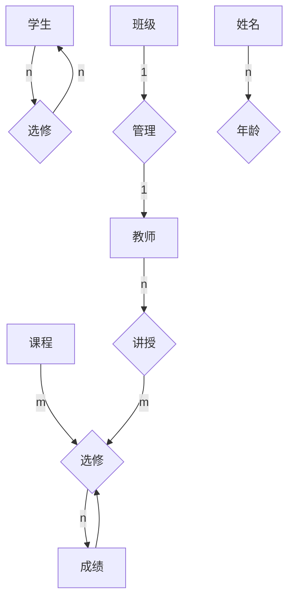
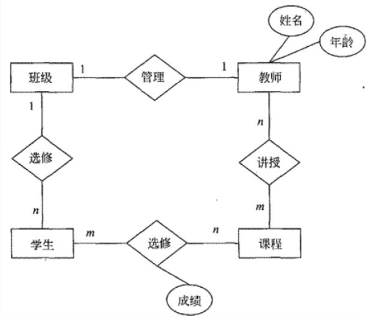
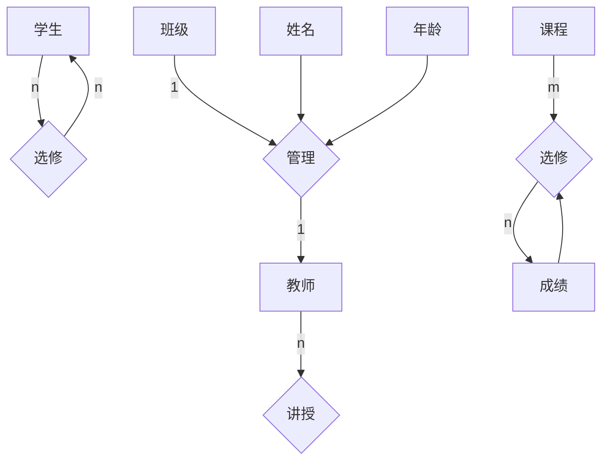
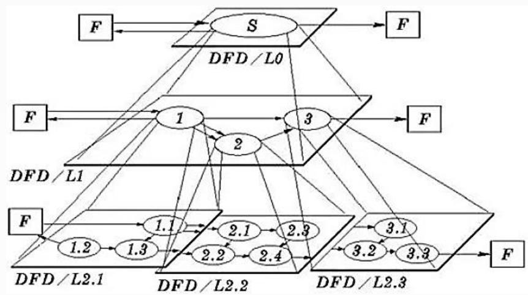
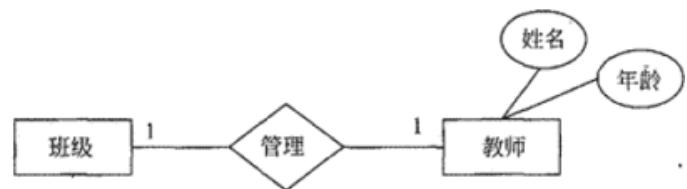
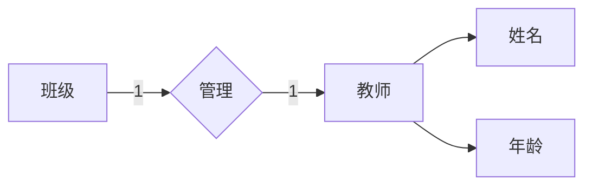
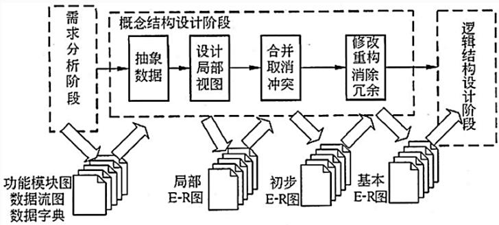
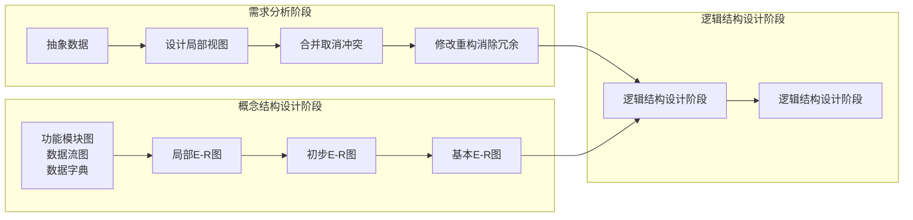

## 系统架构设计师

## 数据库设计(一)


## 第六章 数据库设计基础知识

6.1 数据库基本概念  
⚫ 6.2 关系数据库  
6.3 数据库设计  
6.4 应用程序与数据库的交互  
⚫ 6.5 NoSQL数据库

## 、数据库设计的基本步骤(阶段)

需求分析  
概念结构设计  
逻辑结构设计  
物理结构设计  
数据库实施  
数据库运行和维护

## 二、需求分析

数据需求分析是在项目确定之后，用户和设计人员对数据库应用系统所要涉及的内容(数据)和功能(行为)的整理和描述，是以用户的角度来认识系统。

这一过程是后续开发的基础，因为逻辑设计、物理设计以及应用程序的设计都会以此为依据，是最困难、最耗费时间的一步。

## 三、概念结构设计

概念结构设计的目标是产生反映系统信息需求的数据库概念结构，即概念模式。概念结构是独立于支持数据库的 DBMS 和使用的硬件环境的。设计人员从用户的角度看待数据以及数据处理的要求和约束，产生一个反映用户观点的概念模式，然后再把概念模式转换为逻辑模式。

我们采用E-R模型将现实世界的信息加以抽象，由实体属性，以及实体之间的联系(E-R 图)来描述。

## 1. E-R模型

实体：用矩形框表示，框内标注实体名称。  
⚫ 属性：用椭圆形表示，并用连线与实体连接起来。  
实体之间的联系：用菱形框表示，框内标注联系名称，并用连线将菱形框与有关实体相连，在连线上注明联系类型。



<details>
<summary>flowchart</summary>


</details>


## 2. 联系的类型

E-R图中的联系归结为三种类型：

一对一联系(1：1)  
一对多联系(1：n)  
多对多联系(m：n)



<details>
<summary>flowchart</summary>


</details>


3. 用E-R方法建立概念模型

(1) 选择局部应用  
(2) 逐一设计分E-R图  
(3) E-R图合并

## (1) 选择局部应用

数据流图是对业务处理过程从高层到底层的一级级抽象，高层抽象流图一般反映系统的概貌，对数据的引用较为笼统，而底层又可能过于细致，不能体现数据的关联关系，因此要选择适当层次的数据流图，让这一层的每一部分对应一个局部应用，实现某一项功能。从这一层入手，就能很好地设计分 E-R 图。



<details>
<summary>flowchart</summary>

```mermaid
graph LR
  subgraph Layer1["DFD / L0"]
  S["S"] --> F1["F"]
  S --> F2["F"]
  S --> F3["F"]
  S --> F4["F"]
  S --> DFD_L0["DFD / L0"]
  DFD_L0 --> S
  DFD_L0 --> F1
  DFD_L0 --> F2
  DFD_L0 --> F3
  DFD_L0 --> F4
  DFD_L1["DFD / L1"] --> 1["1"]
  DFD_L1 --> 2["2"]
  DFD_L1 --> 3["3"]
  DFD_L1 --> F1
  DFD_L1 --> F2
  DFD_L1 --> F3
  DFD_L1 --> F4
  DFD_L2["DFD / L2.2"] --> 1.2["1.2"]
  DFD_L2 --> 1.3["1.3"]
  DFD_L2 --> 1.1["1.1"]
  DFD_L2 --> 2.1["2.1"]
  DFD_L2 --> 2.3["2.3"]
  DFD_L2 --> 2.2["2.2"]
  DFD_L2 --> 2.4["2.4"]
  DFD_L2 --> 3.1["3.1"]
  DFD_L2 --> 3.2["3.2"]
  DFD_L2 --> 3.3["3.3"]
  DFD_L2 --> F1
  DFD_L2 --> F2
  DFD_L2 --> F3
  DFD_L2 --> F4
  F1 --> S
  F2 --> S
  F3 --> S
  F4 --> S
  S --> F1
  S --> F2
  S --> F3
  S --> F4
  S --> F5["F"]
  S --> F6["F"]
```
</details>


## (2) 逐一设计分E-R图

对于每一局部应用，其所用到的数据都已经收集在数据字典中了，依照该局部应用的数据流图，从数据字典中提取出数据，使用抽象机制，确定局部应用中的实体、实体的属性、实体标识符及实体间的联系和其类型，就设计出了分E-R图。

(3) E-R图合并

合并E-R图的目的在于在合并过程中解决分 E-R 图中存在的冲突，消除分 E-R 图之间存在的信息冗余，使之成为能够被全系统所有用户共同理解和接受的统一的、精炼的全局概念模型。

合并的方法：

将具有相同实体的两个或多个 E-R 图合二为一，在合成后的 E-R图中把相同实体用一个实体表示，合成后的实体的属性是所有分E-R 图中该实体的属性的并集。



<details>
<summary>flowchart</summary>


</details>


## 4. E-R图合并时的冲突：

⚫ 属性冲突 ：属性的类型、取值范围、数据单位的不一致。  
命名冲突：相同意义的属性，在不同的分 E-R 图上有着不同的命名(异名同义)，或是名称相同的属性在不同的分 E-R 图中代表着不同的意义(同名异义)。  
结构冲突 ：同一实体在不同的分 E-R 图中有不同的属性；同一对象在某一分 E-R 图中被抽象为实体，而在另一分 E-R 图中被抽象为属性。

例:在数据库设计的需求分析、概念结构设计、逻辑结构设计和物理结构设计的四个阶段中，基本E-R图是( )。

A.需求分析阶段形成的文档，并作为概念结构设计阶段的设计依据  
B.逻辑结构设计阶段形成的文档，并作为概念结构设计阶段的设

计依据

C.概念结构设计阶段形成的文档，并作为逻辑结构设计阶段的设计依据  
D.概念结构设计阶段形成的文档，并作为物理设计阶段的设计依据



<details>
<summary>flowchart</summary>


</details>

图12-8概念结构设计的工作步骤


## Thank You