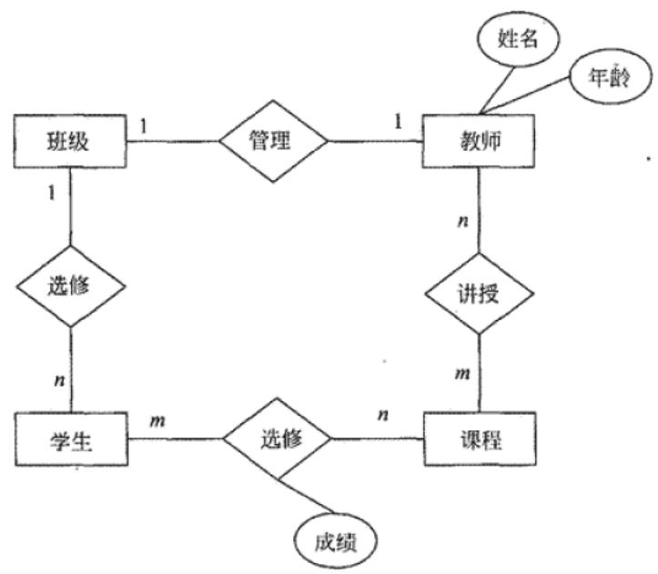
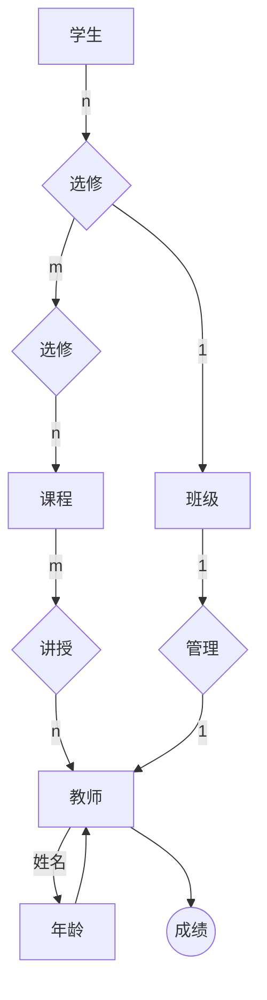
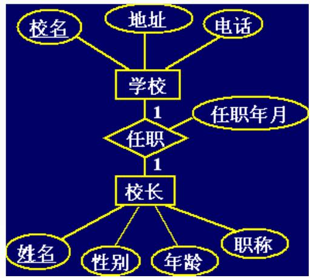
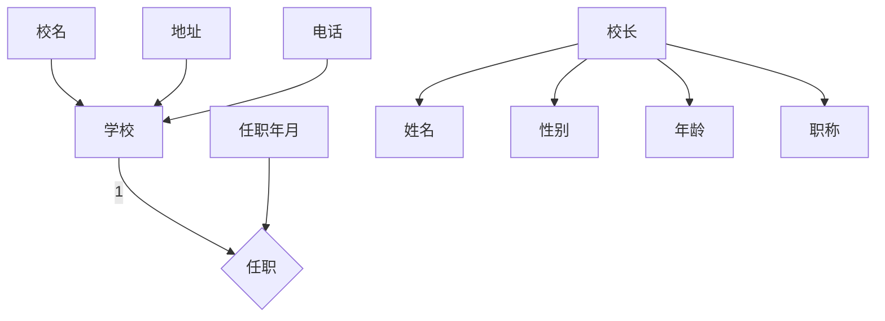
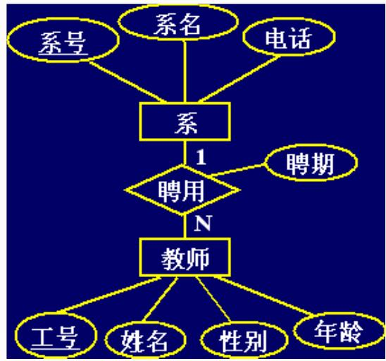
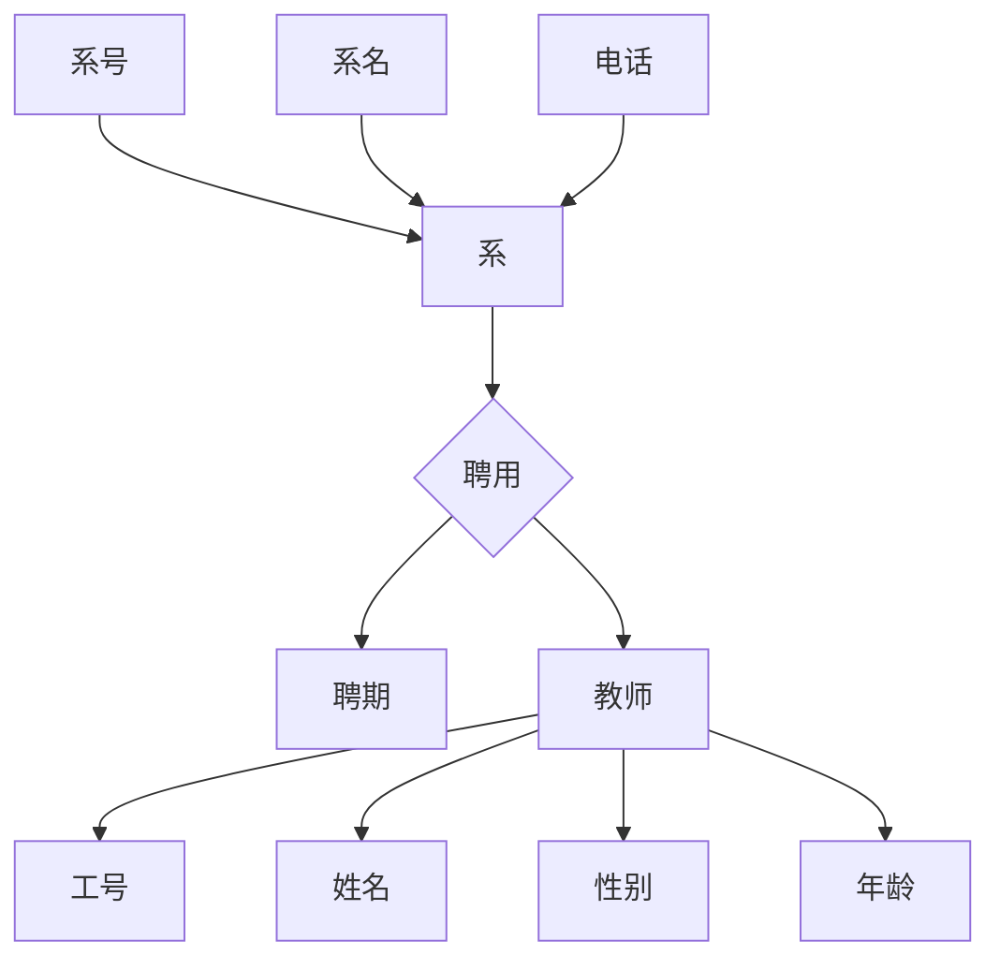
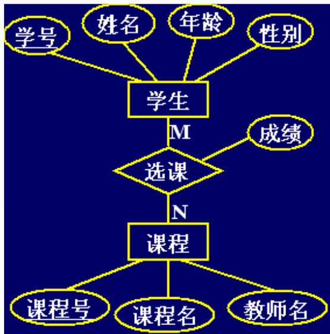
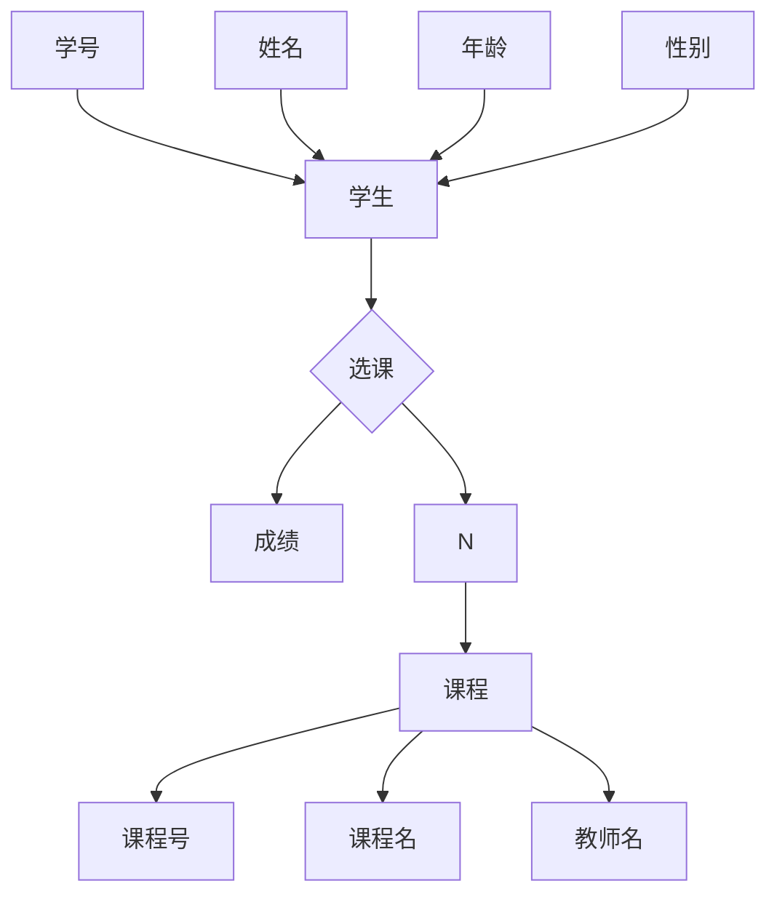
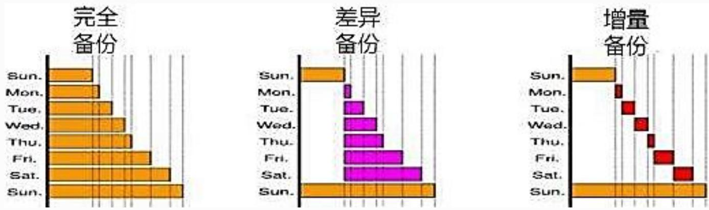

## 系统架构设计师

## 数据库设计(二)

## 第六章 数据库设计基础知识

6.1 数据库基本概念  
⚫ 6.2 关系数据库  
6.3 数据库设计  
6.4 应用程序与数据库的交互  
⚫ 6.5 NoSQL数据库

## 四、逻辑结构设计

逻辑结构设计就是在概念结构设计的基础上进行数据模型设计，可以是层次模型、网状模型和关系模型。

逻辑结构设计的步骤：

1.确定数据模型  
2.将 E-R 图转换成为指定的数据模型  
3.确定完整性约束  
4.确定用户视图

1.E-R图转换为关系模型

E-R图是由实体、属性和联系三要素构成，而关系模型中只有惟一的结构--关系模式。

采用以下方法加以转换：

(1)实体向关系模式的转换  
(2)联系向关系模式的转换

flowchart

## (1)实体向关系模式的转换

每个实体类型转换成一个关系模式  
实体属性即为关系模式的属性  
实体标识符即为关系模式的键

## 注意:

得到的关系模式，有些可能会扩充属性。

(2)联系向关系模式的转换

1：1 联系  
⚫ 1：n 联系  
⚫ m：n 联系

## (2)联系向关系模式的转换

## 1：1 联系

1：1联系，联系两端的实体类型转成两个关系模式，在任一个关系模式中加入另一个关系模式的键(作为外键)和联系的属性.

例：

学校(校名，地址，电话)  
校长(姓名，性别，年龄，职称，所在学校，任职年月)或  
学校(校名，地址，电话，校长姓名，任职年月)  
校长(姓名，性别，年龄，职称)

flowchart

## (2)联系向关系模式的转换

## 1：n 联系

1：n 联系，在N端实体类型转换成的关系模式中，加入1端实体类型的键(作为外键)和联系的属性。

例：

系(系号，系名，电话)  
教师(工号，姓名，性别，年龄，所有系号，聘期)

flowchart

## (2)联系向关系模式的转换

m：n 联系

m：n 联系，联系类型需转换为关系模式，属性为两端实体类型的键(分别作为外键)加上联系的属性，而键为两端实体键的组合。

例：

学生(学号，姓名，年龄，性别)  
课程(课程号，课程名，教师名)  
选课(学号， 课程号，成绩)

flowchart

## 2. 关系模式的规范化

由E-R图转换得来的初始关系模式并不完全符合要求，还会有数据冗余或更新异常存在，需要经过进一步的规范化处理。

## 步骤如下：

①根据语义确定各关系模式的数据依赖。  
②根据数据依赖确定关系模式的范式。  
③如果关系模式不符合要求，要根据关系模式的分解算法对其进行分解，达到3NF、BCNF或4NF。  
④关系模式的评价及修正。

## 3. 确定完整性约束

根据规范化理论确定了关系模式之后，还要对关系模式加以约束，包括数据项的约束、表级约束及表间约束。可以参照SQL标准来确定不同的约束，如检查约束、主码约束以及参照完整性约束，以保证数据的正确性。

## 4. 用户视图的确定

根据数据流图及用户信息建立视图模式，提高数据的安全性和独立性。

根据数据流图确定处理过程使用的视图  
根据用户类别确定不同用户使用的视图

## 5.反规范化

反规范化是加速读操作性能(数据检素)的方法，通过有选择地在数据结构标准化后添加特定的冗余数据来增加查询效率。

常见的反规范化操作有：冗余列、派生列、表重组和表分割，其中表分割又分为水平分割和垂直分割。

反规范化会带来冗余数据不一致问题，常采用数据同步的方法来解决。方法有：应用程序同步、批量处理同步和触发器同步等。

<table><tr><td>员工号</td><td>姓名</td><td>性别</td><td>部门号</td><td>年龄</td><td>联系电话</td></tr><tr><td>20120101</td><td>张龙贵</td><td>男</td><td>01</td><td>35</td><td>131**01</td></tr><tr><td>20120102</td><td>唐国威</td><td>男</td><td>02</td><td>38</td><td>135**43</td></tr><tr><td>20120103</td><td>李维一</td><td>男</td><td>03</td><td>41</td><td>188**06</td></tr><tr><td>20120104</td><td>王水生</td><td>男</td><td>03</td><td>28</td><td>136**07</td></tr><tr><td>20120105</td><td>李维一</td><td>女</td><td>04</td><td>36</td><td>136**21</td></tr></table>

<table><tr><td>部门号</td><td>部门名</td><td>部门简介</td><td>部门电话</td></tr><tr><td>01</td><td>研发部</td><td>研发部是**</td><td>136**61</td></tr><tr><td>02</td><td>产品部</td><td>产品部是**</td><td>133**23</td></tr><tr><td>03</td><td>销售部</td><td>销售部是**</td><td>138**06</td></tr><tr><td>04</td><td>设计部</td><td>设计部是**</td><td>133**21</td></tr></table>

<table><tr><td>编号</td><td>姓名</td><td>语文</td><td>数学</td><td>英语</td><td>历史</td><td>地理</td><td>生物</td></tr><tr><td>1</td><td>郭思懿</td><td>92</td><td>86</td><td>98</td><td>76</td><td>95</td><td>80</td></tr><tr><td>2</td><td>翟若冰</td><td>82</td><td>80</td><td>98</td><td>75</td><td>74</td><td>62</td></tr><tr><td>3</td><td>李倩怡</td><td>82</td><td>75</td><td>97</td><td>80</td><td>81</td><td>61</td></tr></table>

## 五、物理结构设计

物理结构设计就是为逻辑数据模型选取一个最适合应用环境的物理结构（包括存储结构和存取方法）。

物理结构设计的主要工作步骤：

确定数据分布  
存储结构  
访问方式

## 六、数据库实施

运用DBMS提供的数据库语言(如SQL)及宿主语言，根据逻辑设计和物理设计的结果，在计算机上建立起实际的数据库结构，数据加载(装入)，进行试运行和评价的过程，叫数据库的实施(实现)。

包括以下三个步骤：

建立数据库结构  
数据加载(组织数据入库)  
试运行和评价

## 七、数据库运行维护

数据库维护工作的主要内容：

数据库性能的监测和改善  
数据库备份及故障恢复  
数据库重组和重构

## 1.数据库备份及故障恢复

数据备份是指为防止系统出现操作失误或系统故障导致数据丢失，而将全部或部分数据集合从应用主机的硬盘或阵列复制到其它的存储介质的过程。

## 备份可分为：

冷备份（静态备份）是在数据库正常关闭的情况下进行的，所以备份过程中不允许对数据库进行任何存取、修改活动。  
热备份（动态备份）热备份是指备份期间允许对数据库进行存取或修改，即备份和用户事务可以并发执行。

## 按备份的内容分类

完全备份：备份全部文件，并不依赖文件的存档属性来确定备份那些文件。  
差分备份：备份自上一次完全备份以来变化过的文件。  
增量备份：备份上一次备份后（无论是哪种备份），所有发生变化的文件。

## 日志文件的作用

故障恢复必须用日志文件。  
在动态备份方式中必须建立日志文件，备份和日志文件综合起来才能有效地恢复数据库。

例.假设系统中有正在运行的事务，若要转储全部数据库，则应采用( )方式。

A.静态全局转储  
B.动态增量转储  
C.静态增量转储  
D.动态全局转储

## Thank You