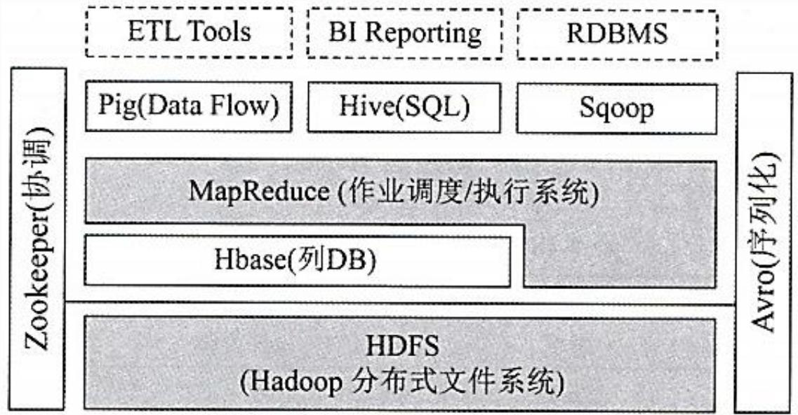

## 系统架构设计师

## 之

## 应用程序与数据库的交互


## 第六章 数据库设计基础知识

6.1 数据库基本概念  
⚫ 6.2 关系数据库  
⚫ 6.3 数据库设计  
⚫ 6.4 应用程序与数据库的交互  
⚫ 6.5 NoSQL数据库

应用系统中，用户不能直接访问后台的数据库，需要高级程序语言来完成与用户之间的交互，因此数据库管理系统需要提供程序级别的接口来访问数据。

常见的应用程序与数据库的交互方式：

库函数，如Oracle的OCI(Oracle调用接口)。  
嵌入式 SQL，将SQL语句直接写入某种高级程序语言。  
通用数据接口标准，如ODBC、JDBC、DAO、RDO、ADO等。  
对象关系映射 (ORM)，是一种为了解决面向对象与关系数据库不匹配的技术。就是将Java中的对象与数据库中的表关联对应起来。 高级项目经理 

## 第六章 数据库设计基础知识

6.1 数据库基本概念  
⚫ 6.2 关系数据库  
⚫ 6.3 数据库设计  
6.4 应用程序与数据库的交互  
⚫ 6.5 NoSQL数据库

常见的NoSQL数据库按存储方式，可分为文档存储、键值存储、列存储和图存储。

表9-3NoSQL数据库的分类与特点

<table><tr><td>分类</td><td>典型产品</td><td>应用场景</td><td>优点</td><td>缺点</td></tr><tr><td>文档存储</td><td>MongoDB、CouchDB</td><td>Web应用,存储面向文档和半结构化数据</td><td>结构灵活,可以根据 value 构建索引</td><td>缺乏统一的查询语法;无事务处理能力</td></tr><tr><td>键值存储</td><td>Memcached、Redis</td><td>内容缓存,如会话、配置文件、参数等</td><td>扩展性好,灵活性强,大量操作时性能高</td><td>数据无结构化,通常被当成字符串或者二进制数据,通过键查询值</td></tr><tr><td>列存储</td><td>Bigtable、HBase、Cassandra</td><td>分布式数据存储和管理</td><td>可扩展性强,查找速度快,复杂性低</td><td>功能局限;不支持事务的强一致性</td></tr><tr><td>图存储</td><td>Neo4j、OrientDB</td><td>社交网络、推荐系统、专注于构建系统图谱</td><td>支持复杂的图形算法</td><td>复杂性高,只能支持一定的数据规模</td></tr></table>


## 一、文档存储

在文档存储中，文档可以很长，很复杂，无结构，可以是任意结构的字段，并且数据具有物理和逻辑上的独立性，这就和具有高度结构化的表存储(关系型数据库的主要存储结构)有很大的不同，而最大的不同则在于它不提供对参数完整性和分布事务的支持。

表9-4文档型数据库用语

<table><tr><td>关系型数据库用语</td><td>数据库</td><td>表</td><td>记录</td></tr><tr><td>文档型数据库用语</td><td>数据库</td><td>集合</td><td>文档</td></tr></table>


## 当前主流的文档型数据库：

表9-5文档存储型数据库

<table><tr><td>名称</td><td>查询语言</td><td>注释</td></tr><tr><td>BaseX</td><td>Xquery, Java</td><td>XML型数据库</td></tr><tr><td>CouchDB</td><td>Erlang</td><td></td></tr><tr><td>MongoDB</td><td>C++</td><td>JSON型数据库</td></tr><tr><td>Lotus Notes</td><td>LotusScript, Java, others</td><td>多键值</td></tr><tr><td>MarkLogic Server</td><td>Xquery</td><td>XML型数据库</td></tr></table>


## 1.文档数据库MongoDB

MongoDB是一个基于分布式文件存储的数据库，它的最大特点就是无表结构。在保存数据和数据结构的时候，会把数据和数据结构都完整地以BSON的形式保存起来，并把它作为值和特定的键进行关联。正是由于这种设计，使得它不需要表结构，而被称为文档型数据库。


## MongoDB的特征：

高性能：提供JSON、XML等可嵌入数据快速处理功能；提供文档的索引功能，大大提高了查询速度。  
⚫ 丰富的查询语言：为数据聚合、结构文档，地理空间提供丰富的查询功能。  
高可用性：提供数据冗余处理和故障自动转移的功能。  
水平扩展能力：通过集群将数据分布到多台机器，而不是只提升单个节点的性能。具体处理分为主从和权衡两种处理模式。


## 二、键值存储

键值存储使用简单的键值方法来存储数据。键值数据库将数据存储为键值对集合，其中键作为唯一标识符。键和值都可以是从简单对象到复杂复合对象的任何内容。

表9-9键值存储的示例

<table><tr><td>类型</td><td>键</td><td>值</td></tr><tr><td>图片名称</td><td>123.BMP</td><td>Binary image file</td></tr><tr><td>网页 URL</td><td>http://www.google.com</td><td>HTML of a web page</td></tr><tr><td>文件路径名</td><td>C:/usr/Zhang/file1.doc</td><td>WORD document</td></tr><tr><td>MD5 哈希</td><td>8089e36d6iojfej2ofeif93089r0930r</td><td>This is a test.</td></tr><tr><td>REST Web 服务调用</td><td>View-person?person-id=123&amp;format=xml</td><td>123</td></tr><tr><td>SQL 查询</td><td>SELECT * FROM STUDENT</td><td>*</td></tr></table>


## 1.数据操作方式

键值存储中存在三种操作：put、get 和 delete。开发者使用put、get 和 delete函数访问和操作键值存储:

put(\$key as xs:string, \$value as item())对表添加一个新的键值对，并且当键存在时，更新键对应的值。  
get(\$key as xs:string) as item()根据给出的任意键返回键对应的值，如果键值存储中没有该键，将返回一个错误信息。  
delete(\$key as xs:string)将键和对应的值从表中删除，如果键值存储中没有该键，将返回一个错误信息。 

## 2.数据保存方式

临时性保存类型：这类数据库把数据都保存在内存中，读和写速度非常快，但当数据库停止或机器重启后，数据就不存在了。  
永久性保存类型：这类数据库把数据保存在硬盘上。由于牵扯到对硬盘的IO操作，所以读写性能慢，优势是不会丢失数据。  
两者兼具型：兼具临时性保存和永久性保存的优点。如Redis系统，它首先把数据存在内存中，在内存中进行读和写操作。在满足特定条件时，将数据写入到硬盘保存。既确保了内存中数据处理的高速性，又通过写入硬盘来保证数据的永久性。 <sub></sub>

## 3.键值存储产品

键值存储产品主要有：亚马逊的Memcached、Redis、 Dynamo、Project Voldemort、Tokyo Tyrant、Riak、 Scalaries 等。


## (1)Memcached

Memcached 属于临时性保存类型，是高性能的分布式内存对象缓存系统。通过缓存数据库查询结果，减少数据库访问次数，以提高动态 Web应用的速度、提高可扩展性。

Memcached 常作为数据库前段 Cache 使用。因为它比数据库少了很多 SQL解析、磁盘操作等开销，而且它是使用内存来管理数据的，所以它可以提供比直接读取数据库更好的性能。

Memcached 也常作为服务器直接数据共享的存储媒介，例如

SSO 系统中保持系统单点登录状态的数据就可以保持在

Memcached中，被多个应用共享。


## (2)Redis

Redis是一种主要基于内存存储和运行，能够快速响应的键值数据库，属于临时和永久兼具类型，有点像 Memcached，整个数据库系统加载在内存当中进行操作，但是通过定期异步操作把数据库数据flush到硬盘上进行保存。因为是纯内存操作，Redis的性能非常出色，每秒可以处理超过10万次读写操作。

其主要缺点是数据库容易受到物理内存的限制，不能用作海量数据的高性能读写，并且它没有原生的可扩展机制，不具有扩展能力，


要依赖客户端来实现分布式读写，因此 Redis 适合的场景主要局限在较小数据量的高性能操作和运算上。

表9-10传统关系型数据库和MongoDB、Redis的比较

<table><tr><td>比较内容</td><td>传统关系型数据库</td><td>MongoDB</td><td>Redis</td></tr><tr><td>读写速度</td><td>一般。基于硬盘读写, 约束很强</td><td>较快。基于内存读写, 约束很弱</td><td>最快。主要基于内存读 写,约束弱</td></tr><tr><td>应用范围</td><td>最广,不能很好处理大数据和高并发访问</td><td>互联网应用为主,可以 处理大数据和高并发 访问</td><td>互联网特定应用为主, 擅长处理高响应和高并发的访问的数据</td></tr></table>


## 三、列存储

面向列的数据库是以列作为单位来进行数据的存储的，擅长进行以列为单位的数据处理。

列存储数据库主要有Google的Bigtable、由Bigtable衍生的Hypertable和HBase、 Cassandra。

表9-16面向行和面向列的数据库比较

<table><tr><td>类型</td><td>数据存储方式</td><td>特点</td></tr><tr><td>面向行的数据库</td><td>以行为单位进行存储</td><td>对少量行进行数据读取和更新</td></tr><tr><td>面向列的数据库</td><td>以列为单位进行存储</td><td>对大量行少数列进行读取,对所有行的指定列进行同时更新</td></tr></table>

## 1.HBase

HBase(Hadoop Database)是一个高可靠性、高性能、面向列、可伸缩的分布式存储系统，利用HBase技术可在廉价PC Server 上搭建起大规模结构化存储集群。



<details>
<summary>flowchart</summary>

```mermaid
graph LR
  subgraph Zookeeper(协调)
  A["Zookeeper"] --> B["MapReduce (作业调度/执行系统)"]
  A --> C["Hbase(列DB)"]
  C --> D["HDFS\n(Hadoop 分布式文件系统)"]
  end

  subgraph Avro(序列化)
    E["ETL Tools"] -.-> F["BI Reporting"]
    G["RDBMS"] -.-> H["Pig(Data Flow)"]
    I["Hive(SQL)"] -.-> J["Sqoop"]
  end
```
</details>

图9-6Hadoop EcoSystem各层系统


## 四、图存储

图存储是一个包含一连串的节点和关系的系统，当它们结合在一起时，就构成了一个图。图存储有三个字段：节点、关系和属性。

图数据库对于那些对象之间具有复杂关系的业务问题很有用，如社交网路、规则引擎、生成组合和那些需要快速分析复杂网络结果并从中找出模式的图系统。

表9-20常见的图数据库

<table><tr><td>名称</td><td>查询语言</td><td>注释</td></tr><tr><td>AllegroGraph</td><td>SPARQL</td><td>RDF GraphStore</td></tr><tr><td>DEX</td><td>Java, C#</td><td>High-performance Graph Database</td></tr><tr><td>Neo4j</td><td>Java</td><td>—</td></tr><tr><td>FlockDB</td><td>Scala</td><td>—</td></tr></table>


## 五、其它存储模式

## 1.多值数据库

多值数据库系统提供了一个通用的数据集成与访问平台，屏蔽了现有各数据库系统不同的访问方法和用户界面，给用户呈现出一个访问多种数据库的公共接口。

常见的多值数据库有Rocket U2、Extensible Storage Engin(ESE/NT)、 OpenInsight 和OpenQM等。


## 2.时间序列与流数据库

时间序列数据库是指具有处理时间序列数据，能对时间数据数组建立索引的优化数据库系统。

流数据库又被称为实时数据库，是一种使用实时处理数据的方式来处理状态不断变化的数据库系统。对时间序列的数据库提出实时的处理要求，那么时间数据库就是流数据库。例如股票的价格、自动驾驶汽车的数据曲线等都需要实时计算处理，此时流数据库发挥巨大作用。

常见的时间序列数据库：InfluxDB、OpenTSDB。


## 3.网格和云数据库

网格和云数据库(Grid & Cloud Database)是基于网格计算或者云计算的数据库。

云计算是一种随需计算或者效用计算，允许用户无需了解底层IT基础设施架构，就能通过互联网访问各种基于IT资源的服务。  
网格计算可以理解为“虚拟超级计算机”，以松耦合的方式将大量的计算资源连接在一起提供单个计算资源无法完成的计算能力。

主流数据库产品：GridGain和CrateDB。


## Thank You