## 系统架构设计师

## 软件架构概念


## 第七章 系统架构设计基础知识

7.1 软件架构概念  
7.2 基于架构的软件开发方法  
7.3 软件架构风格  
7.4 软件架构复用  
7.5 特定领域软件体系结构

## 软件架构的定义

软件架构是指在一定的设计原则基础上，从不同角度对组成系统的各部分进行搭配和安排，形成系统的多个结构而组成架构，它包括该系统的各个构件，构件的外部可见属性及构件之间的相互关系。

软件架构是保证软件质量的根本措施。

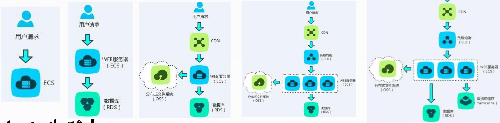

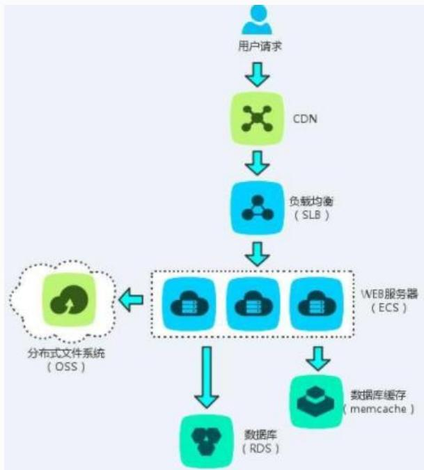

<details>
<summary>flowchart</summary>

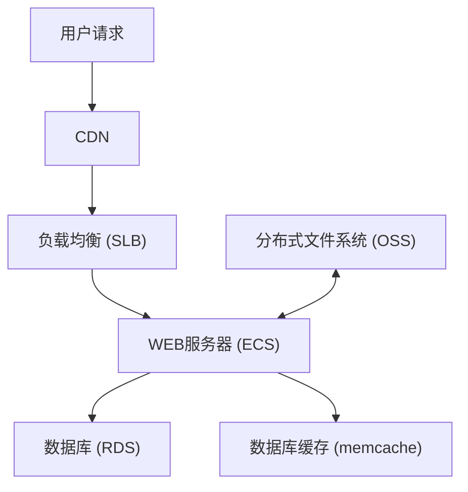
</details>


## 二、软件架构设计与生命周期

1.需求分析阶段  
2.设计阶段  
3.实现阶段  
4.构件组装阶段  
5.部署阶段  
6.后开发阶段

## 三、软件架构的作用

架构设计能满足系统的品质  
架构设计使受益人达成一致的目标  
架构设计能够支持计划编制过程  
架构设计对系统开发的指导性  
架构设计能有效地管理复杂性  
架构设计为复用奠定基础  
架构设计能够降低维护费用  
架构设计能够支持冲突分析

## 第七章 系统架构设计基础知识

7.1 软件架构概念  
7.2 基于架构的软件开发方法  
7.3 软件架构风格  
7.4 软件架构复用  
7.5 特定领域软件体系结构

## 一、体系结构的设计方法(ABSD)概述

ABSD方法是由体系结构驱动的。即指构成体系结构的商业、和功能需求的组合驱动的。

ABSD 方法有3个基础：

基础功能的分解。在功能分解中，ABSD 方法使用已有的基于模块的内聚和耦合技术。  
通过选择体系结构风格来实现质量和商业需求  
软件模板的使用，软件模板包括描述所有这种类型的元素在共享服务和底层构造的基础上如何进行交互。 高级项目经理

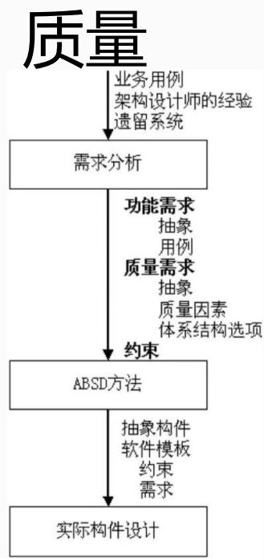

<details>
<summary>flowchart</summary>

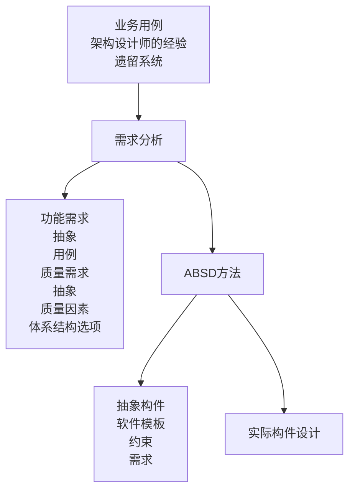
</details>

## 二、概念与术语

## 1.设计元素

ABSD 方法是一个自顶向下，递归细化的方法，软件系统的体系结构通过该方法得到细化直到能产生软件构件和类。在最顶层，系统被分解为若干概念子系统和一个或若干个软件模板。在第2层，概念子系统又被分解成概念构件和一个或若个附加软件模板。

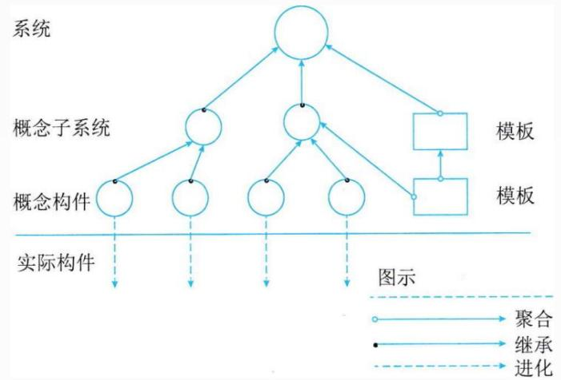

<details>
<summary>flowchart</summary>

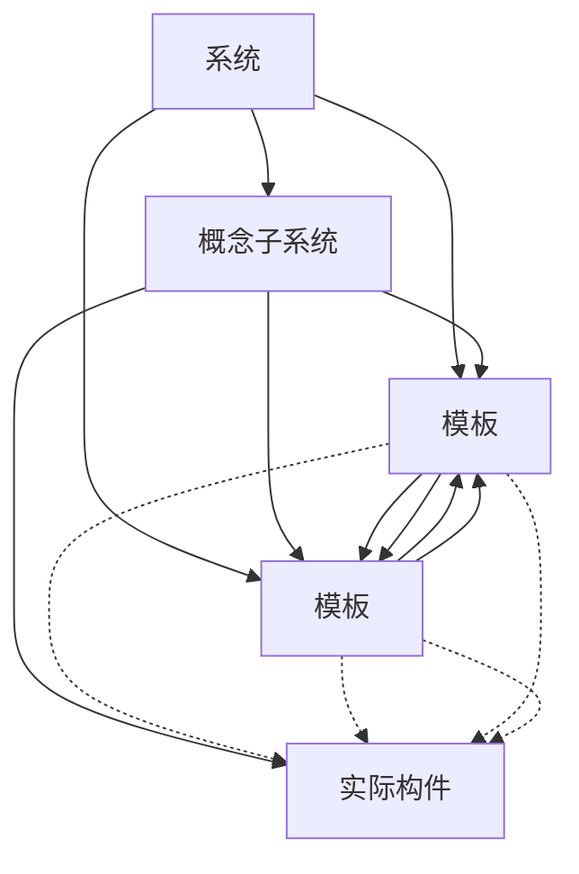
</details>


例：基于体系结构的软件设计(Architecture-Based Software Design，ABSD)方法是体系结构驱动，即指构成体系结构的( )的组合驱动的。ABSD方法是一个自顶向下、递归细化的方法，软件系统的体系结构通过该方法得到细化，直到能产生( )。

A.产品、 功能需求和设计活动  
B.商业、质量和功能需求  
C.商业、产品和功能需求  
D.商业、质量和设计活动

A.软件产品和代码

B.软件构件和类

C.软件构件和连接件

D.类和软件代码

## 2.视角与视图

考虑体系结构时，要从不同的视角来观察对架构的描述，这需要软件设计师考虑体系结构的不同属性。例如，展示功能组织的静态视角能判断质量特性，展示并发行为的动态视角能判断系统行为特性，因此，选择的特定视角或视图(如逻辑视图、进程视图、实现视图和配置视图)可以全方位的考虑体系结构设计。使用逻辑视图来记录设计元素的功能和概念接口，设计元素的功能定义了它本身在系统中的角色，这些角色包括功能、性能等。


## 3.用例和质量场景

用例是系统给予用户一个结果值的功能点，用例用来捕获功能需求。在使用用例捕获功能需求的同时，人们通过定义特定场景来捕获质量需求，并称这些场景为质量场景。这样一来，在软件开发过程中，人们使用质量场景捕获变更、性能、可靠性和交互性，分别称之为变更场景、性能场景、可靠性场景和交互性场景。

质量场景必须包括预期的和非预期的场景。例如，一个预期的性能场景是估计每年用户数量增加 10% 的影响，一个非预期的场景是估计每年用户数量增加 100% 的影响。非预期场景可能不会真正实现，但它在决定设计的边界条件时很有用。 高级项目经理 任

## 三、基于体系结构的开发模型

1.体系结构需求  
2.体系结构设计  
3.体系结构文档化  
4.体系结构复审  
5.体系结构实现  
6.体系结构演化

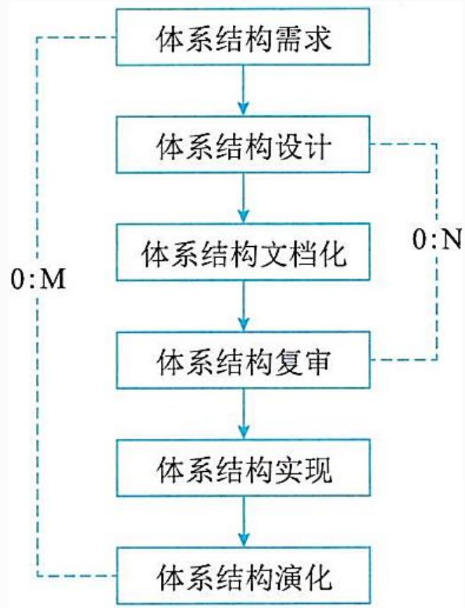

<details>
<summary>flowchart</summary>

```mermaid
graph TD
  A["体系结构需求"] --> B["体系结构设计"]
  B --> C["体系结构文档化"]
  C --> D["体系结构复审"]
  D --> E["体系结构实现"]
  E --> F["体系结构演化"]
  subgraph sg_0_M_0_M["0:M [\"0:M\"]"]
    A
    B
    C
    D
    E
    F
  end
  subgraph sg_0_N_0_N["0:N [\"0:N\"]"]
    B
    D
    E
    F
  end
```
</details>


## 1. 体系结构需求

需求过程主要是获取用户需求，标识系统中要用到的构件。架构需求分为需求获取、标识构件和需求评审3个步骤。

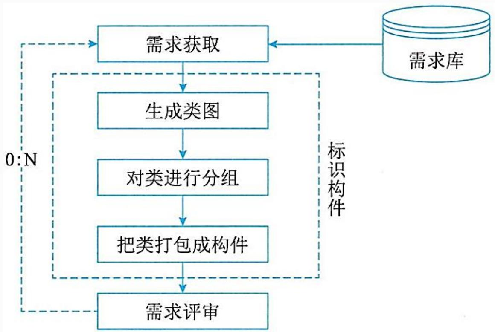

<details>
<summary>flowchart</summary>

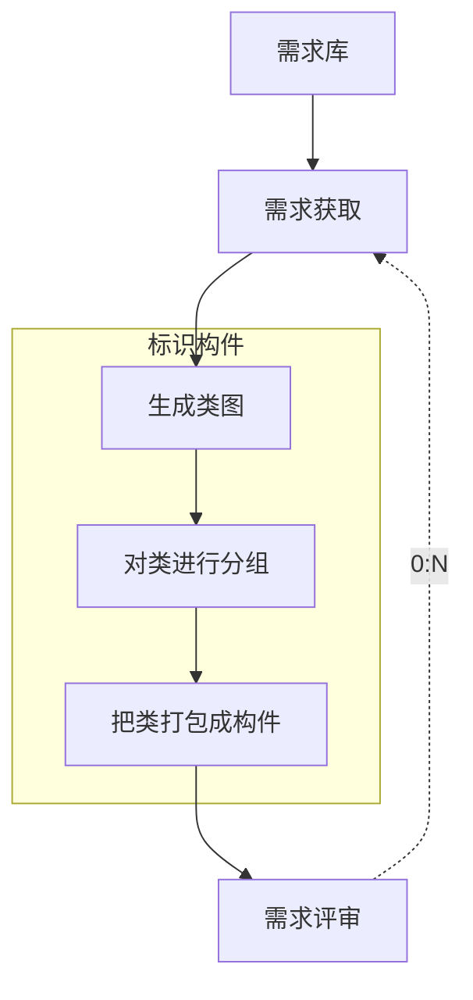
</details>


## 2. 体系结构设计

体系结构设计是一个迭代过程，分为提出软件架构模型、把已标识的构件映射到软件架构中、分析构件之间的相互作用、产生软件体系结构及设计评审。

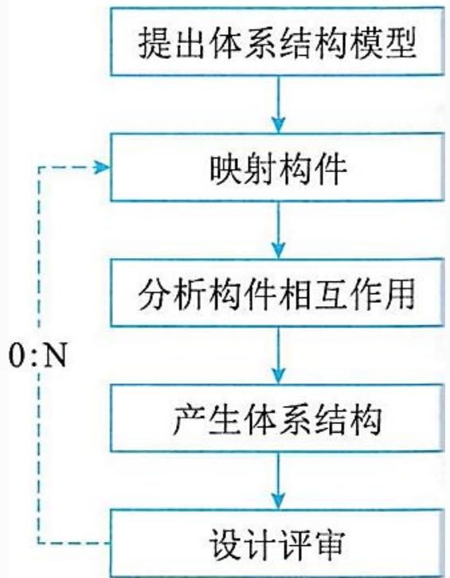

<details>
<summary>flowchart</summary>

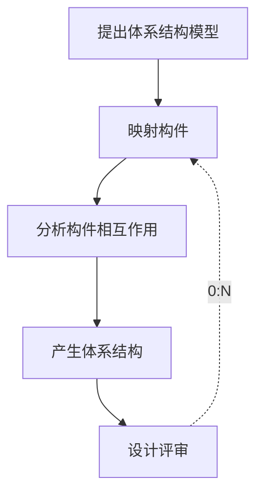
</details>


## 3. 体系结构文档化

文档是在系统演化的每个阶段，系统设计与开发人员的通信媒介，是为验证体系结构设计和提炼或修改这些设计 (必要时)所执行预先分析的基础。

体系结构文档化过程主要输出架构需求规格说明和测试架构需求的质量设计说明书。

## 4. 体系结构复审

体系结构设计、文档化和复审是一个迭代过程。

复审由外部人员（用户代表和领域专家）进行。

复审的目的是标识潜在的风险，及时发现体系结构设计中的缺陷和错误，包括体系结构能否满足需求、质量需求是否在设计中得到体现、层次是否清晰、构件的划分是否合理、文档表达是否明确、构件的设计是否满足功能与性能的要求等。

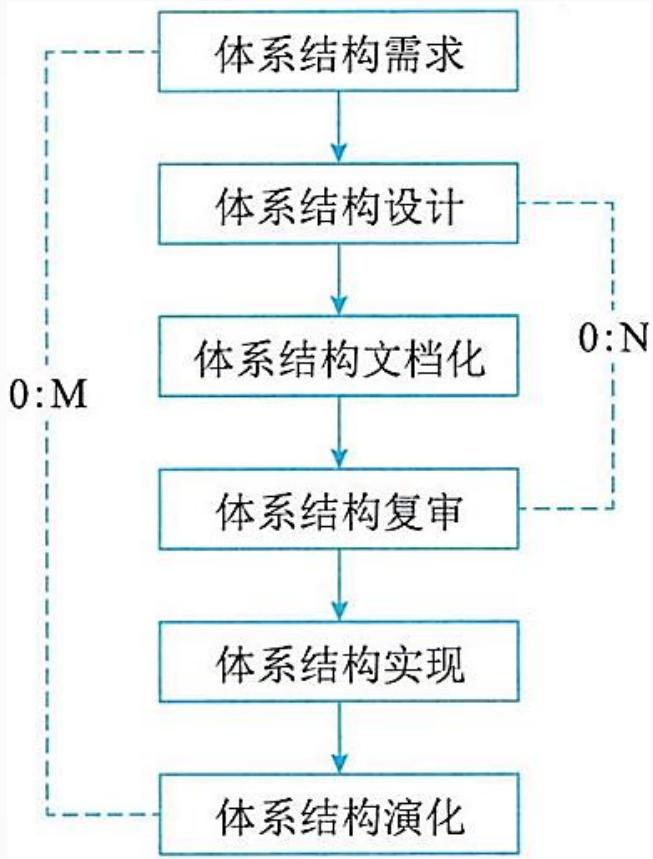

<details>
<summary>flowchart</summary>

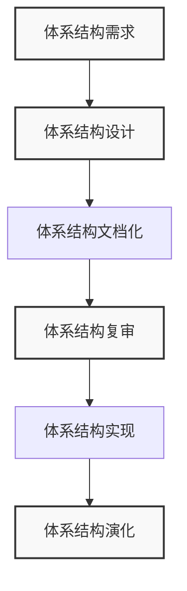
</details>


## 5. 体系结构实现

实现的过程以复审后的文档化的架构说明书为基础，在架构说明书中，已经定义了系统中的构件及它们间的关系，可以从构件库中查找符合接口约束的构件，必要时开发新的满足要求的构件。然后，按照设计提供的结构，通过组装支持工具把这些构件的实现体组装起来，完成整个软件系统的连接与合成。

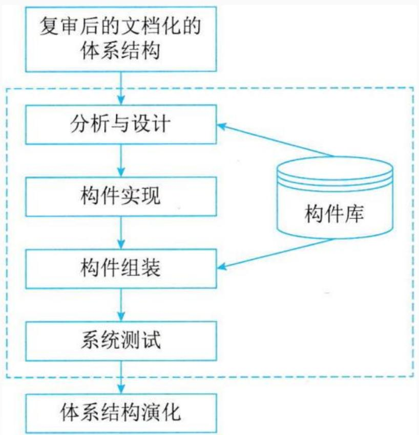

<details>
<summary>flowchart</summary>

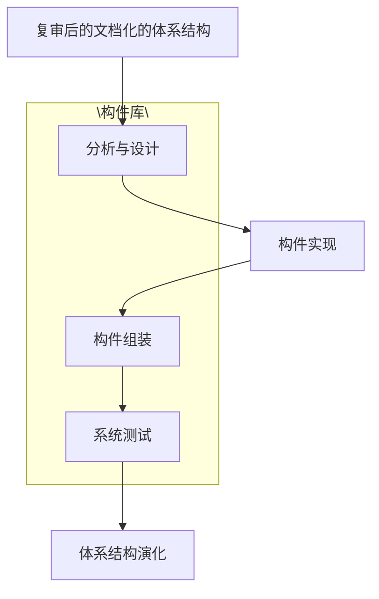
</details>


## 6. 体系结构的演化

在构件开发过程中，用户的需求可能会有变动，需要相应地修改软件体系结构，以适应已发生变化的软件需求。

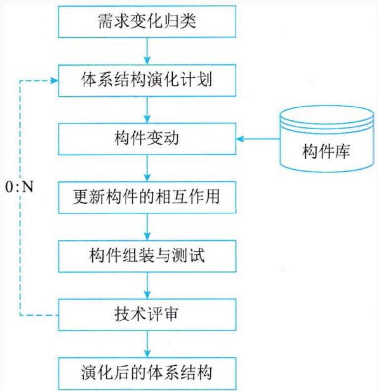

<details>
<summary>flowchart</summary>

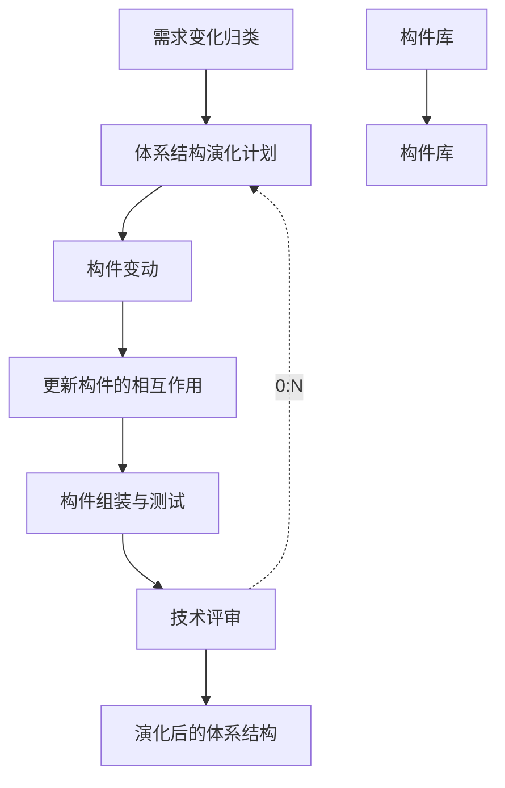
</details>


## Thank You