## 系统架构设计师

## 软件架构风格

## 第七章 系统架构设计基础知识

7.1 软件架构概念  
7.2 基于架构的软件开发方法  
7.3 软件架构风格  
7.4 软件架构复用  
7.5 特定领域软件体系结构

## 一、 架构风格概述

架构风格是描述某一特定应用领域中系统组织方式的惯用模式。架构风格定义一个系统家族，即一个架构定义一个词汇表和一组约束。词汇表包含一些构件和连接件类型，约束指出系统是如何将这些构件和连接件组合起来的。

架构风格反映了领域中众多系统所共有的结构和语义特性，并指导如何将各个模块和子系统有效地组织成一个完整的系统。

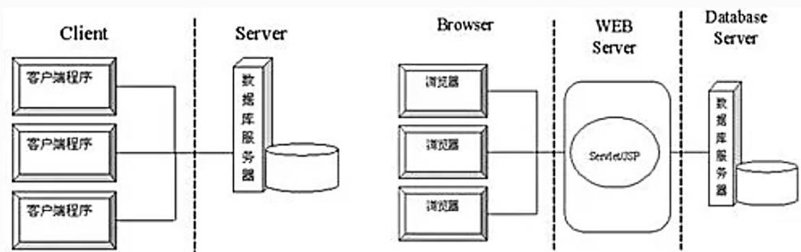

flowchart

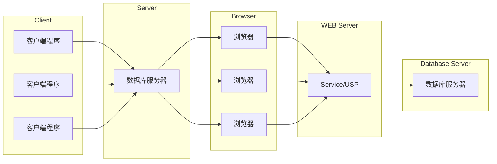

## 通用架构风格的分类如下：

(1)数据流风格：批处理序列；管道/过滤器。  
(2)调用/返回风格：主程序/子程序；面向对象风格；层次结构；客户端/服务器。  
(3)独立构件风格：进程通信；事件系统。  
(4)虚拟机风格：解释器；基于规则的系统。  
(5)仓库风格：数据库系统；超文本系统；黑板系统。

## 二、数据流体系结构风格

## 1.批处理体系结构风格

在批处理风格的软件体系结构中，每个处理步骤是一个单独的程序，每一步必须在前一步结束后才能开始，并且数据必须是完整的，以整体的方式传递。它的基本构件是独立的应用程序，连接件是某种类型的媒介。连接件定义了相应的数据流图，表达拓扑结构。

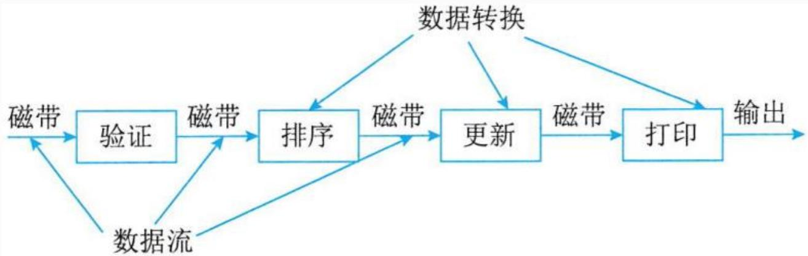

flowchart

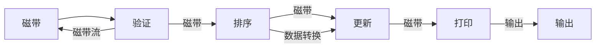

例：软件体系结构风格是描述某一特定应用领域中系统组织方式的惯用模式，其中，在批处理风格软件体系结构中，每个处理步骤是一个单独的程序，每一步必须在前一步结束后才能开始，并且数据必须是完整的，以( )的方式传递。基于规则的系统包括规则集、规则解释器、规则/数据选择器及( )。

A.迭代

B.整体

C.统一格式

D.递增

A.解释引擎

B.虚拟机

C.数据

D.工作内存

## 2.管道-过滤器体系结构风格

当数据源源不断地产生，系统就需要对这些数据进行若干处理(分析、计算、转换等)。解决方案是把系统分解为几个序贯的处理步骤，步骤之间通过数据流连接，一个步骤的输出是另一个步骤的输入。每个处理步骤由一个过滤器(Fiter)实现，处理步骤间的数据传输由管道(Pipe)负责。每个处理步骤(过滤器)都有一组输入和输出，过滤器从管道中读取输入的数据流，经过内部处理，然后产生输出数据流并写入管道中。管道-过滤器风格的基本构件是过滤器。典型的管道/

过滤器体系结构的例子：

①UNIX Shell编写的程序  
②传统的编译器

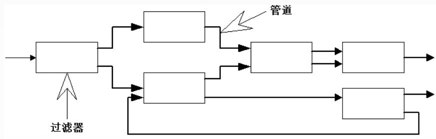

flowchart

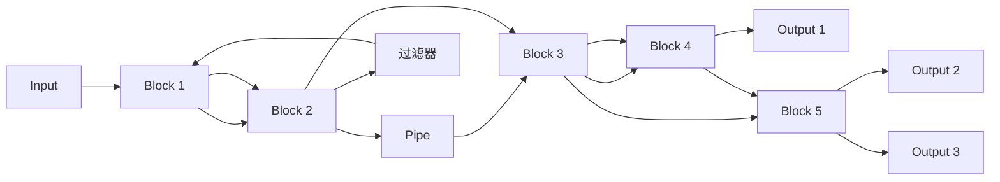

## 三、调用/返回体系结构风格

调用/返回风格是指在系统中采用了调用与返回机制。利用调用-返回实际上是一种分而治之的策略，主要思想是将一个复杂的大系统分解为若干子系统，以便降低复杂度，并且增可修改性。调用/返回体系结构风格主要包括：

主程序/子程序风格  
面向对象风格  
层次风格  
客户端/服务器风格

## 1.主程序/子程序风格

主程序/子程序风格一般采用单线程控制，把问题划分为若干处理步骤，构件即为主程序和子程序。子程序通常可合成为模块。过程调用作为交互机制，即充当连接件。调用关系具有层次性，其语义逻辑表现为主程序的正确性取决于它调用的子程序的正确性。

## 2.面向对象风格

面向对象风格建立在数据抽象和面向对象的基础上，数据的表示方法和它们的相应操作封装在一个抽象数据类型或对象中。这种风格的构件是对象，或者说是抽象数据类型的实例。

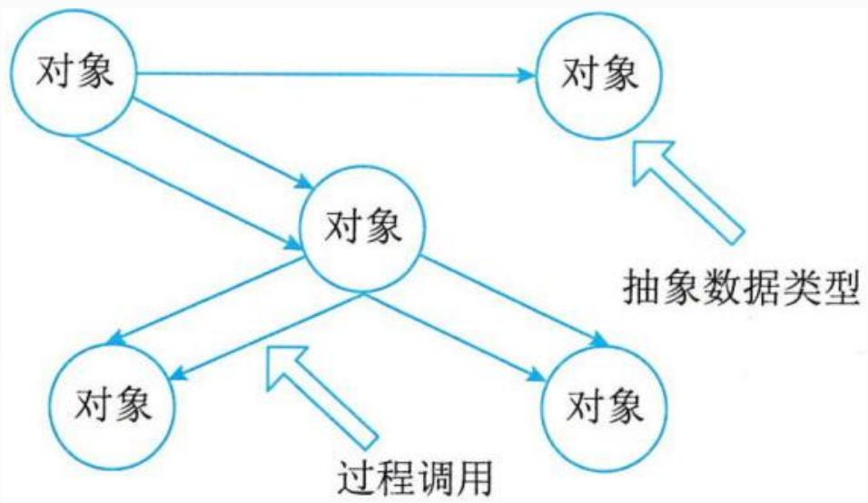

flowchart

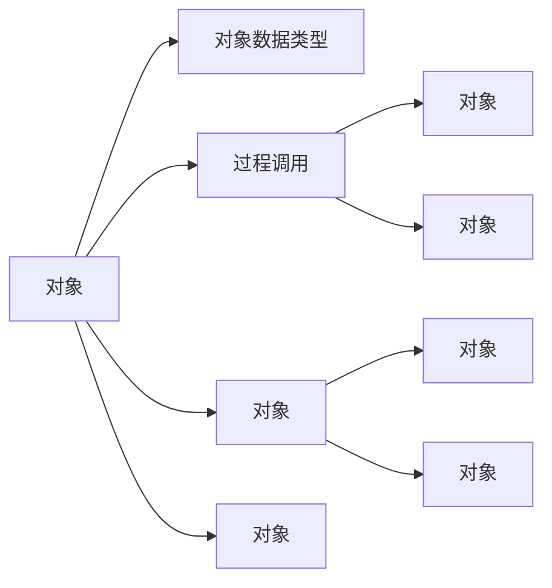

## 3.层次型体系结构风格

层次系统组成一个层次结构，每一层为上层提供服务，并作为下层的客户。在一些层次系统中，除了一些精心挑选的输出函数外，内部的层接口只对相邻的层可见。由于每一层最多只影响两层，只要给相邻层提供相同的接口，允许每层用不同的方法实现，这

同样为软件重用提供了强大的支持。

这样的系统中构件在层上实现了虚拟机。

连接件由通过决定层间如何交互的协议来定义，拓扑约束包括相邻层间交互的约束。

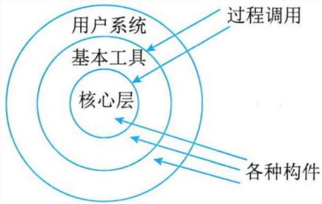

flowchart

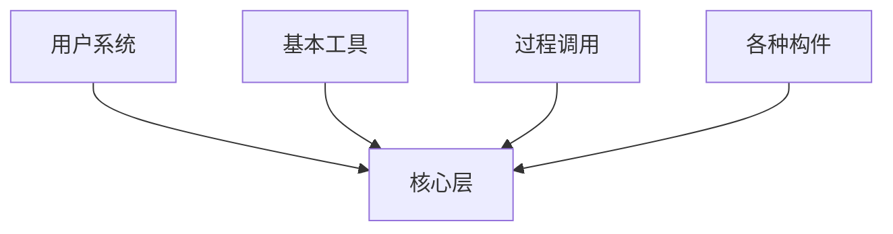

例：软件架构风格是描述某一特定应用领域中系统组织方式的惯用模式，按照软件架构风格，物联网系统属于( )软件架构风格。

A.层次型  
B.事件系统  
C.数据流  
D. C2

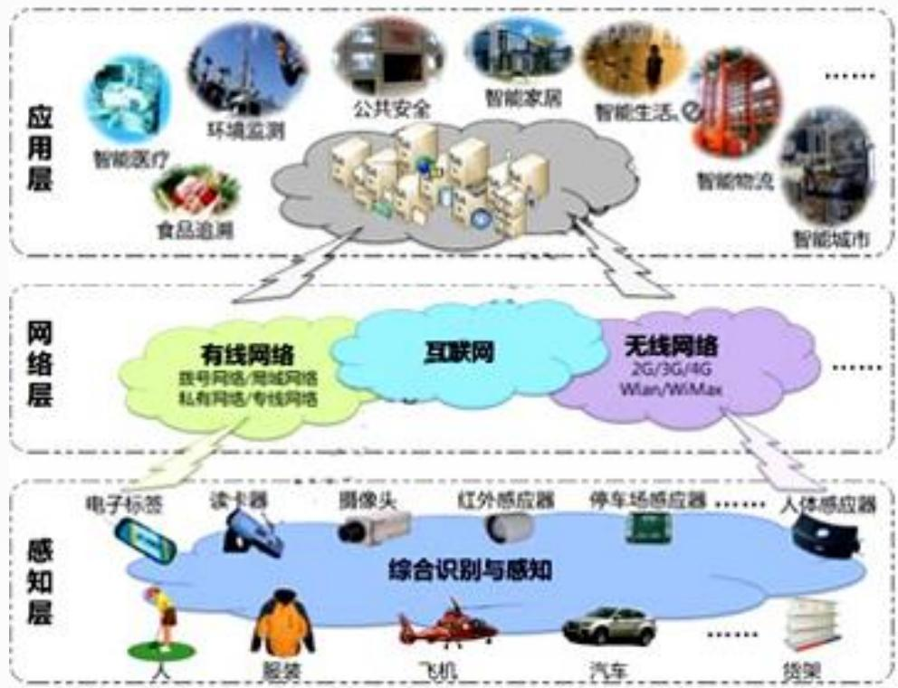

flowchart

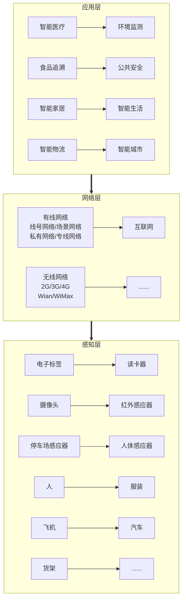

## 4.客户端/服务器体系结构风格

C/S软件体系结构是基于资源不对等，且为实现共享而提出的，两层 C/S 体系结构有3 个主要组成部分：数据库服务器、客户应用程序和网络。服务器 (后台)负责数据管理，客户机(前台)完成与用户的交互任务，称为"胖客户机，瘦服务器"。

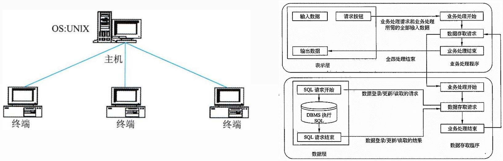

三层C/S 结构增加了应用服务器。整个应用逻辑驻留在应用服务器上，只有表示层位于客户机上，故称为"瘦客户机"。应用功能分为表示层、功能层和数据层三层。

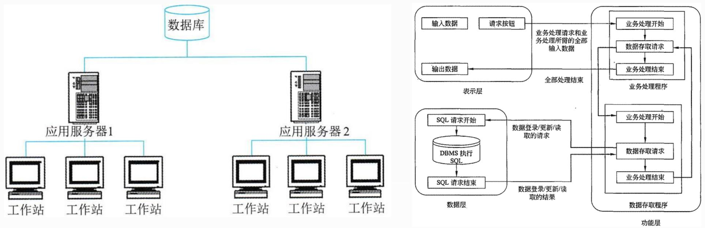

## 四、以数据为中心的体系结构风格

## 1.仓库体系结构风格

仓库(Repository)是存储和维护数据的中心场所。在仓库风格中，有两种不同的构件：

中央数据结构(仓库)，说明当前数据的状态。  
独立构件，它对中央数据进行操作。

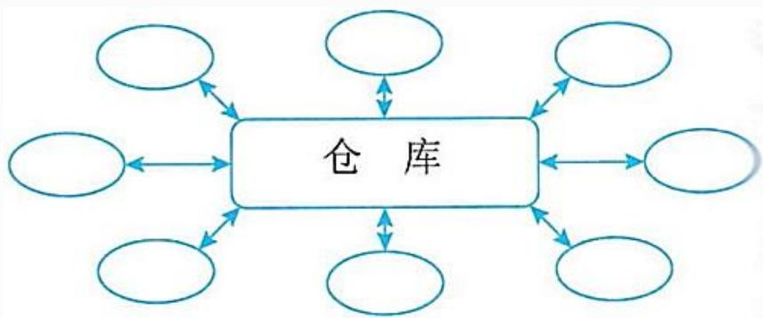

flowchart

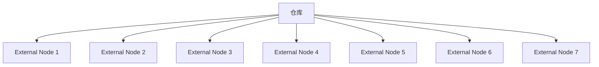

## 2.黑板体系结构风格

黑板体系结构风格适用于解决复杂的非结构化的问题，能在求解过程中综合运用多种不同知识源，使得问题的表达、组织和求解变得比较容易。黑板系统是一种问题求解模型，是组织推理步骤、控制状态数据和问题求解之领域知识的概念框架。

黑板系统的传统应用是信号处理领域，如语音和模式识别。另一应用是松耦合代理数据共享存取。

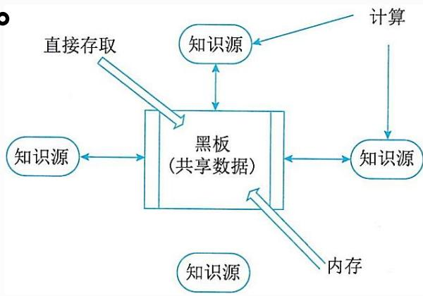

flowchart

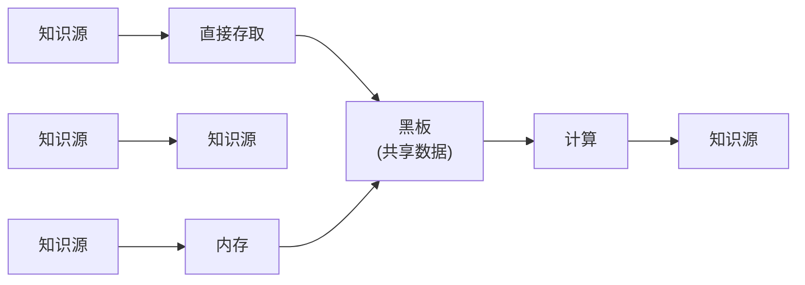

黑板系统主要由三部分组成：

(1)知识源。知识源中包含独立的、与应用程序相关的知识，知识源之间不直接进行通讯，它们之间的交互只能通过黑板来完成。  
(2)黑板数据结构。黑板数据是按照与应用程序相关的层次来组织的解决问题的数据，知识源通过不断地改变黑板数据来解决问题。  
(3)控制。控制完全由黑板的状态驱动，黑板状态的改变决定使用的特定知识。

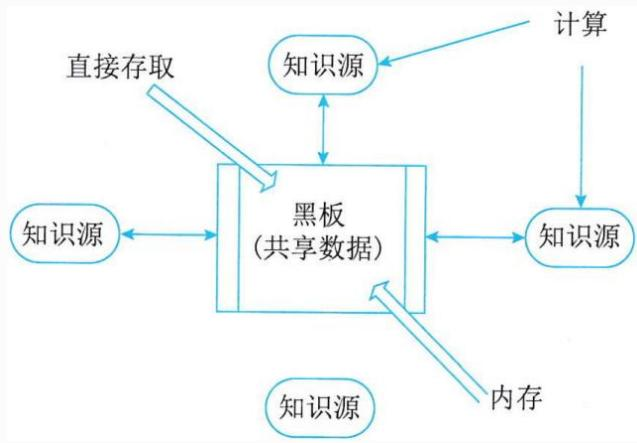

flowchart

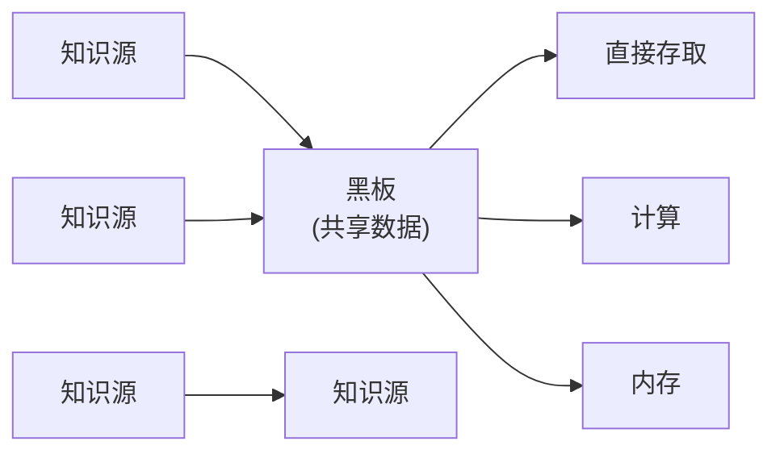

## 五、虚拟机体系结构风格

虚拟机体系结构风格的基本思想是人为构建一个运行环境，在这个环境之上，可以解析与运行自定义的一些语言，这样来增加架构的灵活性。虚拟机体系结构风格主要包括解释器风格和规则系统风格。

## 1.解释器体系结构风格

一个解释器通常包括完成解释工作的解释引擎，一个包含将被解释的代码的存储区，一个记录解释引擎当前工作状态的数据结构，以及一个记录源代码被解释执行进度的数据结构。

解释器通常被用来建立一种虚拟机以弥合程序语义与硬件语义之间的差异。其缺点是执行效率较低。典型的例子是专家系统。

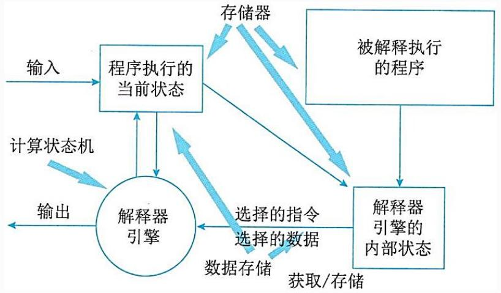

flowchart

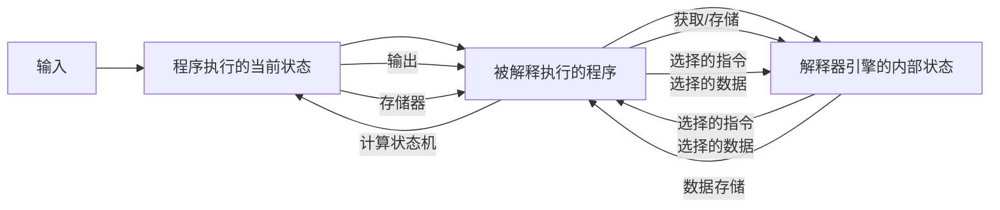

## 2.规则系统体系结构风格

基于规则的系统包括规则集、规则解释器、规则/数据选择器及工作内存。

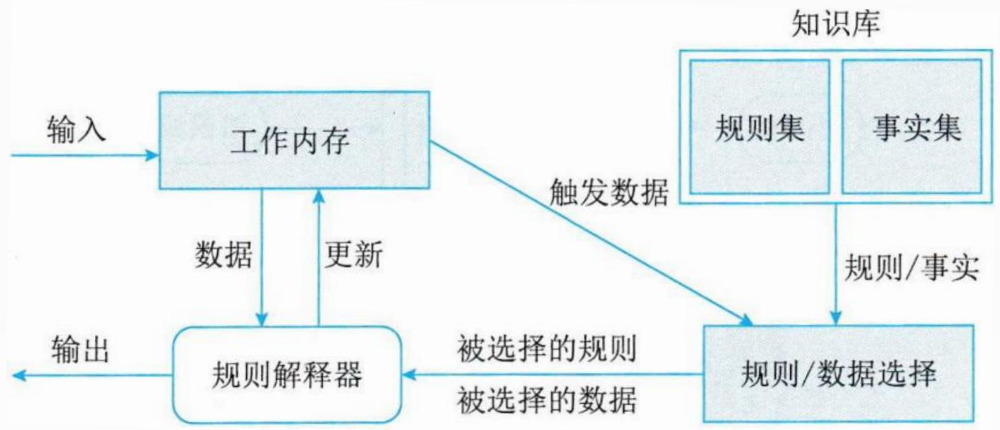

flowchart

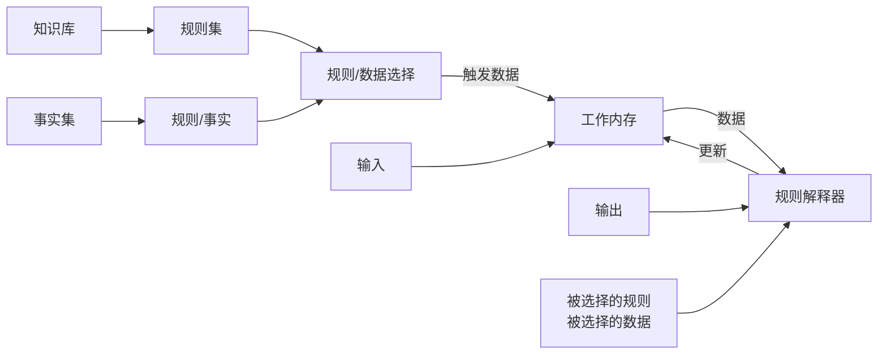

例：软件体系结构风格是描述某一特定应用领域中系统组织方式的惯用模式，其中，在批处理风格软件体系结构中，每个处理步骤是一个单独的程序，每一步必须在前一步结束后才能开始，并且数据必须是完整的，以( )的方式传递。基于规则的系统包括规则集、规则解释器、规则/数据选择器及( )。

A.迭代

B.整体

C.统一格式

D.递增

A.解释引擎

B.虚拟机

C.数据

D.工作内存

## 六、独立构件体系结构风格

独立构件风格主要强调系统中的每个构件都是相对独立的个体，它们之间不直接通信，以降低耦合度，提升灵活性。

独立构件风格主要包括进程通信和事件系统风格。

1.进程通信体系结构风格

在进程通信结构体系结构风格中，构件是独立的过程，连接件是消息传递。

这种风格的特点是构件通常是命名过程，消息传递的方式可以是点到点、异步或同步方式及远程过程调用等。

## 2.事件系统体系结构风格

基于事件的隐式调用风格的思想是构件不直接调用一个过程而是触发或广播一个或多个事件。系统中的其他构件中的过程在一个或多个事件中注册，当一个事件被触发，系统自动调用在这个事件中注册的所有过程，这样一个事件的触发就导致了另一模块中的过程的调用。

特点是事件的触发者并不知道哪些构件会被这些事件影响，这使得不能假定构件的处理顺序，甚至不知道哪些过程会被调用，因此，许多隐式调用的系统也包含显式调用作为构件交互的补充形式。 

## Thank You