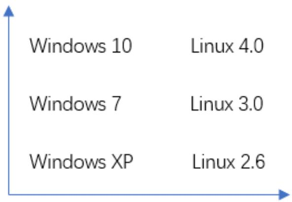
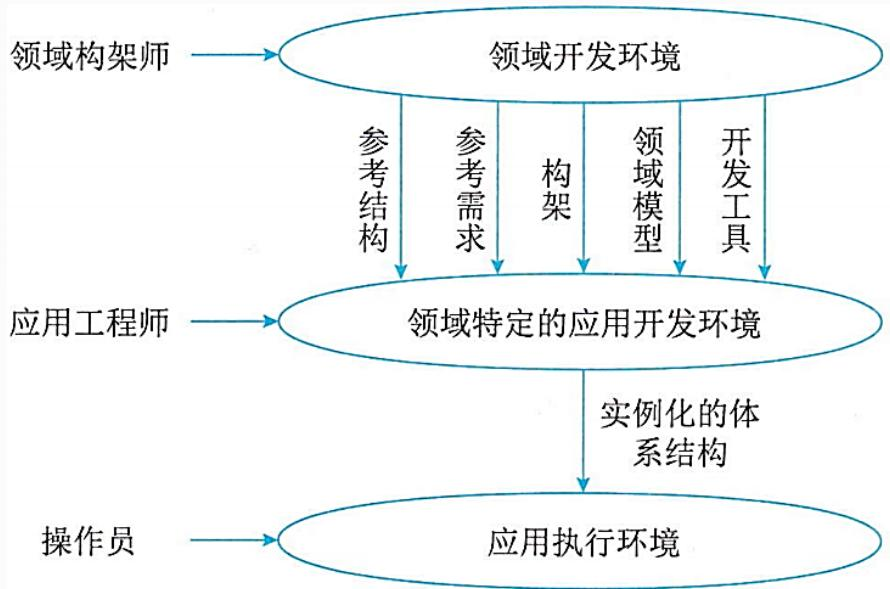
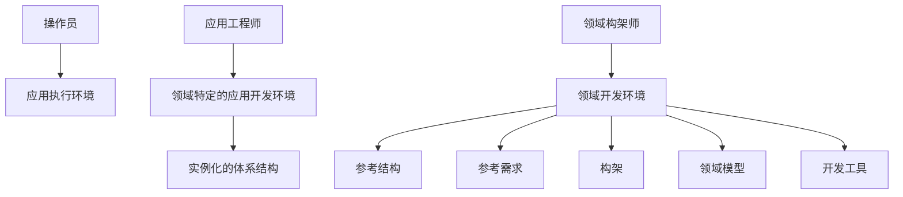

## 系统架构设计师

## 软件架构复用

## 第七章 系统架构设计基础知识

7.1 软件架构概念  
7.2 基于架构的软件开发方法  
7.3 软件架构风格  
7.4 软件架构复用  
7.5 特定领域软件体系结构

## 一、软件架构复用的定义及分类

软件复用是一种系统化的软件开发过程，通过识别、开发、分类、获取和修改软件实体，以便在不同的软件开发过程中重复的使用它们。早期的软件复用主要是代码级复用，被复用的专指程序，后来扩大到包括领域知识、开发经验、体系结构、需求、设计、测试、代码和文档、过程方法和工具等一切有关方面。

软件架构复用的类型包括机会复用和系统复用。机会复用是指开发过程中，只要发现有可复用的资产，就对其进行复用。系统复用是指在开发之前，就要进行规划，以决定哪些需要复用。

## 二、软件架构复用的原因

软件架构复用可以减少开发工作、减少开发时间以及降低开发成本，提高生产力。还可以提高产品质量使其具有更好的互操作性。同时，软件架构复用会使产品维护变得更加简单。

## 三、软件架构复用的基本过程

复用的基本过程包括三个阶段：

1.构造/获取可复用的软件资产  
2.管理可复用资产  
3.使用可复用的资产

flowchart

1.构造/获取可复用的软件资产

首先需要构造恰当的、可复用的资产，并且这些资产必须是可靠的、可被广泛使用的、易于理解和修改的。

## 2.管理可复用资产

通过构件库对可复用构件进行存储和管理，

构件库应提供的主要功能包括构件的存储、管理、检索以及库的浏览与维护等，以及支持使用者有效地、准确地发现所需的可复用构件。在这个过程中，存在两个关键问题：

⚫ 构件分类，是指将数量众多的构件按照某种特定方式组织起来。  
⚫ 构件检索，是指给定几个查询需求，能够快速准确地找到相关构件。

## 3.使用可复用的资产

在最后阶段，通过获取需求，检索复用资产库，获取可复用资产，并定制这些可复用资产：修改、扩展、配置等，最后将它们组装与集成，形成最终系统。

例：软件复用过程的主要阶段包括( )。

A.分析可复用的软件资产、管理可复用资产和使用可复用资产  
B.构造/获取可复用的软件资产、管理可复用资产和使用可复用资产  
C.构造/获取可复用的软件资产和管理可复用资产  
D.分析可复用的软件资产和使用可复用资产

## 第七章 系统架构设计基础知识

7.1 软件架构概念  
7.2 基于架构的软件开发方法  
7.3 软件架构风格  
7.4 软件架构复用  
⚫ 7.5 特定领域软件体系结构

## 一、特定领域软件架构DSSA

特定领域软件架构是在一个特定领域中为一组应用提供组织结构参考的标准软件框架。

其目标是支持在一个特定领域中多个应用的生成。

## DSSA中领域的含义：

(1)垂直域。定义一个特定的系统族，包含整个系统族内的多个系统，结果是在该领域中可作为系统的可行解决方案的一个通用软件架构。  
(2)水平域。定义了在多个系统和多个系统族中功能区域的共有部分，在子系统级上涵盖多个系统族的特定部分功能，无法为系统提供完整的通用架构。

word_cloud

| Operating System | Configuration |
| --- | --- |
| Windows 10 | Linux 4.0 |
| Windows 7 | Linux 3.0 |
| Windows XP | Linux 2.6 |

## 1.DSSA的基本活动

(1)领域分析。主要目的是获得领域模型。领域模型描述领域中系统之间的共同的需求，所描述的需求为领域需求。  
(2)领域设计。主要目的是获得DSSA。DDSA描述在领域模型中表示需求的解决方案，它不是单个系统的表示，而是能够适应领域中多个系统需求的一个高层次的设计。  
(3)领域实现。主要目的是依据领域模型及DSSA开发和组织可重用信息。

例：DSSA(Domain Specific Software Architecture)就是在一个特定应用领域中为一组应用提供组织结构参考的标准软件体系结构，实施DSSA的过程中包含了一些基本的活动。其中，领域模型是( )阶段的主要目标。

A.领域设计  
B.领域实现  
C.领域分析  
D.领域工程

## 2.参与DSSA的人员

领域专家：有经验的用户，从事该领域中系统的需求分析、设计、实现以及项目管理的有经验的软件工程师。  
⚫ 领域分析师：具有知识工程背景的有经验的系统分析员来担任。  
领域设计人员：由有经验的软件设计人员来担任。  
领域实现人员：由有经验的程序设计人员来担任。

## 3.DSSA的建立过程

DSSA的建立过程分为5个阶段，每个阶段又可分为一些步骤和子阶段，是并发的、递归的、反复的，是螺旋的。

(1)定义领域范围。主要输出是领域中的应用需要满足一系列用户的需求。  
(2)定义领域特定的元素。编译领域字典和领域术语的同义词词典。  
(3)定义领域特定的设计和实现需求约束。  
(4)定义领域模型和架构。  
(5)产生、 搜集可重用的产品单元。

## DSSA包含两个过程：

⚫ 领域工程：为一组相近或相似的应用建立基本能力与必备基础的过程，它覆盖了建立可重用软件元素的所有活动。  
应用工程：通过重用软件资源，以领域通用体系结构为框架，开发出满足用户需求的一系列应用软件的过程 。

flowchart

## Thank You