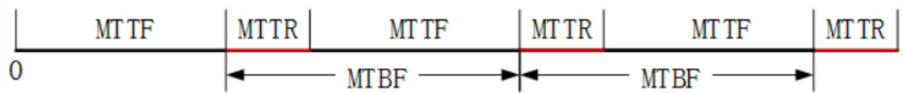

## 系统架构设计师

## 软件系统质量属性

## 第八章 系统质量属性与架构评估

8.1 软件系统质量属性  
8.2 系统架构评估  
8.3 ATAM方法架构评估实践

## 质量属性概念

软件系统的质量就是“软件系统与明确地和隐含地定义的需求相一致的程度”。

影响软件质量的主要因素划分为6个维度特性：

<table><tr><td>质量特性</td><td>质量子特性</td></tr><tr><td rowspan="5">功能性(functionality)</td><td>适宜性(suitability)</td></tr><tr><td>准确性(accurateness)</td></tr><tr><td>互用性(interoperability)</td></tr><tr><td>依从性(compliance)</td></tr><tr><td>安全性(security)</td></tr><tr><td rowspan="3">可靠性(reliability)</td><td>成熟性(maturity)</td></tr><tr><td>容错性(fault tolerance)</td></tr><tr><td>可恢复性(recoverability)</td></tr><tr><td rowspan="3">可用性(usability)</td><td>可理解性(understandability)</td></tr><tr><td>易学性(learnability)</td></tr><tr><td>可操作性(operability)</td></tr></table>

<table><tr><td rowspan="2">效率(efficiency)</td><td>时间特性(time behavior)</td></tr><tr><td>资源特性(resource behavior)</td></tr><tr><td rowspan="4">可维护性(maintainability)</td><td>可分析性(analyzability)</td></tr><tr><td>可修改性(changeability)</td></tr><tr><td>稳定性(stability)</td></tr><tr><td>可测试性(testability)</td></tr><tr><td rowspan="4">可移植性(portability)</td><td>适应性(adaptability)</td></tr><tr><td>易安装性(installability)</td></tr><tr><td>一致性(conformance)</td></tr><tr><td>可替换性(replaceability)</td></tr></table>

基于软件系统的生命周期，可以将软件系统的质量属性分为开发期质量属性和运行期质量属性2部分。

1.开发期质量属性

开发期质量属性指在软件开发阶段所关注的质量属性，包括：

(1)易理解性：指设计被开发人员理解的难易程度。  
(2)可扩展性：软件因适应新需求或需求变化而增加新功能的能力，也称为灵活性。  
(3)可重用性：指重用软件系统或某一部分的难易程度。

(4)可测试性：对软件测试以证明其满足需求规范的难易程度。  
(5)可维护性：当需要修改缺陷、增加功能、提高质量属性时，识别修改点并实施修改的难易程度。  
(6)可移植性：将软件系统从一个运行环境转移到另一个不同的运行环境的难易程度。

## 2.运行期质量属性

运行期质量属性指在软件运行阶段所关注的质量属性，包含：

(1)性能：指软件系统及时提供相应服务的能力，如速度、吞吐量、容量等要求。  
(2)安全性：指软件系统同时兼顾向合法用户提供服务，以及阻止非授权使用的能力。  
(3)可伸缩性：指当用户数和数据量增加时，软件系统维持高服务质量的能力。例如通过增加服务器来提高能力。

(4)互操作性：指本软件系统与其他系统交换数据和相互调用服务的难易程度。  
(5)可靠性：指软件系统在一定的时间内持续无故障运行的能力。  
(6)可用性：指系统在一定时间内正常工作的时间所占的比例。可用性会受到系统错误、恶意攻击，高负载等问题影响。  
(7)鲁棒性：指软件系统在非正常情况下(如用户进行了非法操作、相关的软硬件系统发生了故障等)，仍能够正常运行的能力，也称健壮性或容错性。

例：软件系统质量属性(Quality Attribute)是一个系统的可测量或者可测试的属性，它被用来描述系统满足利益相关者需求的程度，其中，( )关注的是当需要修改缺陷、增加功能、提高质量属性时，定位修改点并实施修改的难易程度；( )关注的是当用户数和数据量增加时，软件系统维持高服务质量的能力。

A.可靠性

B.可测试性

C.可维护性

D.可重用性

A.可用性

B.可扩展性

C.可伸缩性

D.可移植性

## 二、 面向架构评估的质量属性

为了评价一个软件系统，特别是软件系统的架构，需要进行架构评估。评估方法关注的质量属性有以下几种。

1.性能  
2.可靠性  
3.可用性  
4.安全性  
5.可修改性  
6.功能性  
7.可变性  
8.互操作性

## 1.可靠性

可靠性是软件系统在应用或系统错误面前，在意外或错误使用的情况下维持软件系统的功能特性的基本能力。通常用来衡量在规定的条件和时间内，软件完成规定功能的能力。

(1)容错。容错的目的是在错误发生时确保系统正确的行为，并进行内部“修复”。  
(2)健壮性。这里说的是保护应用程序不受错误使用和错误输入的影响，在发生意外错误事件时确保应用系统处于预先定义好的状态。

平均失效间隔时间(MTBF)：是指相邻两次故障之间的平均时间，也称为平均故障间隔。  
⚫ 平均失效等待时间(MTTF)也称平均无故障时间，是指某个元件预计的可运作平均时间  
⚫ 平均故障修复时间(MTTR)：是描述产品由故障状态转为工作状态时修理时间的平均值。表示计算机的可维修性。

平均失效间隔时间(MTBF)常与MTTF发生混淆。因为两次故障之间必然有修复行为，因此，MTBF中应包含MTTR。

$$
\mathrm{MTBF} = \mathrm{MTTR} + \mathrm{MTTF} \quad \text {实际应用中MTTR很小，所以MTBF} \approx \mathrm{MTTF}
$$

text_image

MT TF
MT TR
MT TF
MT TR
MT TF
MT TR
0
← MT BF → ← MT BF →

例：平均失效等待时间(mean time to failure, MTTF)和平均失效间隔时间(mean time between failure, MTBF)是进行系统可靠性分析时的重要指标，在失效率为常数和修复时间很短的情况下，( )。

A.MTTF远远小于MTBF  
B.MTTF和MTBF无法计算  
C.MTTF远远大于MTBF  
D.MTTF和MTBF几乎相等

## 2.可修改性

可修改性 (Modiability) 是指能够快速地以较高的性价比对系统进行变更的能力。通常以某些具体的变更为基准，通过考查变更的代价来衡量可修改性。可修改性包含以下 4个方面：

(1)可维护性  
(2)可扩展性  
(3)结构重组  
(4)可移植性

## 3.可变性

可变性是指架构经扩充或变更而成为新架构的能力。这种新架构应该符合预先定义的规则，在某些具体方面不同于原有的架构。当要将某个架构作为一系列相关产品的基础时(例如，软件产品线)，可变性是很重要的。

## 三、质量属性场景描述

为了精确描述软件系统的质量属性，通常采用质量属性场景作为描述质量属性的手段。质量属性场景是一个具体的质量属性需求，是利益相关者与系统的交互的简短陈述。它由 6 部分组成：

⚫ 刺激源：这是某个生成该刺激的实体(人、计算机系统或者任何其他刺激器)。  
刺激：该刺激是当刺激到达系统时需要考虑的条件。  
环境：该刺激在某些条件内发生。当激励发生时，系统可能处于过载、运行或者其他情况。

制品：某个制品被激励。可能是整个系统，也可能是系统的部分。  
⚫ 响应：该响应是在激励到达后所采取的行动。  
⚫ 响应度量：当响应发生时，应当能够以某种方式对其进行度量，以对需求进行测试。

质量属性场景主要关注可用性、可修改性、性能、可测试性、易用性和安全性等 6 类质量属性。

## 1.可用性质量属性场景

<table><tr><td>场景要素</td><td>可能的情况</td></tr><tr><td>刺激源</td><td>系统内部、系统外部</td></tr><tr><td>刺激</td><td>疏忽、错误、崩溃、时间</td></tr><tr><td>环境</td><td>正常操作、降级模式</td></tr><tr><td>制品</td><td>系统处理器、通信信道、持久存储器、进程</td></tr><tr><td>响应</td><td>系统应该检测事件、并进行如下一个或多个活动:将其记录下来通知适当的各方,包括用户和其他系统;根据已定义的规则禁止导致错误或故障的事件源在一段预先指定的时间间隔内不可用,其中,时间间隔取决于系统的关键程度在正常或降级模式下运行</td></tr><tr><td>响应度量</td><td>系统必须可用的时间间隔可用时间系统可以在降级模式下运行的时间间隔故障修复时间</td></tr></table>

2.可修改性质量属性场景

<table><tr><td>场景要素</td><td>可能的情况</td></tr><tr><td>刺激源</td><td>最终用户、开发人员、系统管理员</td></tr><tr><td>刺激</td><td>希望增加、删除、修改、改变功能、质量属性、容量等</td></tr><tr><td>环境</td><td>系统设计时、编译时、构建时、运行时</td></tr><tr><td>制品</td><td>系统用户界面、平台、环境或与目标系统交互的系统</td></tr><tr><td>响应</td><td>查找架构中需要修改的位置,进行修改且不会影响其他功能,对所做的修改进行测试,部署所做的修改</td></tr><tr><td>响应度量</td><td>根据所影响元素的数量度量的成本、努力、资金;该修改对其他功能或质量属性所造成影响的程度</td></tr></table>

## 3.性能质量属性场景

<table><tr><td>场景要素</td><td>可能的情况</td></tr><tr><td>刺激源</td><td>用户请求,其他系统触发等</td></tr><tr><td>刺激</td><td>定期事件到达、随机事件到达、偶然事件到达</td></tr><tr><td>环境</td><td>正常模式、超载(Overload)模式</td></tr><tr><td>制品</td><td>系统</td></tr><tr><td>响应</td><td>处理刺激、改变服务级别</td></tr><tr><td>响应度量</td><td>等待时间、期限、吞吐量、抖动、缺失率、数据丢失率</td></tr></table>

4.可测试性质量属性场景

<table><tr><td>场景要素</td><td>可能的情况</td></tr><tr><td>刺激源</td><td>开发人员、增量开发人员、系统验证人员、客户验收测试人员、系统用户</td></tr><tr><td>刺激</td><td>已完成的分析、架构、设计、类和子系统集成;所交付的系统</td></tr><tr><td>环境</td><td>设计时、开发时、编译时、部署时</td></tr><tr><td>制品</td><td>设计、代码段、完整的应用</td></tr><tr><td>响应</td><td>提供对状态值的访问,提供所计算的值,准备测试环境</td></tr><tr><td>响应度量</td><td>已执行的可执行语句的百分比如果存在缺陷出现故障的概率执行测试的时间测试中最长依赖的长度准备测试环境的时间</td></tr></table>

## 5.易用性质量属性场景

<table><tr><td>场景要素</td><td>可能的情况</td></tr><tr><td>刺激源</td><td>最终用户</td></tr><tr><td>刺激</td><td>想要学习系统特性、有效使用系统、使错误的影响最低、适配系统、对系统满意</td></tr><tr><td>环境</td><td>系统运行时或配置时</td></tr><tr><td>制品</td><td>系统</td></tr><tr><td>响应</td><td>(1)系统提供以下一个或多个响应来支持“学习系统特性”:帮助系统与环境联系紧密;界面为用户所熟悉;在不熟悉的环境中,界面是可以使用的(2)系统提供以下一个或多个响应来支持“有效使用系统”:数据和(或)命令的聚合;已输入的数据和(或)命令的重用;支持在界面中的有效导航;具有一致操作的不同视图;全面搜索;多个同时进行的活动(3)系统提供以下一个或多个响应来“使错误的影响最低”:撤销;取消;从系统故障中恢复;识别并纠正用户错误;检索忘记的密码;验证系统资源(4)系统提供以下一个或多个响应来“适配系统”:定制能力;国际化(5)系统提供以下一个或多个响应来使客户“对系统的满意”:显示系统状态;与客户的节奏合拍</td></tr><tr><td>响应度量</td><td>任务时间、错误数量、解决问题的数量、用户满意度、用户知识的获得、成功操作在总操作中所占的比例、损失的时间/丢失的数据量</td></tr></table>

6.安全性质量属性场景

<table><tr><td>场景要素</td><td>可能的情况</td></tr><tr><td>刺激源</td><td>正确识别、非正确识别身份未知的来自内部/外部的个人或系统;经过了授权/未授权它访问了有限的资源/大量资源</td></tr><tr><td>刺激</td><td>试图显示数据,改变/删除数据,访问系统服务,降低系统服务的可用性</td></tr><tr><td>环境</td><td>在线或离线、联网或断网、连接有防火墙或者直接连到了网络</td></tr><tr><td>制品</td><td>系统服务、系统中的数据</td></tr><tr><td>响应</td><td>对用户身份进行认证;隐藏用户的身份;阻止对数据或服务的访问;允许访问数据或服务;授予或收回对访问数据或服务的许可;根据身份记录访问、修改或试图访问、修改数据、服务;以一种不可读的格式存储数据;识别无法解释的对服务的高需求;通知用户或另外一个系统,并限制服务的可用性</td></tr><tr><td>响应度量</td><td>用成功的概率表示,避开安全防范措施所需要的时间、努力、资源;检测到攻击的可能性;确定攻击或访问、修改数据或服务的个人的可能性;在拒绝服务攻击的情况下仍然获得服务的百分比;恢复数据、服务;被破坏的数据、服务和(或)被拒绝的合法访问的范围</td></tr></table>

例：为了精确描述软件系统的质量属性，通常采用质量属性场景(Quality Attibute Scenario)作为描述质量属性的手段。质量属性场景是一个具体的质量属性需求，是利益相关者与系统的交互的简短陈述，它由刺激源、刺激、环境、制品、( )六部分组成。其中，想要学习系统特性、有效使用系统、使错误的影响最低、适配系统、对系统满意属于( )质量属性场景的刺激。

A.响应和响应度量  
B.系统和系统响应  
C.依赖和响应  
D.响应和优先级  
A可用性  
B.性能  
C.易用性  
D.安全性

## Thank You