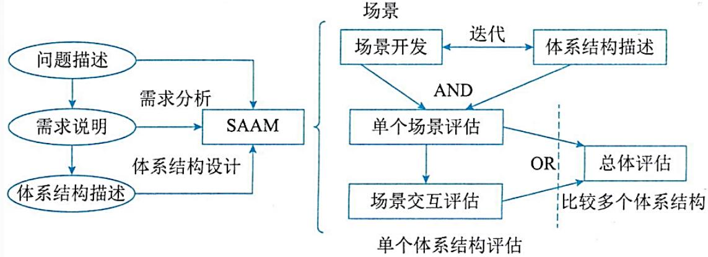
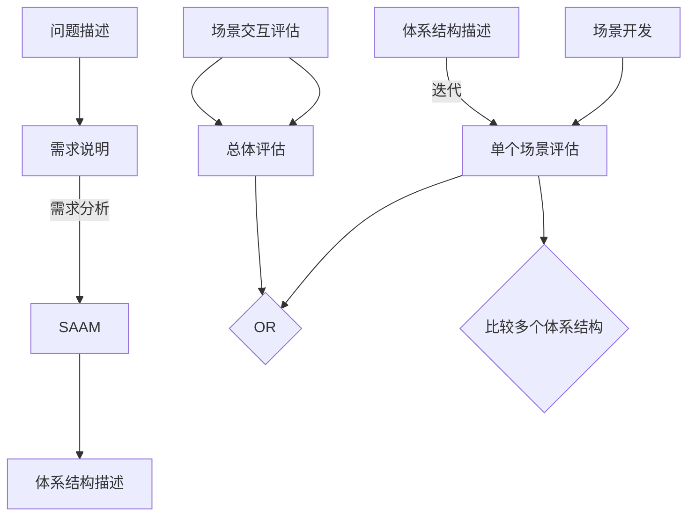
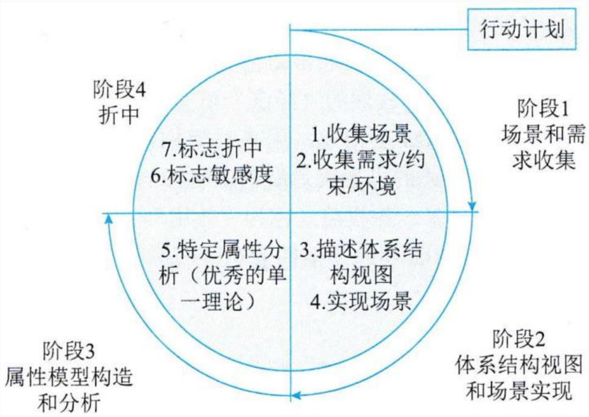
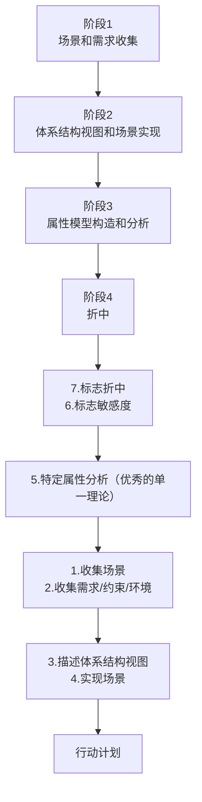
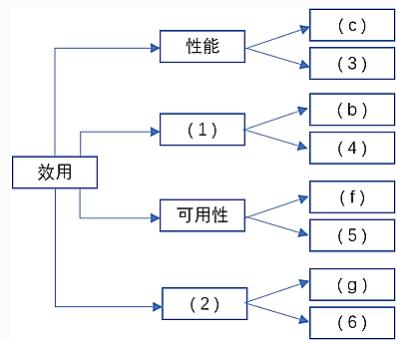
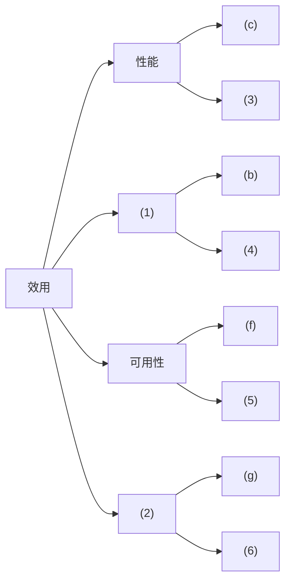

## 系统架构设计师

## 系统架构评估

## 第八章 系统质量属性与架构评估

8.1 软件系统质量属性  
⚫ 8.2 系统架构评估  
8.3 ATAM方法架构评估实践

## 一、系统架构评估的评估方法

1.基于调查问卷或检查表的方式  
2.基于场景的方式  
3.基于度量的方式

## 1.基于调查问卷或检查表的方式

该方法的关键是要设计好问卷或检查表，充分利用系统相关人员的经验和知识，获得对架构的评估。

优点：自由灵活，可评估多种质量属性，也可以在架构设计的多个阶段进行。  
缺点：评估的结果很大程度上来自评估人员的主观推断，因此不同的评估人员可能会产生不同甚至截然相反的结果，而且评估人员对领域的熟悉程度、是否具有丰富的相关经验也成为评估结果是否正确的重要因素。

## 2.基于场景的评估方式

通过分析软件架构对场景(也就是对系统的使用或修改活动)的支持程度，从而判断该架构对这一场景所代表的质量需求的满足程度。

在体系结构评估中，采用刺激、环境和响应三方面对场景进行描述。

⚫ 刺激：是场景中解释或描述项目干系人怎样引发与系统的交互。  
环境：描述刺激发生时的情况。  
⚫ 响应：指系统是如何通过体系结构对刺激作出反应的。

## 3.基于度量的评估方式

度量是指为软件产品的某一属性所赋予的数值，如代码行数、方法调用层数、构件个数等。

基于度量的评估技术涉及3个基本活动：

建立质量属性和度量之间的映射原则，即确定怎样从度量结果推出系统具有什么样的质量属性  
从软件体系结构文档中获取度量信息  
根据映射原则分析推导出系统的某些质量属性。

表13-1三类评估方式比较表

<table><tr><td rowspan="2">评估方式</td><td colspan="2">调查问卷或检查表</td><td rowspan="2">场景</td><td rowspan="2">度量</td></tr><tr><td>调查问卷</td><td>检查表</td></tr><tr><td>通用性</td><td>通用</td><td>特定领域</td><td>特定系统</td><td>通用或特定领域</td></tr><tr><td>评估者对体系结构的了解程度</td><td>粗略了解</td><td>无限制</td><td>中等了解</td><td>精确了解</td></tr><tr><td>实施阶段</td><td>早</td><td>中</td><td>中</td><td>中</td></tr><tr><td>客观性</td><td>主观</td><td>主观</td><td>较主观</td><td>较客观</td></tr></table>

## 二、系统架构评估中的重要概念

1. 敏感点(Sensitivity Point)和权衡点 (Tradeoff Point)。

敏感点是一个或多个构件(和或构件之间的关系)的特性。研究敏感点可使设计师明确在搞清楚如何实现质量目标时应注意什么。  
权衡点是影响多个质量属性的特性，是多个质量属性的敏感点。例如，改变加密级别可能会对安全性和性能产生非常重要的影响。提高加密级别可以提高安全性，但可能要耗费更多的处理时间，影响系统性能。如果某个机密消息的处理有严格的时间延迟要求，则加密级别可能就会成为一个权衡点。

例：改变加密级别可能会对安全性和性能产生非常重要的影响，因此，在软件架构评估中，该设计决策是一个( )。

A.敏感点  
B.风险点  
C.权衡点  
D.非风险点

## 2. 风险承担者 (Stakeholders)

或者称为利益相关人。系统的架构涉及很多人的利益，这些人都对架构施加各种影响，以保证自己的目标能够实现。

<table><tr><td>风险承担者</td><td>职责</td><td>所关心的问题</td></tr><tr><td colspan="3">系统生产者</td></tr><tr><td>软件系统架构师</td><td>负责软件架构的质量需求间进行权衡的人</td><td>对其他风险承担者提出的质量需求的折中和调停</td></tr><tr><td>开发人员</td><td>设计人员或程序员\</td><td>架构描述的清晰与完整、各部分的内聚性与受限藕合、清楚的交互机制</td></tr><tr><td>维护人员</td><td>系统初次部署完成后对系统进行更改的人</td><td>可维护性,确定出某个更改发生后必须对系统中哪些地方进行改动的能力</td></tr><tr><td colspan="3">系统消费者</td></tr><tr><td>客户</td><td>系统的购买者</td><td>开发的进度、总体预算、系统的有用性、满足需求的情况</td></tr><tr><td>最终用户</td><td>所实现系统的使用者</td><td>功能性、可用性</td></tr><tr><td>应用开发者(对产品架构而言)</td><td>利用该架构及其他已有可重用构件,通过将其实例化而构建产品的人员</td><td>架构的清晰性、完整性、简单交互机制、简单裁减机制</td></tr></table>

## 3. 场景

在进行架构评估时，一般首先要精确地得出具体的质量目标，并以之作为判定该架构优劣的标准。为得出这些目标而采用的机制称之为场景。

场景是从风险担者的角度对与系统的交互做的简短描述。在架构评估中，一般采用刺激、环境和响应三方面来对场景进行描述。

## 三、系统架构评估方法

## 1.SAAM方法

SAAM方法是最早形成文档并得到广泛使用的软件体系结构分析方法，最初是用来分析体系结构的可修改性的，但实践证明，SAAM方法也可用于其他质量属性如可移植性、可扩充性等，最终发展成了评估一个系统架构的通用方法。

SAAM 分析评估架构的过程包括5 个步骤，即场景开发、架构描述、单个场景评估、场景交互和总体评估。

通过各类风险承担者协商讨论，开发一些任务场景，体现系统所支持的各种活动。用一种易于理解的、合乎语法规则的架构描述软件架构，体现系统的计算构件、数据构件以及构件之间的关系(数据和控制)。对场景(直接场景和间接场景)生成一个关于特定架构的场景描述列表。通过对场景交互的分析，得出系统中所有场景对系统中的构件所产生影响的列表。最后，对场景和场景间的交互作一个总体的权衡和评价。

flowchart

## 2.ATAM方法

架构权衡分析方法(ATAM)是评价软件构架的一种综合全面的方法。主要针对性能、可用性、安全性和可修改性，在系统开发之前，可以使用ATAM方法在多个质量属性之间进行评价和折中。

## ATAM 分为4个主要的活动领域(阶段)

场景和需求收集  
架构视图和场景实现  
属性模型构造和分析  
折中

flowchart

ATAM方法采用效用树 (Utility tree) 这一工具来对质量属性进行分类和优先级排序。效用树的结构包括:树根→质量属性→属性分类→质量属性场景 (叶子节点)。

ATAM 主要关注4 类质量属性：性能、安全性、可修改性和可用性，因为这4 个质量属性是利益相关者最为关心的。

得到初始的效用树后，需要修剪这棵树，保留重要场景(不超过50个)，再对场景按重要性给定优先级(用H/M/L 的形式)，再按场景实现的难易度来确定优先级(用H/M/L的形式)，这样对所选定的每个场景就有一个优先级对(重要度、难易度)，如 (H、L)表示该场景重要且易实现。 

flowchart

例：效用树是采用架构权衡分析方法(Architecture TradeoffAnalysis Method，ATAM)进行架构评估的工具之一，其树形结构从根部到叶子节点依次为( )。

A.树根、属性分类、优先级，质量属性场景  
B.树根、质量属性、属性分类，质量属性场景  
C.树根、优先级、质量属性、质量属性场景  
D.树根、质量属性、属性分类，优先级

## 3.CBAM方法

成本效益分析法 (CBAM)是在ATAM上构建，用来对架构设计决策的成本和收益进行建模，是优化此类决策的一种手段。CBAM 的思想就是架构策略影响系统的质量属性，反过来这些质量属性又会为系统的项目干系人带来一些收益(称为效用)，CBAM 协助项目干系人根据其投资回报(ROI)选择架构策略。

CBAM在ATAM结束时开始，它实际上使用了 ATAM评估的结果。

## CBAM 方法分为以下8个步骤：

(1)整理场景。  
(2)对场景进行求精。  
(3)确定场景的优先级。  
(4)分配效用。  
(5)架构策略涉及哪些质量属性及响应级别，形成"策略一场景一响应级别"的对应关系。  
(6)使用内插法确定"期望的"质量属性响应级别的效用。  
(7)计算各架构策略的总收益  
(8)根据受成本影响的ROI选择架构策略

## Thank You