## 系统架构设计师

## 之

## ATAM方法架构评估实践

## 第八章 系统质量属性与架构评估

8.1 软件系统质量属性  
8.2 系统架构评估  
8.3 ATAM方法架构评估实践

## ATAM方法评估软件体系结构，分为4个基本阶段：

描述和介绍阶段(演示)  
调查和分析阶段  
测试阶段  
报告阶段

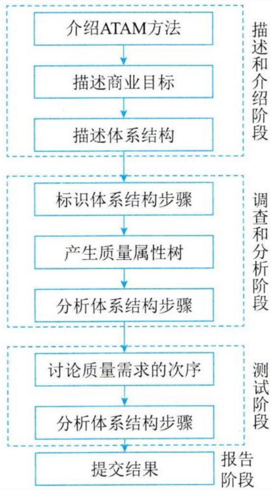

flowchart

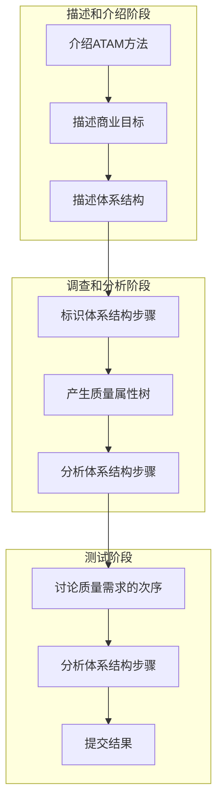

## 一、阶段1--演示

是ATAM 评估软件体系结构的初始阶段。

此阶段有3个主要步骤。

第1步:介绍ATAM

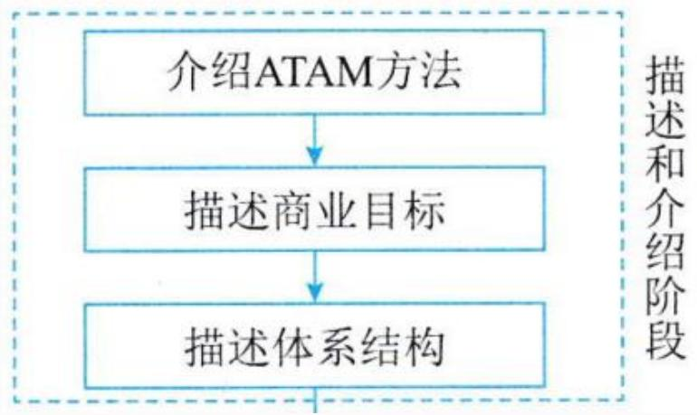

flowchart

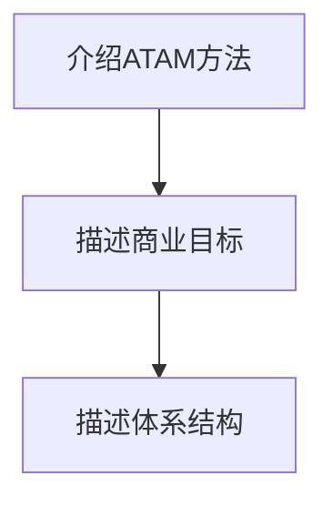

涉及 ATAM 评估过程的描述。在此步骤中，评估负责人向所有相关参与者提供有关 ATAM过程的一般信息。领导者说明评估中使用的分析技术以及评估的预期结果。领导者解决小组成员的任何疑虑、期望或问题

## 第2步:介绍业务驱动因素

在这一步中，提到了系统体系结构驱动程序的业务目标。这一步着重于系统的业务视角。它提供了有关系统功能、主要利益相关方、业务目标和系统其他限制的更多信息。

主要利益相关方:最终用户、架构师、应用程序开发人员。

第3步:介绍要评估的体系结构

在这一步中，架构团队描述要评估的架构。它侧重于体系结构、时间可用性以及体系结构的质量要求。

此步骤中的体系结构演示非常重要，因为它会影响分析的质量。这里涉及的关键问题包括技术约束，与正在评估的系统交互的其他系统，以及为满足质量属性而实施的架构方法。

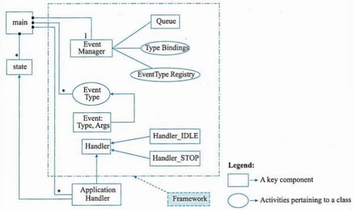

flowchart

This diagram illustrates the architecture of a system, showing how a main component (state) is distributed across multiple event handlers and event types to form a specific framework.

图8-6Hoover体系结构的简单类图

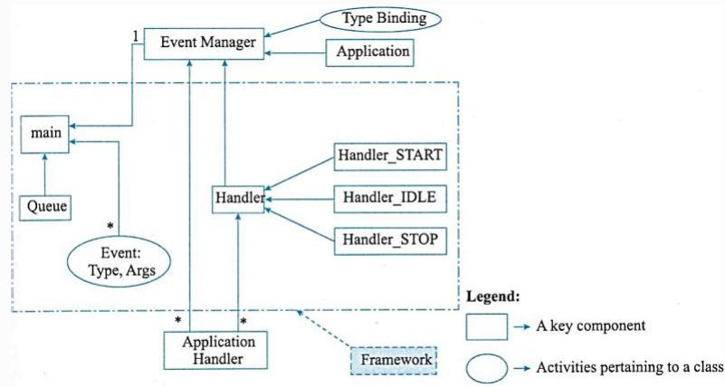

flowchart

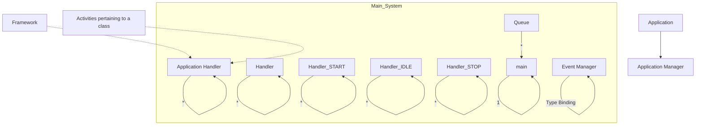

图8-7一个简单的“银行”体系结构类图

## 二、阶段2--调查和分析

在这个阶段，对评估期间需要重点关注的一些关键问题进行彻底调查。

这个阶段细分为3 个步骤。

第4步:确定架构方法

这一步涉及能够理解系统关键需求的关键架构方法。在这一步中，架构团队解释架构的流程控制，并提供关于如何达成关键目标以及是否达到关键目标的适当解释。

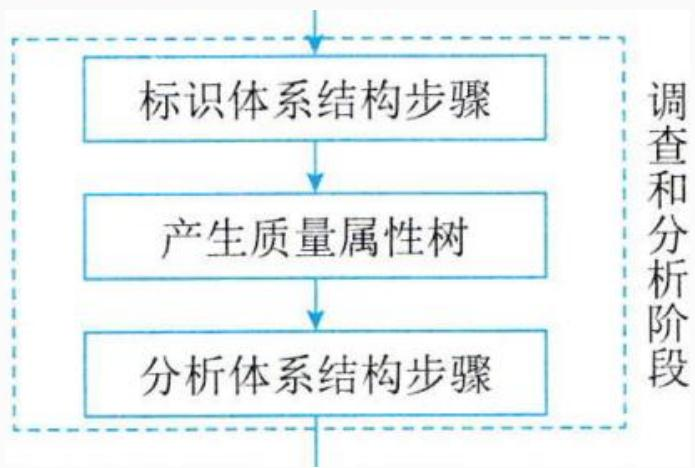

flowchart

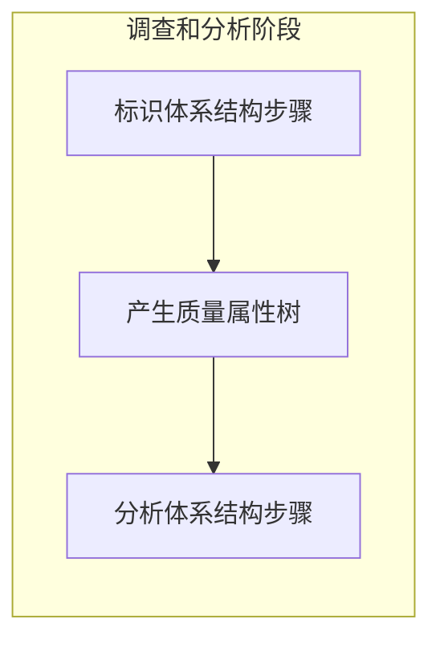

## 第5步:生成质量属性效用树

在评估阶段，确定系统最重要的质量属性目标，并确定优先次序和完善。这一步至关重要，通过建立效用树，将所有利益相关方和评估人员的注意力集中在关系到体系成功至关重要的体系结构的不同方面。

<table><tr><td>利益相关者</td><td>场景</td><td>质量属性</td></tr><tr><td rowspan="5">用户</td><td>针对系统的未授权访问</td><td>安全性</td></tr><tr><td>所有操作以尽可能快的速度处理</td><td>性能</td></tr><tr><td>失效发生后应该立即回复</td><td>可用性</td></tr><tr><td>处理使用系统过程中的用户错误</td><td>可靠性</td></tr><tr><td>处理针对系统功能的新需求</td><td>可修改性</td></tr><tr><td rowspan="6">架构师</td><td>框架的主要部分应该支持重用</td><td>可变性</td></tr><tr><td>框架的修改开销小、速度快、时间短</td><td>可修改性</td></tr><tr><td>框架中的组件能够协同交互</td><td>功能性</td></tr><tr><td>框架能够扩展以支持更复杂的选项</td><td>可变性</td></tr><tr><td>可以在不同环境中执行</td><td>可移植性</td></tr><tr><td>合适的数据封装和安全的数据结构</td><td>安全性</td></tr></table>

## 第6步:分析体系结构方法

这是"调查和分析"阶段的最后一步。

在这一步中，分析前一步生成的效用树的输出并进行彻底调查和分析，找出处理相应质量属性架构的方法。

这里还要确定每种架构方法的风险、非风险、敏感点和权衡点。

<table><tr><td>架构</td><td>风险</td><td>非风险</td></tr><tr><td>胡佛架构</td><td>—</td><td>可变性可靠性概念一致性功能性可修改性</td></tr><tr><td>银行体系结构</td><td>可变性概念一致性可修改性</td><td>可靠性功能性</td></tr></table>

## 三、阶段3--测试

第7步:头脑风暴和优先场景

这是 ATAM测试阶段的第一步。前者代表利益相关者的利益，用于理解质量属性要求。在效用树生成步骤中，主要结果是从架构师的角度来理解质量属性。在这一步中，目标是让更大的利益相关者参与其中。

flowchart

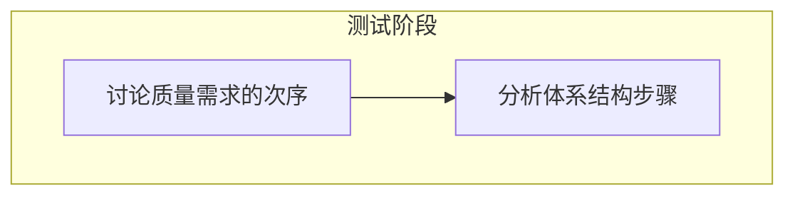

第8步:分析架构方法

这是测试阶段的最后一步。

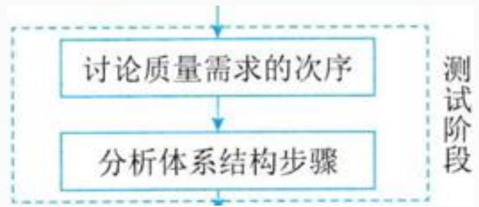

flowchart

在这一步中，我们分析上一步中高优先级的质量属性。找到了处理这些质量属性的架构设计方案，并检查相应的架构设计方案是否可支持满足这些属性。这一步重复“调查和分析”阶段的第6步。唯一的区别在于，在步骤6 中，高优先级质量属性来自效用树，而这一步需要考虑在头脑风暴投票中，高得票数的质量属性。

## 四、阶段4--报告ATAM

这是 ATAM 评估的最后阶段，其中提供了评估期间收集的所有信息。ATAM 团队将他们的发现呈现给利益相关者。

ATAM团队的主要发现通常包括：

一种效用树;  
一组生成的场景;  
一组分析问题;  
一套确定的风险和非风险;  
确定的架构方法。

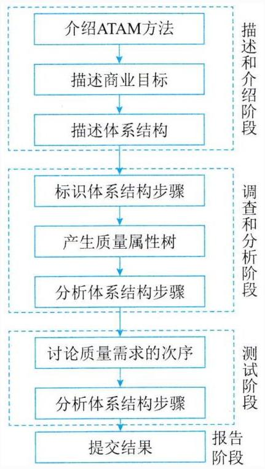

flowchart

## Thank You