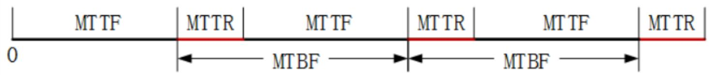
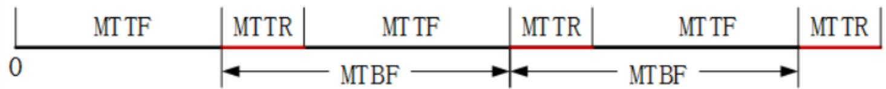
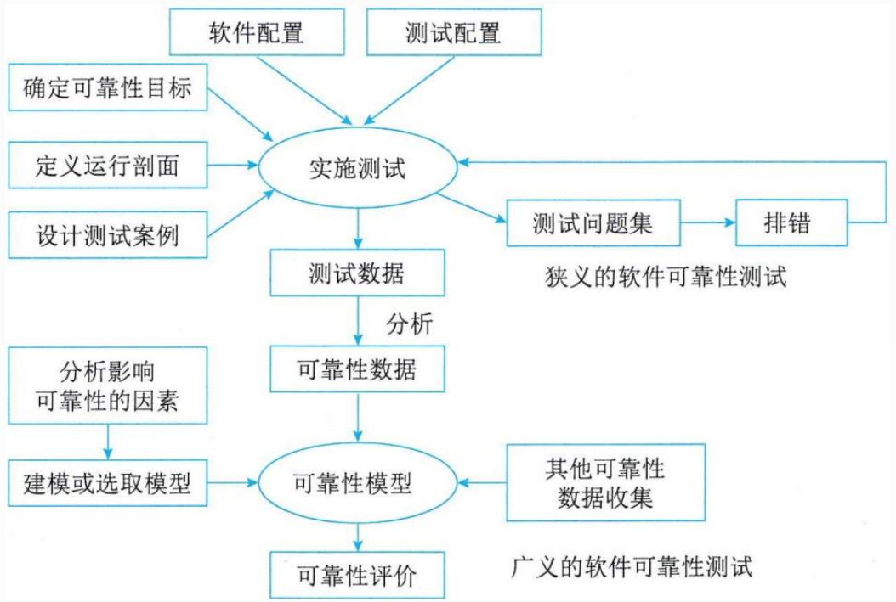
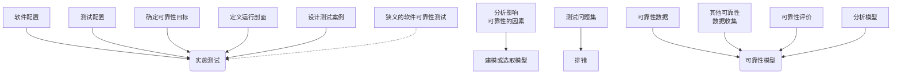
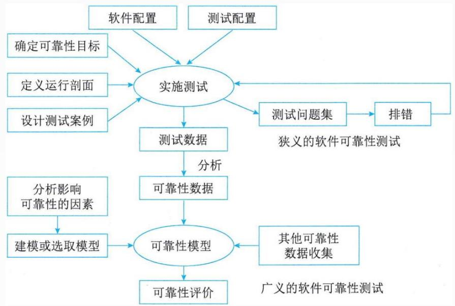
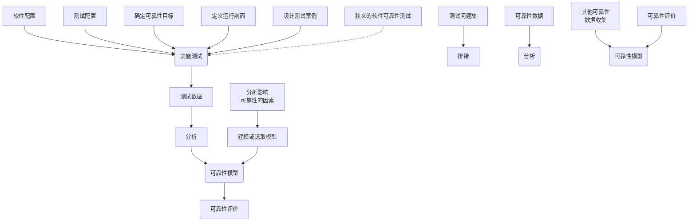

## 系统架构设计师

## 软件可靠性基本概念

## 第九章 软件可靠性基础知识

⚫ 9.1 软件可靠性基本概念  
9.2 软件可靠性建模  
9.3 软件可靠性管理  
9.4 软件可靠性设计  
9.5 软件可靠性测试  
9.6 软件可靠性评价

## 软件可靠性定义

软件可靠性(Software Reliability)是软件产品在规定的条件下和规定的时间区间完成规定功能的能力。

规定的条件是指直接与软件运行相关的使用该软件的计算机系统的状态和软件的输入条件，或统称为软件运行时的外部输入条件。  
规定的时间区间是指软件的实际运行时间区间。  
⚫ 规定功能是指为提供给定的服务，软件产品所必须具备的功能。

## 二、 软件可靠性的定量描述

从软件可靠性的定义可以看到，软件的可靠性可以基于使用条件、规定时间、系统输入、系统使用和软件缺陷等变量构建的数学表达式。

## 1.规定时间

规定时间有三种概念：

自然时间，也就是日历时间  
运行时间  
执行时间

## 2.失效概率

从软件运行开始，到某一时刻t为止，出现失效的概率。可以看作是关于软件运行时间的一个随机函数。用F(t)表示。

或指单位时间内失效的元件数与元件总数的比例。通常用λ表示。

## 3.可靠度

软件系统在规定的条件下、规定的时间内不发生失效的概率。

可靠度的公式为R(t)=1-F(t)

4.失效强度

失效强度的物理解释就是单位时间软件系统出现失效的概率。

$$
f (t) = \lim _ {\Delta t \to 0} \frac {F (t + \Delta t) - f (t)}{\Delta t} = F ^ {\prime} (t)
$$

5.平均失效前时间

系统平均失效前时间 (MTTF)也叫平均失效等待时间，定义为从0时到故障发生时系统的持续运行时间的期望值。

text_image

MT TF
MTTR
MT TF
MT TR
MT TF
MT TR
0
← MTBF → ← MTBF →

向上人生路!

## 6.平均恢复前时间

平均恢复前时间(MTTR)也叫平均故障修复时间，是从出现故障到修复成功中间的这段时间，它包括确认失效发生所必需的时间，记录所有任务的时间，还有将设备重新投入使用的时间。MTTR越小表示易恢复性越好。

## 7.平均故障间隔时间MTBF

是指相邻两次故障之间的平均时间，也称为平均故障间隔。

$$
\mathrm{MTBF} = \mathrm{MTTR} + \mathrm{MTTF} \quad \text {实际MTTR很小，所以MTBF} \approx \mathrm{MTTF}
$$

text_image

MT TF
MT TR
MT TF
MT TR
MT TF
MT TR
0
← MT BF → ← MT BF →

例：系统( )是指在规定的时间内和规定条件下能有效地实现规定功能的能力。它不仅取决于规定的使用条件等因素，还与设计技术有关。常用的度量指标主要有故障率(或失效率)、平均失效等待时间、平均失效间隔时间和可靠度等。其中，( )是系统在规定工作时间内无故障的概率。

A.可靠性

B.可用性

C.可理解性

D.可测试性

A.失效率

B.平均失效等待时间

C.平均失效间隔时间

D.可靠度

## 三、可靠性目标

使用失效强度来表示软件缺陷对软件运行的影响程度。然而在实际情况中，对软件运行的影响程度不仅取决于软件失效发生的概率，还和软件失效的严重程度有很大关系。这里引出另外一个概念--失效严重程度类。

失效严重程度类就是对用户具有相同程度影响的失效集合。

对失效严重程度的分级可以按照不同的标准进行，常见的是按对成本影响、对系统能力的影响等标准划分。

表9-1按照对成本的影响划分失效严重程度类

<table><tr><td>失效严重程度类</td><td>定义(人民币万元)</td><td>失效严重程度类</td><td>定义(人民币万元)</td></tr><tr><td>1</td><td>成本&gt;100</td><td>4</td><td>0.1&lt;成本≤1</td></tr><tr><td>2</td><td>10&lt;成本≤100</td><td>5</td><td>成本&lt;0.1</td></tr><tr><td>3</td><td>1&lt;成本≤10</td><td></td><td></td></tr></table>

表9-2按照对系统能力的影响划分失效严重程度类

<table><tr><td>失效严重程度类</td><td>定义</td></tr><tr><td>1</td><td>系统崩溃,重要数据不可恢复</td></tr><tr><td>2</td><td>系统出错停止响应,重要数据可恢复</td></tr><tr><td>3</td><td>用户重要操作无响应,可恢复</td></tr><tr><td>4</td><td>部分操作无响应,但可用其他操作方式替代</td></tr></table>

## 四、可靠性测试

广义的软件可靠性测试是指为了最终评价软件系统的可靠性而运用建模、统计、试验、分析和评价等一系列手段对软件系统实施的一种测试。一个完整的软件可靠性测试包括：

flowchart

狭义的软件可靠性测试是指为了获取可靠性数据，按预先确定的测试用例，在软件的预期使用环境中，对软件实施的一种测试。

狭义的软件可靠性测试也叫“软件可靠性试验”，它是面向缺陷的测试。

可靠性测试的目的可归纳为以下3 个方面：

(1)发现软件系统在需求、设计、编码、测试和实施等方面的缺陷。  
(2)为软件的使用和维护提供可靠性数据。  
(3)确认软件是否达到可靠性的定量要求。

## 第九章 软件可靠性基础知识

9.1 软件可靠性基本概念  
⚫ 9.2 软件可靠性建模  
9.3 软件可靠性管理  
9.4 软件可靠性设计  
9.5 软件可靠性测试  
9.6 软件可靠性评价

## 影响软件可靠性的因素

软件可靠性模型是指为预计或估算软件的可靠性所建立的可靠性框图和数学模型，建立可靠性模型是为了将复杂系统的可靠性逐级分解为简单系统的可靠性，以便于定量预计、分配、估算和评价复杂系统的可靠性。

flowchart

从技术的角度来看，影响软件可靠性的因素如下：

(1)运行剖面(环境)  
(2)软件规模  
(3)软件内部结构  
(4)软件的开发方法和开发环境  
(5)软件的可靠性投入

## 二、软件可靠性模型分类

种子法模型  
失效率类模型  
曲线拟合类模型  
可靠性增长模型  
程序结构分析模型  
输入域分类模型  
执行路径分析方法模型  
非齐次泊松过程模型  
马尔可夫过程模型  
贝叶斯分析模型

## 第九章 软件可靠性基础知识

9.1 软件可靠性基本概念  
9.2 软件可靠性建模  
9.3 软件可靠性管理  
9.4 软件可靠性设计  
9.5 软件可靠性测试  
9.6 软件可靠性评价

软件可靠性管理是软件工程管理的一部分，它以全面提高和保证软件可靠性为目标，以软件可靠性活动为主要对象，是把现代管理理论用于软件生命周期中的可靠性保障活动的一种管理形式。

软件可靠性活动是贯穿于软件开发全过程的。

## 1.需求分析阶段

（1）确定软件的可靠性目标。  
（2）分析可能影响可靠性的因素。  
（3）确定可靠性的验收标准。  
（4）制定可靠性管理框架。  
（5）制定可靠性文档编写规范。  
（6）制订可靠性活动初步计划。  
（7）确定可靠性数据收集规范。

## 2.概要设计阶段

（1）确定可靠性度量。  
（2）制定详细的可靠性验收方案。  
（3）可靠性设计。  
（4）收集可靠性数据。  
（5）调整可靠性活动计划。  
（6）明确后续阶段的可靠性活动的详细计划。  
（7）编制可靠性文档。

## 3.详细设计阶段

（1）可靠性设计。  
（2）可靠性预测（确定可靠性度量估计值）。  
（3）调整可靠性活动计划。  
（4）收集可靠性数据。  
（5）明确后续阶段的可靠性活动的详细计划。  
（6）编制可靠性文档。

## 4.编码阶段

（1）可靠性测试（含于单元测试）。  
（2）排错。  
（3）调整可靠性活动计划。  
（4）收集可靠性数据。  
（5）明确后续阶段的可靠性活动的详细计划。  
（6）编制可靠性文档。

## 5.测试阶段

（1）可靠性测试（含于集成测试、系统测试）。  
（2）排错。  
（3）可靠性建模。  
（4）可靠性评价。  
（5）调整可靠性活动计划。  
（6）收集可靠性数据。  
（7）明确后续阶段的可靠性活动的详细计划。  
（8）编制可靠性文档。

## 6.实施阶段

（1）可靠性测试（含于验收测试）。  
（2）排错。  
（3）收集可靠性数据。  
（4）调整可靠性模型。  
（5）可靠性评价。  
（6）编制可靠性文档。

## Thank You