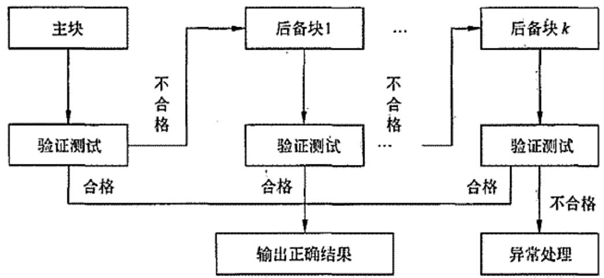
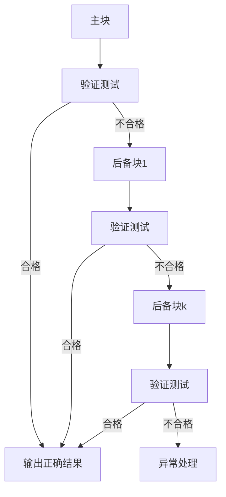
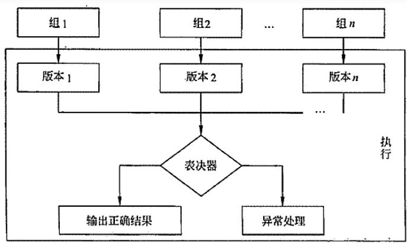
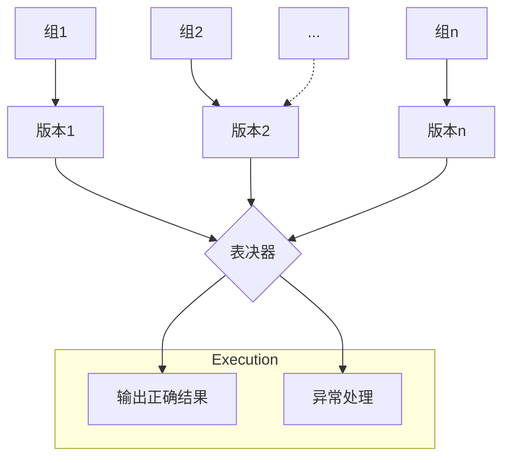
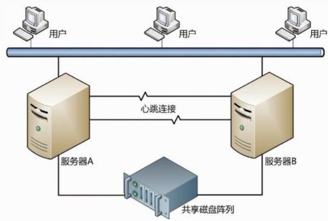
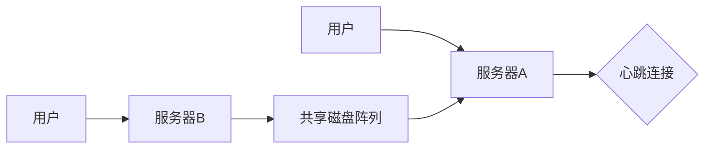
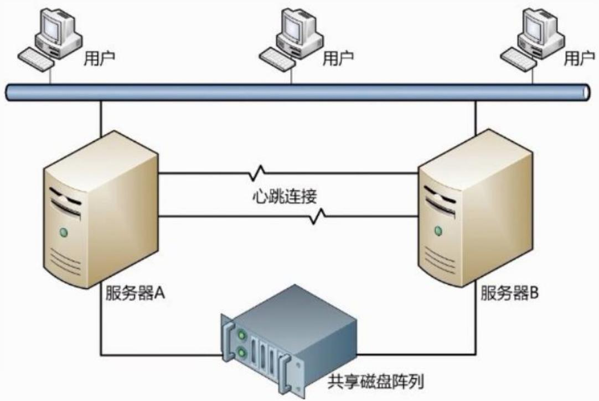
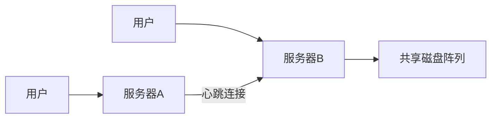
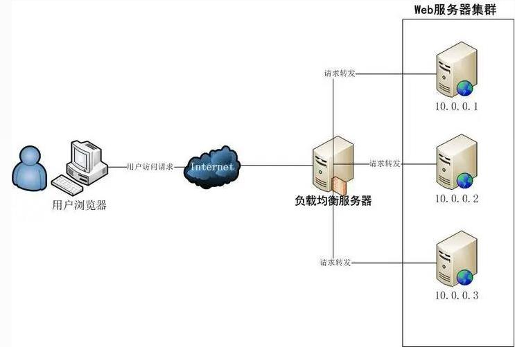
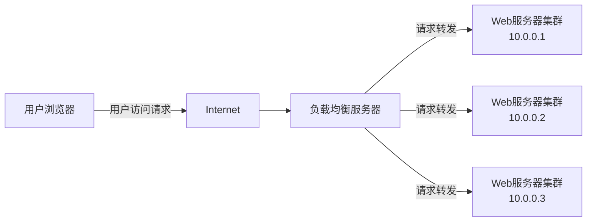

## 系统架构设计师

## 软件可靠性设计

## 第九章 软件可靠性基础知识

9.1 软件可靠性基本概念  
9.2 软件可靠性建模  
9.3 软件可靠性管理  
9.4 软件可靠性设计  
9.5 软件可靠性测试  
9.6 软件可靠性评价

软件可靠性设计的原则：

(1)软件可靠性设计是软件设计的一部分，必须在软件的总体设计框架中使用，并且不能与其他设计原则相冲突。  
(2)软件可靠性设计在满足提高软件质量要求的前提下，以提高和保障软件可靠性为最终目标。  
(3)软件可靠性设计应确定软件的可靠性目标，不能无限扩大化，并且排在功能度、用户需求和开发费用之后考虑。

被认可的且具有应用前景的软件可靠性设计技术主要有：

容错设计技术  
检错设计技术  
降低复杂度设计技术

## 容错设计技术

常用的软件容错技术主要有：

1.恢复块设计  
2.N版本程序设计  
3.冗余设计

## 1.恢复块设计

恢复块方法是一种动态的故障屏蔽技术，采用后向恢复策略。它提供具有相同功能的主块和几个后备块，一个块就是一个执行完整的程序段，主块首先投入运行，结束后进行验证测试，如果没有通过验证测试，系统经现场恢复后由一后备块运行。

被选择用来构建恢复块的程序块可以是模块、过程、子程序和程

序段等。

flowchart

## 2.N版本程序设计

N版本程序设计是一种静态的故障屏蔽技术，采用前向恢复的策略，其设计思想是用n个具有相同功能的程序同时执行 一项计算，结果通过多数表决来选择。

n份程序必须由不同的人独立设计，使用不同的方法，不同的设计语言，不同的开发环境和工具来实现。目的是减少n版本软件在表决点上相关错误的概率。

flowchart

## 3.冗余设计

软件的冗余设计技术实现的原理是在一套完整的软件系统之外，设计一种不同路径、不同算法或不同实现方法的模块或系统作为备份，在出现故障时可以使用冗余的部分进行替换，从而维持软件系统的正常运行。

## 二、检错技术

检错技术，在软件出现故障后能及时发现并报警，提醒维护人员进行处理。

检错技术实现的代价一般低于容错技术和冗余技术，但它有一个明显的缺点，就是不能自动解决故障，出现故障后如果不进行人工干预，将最终导致软件系统不能正常运行。

采用检错设计技术要着重考虑几个要素：检测对象、检测延时、实现方式和处理方式。

## 三、降低复杂度

降低复杂度设计的思想就是在保证实现软件功能的基础上，简化软件结构，缩短程序代码度，优化软件数据流向，降低软件复杂度，从而提高软件可靠性。

软件复杂性分为模块复杂性和结构复杂性。

⚫ 模块复杂性主要包含模块内部数据流向和程序长度两个方面。  
结构复杂性用不同模块之间的关联程度来表示。

## 四、系统配置技术

## 1.双机热备技术

双机热备技术是一种软硬件结合的较高容错应用方案。该方案由两台服务器系统和一个外接共享磁盘阵列柜和相应的双机热备份软件组成。操作系统和应用程序安装在两台服务器的本地系统盘上，整个网络系统的数据是通过磁盘阵列集中管理和数据备份的。用户的数据存放在外接共享磁盘阵列中，当一台服务器出现故障

时，备机主动替代主机工作，保证网络服务不间断。

flowchart

双机热备方案中，根据两台服务器的工作方式可以有 3 种不同的工作模式，

双机热备模式 $_ { \cdot } ( \mathsf { A c t i v e } / \mathsf { S t a n d b y } )$  
双机互备模式  
双机双工模式(实现负载均衡)

flowchart

## 2.服务器集群技术

集群技术是指一组相互独立的服务器在网络中组合成为单一的系统工作，并以单一系统的模式加以管理。集群中所有的计算机拥有一个共同的名称，集群内任一系统上运行的服务可被所有的网络客户所使用。当某结点服务器发生故障时，这台服务器上所运行的应用程序将在另一结点服务器上被自动接管。

flowchart

## Thank You