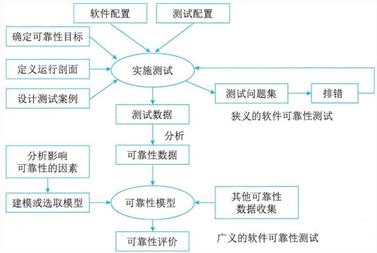
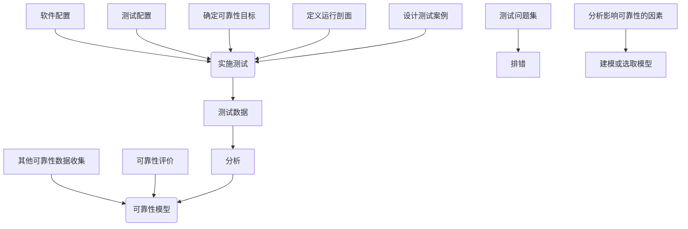
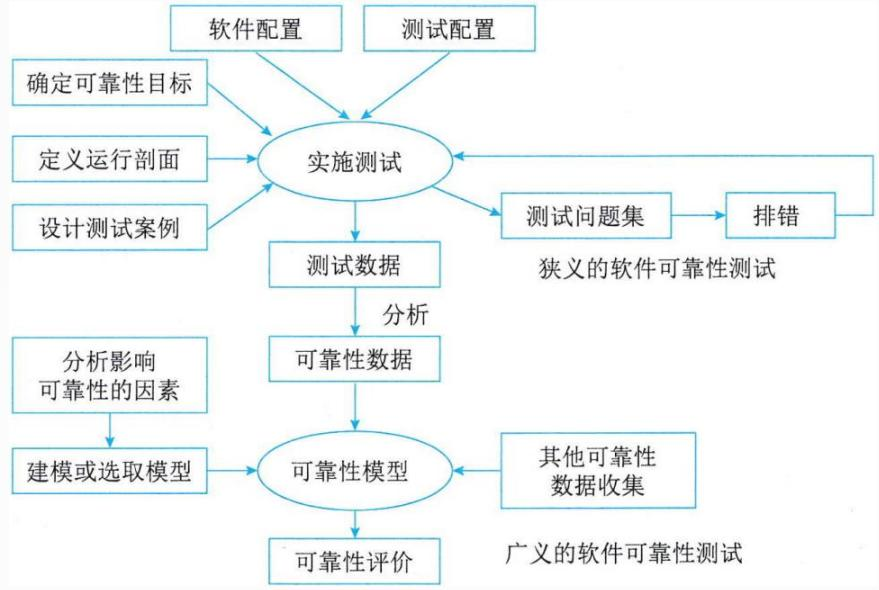
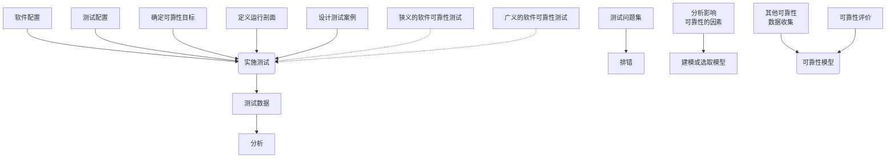

## 系统架构设计师

## 软件可靠性测试

## 第九章 软件可靠性基础知识

9.1 软件可靠性基本概念  
9.2 软件可靠性建模  
9.3 软件可靠性管理  
9.4 软件可靠性设计  
9.5 软件可靠性测试  
9.6 软件可靠性评价

## 一、软件可靠性测试概述

传统的软件测试是面向错误的测试，测试所得的数据不能直接用于软件可靠性评价，必须经过一定的分析处理后方可使用可靠性模型进行可靠性评价。

软件可靠性测试由可靠性目标的确定、运行剖面的开发、测试用例的设计、测试实施、测试结果的分析等活动组成。

flowchart

## 二、定义软件运行剖面

定义运行剖面首先需要为软件的使用行为建模，然后是开发使用模型，明确需要测试的内容。

定义使用概率的最佳方法是使用实际的用户数据，如来自系统原型、前一版本的使用数据；其次是由该软件应用领域的用户和专家提供的预期使用数据，在没有任何数据可用的情况下，只能是将每个状态现有的弧分配相同的概率，这是最差的一种方法。

由于软件可靠性行为是相对于软件实际的运行剖面而言的，同一软件在不同运行剖面下其可靠性表现可能大不相同，所以用于可靠性测试准备的运行剖面的开发与定义必须充分分析和考虑软件的实际运行情况。

## 三、可靠性测试用例设计

设计测试用例就是针对特定功能或组合功能设计测试方案，并编写成文档。测试用例的选择既要有一般情况，也应有极限情况以及最大和最小的边界值情况。因为测试的目的是暴露应用软件中隐藏的缺陷，所以在设计选取测试用例和数据时要考虑那些易于发现缺陷的测试用例和数据，结合复杂的运行环境，在所有可能的输入条件和输出条件中确定测试数据，来检查应用软件是否都能产生正确的输出。优先测试那些最重要或最频繁使用的功能，释放和缓解最高级别的风险，有助于尽早发现那些对可靠性有最大影响的故障，以保证软件的按期交付。 

## 典型的测试用例包括以下内容：

测试用例标识  
被测对象  
测试环境及条件  
测试输入  
操作步骤  
预期输出  
测试对象的特殊需求

判断输出结果是否符合标准

<table><tr><td>ID</td><td>类型</td><td>测试步骤</td><td>输入数据</td><td>期望的结果</td></tr><tr><td>001</td><td>登录</td><td>输入用户、密码,点击“登录”</td><td>用户名:user密码:987654</td><td>提示登录成功</td></tr><tr><td>002</td><td>登录</td><td>输入用户、密码,点击“登录”</td><td>用户名:test密码:987654</td><td>提示用户名错误,请重新输入</td></tr><tr><td>003</td><td>登录</td><td>输入用户、密码,点击“登录”</td><td>用户名:user密码:123456</td><td>提示密码错误,请重新输入</td></tr><tr><td>004</td><td>登录</td><td>输入用户、密码,点击“登录”</td><td>用户名:密码:123456</td><td>提示用户名不能为空,请输入用户名</td></tr><tr><td>005</td><td>登录</td><td>输入用户、密码,点击“登录”</td><td>用户名:user密码:</td><td>提示密码不能为空,请输入密码</td></tr></table>

## 四、可靠性测试的实施

开发方交付的任何软件文档中与可靠性质量特性有关的部分、程序以及数据都应当按照需求说明和质量需求进行测试。在项目合同、需求说明书和用户文档中规定的所有配置情况下，程序和数据都必须进行测试。软件可靠性数据是可靠性评价的基础。为了获得更多的可靠性数据，应该使用多台计算机同时运行软件，以增加累计运行时间。

应该按照相关标准的要求，制定和实施软件错误报告和可靠性数据收集、保存、分析和处理的规程，完整、准确地记录软件测试阶段的软件错误报告和收集可靠性数据。 

测试活动结束后要编写《软件可靠性测试报告》，对测试用例及测试结果在测试报告中加以总结归纳。

测试报告应包括以下内容：

软件产品标识  
测试环境配置(硬件和软件)  
测试依据  
测试结果  
测试问题  
测试时间

## 第九章 软件可靠性基础知识

9.1 软件可靠性基本概念  
9.2 软件可靠性建模  
9.3 软件可靠性管理  
9.4 软件可靠性设计  
9.5 软件可靠性测试  
9.6 软件可靠性评价

## 一、软件可靠性评价概述

软件可靠性评价工作是指选用或建立合适的可靠性数学模型，运用统计技术和其他手段，对软件可靠性测试和系统运行期间收集的软件失效数据进行处理，并评估和预测软件可靠性的过程。

## 软件可靠性评价过程包含如下三个方面

1.选择可靠性模型  
2.收集可靠性数据  
3.可靠性评估和预测

flowchart

## 二、选择可靠性模型

对于不同的软件系统，不同的可靠性分析目的，模型的适用性是不一样的。可以从以下四方面进行模型的比较和选择。

1.模型假设的适用性  
2.预测的能力与质量  
3.模型输出值能否满足可靠性评价需求  
4.模型使用的简便性

## 三、收集可靠性数据

面向缺陷的可靠性测试产生的测试数据经过分析后，可以得到非常有价值的可靠性数据，是可靠性评价所用数据的一个重要来源，这部分数据取决于定义的运行剖面和选取的测试用例集。

可靠性数据主要是指软件失效数据，是软件可靠性评价的基础，主要是在软件测试、实施阶段收集的。

在软件工程的需求、设计和开发阶段的可靠性活动，也会产生影响较大的其他可靠性数据。因此，可靠性数据的收集工作是贯穿于整个软件生命周期的。

## 四、可靠性评估和预测

软件可靠性的评估和预测的主要目的，是为了评估软件系统的可靠性状况和预测将来一段时间的可靠性水平。

目前有不少支持软件可靠性估计的软件工具，只要将收集的失效数据分类、录入合适的可靠性模型，就可以获得软件可靠性的评价结果。

软件可靠性评估和预测以软件可靠性模型分析为主，但也要在模型之外运用一些统计技术和手段对可靠性数据进行分析，作为可靠性模型的补充、完善和修正。

## Thank You