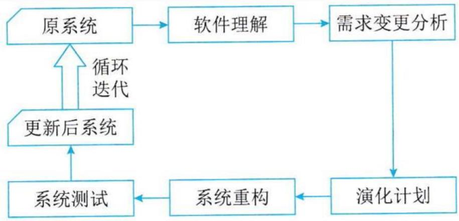
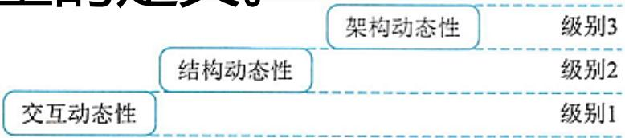
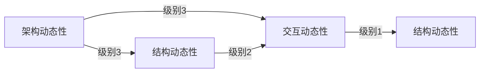

## 系统架构设计师

## 之

## 软件架构演化和定义的关系

## 第十章 软件架构的演化和维护

⚫ 10.1 软件架构的演化和定义的关系  
10.2 面向对象软件架构演化过程  
⚫ 10.3 软件架构演化方式的分类  
10.4 软件架构演化原则  
10.5 软件架构演化评估方法  
10.6 大型网站系统架构演化实例  
10.7 软件架构维护

软件架构的演化和维护的目的是为了使软件能够适应环境的变化而进行的纠错性修改和完善性修改。软件架构的演化和维护过程是一个不断迭代的过程，通过演化和维护，软件架构逐步得到完善，以满足用户需求。

软件架构的演化就是软件整体结构的演化，演化过程涵盖软件架构的全生命周期，包括软件架构需求的获取、软件架构建模、软件架构文档、软件架构实现以及软件架构维护等阶段。所以，人们通常说软件架构是演化来的，而不是设计来的。

软件架构定义是SA={组件，连接件，约束}，这类软件架构演化主要关注的就是组件、连接件和约束的添加、修改与删除等。

组件是软件架构的基本要素和结构单元，表示系统中主要的计算元素、数据存储以及一些重要模块，当需要消除软件架构存在的缺陷、新增功能、适应新的环境时都涉及组件的演化。组件的演化体现在组件中模块的增加、删除或修改。  
连接件是组件间的交互关系，多数情况下组件的演化牵涉到连接件的演化。连接件的演化体现在组件交互消息的增加、删除或改变。  
约束是组件和连接件之间的拓扑关系和配置，它为组件和连接件高级项目经理 提供额外数据支撑，可以是架构的约束数据，或架构的参数。

## 第十章 软件架构的演化和维护

10.1 软件架构的演化和定义的关系  
10.2 面向对象软件架构演化过程  
⚫ 10.3 软件架构演化方式的分类  
10.4 软件架构演化原则  
10.5 软件架构演化评估方法  
10.6 大型网站系统架构演化实例  
10.7 软件架构维护

软件架构演化典型的分类方法:

(1)按照软件架构的实现方式和实施粒度分类：基于过程和函数的演化、面向对象的演化、基于组件的演化和基于架构的演化。  
(2)按照研究方法将软件架构演化方式分为4类：第1类是对演化的支持，如代码模块化的准则、可维护性的支持(如内聚和耦合)、代码重构等；第2类是版本和工程的管理工具，如CVS 和COCOMO；第3类是架构变换的形式方法，包括系统结构和行为变换的模型，以及架构演化的重现风格等；第4类是架构演化的成本收益分析决定如何增加系统的弹性。

(3)针对软件架构的演化过程是否处于系统运行时期，将软架构演化分为静态演化和动态演化 。

静态演化发生在软件架构的设计、实现和维护过程中，软件系统还未运行或者处在运行停止状态。  
动态演化发生在软件系统运行过程中。

## 软件架构演化时期

1.设计时演化

设计时演化是指发生在体系结构模型和与之相关的代码编译之前的软件架构演化。

2.运行前演化

运行前演化是指发生在编译之后、执行之前的软件架构演化，这时由于应用程序并未执行，修改时不用考虑应用程序的状态，但需要考虑系统的体系结构，且系统需要具有添加和删除组件的机制。 

## 3.有限制运行时演化

有限制运行时演化是指系统在设计时就规定了演化的具体条件，将系统置于“安全”模式下，演化只发生在某些特定约束满足时，可以进行一些规定好的演化操作。

## 4.运行时演化

运行时演化是指系统的体系结构在运行时不能满足要求时发生的软件架构演化，包括添加组件、删除组件、升级替换组件、改变体系结构的拓扑结构等。此时的演化是最难实现的。

## 二、软件架构静态演化

## 1.静态演化需求

软件架构静态演化的需求是广泛存在的，可归结为两个方面。

(1)设计时演化需求。在架构开发和实现过程中对原有架构进行调整，保证软件实现与架构的一致性以及软件开发过程的顺利进行。  
(2)运行前演化需求。软件发布之后由于运行环境的变化，需要对软件进行修改升级，在此期间软件的架构同样要进行演化。

## 2.静态演化的一般过程

软件静态演化是系统停止运行期间的修改和更新，即一般意义上的软件修复和升级。与此时相对应的维护方法有三类：更正性维护、适应性维护、完善性维护。

软件的静态演化包括如下 5 个步骤：

软件理解：查阅软件文档，分析软件架构，识别系统组成元素及其之间的相互关系，提取系统的抽象表示形式。  
需求变更分析：静态演化往往是由于用户需求变化、系统运行出错和运行环境发生改变等原因所引起的，需要找出新的软件需求与原有的差异。  高级项目经理任

演化计划：分析原系统，确定演化范围和成本，选择合适的演化计划。  
系统重构：根据演化计划对系统进行重构，使之适应当前的需求。  
⚫ 系统测试：对演化后的系统进行测试，查找其中的错误和不足。

flowchart

图10-4静态演化过程模型

## 三、软件架构动态演化

动态演化是在系统运行期间的演化，在不停止系统功能的情况下完成演化，较之静态演化更加困难。具体发生在有限制的运行时演化和运行时演化阶段。

1.动态演化的类型  
1)软件动态性的等级

软件的动态性分为3 个级别：

交互动态性，要求数据在固定的结构下动态交互。  
结构动态性，允许对结构进行修改，通常形式是组件和连接件实例的添加和删除，这种动态性是研究和应用的主流。  
⚫ 架构动态性，允许软件架构的基本构造变动，即结构可以被重定义，如新的组件类型的定义。

flowchart

图10-6软件的三级动态性

## 2)动态演化的内容

根据所修改的内容不同，软件的动态演化包括以下 4 个方面：

属性改名：目前所有的ADL都支持对非功能属性的分析和规约，而在运行过程中，用户可能会对这些指标进行重新定义(如服务响应时间)。  
行为变化：在运行过程中，用户需求变化或系统自身服务质量的调节都将引发软件行为的变化。如，为了提高安全级别而更换加密算法；将HTTP协议改为HTTPS协议。

拓扑结构改变：如增删组件，增删连接件，改变组件与连接件之间的关联关系等。  
⚫ 风格变化：一般软件演化后其架构风格应当保持不变，如果非要改变软件的架构风格也只能将架构风格变为衍生风格。如将两层C/S结构调整为三层C/S结构等。

## Thank You