## 系统架构设计师

## 之 软件架构演化评估方法

## 第十章 软件架构的演化和维护

10.1 软件架构的演化和定义的关系  
10.2 面向对象软件架构演化过程  
⚫ 10.3 软件架构演化方式的分类  
10.4 软件架构演化原则  
10.5 软件架构演化评估方法  
10.6 大型网站系统架构演化实例  
10.7 软件架构维护

## 根据演化过程是否已知可将评估过程分为:

演化过程已知的评估  
演化过程未知的评估

## 一、演化过程已知的评估

演化过程已知的评估其目的在于通过对架构演化过程进行度量，比较架构内部结构上的差异以及由此导致的外部质量属性上的变化，对该演化过程中相关质量属性进行评估。涉及评估流程以及具体的相关指标的计算方法。

## 1.评估流程

架构演化评估的基本思路是将架构度量应用到演化过程中，通过对演化前后的不同版本的架构分别进行度量，得到度量结果的差值及其变化趋势，并计算架构间质量属性距离，进而对相关质量属性进行评估。 

## 2.架构演化中间版本度量

对于不同类型的质量属性，其度量方法不同，度量结果的类型也

不同。本章主要度量的是架构的可维护性和可靠性。

对于可靠性，度量结果是一个实数值。  
对于可维护性，它包含圈复杂度、扇入扇出度、模块间耦合度、模块的响应、紧内聚度、松内聚度等 6个子度量指标。

通过比较原子演化前后架构质量属性 Qi-1和Qi间的变化，可以分析该类演化对评估系统的外部质量属性的影响，进而找出架构内部结构变化和外部质量属性变化间的关联。

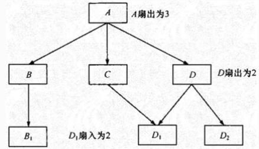

flowchart

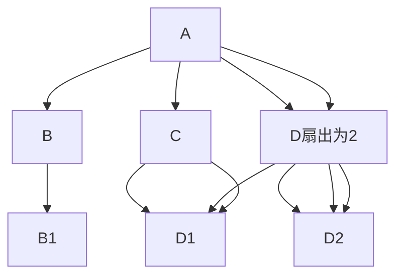
```mermaid
graph TD
  A["A"] --> B["B"]
  A --> C["C"]
  A --> D["D"]
  B --> B1["B1"]
  C --> D1["D1"]
  D --> D2["D2"]
  D --> D1
  D --> D2
  A --> D["D扇出为2"]
  C --> D1
  D --> D2
```

## 二、演化过程未知的评估

演化过程未知时，我们无法像演化过程已知时那样追踪架构在演化过程中的每一步变化，只能根据架构演化前后的度量结果逆向推测出架构发生了哪些改变，并分析这些改变与架构相关质量属性的关联关系。

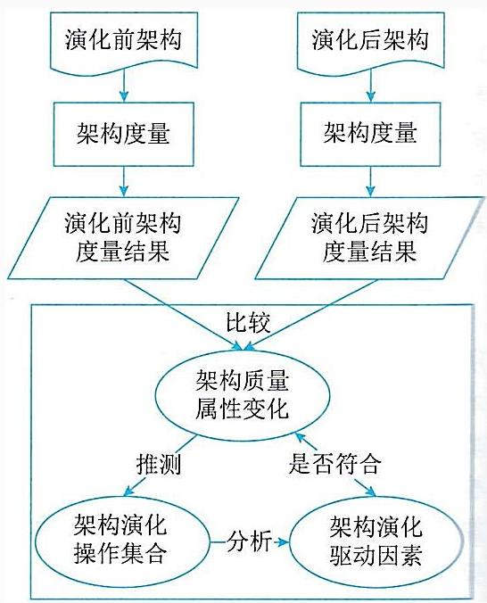

flowchart

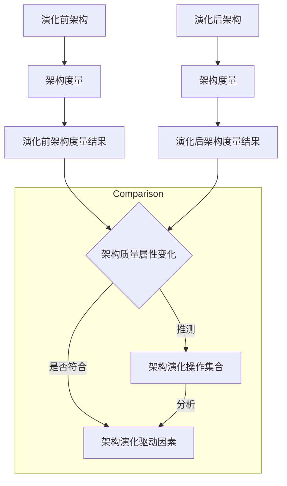
```mermaid
graph TD
  A["演化前架构"] --> B["架构度量"]
  C["演化后架构"] --> D["架构度量"]
  B --> E["演化前架构度量结果"]
  D --> F["演化后架构度量结果"]
  E --> G{"架构质量属性变化"}
  F --> G
  subgraph Comparison
  G -->|推测| H["架构演化操作集合"]
  G -->|是否符合| I["架构演化驱动因素"]
  H -->|分析| I
  end
```

## 第十章 软件架构的演化和维护

10.1 软件架构的演化和定义的关系  
10.2 面向对象软件架构演化过程  
⚫ 10.3 软件架构演化方式的分类  
10.4 软件架构演化原则  
10.5 软件架构演化评估方法  
⚫ 10.6 大型网站系统架构演化实例  
10.7 软件架构维护

## 一、第一阶段: 单体架构

小型网站最开始没有太多人访问，只需要一台服务器就绰绰有余，这时网站的应用程序、数据库、文件等所有资源都在一台服务器上。

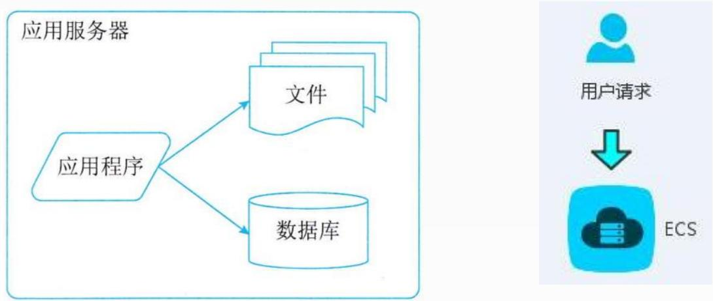

## 二、第二阶段: 垂直架构

将应用和数据分离，整个网站使用 3 台服务器的：应用服务器、文件服务器和数据库服务器。

⚫ 应用服务器处理大量的业务逻辑，因此需要更快更强大的处理器速度。  
数据库服务器需要快速磁盘检索和数据缓存，因此需要更快的  
磁盘和更大的内存。

文件服务器需要存储大量用户上传的文件，因此需要更大容量的硬盘。

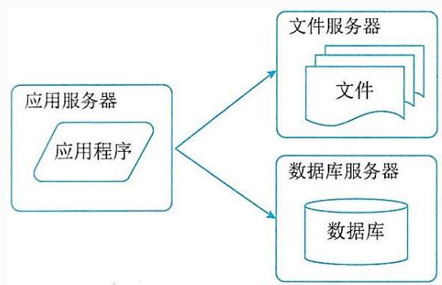

flowchart

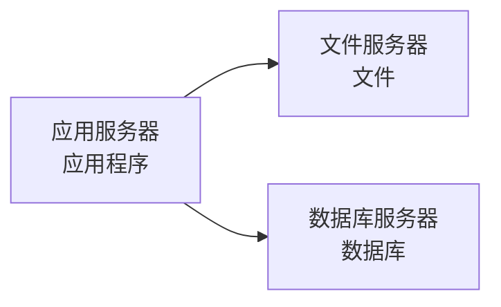
```mermaid
graph LR
  A["应用服务器\n应用程序"] --> B["文件服务器\n文件"]
  A --> C["数据库服务器\n数据库"]
```

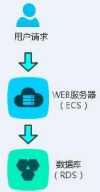

flowchart

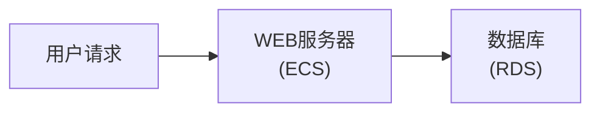
```mermaid
graph LR
  A["用户请求"] --> B["WEB服务器\n(ECS)"]
  B --> C["数据库\n(RDS)"]
```

## 三、第三阶段: 使用缓存改善网站性能

把经常访问的小部分数据缓存在内存中，可以减少数据库的访问压力，提高整个网站的数据访问速度，改善数据库的写入性能。

网站使用的缓存可分为两种：

缓存在应用服务器上的本地缓存  
⚫ 缓存在专门的分布式缓存服务器上的远程缓存使用缓存后，数据访问压力得到有效缓解，但是单一应用服务器能够处理的请求连接有限，在网站访问高峰期，应用服务器成为整个网站的瓶颈。

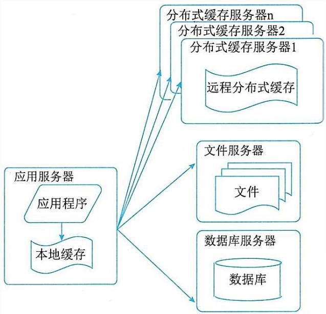

flowchart

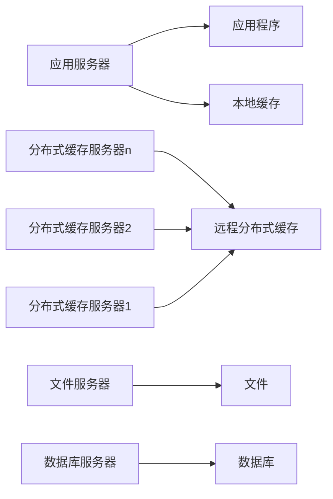
```mermaid
graph LR
  A["应用服务器"] --> B["应用程序"]
  A --> C["本地缓存"]
  D["分布式缓存服务器n"] --> E["远程分布式缓存"]
  F["分布式缓存服务器2"] --> E
  G["分布式缓存服务器1"] --> E
  H["文件服务器"] --> I["文件"]
  J["数据库服务器"] --> K["数据库"]
```

四、第四阶段: 使用服务集群改善网站并发处理能力通过增加服务器的方式改善负载压力、提高系统性能，从而实现系统的可伸缩性。应用服务器集群是网站可伸缩架构设计中较为简单成熟的一种。

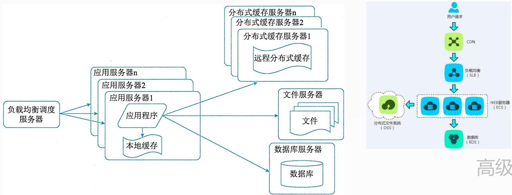

## 五、第五阶段: 数据库读写分离

在网站的用户达到一定规模后，数据库因为负载压力过高而成为网站的瓶颈。目前的主流数据库提供主从热备功能，通过配置两台数据库主从关系，可以将一台数据库服务器的数据更新同步另一台服务器上。网站利用数据库的这一功能，实现数据库读写分离，从而改善数据库负载压力。

应用服务器在写数据的时候，访问主数据库，主数据库通过主从复制(同步)机制将数据更新同步到从数据库，这样当应用服务器读数据的时候，就可以通过从数据库获得数据。

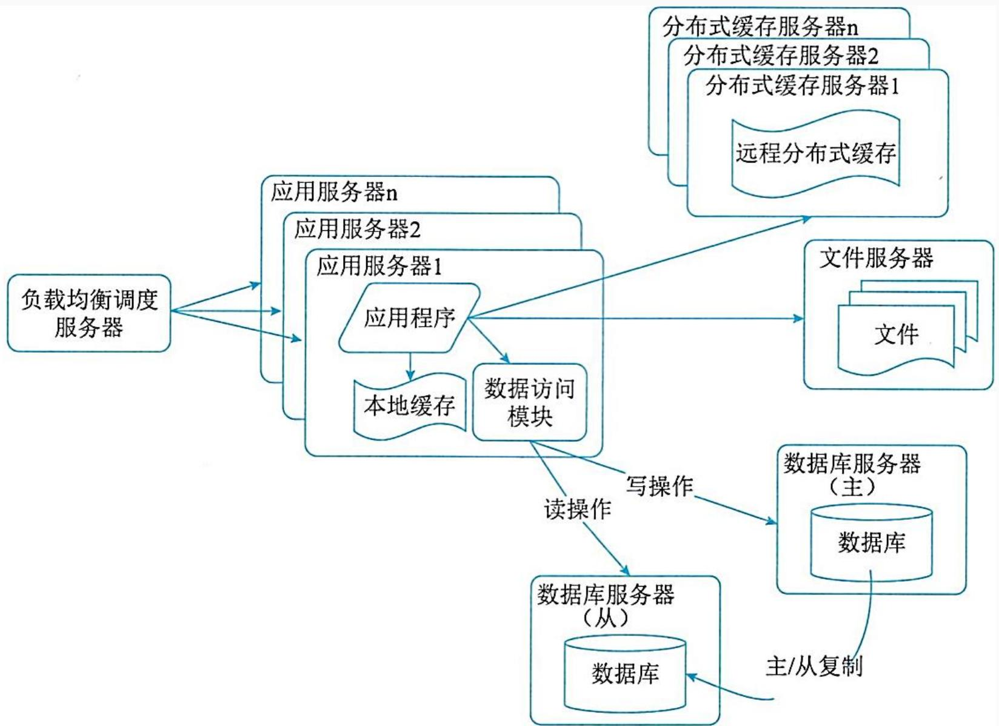

flowchart

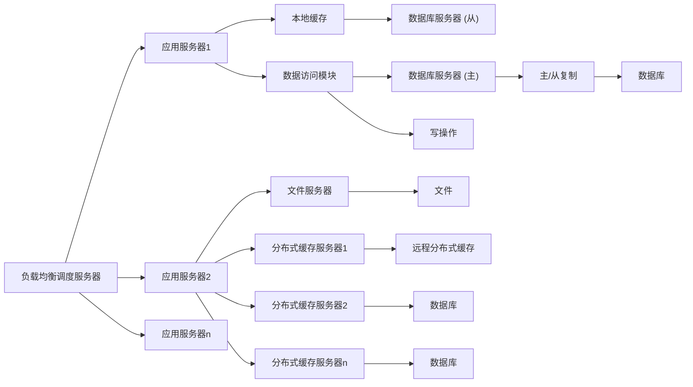
```mermaid
graph LR
  A["负载均衡调度服务器"] --> B["应用服务器1"]
  A --> C["应用服务器2"]
  A --> D["应用服务器n"]
  
  B --> E["本地缓存"]
  B --> F["数据访问模块"]
  C --> G["文件服务器"]
  C --> H["分布式缓存服务器1"]
  C --> I["分布式缓存服务器2"]
  C --> J["分布式缓存服务器n"]
  
  E --> K["数据库服务器 (从)"]
  F --> L["数据库服务器 (主)"]
  F --> M["写操作"]
  
  G --> N["文件"]
  H --> O["远程分布式缓存"]
  I --> P["数据库"]
  J --> Q["数据库"]
  
  L --> R["主/从复制"]
  R --> S["数据库"]
```

## 六、第六阶段: 使用反向代理和 CDN 加速网站响应

随着网站业务不断发展，用户规模越来越大，由于区域的差别使得网络环境异常复杂，不同地区的用户访问网站时，速度差别也极大。为了更好的用户体验，网站需要加速网站访问速度。主要手段有使用CDN 和反向代理。CDN和反向代理的基本原理都是缓存。

⚫ CDN部署在网络提供商的机房，使用户在请求网站服务时，可以从距离自己最近的网络提供商机房获取数据。  
反向代理部署在网站的中心机房，当用户请求到达中心机房后，首先访问的服务器是反向代理服务器，如果反向代理服务器中缓存着用户请求的资源，就将其直接返回给用户。高级项目经理 任

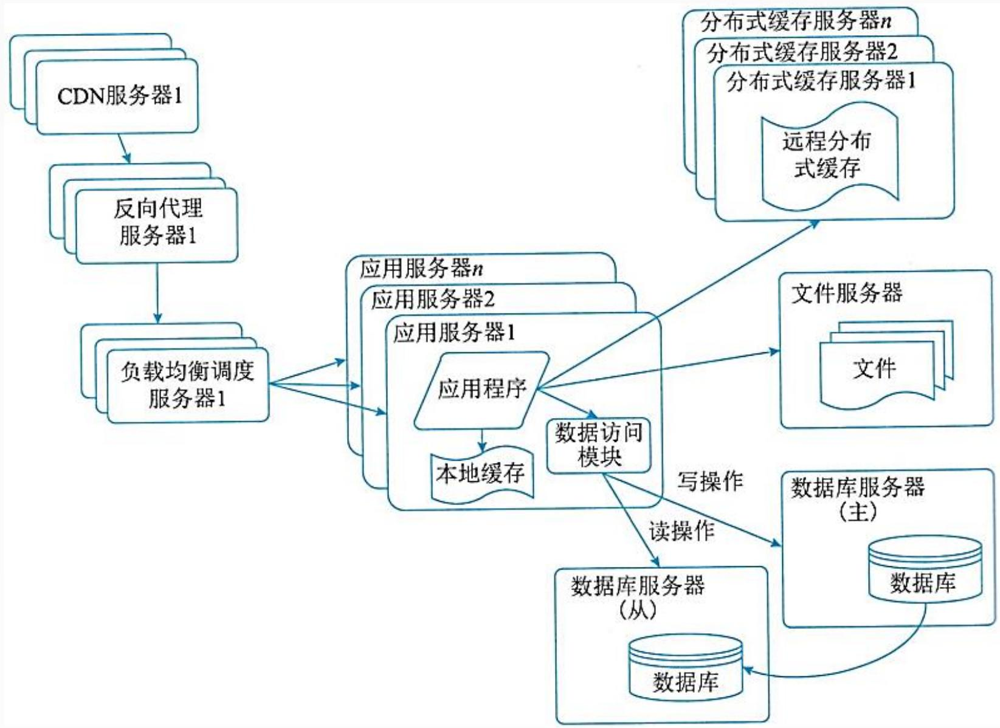

flowchart

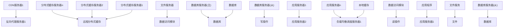
```mermaid
graph TD
  A["CDN服务器1"] --> B["反向代理服务器1"]
  C["分布式缓存服务器n"] --> D["远程分布式缓存"]
  E["分布式缓存服务器2"] --> D
  F["分布式缓存服务器1"] --> D
  G["文件服务器"] --> H["数据访问模块"]
  I["数据库服务器(主)"] --> J["数据库"]
  K["数据库服务器(从)"] --> L["写操作"]
  M["应用服务器1"] --> N["应用服务器2"]
  O["应用服务器n"] --> P["负载均衡调度服务器1"]
  Q["本地缓存"] --> P
  R["数据库"] --> J
  S["数据访问模块"] --> T["读操作"]
  U["应用程序"] --> V["应用服务器1"]
  W["文件服务"] --> X["文件"]
  Y["数据库服务器(从)"] --> Z["数据库"]
```

七、第七阶段: 使用分布式文件系统和分布式数据库系统任何强大的单一服务器都满足不了大型网站持续增长的业务需求。数据库经过读写分离后，一台服务器拆分成两台服务器，但是随着网站业务的发展依然不能满足需求，这时需要使用分布式数据库。文件系统也一样，需要使用分布式文件系统。分布式数据库是网站数据库拆分最后手段，只有在单表数据规模非常庞大的时候才使用。不到不得已时，网站更常用的数据库拆分手段是业务分库，将不同业务的数据部署在不同的物理服务器上。

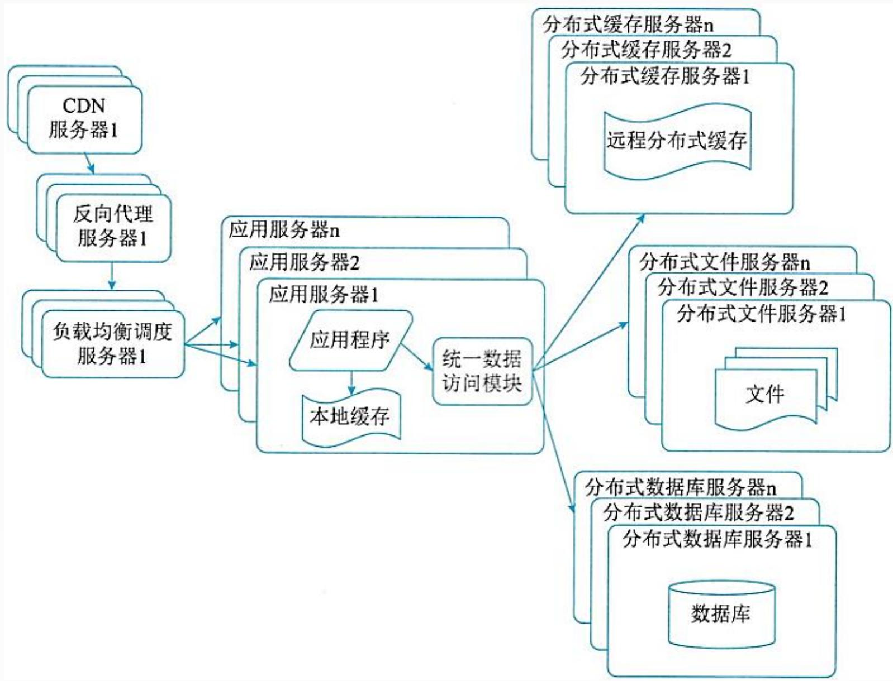

flowchart

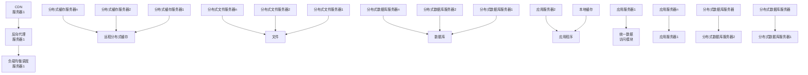
```mermaid
graph TD
  A["CDN\n服务器1"] --> B["反向代理\n服务器1"]
  B --> C["负载均衡调度\n服务器1"]
  D["分布式缓存服务器n"] --> E["远程分布式缓存"]
  F["分布式缓存服务器2"] --> E
  G["分布式缓存服务器1"] --> E
  H["分布式文件服务器n"] --> I["文件"]
  J["分布式文件服务器2"] --> I
  K["分布式文件服务器1"] --> I
  L["分布式数据库服务器n"] --> M["数据库"]
  N["分布式数据库服务器2"] --> M
  O["分布式数据库服务器1"] --> M
  P["应用服务器2"] --> Q["应用程序"]
  R["应用服务器1"] --> S["统一数据\n访问模块"]
  T["本地缓存"] --> Q
  U["应用服务器n"] --> V["应用服务器1"]
  W["分布式数据库服务器"] --> X["分布式数据库服务器2"]
  Y["分布式数据库服务器"] --> Z["分布式数据库服务器1"]
```

## 八、第八阶段: 使用NoSQL和搜索引擎

随着网站业务越来越复杂，对数据存储和检索的需求也越来越复杂，网站需要采用一些非关系数据库技术，如NoSQL 和非数据库查询技术如搜索引擎。NoSQL 和搜索引擎都是源自互联网的技术手段，对可伸缩的分布式特性具有更好的支持。应用服务器则通过一个统一数据访问模块访问各种数据，减轻应用程序管理诸多数据源的麻烦。

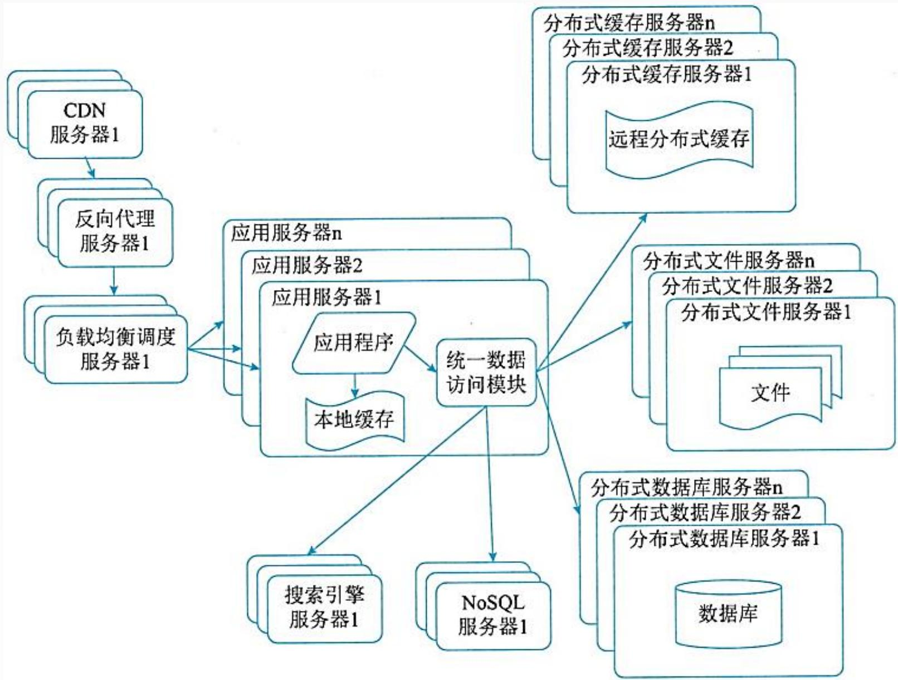

flowchart

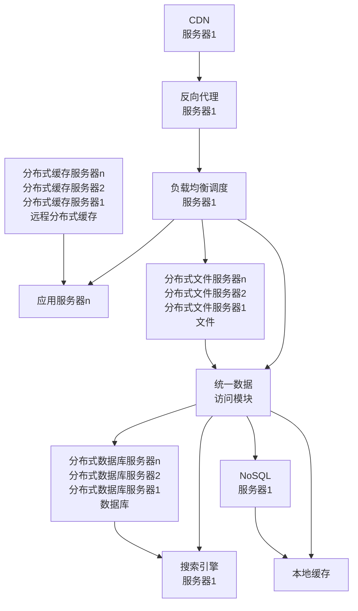
```mermaid
graph TD
  A["CDN\n服务器1"] --> B["反向代理\n服务器1"]
  B --> C["负载均衡调度\n服务器1"]
  D["分布式缓存服务器n\n分布式缓存服务器2\n分布式缓存服务器1\n远程分布式缓存"] --> E["应用服务器n"]
  F["分布式文件服务器n\n分布式文件服务器2\n分布式文件服务器1\n文件"] --> G["统一数据\n访问模块"]
  H["分布式数据库服务器n\n分布式数据库服务器2\n分布式数据库服务器1\n数据库"] --> I["搜索引擎\n服务器1"]
  J["NoSQL\n服务器1"] --> K["本地缓存"]
  C --> E
  C --> F
  C --> G
  G --> H
  G --> I
  G --> J
  G --> K
```

## 九、第九阶段: 业务拆分

大型网站为了应对日益复杂的业务场景，通过使用分而治之的手段将整个网站业务分成不同的产品线。如电商网站都会将首页、商铺、订单、买家、卖家等拆分成不同的产品线，分归不同的业务团队负责。具体到技术上，也会根据产品线划分，将一个网站拆分成许多不同的应用，每个应用独立部署。应用之间可以通过一个超链接建立关系，也可以通过消息队列进行数据分发，当然最多的还是通过访问同一个数据存储系统来构成一个完整系统。

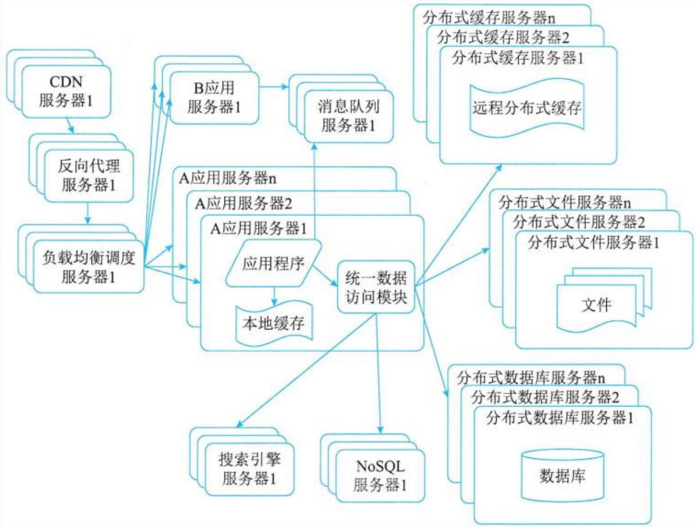

flowchart

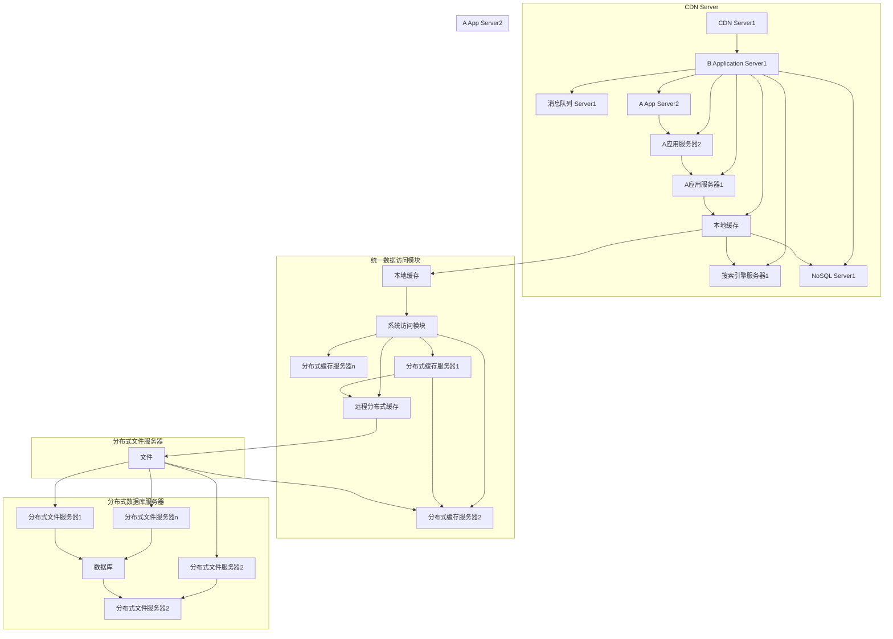
```mermaid
graph TD
  subgraph Server1["CDN Server"]
  C1["CDN Server1"] --> B1["B Application Server1"]
  B1 --> D1["消息队列 Server1"]
  B1 --> A1["A App Server2"]
  B1 --> A2["A App Server1"]
  B1 --> A3["应用程序"]
  B1 --> A4["负载均衡调度服务器1"]
  B1 --> A5["搜索引擎服务器1"]
  B1 --> A6["NoSQL Server1"]
  end

  subgraph Server2["A App Server2"]
  A1 --> A2["A应用服务器2"]
  A2 --> A3["A应用服务器1"]
  A3 --> A4["本地缓存"]
  end

  subgraph Server3["统一数据访问模块"]
  A4 --> A5
  A4 --> A6
  A4 --> A7["本地缓存"]
  A7 --> A8["系统访问模块"]
  A8 --> D8["分布式缓存服务器n"]
  A8 --> D9["分布式缓存服务器2"]
  A8 --> D10["分布式缓存服务器1"]
  A8 --> D11["远程分布式缓存"]
  end

  subgraph Server4["分布式文件服务器"]
  D10 --> D9
  D10 --> D11
  D11 --> D12["文件"]
  end

  subgraph Server5["分布式数据库服务器"]
  D12 --> D9
  D12 --> D13["分布式文件服务器n"]
  D12 --> D14["分布式文件服务器2"]
  D12 --> D15["分布式文件服务器1"]
  D13 --> D16["数据库"]
  D14 --> D17["分布式文件服务器2"]
  D15 --> D16
  D16 --> D17
  end
```

## 十、第十阶段: 分布式服务

随着业务拆分越来越小，存储系统越来越庞大，应用系统的整体复杂度呈指数级增加，部署维护越来越困难。由于所有应用要和所有数据库系统连接，在数万台服务器规模的网站中，这些连接的数目是服务器规模的平方，导致数据库连接资源不足，拒绝服务。既然每一个应用系统都需要执行许多相同的业务操作，比如用户管理、商品管理等，那么可以将这些共用的业务提取出来，独立部署。由这些可复用的业务连接数据库，提供共用业务服务，而应用系统只需要管理用户界面，通过分布式服务调用共用业务服务完成具体业务操作。 

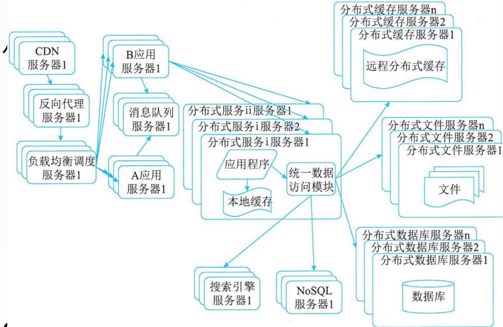

flowchart

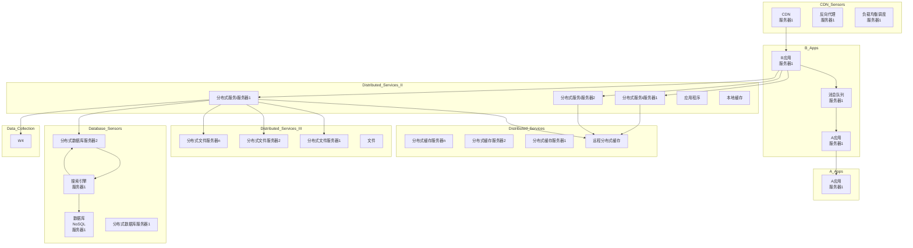
```mermaid
graph TD
  subgraph CDN_Sensors
    C1["CDN\n服务器1"]
    C2["反向代理\n服务器1"]
    C3["负载均衡调度\n服务器1"]
  end

  subgraph B_Apps
    B1["B应用\n服务器1"]
    B2["消息队列\n服务器1"]
    B3["A应用\n服务器1"]
  end

  subgraph A_Apps
    A1["A应用\n服务器1"]
  end

  subgraph Distributed_Services
    D1["分布式缓存服务器n"]
    D2["分布式缓存服务器2"]
    D3["分布式缓存服务器1"]
    D4["远程分布式缓存"]
  end

  subgraph Distributed_Services_II
    I1["分布式服务ii服务器1"]
    I2["分布式服务i服务器2"]
    I3["分布式服务i服务器1"]
    App1["应用程序"]
    LocalCache["本地缓存"]
  end

  subgraph Distributed_Services_III
    W1["分布式文件服务器n"]
    W2["分布式文件服务器2"]
    W3["分布式文件服务器1"]
    File["文件"]
  end

  subgraph Database_Sensors
    DB1["数据库\nNoSQL\n服务器1"]
    DB2["分布式数据库服务器2"]
    DB3["分布式数据库服务器1"]
    DB4["搜索引擎\n服务器1"]
  end

  subgraph Data_Collection
  C1 --> B1
  B1 --> B2
  B2 --> B3
  B3 --> A1
  B1 --> I1
  B1 --> I2
  B1 --> I3
  I1 --> D4
  I2 --> D4
  I3 --> D4
  I3 --> W1
  I3 --> W2
  I3 --> W3
  I3 --> W4
  I3 --> DB2
  DB2 --> DB4
  end

  subgraph Data_Collection
  DB4 --> DB1
  DB4 --> DB2
  end
```

## Thank You