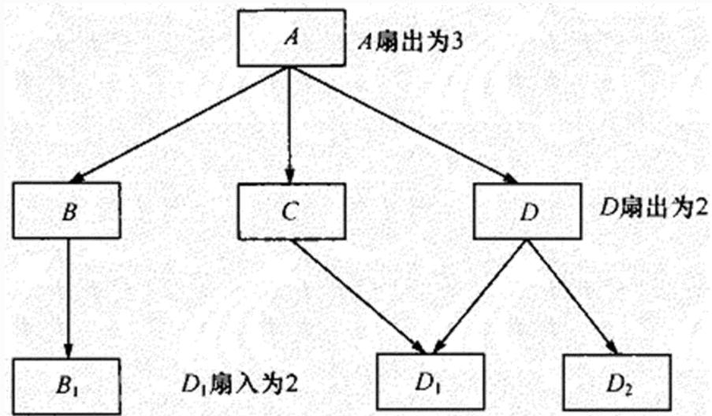
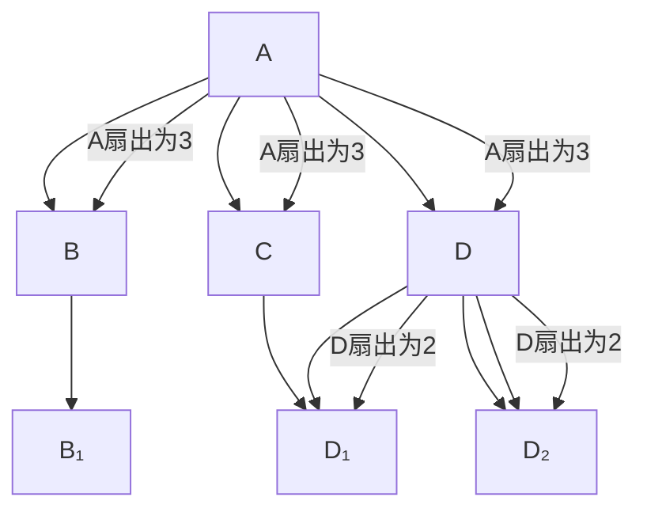

## 系统架构设计师

## 软件架构维护

## 第十章 软件架构的演化和维护

10.1 软件架构的演化和定义的关系  
10.2 面向对象软件架构演化过程  
⚫ 10.3 软件架构演化方式的分类  
10.4 软件架构演化原则  
10.5 软件架构演化评估方法  
10.6 大型网站系统架构演化实例  
⚫ 10.7 软件架构维护

软件架构是软件开发和维护过程中的一个重点制品，是软件需求和设计、实现之间的桥梁。软件架构的维护与演化密不可分，维护需要对软件架构的演化过程进行追踪和控制，以保障软件架构的演化过程能够满足需求(亦有说法将架构维护作为架构演化的一部分)。

由于软件架构维护过程一般涉及架构知识管理、架构修改管理和架构版本管理等内容，下面分别对它们进行介绍。

## 软件架构知识管理

软件架构知识管理是对架构设计中所隐含的决策来源进行文档化表示，进而在架构维护过程中帮助维护人员对架构的修改进行完善的考虑，并能够为其他软件架构的相关活动提供参考。

## 1.架构知识的定义

架构知识= 架构设计 + 架构设计决策。

## 2.架构知识管理的含义

架构知识管理侧重于软件开发和实现过程所涉及的架构静态演化，从架构文档等信息来源中捕捉架构知识，进而提供架构的质量属性及其设计依据以进行记录和评价。

## 二、软件架构修改管理

在软件架构修改管理中，一个主要的做法就是建立一个隔离区域，保障该区域中任何修改对其他部分的影响比较小，甚至没有影响。为此，需要明确修改规则、修改类型，以及可能的影响范围和副作用等。

## 三、软件架构版本管理

软件架构版本管理为软件架构演化的版本演化控制、使用和评价等提供了可靠的依据，并为架构演化量化度量奠定了基础。

## 四、软件架构可维护性度量实践架构可维护性的六个子度量指标：

1.圈复杂度(CCN)  
2.扇入扇出度(FFC)  
3.模块间耦合度(CBO)  
4.模块的响应(RFC)  
5.紧内聚度TCC  
6.松内聚度LCC

## 1.圈复杂度(CCN)

由于在组件图中组件是独立的，每个组件代表一个系统或子系统中的封装单位，封装了完整的事务处理行为，组件图能够通过组件之间的控制依赖关系来体现整个系统的组成结构。

对架构的组件图进行圈复杂度的度量，可以对整个系统的复杂程度做出初步评估，在设计早期发现问题和做出调整，并预测待评估系统的测试复杂度，及早规避风险，提高软件质量。实践表明程序规模以 CCN≤10为宜。

## 2.扇入扇出度(FFC)

扇入是指直接调用该模块的上级模块的个数，扇出指该模块直接调用的下级模块的个数。

用扇入扇出度综合评估组件主动调用以及被调用的频率。扇入扇出度越大，表明该组件与其他组件间的接口关联或依赖关联越多。

flowchart

## 3.模块间耦合度(CBO)

模块间耦合度CBO度量模块与其他模块交互的频繁程度。

组件与其他组件的依赖关系及接口越多，该组件的耦合度越大。

CBO 越大的模块，越容易受到其他模块修改和错误的影响，因而可维护性越差，风险越高。

## 4.模块的响应(RFC)

RFC度量组件执行所需的功能的数量，包括接口提供的功能、依赖的其他模块提供的功能以及子模块提供的功能。

5.模块间内聚度--紧内聚度TCC和松内聚度LCC

内聚度是模块内部各成份之间的联系紧密程度，联系越紧其内聚度越大。好的架构设计应该遵循"高内聚-低耦合"原则，提高模块的独立性，降低模块间接口调用的复杂性。

$$
\begin{array}{l} \mathrm{TCC} = \frac {E + X + W + R}{P (S)} = \frac {1 + 0 + 1 + 1}{2 \times (2 - 1) / 2} = 3 \\ \mathrm{LCC} = \frac {E + X + W + R + N I C (S)}{P (S)} = \frac {E + X + W + R + 0}{P (S)} = \mathrm{TCC} = 3 \\ \end{array}
$$

## Thank You