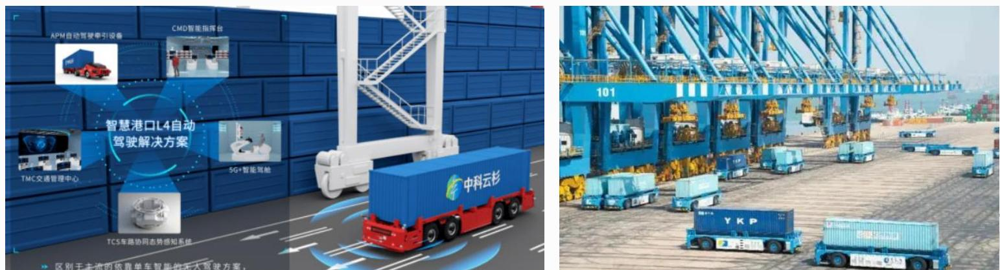
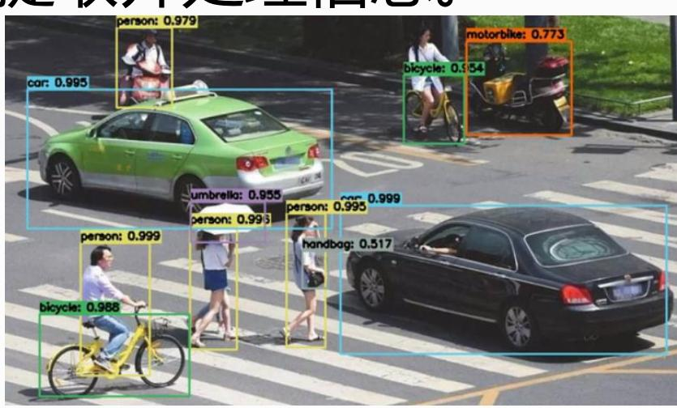
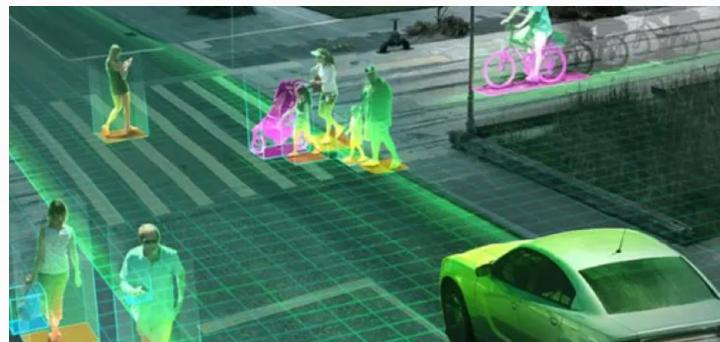
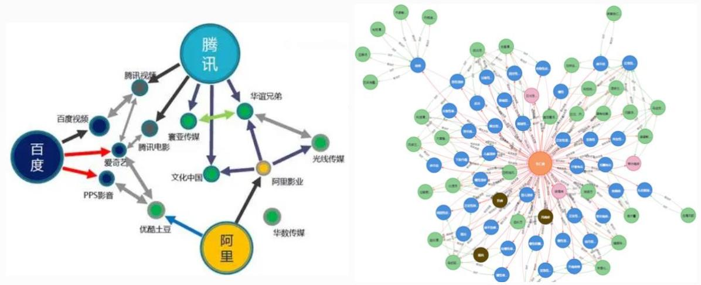
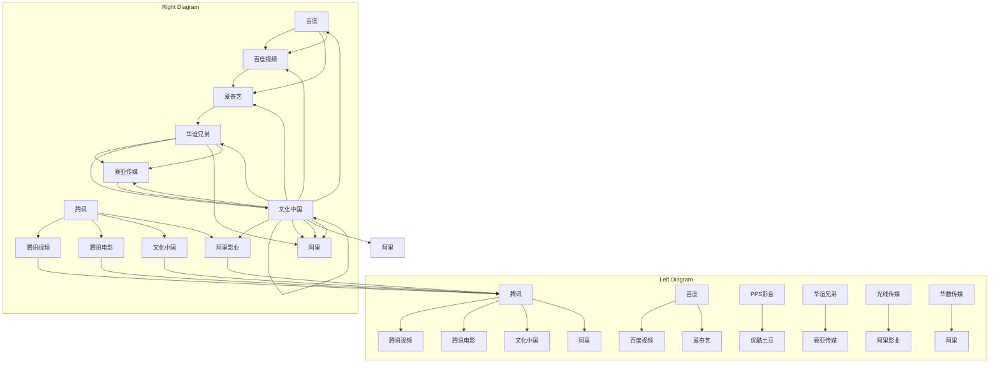
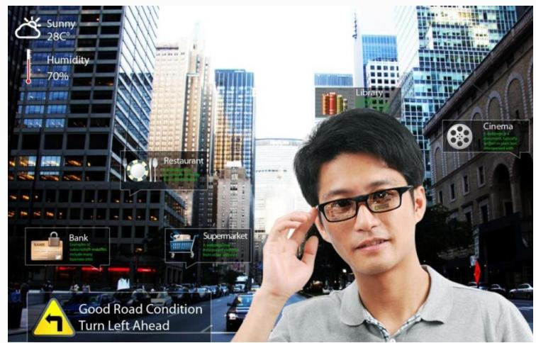

## 系统架构设计师

## 之 信息物理系统技术概述

## 第十一章 未来信息综合技术

11.1 信息物理系统技术概述  
11.2 人工智能技术概述  
11.3 机器人技术概述  
11.4 边缘计算概述  
11.5 数字孪生体技术概述  
11.6 云计算和大数据技术概述

## 一、信息物理系统的概念

信息物理系统(Cyber-Physical Systems，CPS)通过集成先进的感知、计算、通信、控制等信息技术和自动控制技术，构建了物理空间与信息空间中人、机、物、环境、信息等要素相互映射、适时交互、高效协同的复杂系统，实现系统内资源配置和运行的按需响应、快速迭代、动态优化。

CPS是在环境感知的基础上，深度融合计算、通信和控制能力的网络化物理设备系统，通过计算进程和物理进程相互影响的反馈循环实现深度融合和实时交互来增加或扩展新的功能，以安全、可靠、高效和实时的方式检测或者控制一个物理实体。 

## 二、CPS的实现

## 1.CPS的体系架构

单元级CPS 体系架构  
系统级CPS 体系架构  
SoS 级CPS 体系架构

## 1)单元级

单元级 CPS 是具有不可分割性的 CPS 最小单元，其本质是通过软件对物理实体及环境进行状态感知、计算分析，并最终控制到物理实体，构建最基本的数据自动流动的闭环，形成物理世界和信息世界的融合交互。同时，为了与外界进行交互，单元级 CPS 应具有通信功能。

单元级 CPS 是具备可感知、可计算、可交互、可延展、自决策功能的 CPS 最小单元，一个智能部件、一个工业机器人或一个智能机床都可能是一个 CPS 最小单元。

## 2)系统级

系统级CPS 基于多个单元级 CPS 的状态感知、信息交互、实时分析，实现了局部制造资源的自组织、自配置、自决策、自优化。在单元级 CPS 功能的基础上，系统级 CPS 还包含互联万通、即插即用、边缘网关、数据互操作、协同控制、监视与诊断等功能。其中互连互通、边缘网关和数据互操作实现单元级CPS 的异构集成。

## 3)SoS 级

多个系统级 CPS 的有机组合构成 SoS 级CPS。SoS 级CPS 主要实现数据的汇聚，从而对内进行资产的优化和对外形成运营优化服务。其主要功能包括:数据存储、数据融合、分布式计算、大数据分析、数据服务，并在数据服务的基础上形成了资产性能管理和运营优化服务。

## 2.CPS的技术体系

CPS的技术体系分为四大核心技术要素：

"一硬"(感知和自动控制)，是CPS实现的硬件支撑；  
⚫ "一软"(工业软件)，固化了 CPS计算和数据流程的规则，是 CPS的核心；  
⚫ "一网"(工业网络)，互连互通和数据传输的网络载体；  
⚫ "一平台"(工业云和智能服务平台)，CPS 数据汇聚和支撑上层解决方案的基础，对外提供资源管控和能力服务。

## 第十一章 未来信息综合技术

11.1 信息物理系统技术概述  
11.2 人工智能技术概述  
11.3 机器人技术概述  
11.4 边缘计算概述  
11.5 数字孪生体技术概述  
11.6 云计算和大数据技术概述

## 一、人工智能的概念

人工智能(Artificial Intelligence，AI)是利用数字计算机或者数字计算机控制的机器模拟延伸和扩展人的智能，感知环境、获取知识并使用知识获得最佳结果的理论、方法、技术及应用系统。

人工智能的目标是了解智能的实质，并生产出一种新的能以人类智能相似的方式做出反应的智能机器。该领域的研究包括机器人、自然语言处理、计算机视觉和专家系统等。

根据人工智能是否能真正实现推理、思考和解决问题，可以将人工智能分为弱人工智能和强人工智能。

## 1.弱人工智能

弱人工智能是指不能真正实现推理和解决问题的智能机器，这些机器表面看像是智能的，但是并不真正拥有智能，也不会有自主意识。

目前的主流研究仍然集中于弱人工智能，并取得了显著进步，如在语音识别、图像处理和物体分割、机器翻译等方面都取得了重大突破，某些方面甚至可以接近或超越人类水平。

## 2.强人工智能

强人工智能是指真正能思维的智能机器，并且认为这样的机器是有知觉和有自我意识的，这类机器可分为类人(机器的思考和推理类似人的思维)与非类人(机器产生了和人完全不一样的知觉和意识，使用和人完全不一样的推理方式)两大类。

## 二、人工智能关键技术

## 1.自然语言处理(NLP)

自然语言处理研究实现人与计算机之间用自然语言进行有效通信的各种理论和方法。

自然语言处理涉及的领域主要包括：机器翻译(利用计算机实现从一种自然语言到另外一种自然语言的翻译)、语义理解(利用计算机理解文本篇章内容，并回答相关问题) 和问答系统(让计算机像人类一样用自然语言与人交流)等。

## 2.计算机视觉(Computer Vision )

计算机视觉是使用计算机模仿人类视觉系统的科学，让计算机拥有类似人类提取、处理、理解和分析图像以及图像序列的能力，将图像分析任务分解为便于管理的小块任务。

自动驾驶、机器人、智能医疗等领域均需要通过计算机视觉技术从视觉信号中提取并处理信息。

text_image

person: 0.979
car: 0.995
umbrella: 0.955
person: 0.993
person: 0.999
bicycle: 0.988
handbag: 0.517
motorbike: 0.773
bicycle: 0.54
car: 0.999

text_image

Street photo with overlaid human figures and green pedestrian detection overlays, including a car and a pink '①' marker on the road.

## 3.知识图谱(Knowledge Graph)

知识图谱本质上是结构化的语义知识库，是一种由节点和边组成的图数据结构，以符号形式描述物理世界中的概念及其相互关系。

知识图谱就是把所有不同种类的信息连接在一起而得的一个关系网络，提供了从"关系"的角度去分析问题的能力。知识图谱在搜索引擎、可视化展示和精准营销方面有很大的优势，已为业界的

热门工具。

flowchart

4.人机交互(Human-Computer Interaction，HCI)

人机交互主要研究人和计算机之间的信息交换，包括人到计算机和计算机到人的两部分信息交换，是人工智能领域重要的外围技术。人机交互是与认知心理学、人机工程学、多媒体技术、虚拟现实技术等密切相关的综合学科的交叉。

人机交互技术除了传统的基本交互和图形交互外，还包括语音交互、情感交互、体感交互及脑机交互等技术。

5.虚拟现实或增强现实(Virtual Reality /Augmented Reality，VR/AR)虚拟现实或增强现实是以计算机为核心的新型视听技术。结合相关科学技术，在一定范围内生成与真实环境在视觉、听觉等方面高度近似的数字化环境。用户借助必要的装备与数字化环境中的对象进行交互，相互影响，获得近似真实环境的感受和体验，通过显示设备、跟踪定位设备、触力觉交互设备、数据获取设备、

专用芯片等实现。

text_image

Sunny
28°C
Humidity
70%
Restaurant
Library
Cinema
Bank
Supermarket
Good Road Condition
Turn Left Ahead

## 6.机器学习(Machine Learning，ML)

机器学习是人工智能的核心研究领域之一，其最初的研究动机是为了让计算机系统具有人的学习能力以便实现人工智能。具体来说，机器学习是以数据为基础，通过研究样本数据寻找规律，并根据所得规律对未来数据进行预测。目前，机器学习广泛应用于数据挖掘、计算机视觉、自然语言处理、生物特征识别等领域。

## Thank You