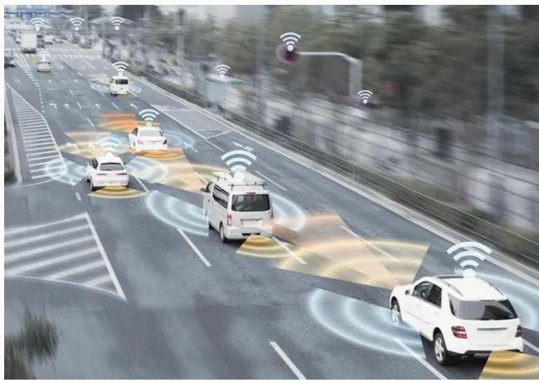

## 系统架构设计师

## 机器人技术概述

## 第十一章 未来信息综合技术

11.1 信息物理系统技术概述  
11.2 人工智能技术概述  
⚫ 11.3 机器人技术概述  
11.4 边缘计算概述  
11.5 数字孪生体技术概述  
11.6 云计算和大数据技术概述

## 一、 机器人的定义

具有如下3 个条件的机器可以称为机器人：

(1)具有脑、手、脚等三要素的个体；  
(2)具有非接触传感器(用眼、耳接收远方信息) 和接触传感器；  
(3)具有平衡觉和固有觉的传感器。

随着电子技术和计算机技术的飞速发展，机器人技术已经准备进入 4.0 时代。所谓机器人 4.0 时代，就是把云端大脑分布在各个地方，充分利用边缘计算的优势，提供高性价比的服务，把要完成任务的记忆场景的知识和常识很好地组合起来，实现规模化部署。

特别强调机器人除了具有感知能力实现智能协作，还应该具有一定的理解和决策能力，进行更加自主的服务。

## 二、机器人4.0的核心技术

机器人 4.0 有以下几个核心技术：

云-边-端的无缝协同计算  
持续学习与协同学习  
知识图谱  
场景自适应  
数据安全

## 三、机器人的分类

按照控制方式分类，机器人可分为：

操作机器人  
程序机器人  
示教再现机器人  
智能机器人  
综合机器人

## 第十一章 未来信息综合技术

11.1 信息物理系统技术概述  
11.2 人工智能技术概述  
11.3 机器人技术概述  
⚫ 11.4 边缘计算概述  
11.5 数字孪生体技术概述  
11.6 云计算和大数据技术概述

## 一、 边缘计算的概念

ISO/IEC JTC1/SC38 给出的边缘计算是一种将主要处理和数据存储放在网络边缘节点的分布式计算形式。

ETSI(欧洲电信标准协会)：提供了移动网络边缘IT 服务环境和计算能力，强调靠近移动用户，以减少网络操作和服务交付的时延，提高用户体验。

natural_image

Highway with autonomous driving vehicles and sensor overlays, no visible text or symbols

## 二、边缘计算的特点:

(1) 联接性：联接性是边缘计算的基础。所联接物理对象的多样性及应用场景的多样性需要边缘计算具备丰富的联接功能，如各种网络接口、网络协议、网络拓扑、网络部署与配置、网络管理与维护。  
(2) 数据第一入口：边缘计算作为物理世界到数字世界的桥梁，是数据的第一入口。

(3)约束性：边缘计算产品需适配工业现场相对恶劣的工作条件与运行环境，对边缘计算设备的功耗、成本、空间有较高的要求。边缘计算产品需要考虑通过软硬件集成与优化，以适配各种条件约束，支撑行业数字化多样性场景。  
(4)分布性：边缘计算实际部署天然具备分布式特征。这要求边缘计算支持分布式计算与存储、实现分布式资源的动态调度与统一管理、支撑分布式智能、具备分布式安全等能力。

## 三、边缘计算的安全

边缘安全的价值体现在以下几方面：

提供可信的基础设施  
为边缘应用提供可信赖的安全服务  
保障安全的设备接入和协议转换  
提供安全可信的网络及覆盖

## 四、边缘计算应用场合

智慧园区  
安卓云与云游戏  
视频监控  
工业物联网  
⚫ Cloud VR

## Thank You