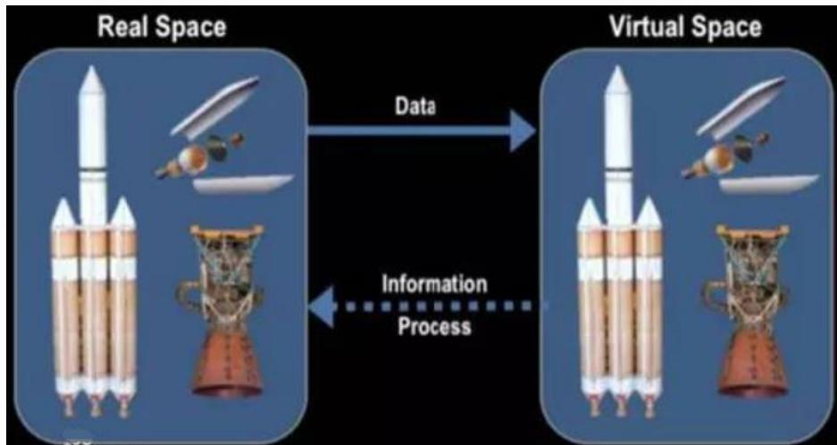
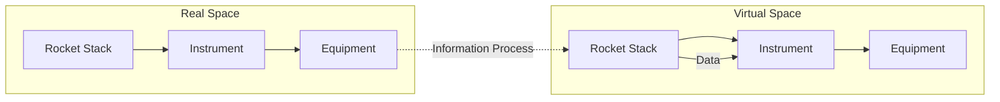
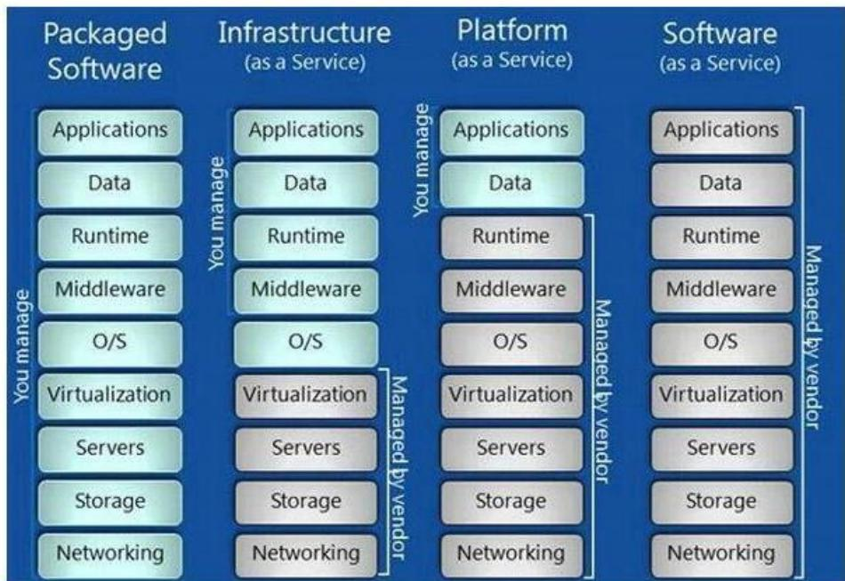
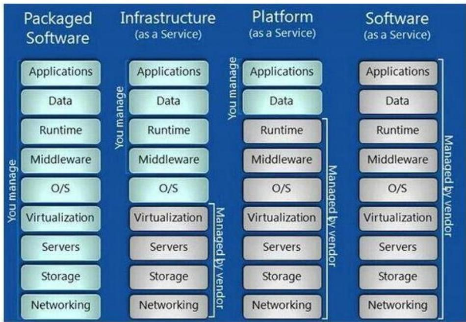

## 系统架构设计师

## 数字孪生体技术概述

## 第十一章 未来信息综合技术

11.1 信息物理系统技术概述  
11.2 人工智能技术概述  
11.3 机器人技术概述  
11.4 边缘计算概述  
⚫ 11.5 数字孪生体技术概述  
11.6 云计算和大数据技术概述

## 一、数字孪生体的定义

数字孪生体是现有或将有的物理实体对象的数字模型，通过实测、仿真和数据分析来实时感知、诊断、预测物理实体对象的状态，通过优化和指令来调控物理实体对象的行为，通过相关数字模型间的相互学习来进化自身，同时改进利益相关方在物理实体对象生命周期内的决策。

flowchart

## 二、数字孪生体的关键技术

数字孪生体的三项核心技术：

⚫ 建模：是将我们对物理世界的理解进行简化和模型化。  
仿真：建模和仿真是一对伴生体。建模是模型化我们对物理世界或问题的理解，仿真就是验证和确认这种理解的正确性和有效性。所以，数字化模型的仿真技术是创建和运行数字孪生体、保证数字孪生体与对应物理实体实现有效闭环的核心技术。

基于数据融合的数字线程：目前 VR、AR 以及 MR 等增强现实技术、数字线程、系统工程和MBSE、物联网、云计算、雾计算、边缘计算、大数据技术、机器学习和区块链技术，仍为数字孪生体构建过程中的内外围核心技术。

## 第十一章 未来信息综合技术

11.1 信息物理系统技术概述  
11.2 人工智能技术概述  
11.3 机器人技术概述  
11.4 边缘计算概述  
11.5 数字孪生体技术概述  
11.6 云计算和大数据技术概述

## 云计算概念

云计算是分布式计算的一种，指通过网络“云”将巨大的数据计算处理程序分解成无数个小程序，通过多部服务器组成的系统进行处理和分析这些小程序，得到结果后返回给用户。

云计算早期就是简单的分布式计算，解决任务分发，并进行计算结果的合并。

现阶段所说的云服务已经不单单是一种分布式计算，而是分布式计算、效用计算、负载均衡、并行计算、网络存储、热备份冗余和虚拟化等计算机技术混合演进、跃升的结果。

## 二、云计算的服务方式

软件即服务 (Software as a Service)  
平台即服务 (Platformas a Service，PaaS)  
基础设施即服务 (Infrastructure as a Service，IaaS)

## 1. SaaS (软件即服务)

用户根据自己实际需求，通过互联网向厂商定购所需的应用软件服务，按定购的服务多少或时间长短向厂商支付费用，并通过标准浏览器向客户提供应用服务。

bar_stacked

| Category | Sub-category | Management Structure |
| --- | --- | --- |
| Packaged Software | Applications | You manage |
| Packaged Software | Data | You manage |
| Packaged Software | Runtime | You manage |
| Packaged Software | Middleware | You manage |
| Packaged Software | O/S | You manage |
| Packaged Software | Virtualization | Managed by vendor |
| Packaged Software | Servers | Managed by vendor |
| Packaged Software | Storage | Managed by vendor |
| Packaged Software | Networking | Managed by vendor |
| Infrastructure (as a Service) | Applications | You manage |
| Infrastructure (as a Service) | Data | You manage |
| Infrastructure (as a Service) | Runtime | You manage |
| Infrastructure (as a Service) | Middleware | You manage |
| Infrastructure (as a Service) | O/S | You manage |
| Infrastructure (as a Service) | Virtualization | Managed by vendor |
| Infrastructure (as a Service) | Servers | Managed by vendor |
| Infrastructure (as a Service) | Storage | Managed by vendor |
| Infrastructure (as a Service) | Networking | Managed by vendor |
| Platform (as a Service) | Applications | Managed by vendor |
| Platform (as a Service) | Data | Managed by vendor |
| Platform (as a Service) | Runtime | Managed by vendor |
| Platform (as a Service) | Middleware | Managed by vendor |
| Platform (as a Service) | O/S | Managed by vendor |
| Platform (as a Service) | Virtualization | Managed by vendor |
| Platform (as a Service) | Servers | Managed by vendor |
| Platform (as a Service) | Storage | Managed by vendor |
| Platform (as a Service) | Networking | Managed by vendor |
| Software (as a Service) | Applications | Managed by vendor |
| Software (as a Service) | Data | Managed by vendor |
| Software (as a Service) | Runtime | Managed by vendor |
| Software (as a Service) | Middleware | Managed by vendor |
| Software (as a Service) | O/S | Managed by vendor |
| Software (as a Service) | Virtualization | Managed by vendor |
| Software (as a Service) | Servers | Managed by vendor |
| Software (as a Service) | Storage | Managed by vendor |
| Software (as a Service) | Networking | Managed by vendor |

## 2. PaaS (平台即服务)

在PaaS 模式下，服务提供商将分布式开发环境与平台作为一种服务来提供。厂商提供开发环境、服务器平台、硬件资源等服务给客户，客户在服务提供商平台的基础上定制开发自己的应用程序。

bar_stacked

| Category | Component | Management Approach |
| --- | --- | --- |
| Packaged Software | Applications | You manage |
| Packaged Software | Data | You manage |
| Packaged Software | Runtime | You manage |
| Packaged Software | Middleware | You manage |
| Packaged Software | O/S | You manage |
| Packaged Software | Virtualization | Managed by vendor |
| Packaged Software | Servers | Managed by vendor |
| Packaged Software | Storage | Managed by vendor |
| Packaged Software | Networking | Managed by vendor |
| Infrastructure (as a Service) | Applications | You manage |
| Infrastructure (as a Service) | Data | You manage |
| Infrastructure (as a Service) | Runtime | You manage |
| Infrastructure (as a Service) | Middleware | You manage |
| Infrastructure (as a Service) | O/S | You manage |
| Infrastructure (as a Service) | Virtualization | Managed by vendor |
| Infrastructure (as a Service) | Servers | Managed by vendor |
| Infrastructure (as a Service) | Storage | Managed by vendor |
| Infrastructure (as a Service) | Networking | Managed by vendor |
| Platform (as a Service) | Applications | You manage |
| Platform (as a Service) | Data | You manage |
| Platform (as a Service) | Runtime | You manage |
| Platform (as a Service) | Middleware | You manage |
| Platform (as a Service) | O/S | You manage |
| Platform (as a Service) | Virtualization | Managed by vendor |
| Platform (as a Service) | Servers | Managed by vendor |
| Platform (as a Service) | Storage | Managed by vendor |
| Platform (as a Service) | Networking | Managed by vendor |
| Software (as a Service) | Applications | Managed by vendor |
| Software (as a Service) | Data | Managed by vendor |
| Software (as a Service) | Runtime | Managed by vendor |
| Software (as a Service) | Middleware | Managed by vendor |
| Software (as a Service) | O/S | Managed by vendor |
| Software (as a Service) | Virtualization | Managed by vendor |
| Software (as a Service) | Servers | Managed by vendor |
| Software (as a Service) | Storage | Managed by vendor |
| Software (as a Service) | Networking | Managed by vendor |

## 3. IaaS (基础设施即服务)

IaaS 模式下，服务提供商将内存、I/O 设备、存储和计算能力等整合为一个虚拟的资源池，为客户提供所需要的存储资源、计算资源、虚拟化服务器等服务。

bar_stacked

| Category | Component | Management Approach |
| --- | --- | --- |
| Packaged Software | Applications | You manage |
| Packaged Software | Data | You manage |
| Packaged Software | Runtime | You manage |
| Packaged Software | Middleware | You manage |
| Packaged Software | O/S | You manage |
| Packaged Software | Virtualization | Managed by vendor |
| Packaged Software | Servers | Managed by vendor |
| Packaged Software | Storage | Managed by vendor |
| Packaged Software | Networking | Managed by vendor |
| Infrastructure (as a Service) | Applications | You manage |
| Infrastructure (as a Service) | Data | You manage |
| Infrastructure (as a Service) | Runtime | You manage |
| Infrastructure (as a Service) | Middleware | You manage |
| Infrastructure (as a Service) | O/S | You manage |
| Infrastructure (as a Service) | Virtualization | Managed by vendor |
| Infrastructure (as a Service) | Servers | Managed by vendor |
| Infrastructure (as a Service) | Storage | Managed by vendor |
| Infrastructure (as a Service) | Networking | Managed by vendor |
| Platform (as a Service) | Applications | You manage |
| Platform (as a Service) | Data | You manage |
| Platform (as a Service) | Runtime | You manage |
| Platform (as a Service) | Middleware | You manage |
| Platform (as a Service) | O/S | You manage |
| Platform (as a Service) | Virtualization | Managed by vendor |
| Platform (as a Service) | Servers | Managed by vendor |
| Platform (as a Service) | Storage | Managed by vendor |
| Platform (as a Service) | Networking | Managed by vendor |
| Software (as a Service) | Applications | Managed by vendor |
| Software (as a Service) | Data | Managed by vendor |
| Software (as a Service) | Runtime | Managed by vendor |
| Software (as a Service) | Middleware | Managed by vendor |
| Software (as a Service) | O/S | Managed by vendor |
| Software (as a Service) | Virtualization | Managed by vendor |
| Software (as a Service) | Servers | Managed by vendor |
| Software (as a Service) | Storage | Managed by vendor |
| Software (as a Service) | Networking | Managed by vendor |

例：从对外提供的服务能力来看，云计算的架构可以分为：IaaS、PaaS、SaaS三个层次。其中（ ）是通过Internet提供软件的模式管理来管理企业经营活动。

A.IaaS  
B.PaaS  
C.SaaS  
D.三个层次都提供

## 三、云计算的部署方式

公有云：指第三方提供商为用户提供的能够使用的云，公有云一般可通过 Internet 使用，是免费或成本低廉的。  
私有云：为一个客户单独使用而构建的云，因而提供对数据、安全性和服务质量的最有效控制。  
社区云：由几个组织共享的云端基础设施，它们支持特定的社群，有共同的关切事项，例如使命任务、安全需求、策略与法规遵循考量等。管理者可能是组织本身，也能是第三方。  
混合云

## 四、大数据的概念

## 1.大数据概念

大数据是指其大小或复杂性无法通过现有常用的软件工具，以合理的成本并在可接受的时限内对其进行捕获、管理和处理的数据集。

## 2.大数据特征(5V)

大量(Volume)：数据量的大小决定数据的价值和潜在的信息；单位是PB(1024TB)、EB(1024PB)。  
高速(Velocity) ：指获得数据的速度和处理速度。  
多样性(Variety) ：类型繁多，包括各种结构化、半结构化和非结构化的数据；。  
真实性(Veracity)：数据的质量。  
价值(Value)：单位价值密度低，合理运用大数据，以低成本创造高价值。

## Thank You