## 系统架构设计师

## 之 信息系统架构基本概念及发展

## 第十二章 信息系统架构设计理论与实践

⚫ 12.1 信息系统架构基本概念及发展  
12.2 信息系统架构  
12.3 信息系统架构设计方法

## 一、信息系统架构的定义

信息系统架构是该系统的一个(或多个)结构，而结构由软件元素、元素的外部可见属性及它们之间的关系组成。

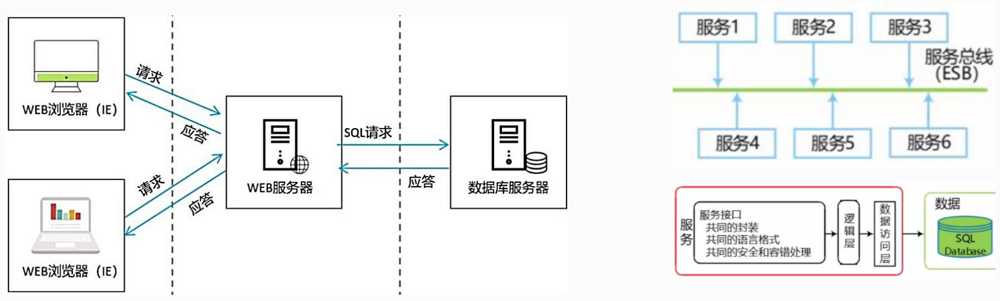

## 第十二章 信息系统架构设计理论与实践

12.1 信息系统架构基本概念及发展  
12.2 信息系统架构  
12.3 信息系统架构设计方法

## 一、 信息系统架构分类

信息系统架构分为物理结构与逻辑结构两种：

⚫ 物理结构是指不考虑系统各部分的实际工作与功能结构，只抽象地考察其硬件系统的空间分布情况。  
逻辑结构是指信息系统各种功能子系统的综合体。

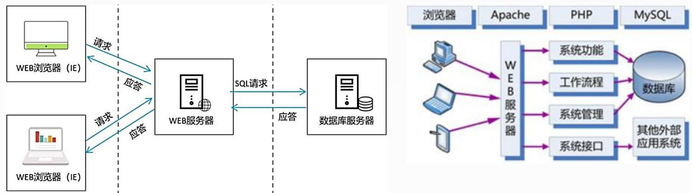

flowchart

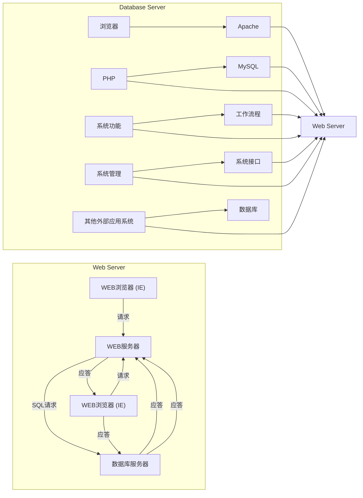

## 1.信息系统物理结构

按照信息系统硬件在空间上的拓扑结构，其物理结构分为两类：

集中式：是指物理资源在空间上集中配置。优点是资源集中，便于管理，资源利用率较高。缺点是资源过于集中会造成系统的脆弱，一旦主机出现故障，会使整个系统瘫痪。  
分布式：指通过网络把不同地点的计算机硬件、软件、数据等资源联系在一起，实现不同地点的资源共享。优点是系统扩展方便，安全性好，某个结点故障不会导致整个系统停止运行。缺点是系统管理的标准不易统一，协调困难，不利于整体资源的规划与管理。 

## 2.信息系统的逻辑结构

信息系统的逻辑结构是其功能综合体和概念性框架。

例如工厂的管理信息系统，从管理职能角度划分，包括供应、生产、销售、人事、财务等主要功能的信息管理子系统。一个完整的信息系统支持组织的各种功能子系统，使得每个子系统可以完成事务处理、操作管理、管理控制与战略规划等各个层次的功能。在每个子系统中可以有自己的专用文件，同时可以共用系统数据库中的数据，通过接口文件实现子系统之间的联系。

## 二、信息系统常用的5种架构模型

单机应用系统  
两层/多层C/S  
⚫ MVC 结构  
面向服务的架构SOA  
企业数据交换总线

## 1.MVC 结构

MVC实际上是多层 C/S 结构的一种标准化模式。在J2EE架构中，

View视图层指浏览器层，用于图形化展示请求结果。  
Controller 控制器指 Web 服务器层。  
Model模型层指应用逻辑实现及数据持久化的部分。

如Struts+Spring+Hibernate (SSH)、JSP+Spring+Hibernate等都是面向MVC架构的。

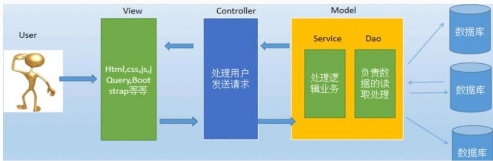

flowchart

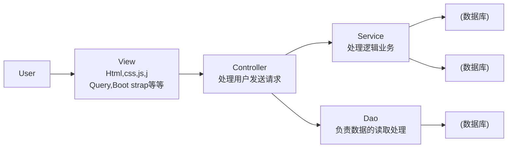

## 2.面向服务的架构SOA

SOA模型中，所有的功能都被定义成了独立的服务，所有的服务通过企业服务总线(ESB)或流程管理器来连接。这种松散耦合的结构使得能够以最小的代价整合已经存在的各种异构系统。

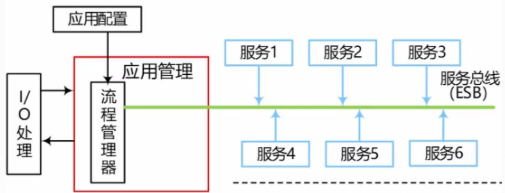

flowchart

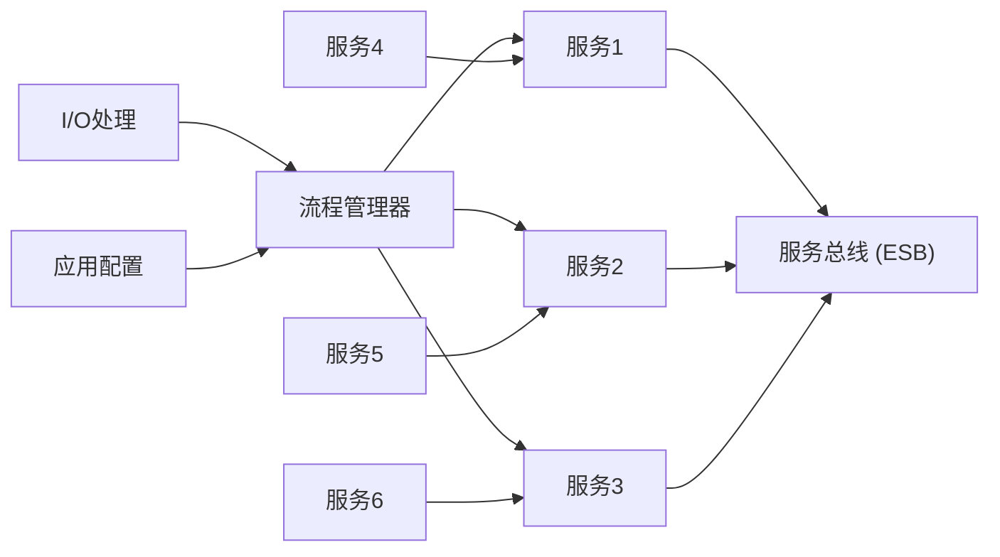

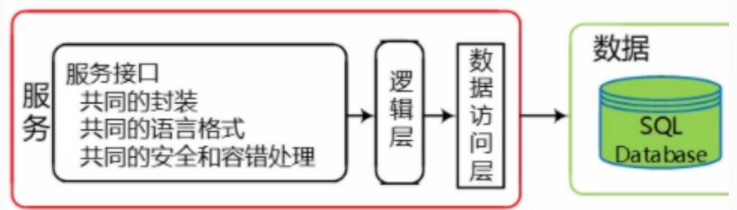

flowchart

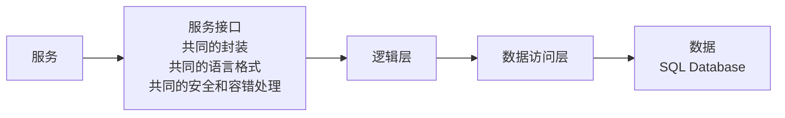

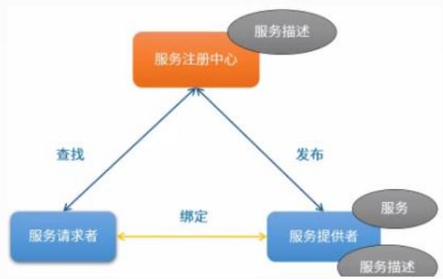

flowchart

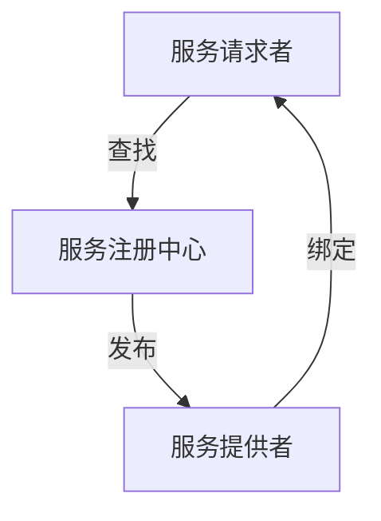

## 3.企业数据交换总线

企业数据交换总线，是不同的企业应用之间进行信息交换的公共通道。数据总线本身，其实质是一个可称之为连接器的软件系统(Connector)，它可以基于中间件(如消息中间件或交易中间件)构建，也可以基于CORBA/IIOP协议开发，主要功能是按照预定义的配置或消息头定义，进行数据、请求或回复的接收与分发。

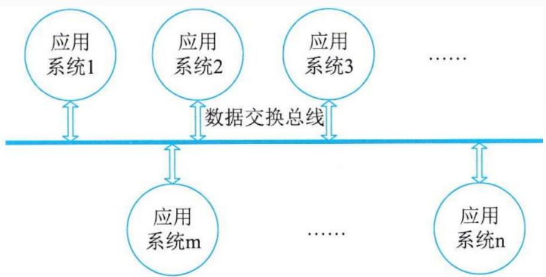

flowchart

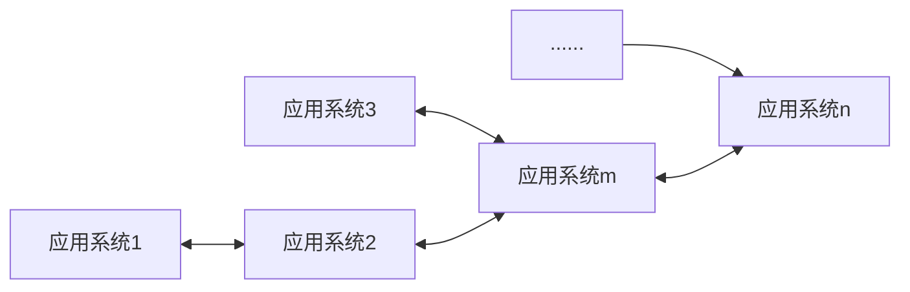

## 三、企业信息系统的总体框架

信息系统的架构(ISA) 模型应该是多维度，分层次、高度集成化的模型。

要在企业中建立一个有效集成的ISA，必须考虑四方面：战略系统、业务系统、应用系统和信息基础设施。

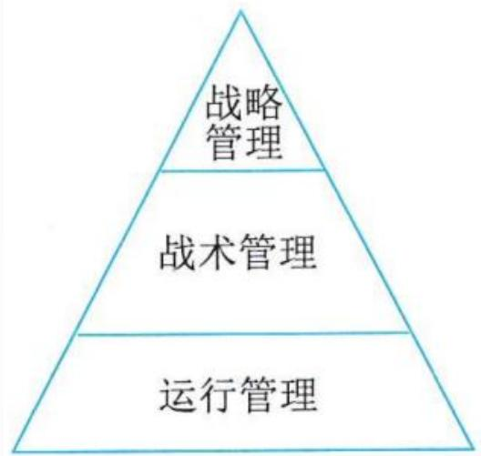

flowchart

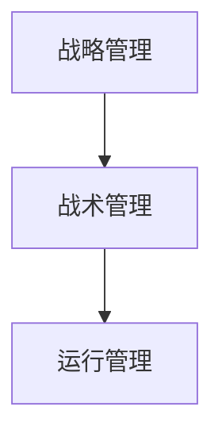

管理金字塔

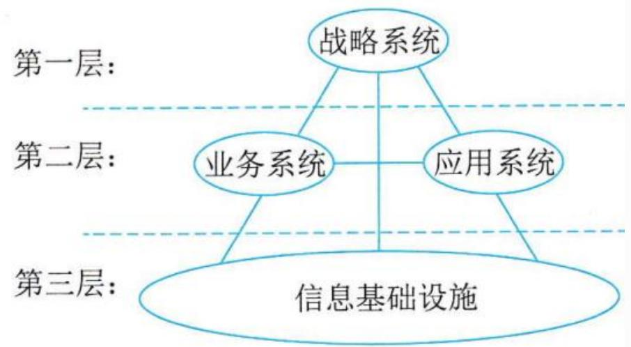

flowchart

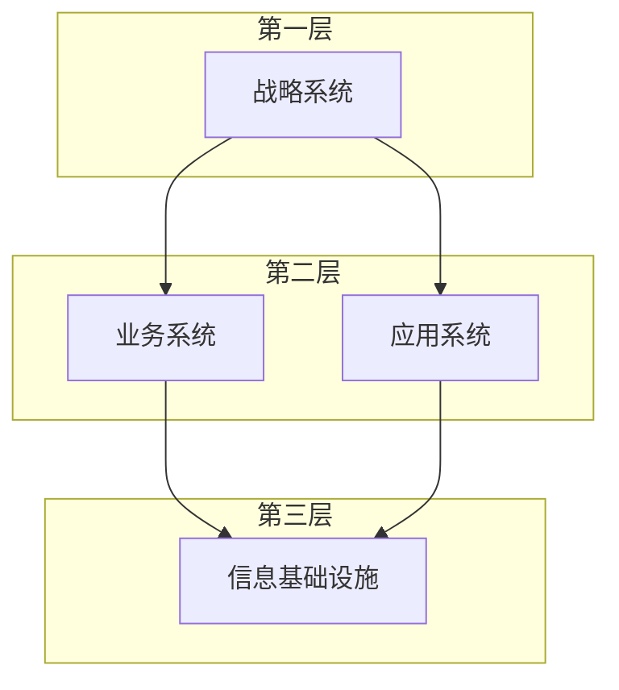

## 1.战略系统

战略系统是指企业中与战略制定、高层决策有关的管理活动和计算机辅助系统。

战略系统由两个部分组成：

以计算机为基础的高层决策支持系统  
企业的战略规划体系

在ISA 中设立战略系统有两重含义：一是表示信息系统对企业高层管理者的决策支持能力；二是表示企业战略规划对信息系统建设的影响和要求。 高级项目经理

## 2.业务系统

业务系统是指企业中完成一定业务功能的各部分(物质、能量、信息和人) 组成的系统。如：生产系统、销售系统、采购系统、人事系统、会计系统等，每个业务系统由一些业务过程来完成该业务系统的功能。

## 3.应用系统

应用系统即应用软件系统，指信息系统中的应用软件部分。

企业信息系统中的应用软件 (应用系统)，一般按完成的功能可包

含：事务处理系统TPS、管理信息系统MIS、决策支持系统DSS、专家系统ES、办公自动化系统OAS、计算机辅助设计/制造${ \mathsf { C A D / C A M } }$ 等。

## 4.企业信息基础设施

企业信息基础设施是指根据企业当前业务和可预见的发展趋势，及对信息采集、处理、存储和流通的要求，构筑由信息设备、通信网络、数据库、系统软件和支持性软件等组成的环境。

企业信息基础设施分成三部分：

技术基础设施：由计算机、网络、系统软件、支持性软件、数据交换协议等组成。  
信息资源设施：由数据与信息本身、数据交换的形式与标准、信息处理方法等组成。

管理基础设施：企业中信息系统部门的组织结构、信息资源设施管理人员的分工、企业信息基础设施的管理方法与规章制度等。

## Thank You