## 系统架构设计师

## 之 信息系统架构设计方法

## 第十二章 信息系统架构设计理论与实践

12.1 信息系统架构基本概念及发展  
12.2 信息系统架构  
12.3 信息系统架构设计方法

## 一、ADM架构开发方法

## 1.TOGAF概述

TOGAF是一种开放式企业架构标准，它为标准、方法论和企业架构专业人员之间的沟通提供一致性保障。

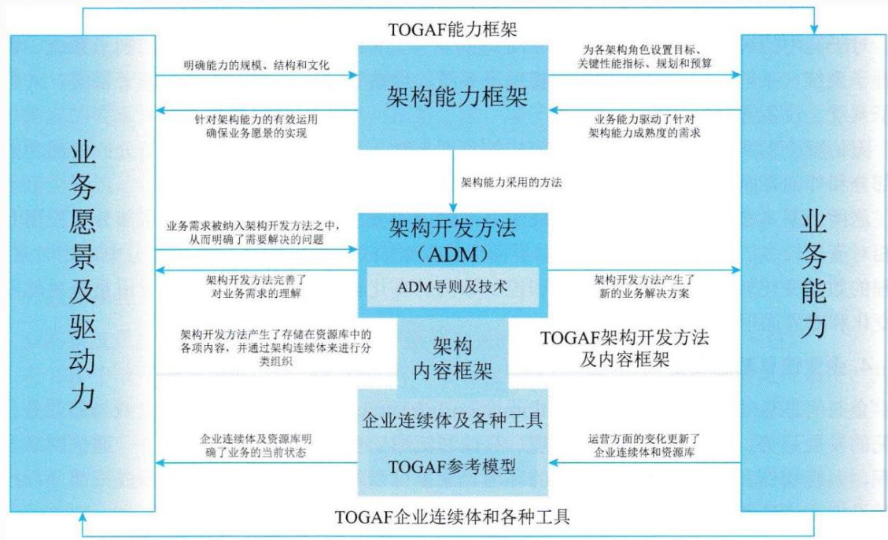

flowchart

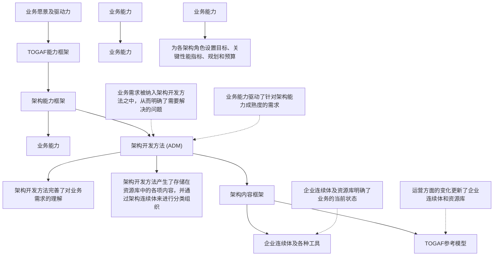

TOGAF反映了企业内部架构能力的结构和内容，TOGAF9版本包括六个组件：

(1)架构开发方法：是TOGAF 的核心。它描述了 TOGAF 架构开发方法(ADM)，即一种开发企业架构的分步方法。  
(2)ADM 指南和技术：这部分包含一系列可用于应用ADM的指南和技术。  
(3)架构内容框架：这部分描述了TOGAF 内容框架，包括架构工件的结构化元模型、可重用架构构建块(ABB)的使用以及典型架构可交付成果的概述。

(4)企业连续体和工具：这部分讨论分类法和工具，用于对企业内部架构活动的输出进行分类和存储。  
(5)TOGAF 参考模型：这部分提供了两个架构参考模型，即TOGAF技术参考模型(TRM)和集成信息基础设施参考模型(III-RM)。  
(6)架构能力框架：这部分讨论在企业内建立和运营架构实践所需的组织、流程、技能、角色和职责。

## 2.ADM架构开发方法

架构开发方法(ADM)为开发企业架构所需要执行各个步骤以及它们之间的关系进行详细的定义，同时它也是 TOGAF 规范中最为核心的内容。

ADM架构开发包括十个阶段：

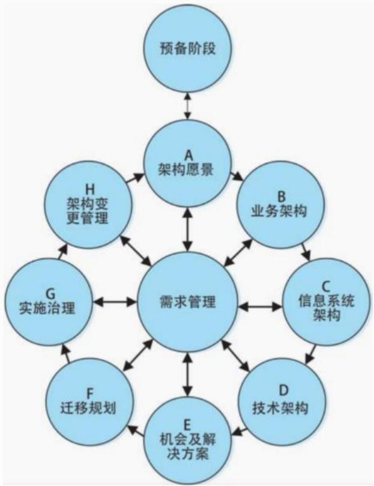

flowchart

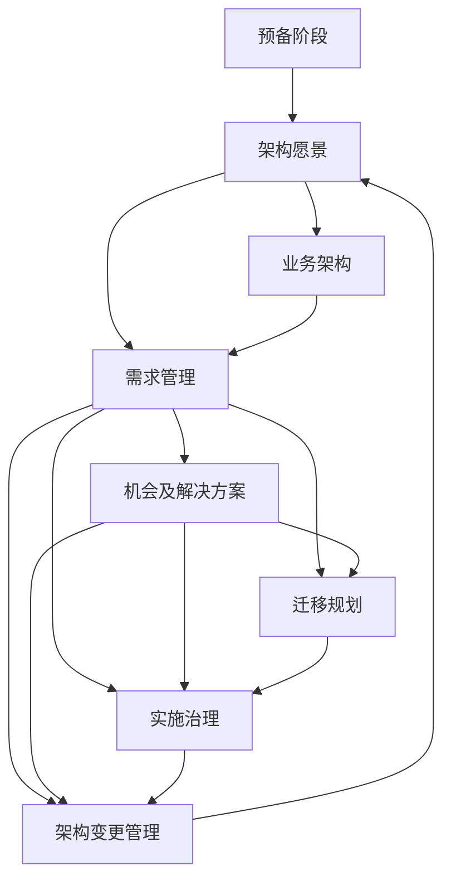

## (1)预备阶段

为组织成功实施 TOGAF 项目做好准备。完成所需的准备和启动活动，以满足新的企业架构要面对的业务指示，包括定义组织机构、特定的架构框架、工具、定义原则等。

(2)阶段A--架构愿景

在架构愿景阶段，将启动一次架构开发过程的迭代，设置迭代工作的范围、约束和期望创建架构愿景、验证业务上下文，创建架构工作说明书并取得大家的一致认可。

愿景表达了我们对架构的期望结果，阐明重要涉众关注的问题和目标，可帮助团队关注架构的核心领域。

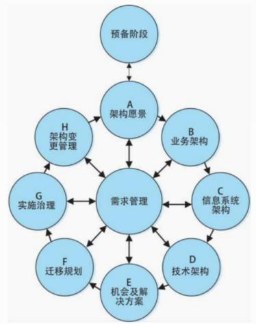

flowchart

This flowchart illustrates a project management and system architecture workflow, showing how various stages (Preparation, Arch愿景, Business Architecture, etc.) feed into specific modules like Demand Management and Implementation Governance.

## (3)阶段B--业务架构

在业务架构阶段，将开发一个支持架构愿景的业务架构。架构愿景中概括的基线和目标业务架构将在此被细化，从而使它们可以作为技术分析的有效输入。

## 本阶段的核心内容包括

组织如何满足业务目标；  
企业静态特征(业务目标、业务组织结构业务角色)；  
企业动态特征(流程、功能、服务)。

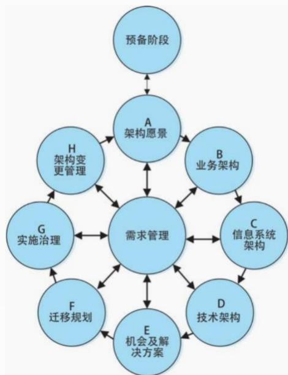

flowchart

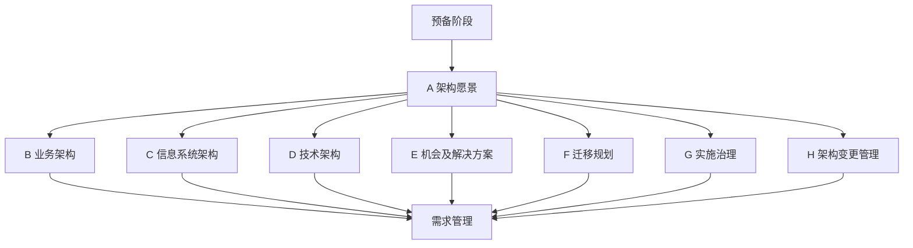

(4)阶段C--信息系统架构

在信息系统架构设计阶段，确定主要的信息类型和处理这些信息的应用系统。

本阶段有两个主要的步骤，数据架构设计和应用架构设计，二者既可以依次开发，也可以并行开发。

核心内容为：

信息系统如何满足企业的业务目标  
信息以及信息之间的关系  
应用以及应用之间的关系

(5)阶段D--技术架构

在技术架构阶段，完成对系统基础服务设施的设计，定义了架构解决方案的物理实现，包括硬件、软件和通信技术。

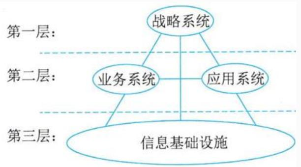

flowchart

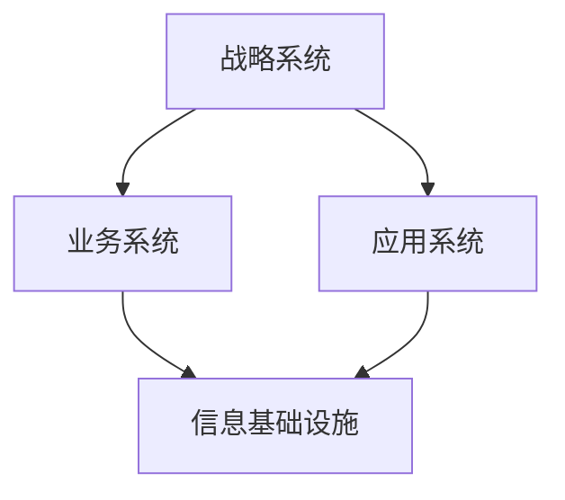

(6)阶段E--机会及解决方案

这是第一个直接关注实施的阶段，该阶段主要描述确定目标架构交付物(项目、程序或文件)的过程。

(7)阶段F--迁移规划

该阶段通过制订一个详细的实现和迁移计划完成从基线架构向目标架构的转变。

(8)阶段G--实施治理

该阶段定义了实施项目的架构约束，提供项目构建的架构监督，产生一个架构契约。

(9)阶段H--架构变更管理

该阶段确保能够以一种可控制的方式对架构的改变进行管理。

(10)需求管理

架构需求管理适用于 ADM 的所有阶段，是一个动态的过程，完成对企业需求的识别、存储并把它们插入或取出相应的 ADM 阶段。需求管理是 ADM 流程的中心。

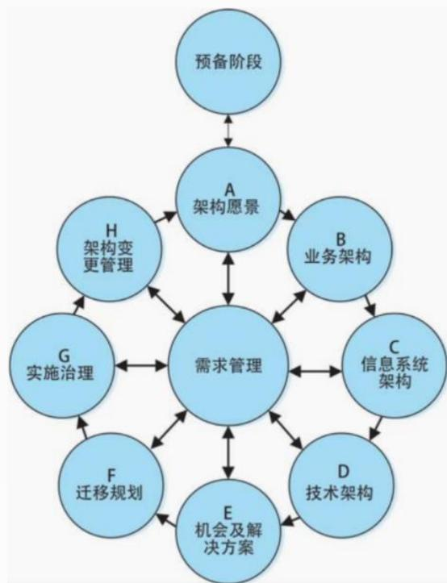

flowchart

```mermaid
graph TD
  A["A\n架构愿景"] --> B["B\n业务架构"]
  B --> C["C\n信息系统架构"]
  C --> D["D\n技术架构"]
  D --> E["E\n机会及解决方案"]
  E --> F["F\n迁移规划"]
  F --> G["G\n实施治理"]
  G --> H["H\n架构变更管理"]
  H --> I["I\n需求管理"]
  I --> J["J\n需求管理"]
  K["预备阶段"] --> A
  L["需求管理"] --> M["需求管理"]
  N["需求管理"] --> O["需求管理"]
  P["需求管理"] --> Q["需求管理"]
  R["需求管理"] --> S["需求管理"]
  T["需求管理"] --> U["需求管理"]
  V["需求管理"] --> W["需求管理"]
  X["需求管理"] --> Y["需求管理"]
  Z["需求管理"] --> AA["需求管理"]
  AB["需求管理"] --> AC["需求管理"]
  AD["需求管理"] --> AE["需求管理"]
  AF["需求管理"] --> AG["需求管理"]
  AH["需求管理"] --> AI["需求管理"]
  AJ["需求管理"] --> AK["需求管理"]
  AL["需求管理"] --> AM["需求管理"]
  AN["需求管理"] --> AO["需求管理"]
  AP["需求管理"] --> AQ["需求管理"]
  AR["需求管理"] --> AS["需求管理"]
  AT["需求管理"] --> AU["需求管理"]
  AV["需求管理"] --> AW["需求管理"]
  AX["需求管理"] --> AY["需求管理"]
  AZ["需求管理"] --> BA["需求管理"]
  BA --> CA["需求管理"]
  AD --> AD1["AD1"]
  AD --> AD2["AD2"]
  AD --> AD3["AD3"]
  AD --> AD4["AD4"]
  AD --> AD5["AD5"]
  AD --> AD6["AD6"]
  AD --> AD7["AD7"]
  AD --> AD8["AD8"]
  AD --> AD9["AD9"]
  AD --> AD10["AD10"]
  AD --> AD11["AD11"]
  AD --> AD12["AD12"]
  AD --> AD13["AD13"]
  AD --> AD14["AD14"]
  AD --> AD15["AD15"]
  AD --> AD16["AD16"]
  AD --> AD17["AD17"]
  AD --> AD18["AD18"]
  AD --> AD19["AD19"]
  AD --> AD20["AD20"]
  AD --> AD21["AD21"]
  AD --> AD22["AD22"]
  AD --> AD23["AD23"]
  AD --> AD24["AD24"]
  AD --> AD25["AD25"]
  AD --> AD26["AD26"]
  AD --> AD27["AD27"]
  AD --> AD28["AD28"]
  AD --> AD29["AD29"]
  AD --> AD30["AD30"]
  AD --> AD31["AD31"]
  AD --> AD32["AD32"]
  AD --> AD33["AD33"]
  AD --> AD34["AD34"]
  AD --> AD35["AD35"]
  AD --> AD36["AD36"]
  AD --> AD37["AD37"]
  AD --> AD38["AD38"]
  AD --> AD39["AD39"]
  AD --> AD40["AD40"]
  AD --> AD41["AD41"]
  AD --> AD42["AD42"]
  AD --> AD43["AD43"]
  AD --> AD44["AD44"]
  AD --> AD45["AD45"]
  AD --> AD46["AD46"]
  AD --> AD47["AD47"]
  AD --> AD48["AD48"]
  AD --> AD49["AD49"]
  AD --> AD50["AD50"]
```

## ADM有3个级别的迭代：

(1)基于ADM整体的迭代：用环形的方式来应用ADM方法，表明了在一个架构开发工作阶段完成后会直接进入随后的下一个阶段。  
(2)多个开发阶段间的迭代：例如在完成了技术架构阶段的开发工作后又重新回到业务架构开发阶段。  
(3)在一个阶段内部的迭代，TOGAF 支持基于一个阶段内部的多个开发活动，对复杂的架构内容进行迭代开发。

## 二、信息化总体架构方法

## 1.信息化建设生命周期

系统规划  
系统分析  
系统设计  
系统实施  
系统运行和维护

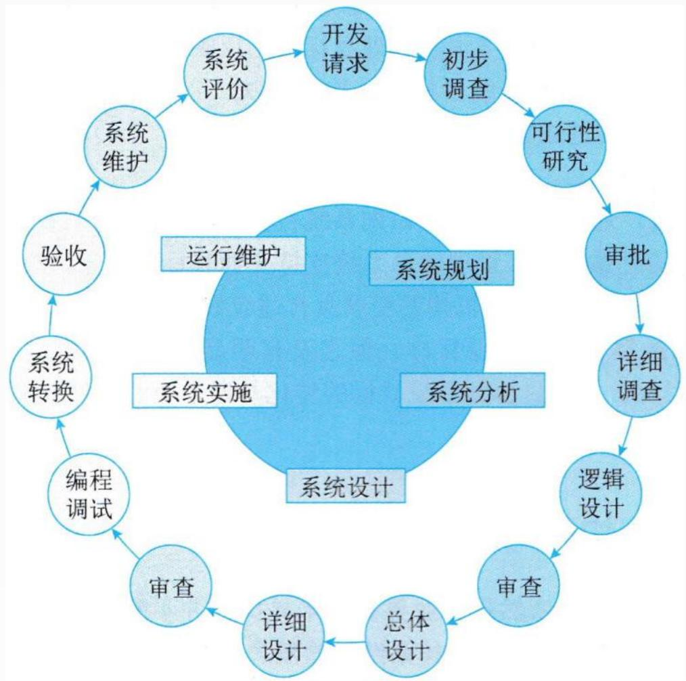

flowchart

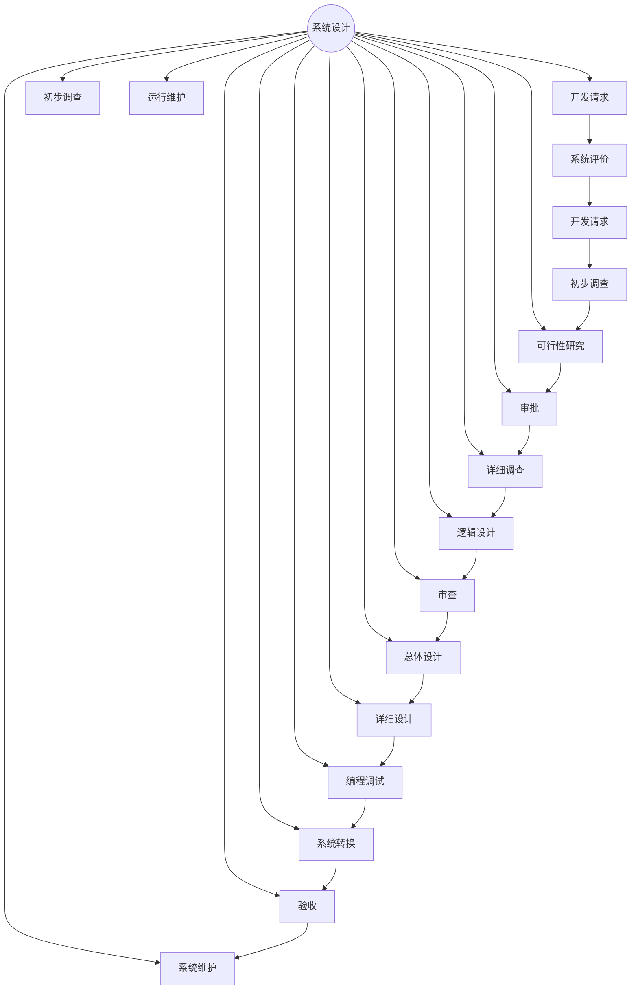

## 2.信息系统工程总体规划的方法论

关键成功因素法(CSF)  
战略目标集转化法(SST)  
企业系统规划法(BSP)  
企业信息分析与集成技术  
产出/方法分析  
投资回收法  
征费法 (chargout)  
零线预算法  
阶石法

## (1)关键成功因素法(CSF)

在现行系统中，总存在着多个变量影响系统目标的实现，其中若干个因素是关键的和主要的(即关键成功因素)。通过对关键成功因素的识别，找出实现目标所需的关键信息集合，从而确定系统开发的优先次序。

不同组织关键成功因素不同，不同时期关键成功因素也不相同。当在一个时期内的关键成功因素解决后，新的识别关键成功因素又开始。

## (2)战略目标集转化法(SST)

把整个战略目标看成是一个“信息集合”，由使命、目标、战略等组成，管理信息系统的规划过程即是把组织的战略目标转变成为管理信息系统的战略目标的过程。

战略目标集转化法从另一个角度识别管理目标，它反映了各种人的要求，而且给出了按这种要求的分层，然后转化为信息系统目标的结构化方法。它能保证目标比较全面，疏漏较少但它在突出重点方面不如关键成功因素法。

## (3)企业系统规划法(BSP)

信息支持企业运行。通过自上而下地识别系统目标、企业过程和数据，然后对数据进行分析，自下而上地设计信息系统。

企业系统规划法虽然也首先强调目标，但它没有明显的目标导引过程。它通过识别企业“过程”引出了系统目标，企业目标到系统目标的转化是通过企业过程/数据类等矩阵的分析得到的。

## Thank You