## 系统架构设计师

## 层次式体系结构概述

## 第十三章 层次式架构设计理论与实践

⚫ 13.1 层次式体系结构概述  
13.2 表现层框架设计  
13.3 中间层架构设计  
13.4 数据访问层设计  
13.5 数据架构规划与设计  
13.6 物联网层次架构设计

## 一、层次式体系结构概述

层次式体系结构设计将系统组成一个层次结构，每一层为上层服务，并作为下层客户。内部的层接口只对相邻的层可见，每一层最多只影响两层，只要给相邻层提供相同的接口，允许每层用不同的方法实现，为软件重用提供了强大的支持。

层次式架构也称N层架构模式，分成表现层(展示层)、中间层(业务层)、数据访问层(持久层) 和数据层。

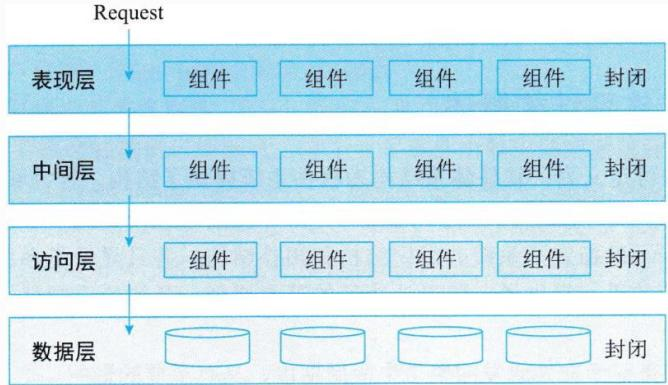

flowchart

This diagram illustrates the data structure and layering process of a system, showing how requests are distributed across four layers: Performance Layer, Intermediate Layer, Access Layer, and Data Layer.

分层架构的一个特性就是关注分离。该层中的组件只负责本层的逻辑，组件的划分很容易明确组件的角色和职责，也比较容易开发、测试、管理和维护。

层次式体系结构是一个可靠的通用的架构，对很多应用来说，如果不确定哪种架构适合，可以用层次式架构作为一个初始架构。

## 但设计时要注意以下两点：

(1)要注意污水池反模式

污水池反模式，就是请求流简单地穿过几个层，每层里面基本没有做任何业务逻辑，或者做了很少的业务逻辑。如果请求超过20%，则应该考虑让一些层变成开放的。

(2)需要考虑的是分层架构可能会让你的应用变得庞大。

即使你的表现层和中间层可以独立发布，但它的确会带来一些潜在的问题，比如：分布模式复杂、健壮性下降、可靠性和性能的不足，以及代码规模的膨胀等。 

## 第十三章 层次式架构设计理论与实践

13.1 层次式体系结构概述  
13.2 表现层框架设计  
13.3 中间层架构设计  
13.4 数据访问层设计  
13.5 数据架构规划与设计  
13.6 物联网层次架构设计

## 表现层设计模式

## 1.MVC模式

MVC 强制地把一个应用的输入、处理、输出流程按照视图、控制、模型的方式进行分离，形成了控制器、模型、视图三个核心模块。

(1)视图 (View)：用户看到并与之交互的界面。视图向用户显示相关的数据，并接收用户输入的数据，但是它并不进行任何实际的业务处理。

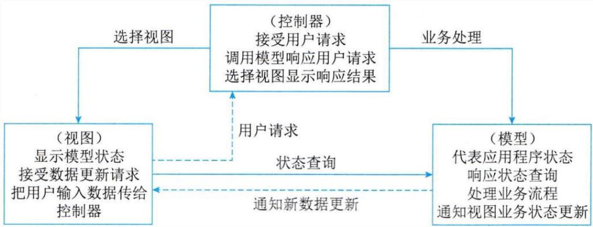

flowchart

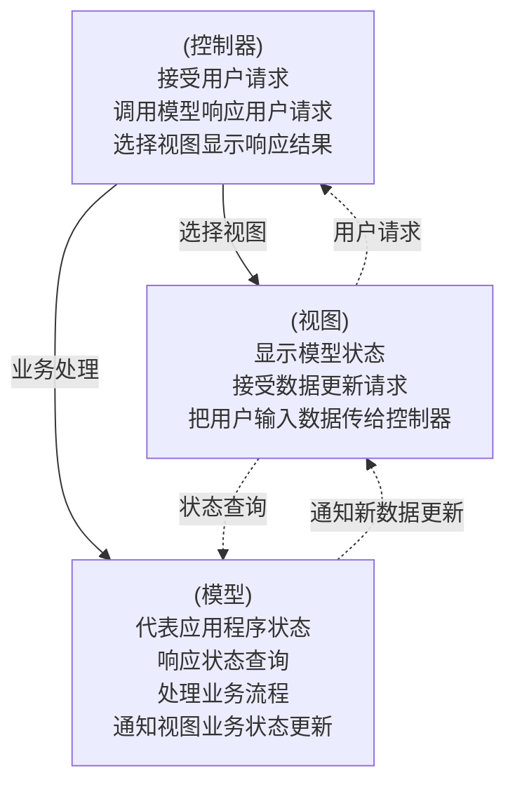

## (2)控制器(Controller)

接受用户的输入并调用模型和视图去完成用户的需求。该部分是用户界面与模型的接口。一方面它解释来自于视图的输入，将其解释成为系统能够理解的对象，同时它也识别用户动作，并将其解释为对模型特定方法的调用；另一方面，它处理来自于模型的事件和模型逻辑执行的结果，调用适当的视图为用户提供反馈。

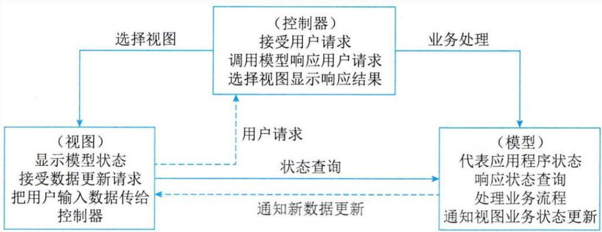

flowchart

## (3)模型(Model)

应用程序的主体部分。模型表示业务数据和业务逻辑。一个模型能为多个视图提供数据。由于同一个模型可以被多个视图重用，所以提高了应用的可重用性。

flowchart

## 2.MVP模式

MVP模式中Model提供数据，View负责显示，Presenter/Controller负责逻辑的处理。

MVP与MVC 有一些显著的区别，MVC模式中允许 View 和 Model直接进行"交流"，在MVP 模式中是不允许的。在MVP 中 View 并不直接使用 Model，它们之间的通信是通过 Presenter (MVC中的Controller)来进行的，所有的交互都发生在 Presenter 内部，而在MVC中View会直接从Model 中读取数据而不是通过 Controller。

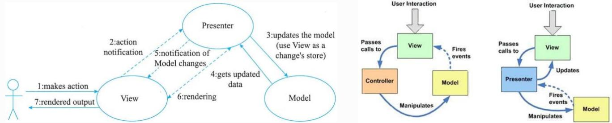

flowchart

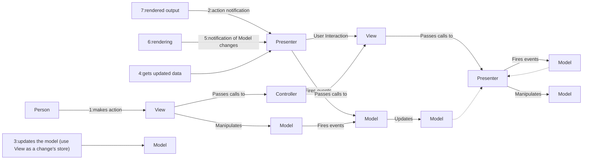

## 3.MVVM模式

MVVM模式正是为解决MVP中UI种类变多，接口也会不断增加的问题而提出的。MVVM模式全称是模型-视图-视图模型 (Model-View-ViewModel)，它和MVC、MVP类似，主要目的都是为了实现视图和模型的分离，不同的是 MVVM 中，View 与Model 的交互通过 ViewModel来实现。ViewModel是MVVM的核心，它通过DataBinding实现 View 与Model之间的双向绑定，其内容包括数据状态处理、数据绑定及数据转换。例如，View 中某处的状态和Model中某部分数据绑定在一起，这部分数据一旦变化将会反映到 View 层。而这个机制通过 ViewModel来实现。 高级项目经理 任

ViewModel，即视图模型，是一个专门用于数据转换的控制器，它可以把对象信息转换为视图信息，将命令从视图携带到对象。View和ViewModel之间使用DataBinding及其事件进行通信。View的用户接口事件仍然由 View自身处理，并把相关事性映射到ViewModel，以实现View中的对象与视图模型内容的同步，且可通过双向数据绑定进行更新。

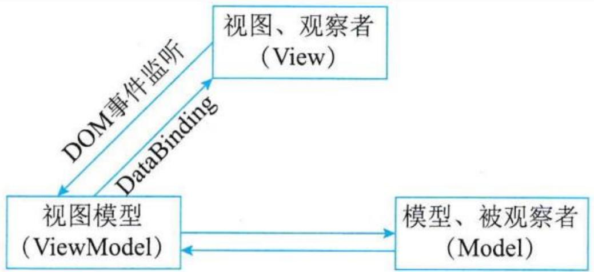

flowchart

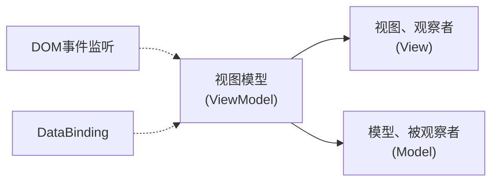

## 二、表现层中UIP设计思想

UIP是微软社区开发的众多Application Block 中的其中之一，它是开源的。UIP 提供了一个扩展的框架，用于简化用户界面与商业逻辑代码的分离的方法，可以用它来写复杂的用户界面导航和工作流处理，并且它能够复用在不同的场景并可以随着应用的增加而进行扩展。

## UIP框架把表现层分为了以下二层：

⚫ User Interface Components: 这个组件就是原来的表现层，用户看到的和进行交互都是这个组件，它负责获取用户的数据并且返回结果。  
User Interface Process Components: 这个组件用于协调用户界面的各部分，使其配合后台的活动，例如导航和工作流控制，以

及状态和视图的管理。

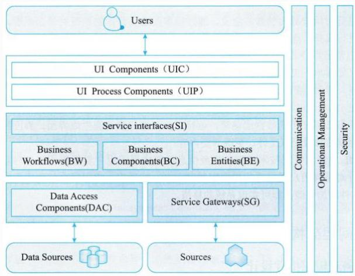

flowchart

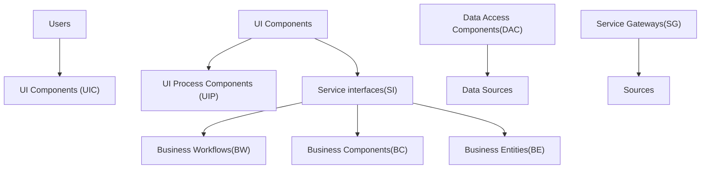

## 三、表现层动态生成设计思想

基于 XML 的界面管理技术可实现灵活的界面配置、界面动态生成和界面定制。其思路是用XML 生成配置文件及界面所需的元数据，按不同需求生成界面元素及软件界面。

基于XML 界面管理技术，包括界面配置、界面动态生成和界面定制三部分。

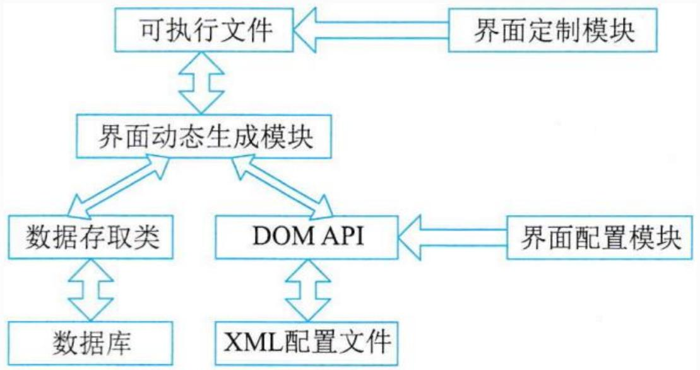

flowchart

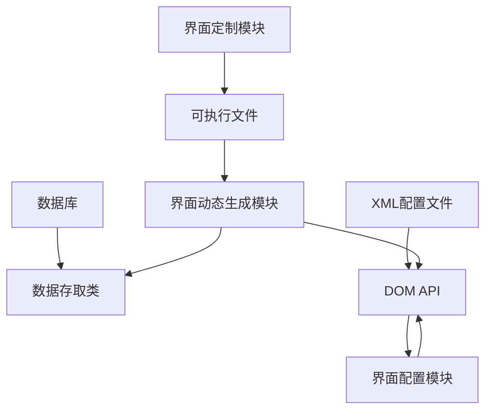

界面配置是对用户界面的静态定义，通过读取配置文件的初始值对界面配置。由界面配置对软件功能进行裁剪、重组和扩充，以实现特殊需求。  
界面定制是对用户界面的动态修改过程，在软件运行过程中，用户可按需求和使用习惯对界面元素(如菜单、工具栏、键盘命令) 的属性(如文字、图标、大小和位置等) 进行修改。软件运行结束，界面定制的结果被保存。

## Thank You