## 系统架构设计师

## 中间层架构设计


## 第十三章 层次式架构设计理论与实践

13.1 层次式体系结构概述  
13.2 表现层框架设计  
⚫ 13.3 中间层架构设计  
13.4 数据访问层设计  
13.5 数据架构规划与设计  
13.6 物联网层次架构设计

## 业务逻辑层框架

业务逻辑层负责定义业务逻辑（规则、工作流、数据完整性等），接收来自表示层的数据请求，逻辑判断后，向数据访问层提交请求，并传递数据访问结果，起着承上启下的作用。

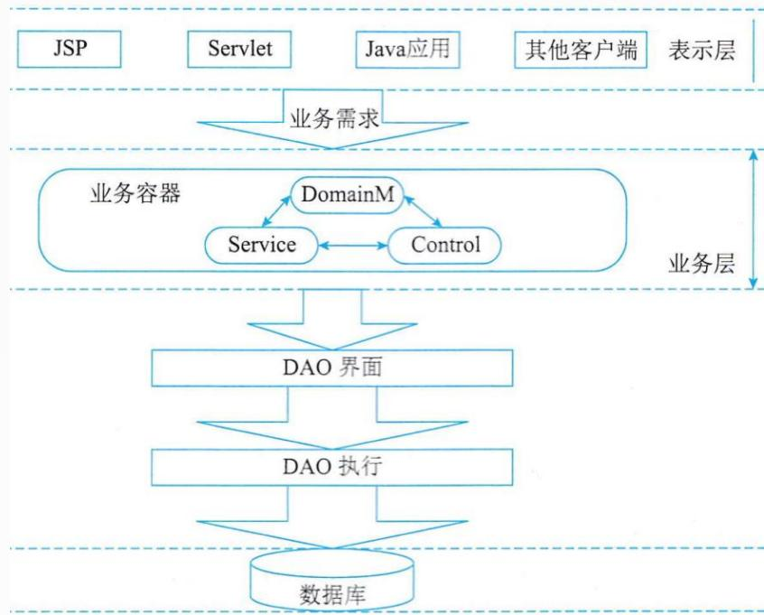

<details>
<summary>flowchart</summary>

This flowchart illustrates the architecture and data flow of a business system, showing how JSP, Servlet, Java application, and other clients interact with a Business Layer (业务层), which then flows through Service and Control layers to a DAO Interface and DAO Execution.
</details>


## 业务逻辑的内容包括四部分：

领域实体：定义了业务中的对象，对象有属性和行为；  
业务规则：定义了需要完成一个动作，必须满足的条件；  
数据完整性：某些数据不可少；  
工作流：业务流程的全部或部分自动化，在此过程中，文档、信息或任务按照一定的过程规则流转，实现组织成员间的协调工作以达到业务的整体目标。

## 第十三章 层次式架构设计理论与实践

13.1 层次式体系结构概述  
13.2 表现层框架设计  
13.3 中间层架构设计  
⚫ 13.4 数据访问层设计  
13.5 数据架构规划与设计  
13.6 物联网层次架构设计

## 5种数据访问模式

## 1.在线访问

在线访问是最基本的数据访问模式。在线访问模式会占用一个数据库连接，读取数据，每个数据库操作都会通过这个连接不断地与后台的数据源进行交互。

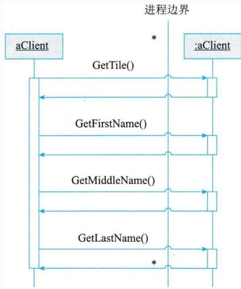

<details>
<summary>flowchart</summary>

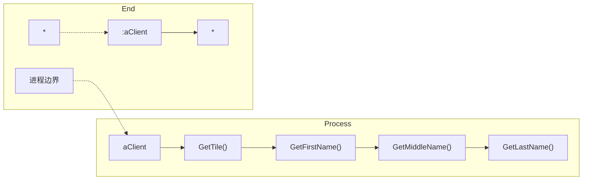
</details>


## 在线访问方式的优点：

可以处理复杂的 Select 语句  
性能比直接的 SQL要优越一些

在线访问方式的缺点：

业务对象和数据访问代码完全耦合在一起，代码混乱  
修改维护上相对困难  
开发程序员必须能看懂SQL语句

## 2. DataAccess Object

DAO(数据访问对象)模式是标准J2EE 设计模式之一，开发人员常常用这种模式将底层数据访问操作与高层业务逻辑分离开。

业务对象应该关注的是业务逻辑，不应该关心数据存取的细节，DAO组件只对他的客户端暴露一些非常简单的DAO外部接口，而将数据源的实现细节对客户端完全的隐藏起来。

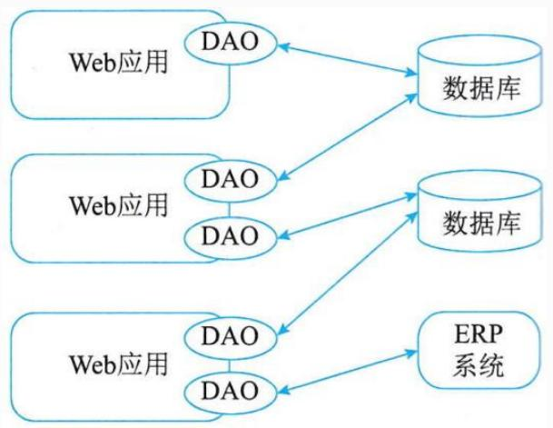

<details>
<summary>flowchart</summary>

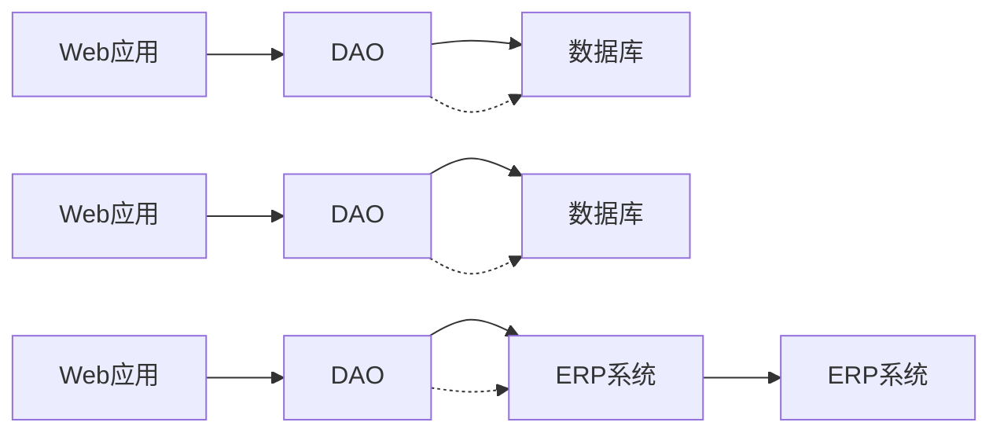
</details>


DAO提供了访问关系型数据库所需操作的接口，将数据访问和业务逻辑分离，对上层提供面向对象的数据访问接口。

优点：DAO设计模式可以减少代码量，增强程序的可移植性，提

高代码的可读性。

典型的 DAO实现包括以下组件：

一个DAO 工厂类  
一个DAO 接口  
⚫ 一个实现了 DAO 接口的具体类  
数据传输对象

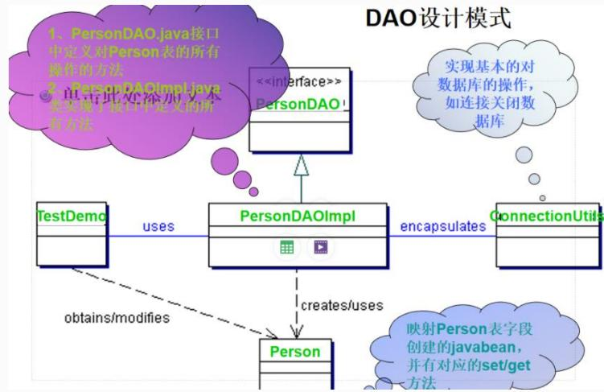

<details>
<summary>flowchart</summary>

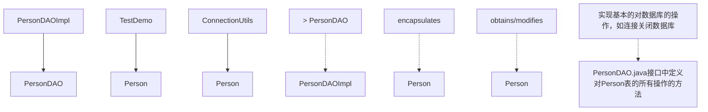
</details>

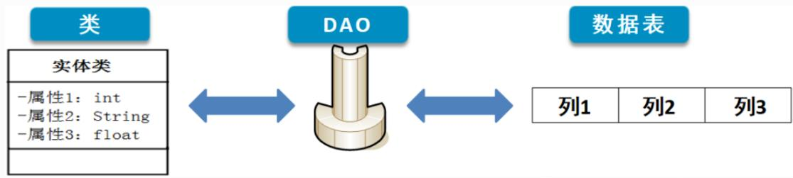

<details>
<summary>flowchart</summary>

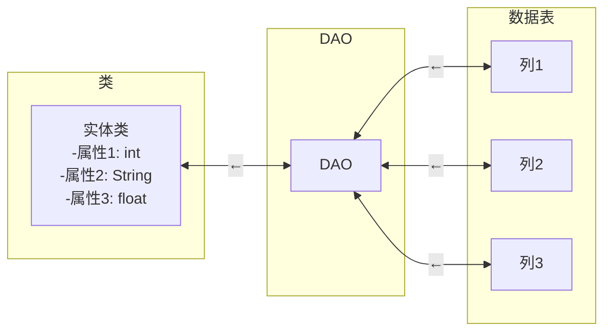
</details>

## 3.Data Transfer Object

DTO(数据传输对象)是这样一组对象或是数据的容器，它需要跨不同的进程或是网络的边界来传输数据。这类对象本身应该不包含具体的业务逻辑，与业务逻辑解耦。

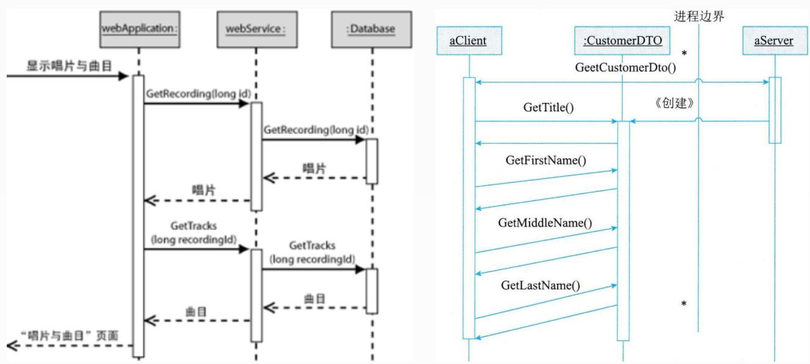

<details>
<summary>flowchart</summary>

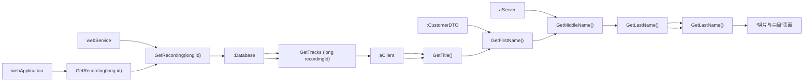
</details>


## 4.离线数据模式

离线数据模式是以数据为中心，数据从数据源获取之后，将按照某种预定义的结构存放在系统中，成为应用的中心。离线，对数据的各种操作独立于各种与后台数据源之间的连接或是事务；XML集成，数据可以方便地与XML 格式的文档之间互相转换；独立于数据源，离线数据模式的不同实现定义了数据的各异的存放结构和规则，这些都是独立于具体的某种数据源的。

## 5.对象/关系映射(O/R Mapping)

对象/关系映射的基本思想来源于这样一种现实: 多数应用的数据都是存在关系型数据库中，而这些应用程序中的数据在开发或是运行时是以对象的形式组织起来的，那么对象/关系映射就提供了这样一种工具或平台，能够将应用程序中的数据转换成关系型数据库中的记录，或是将关系数据库中的记录转换成应用程序中代码便于操作的对象。

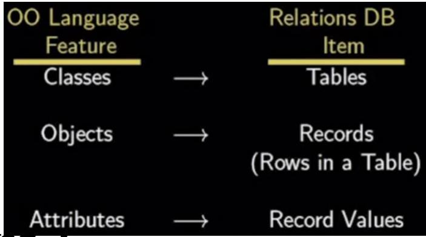

<details>
<summary>flowchart</summary>

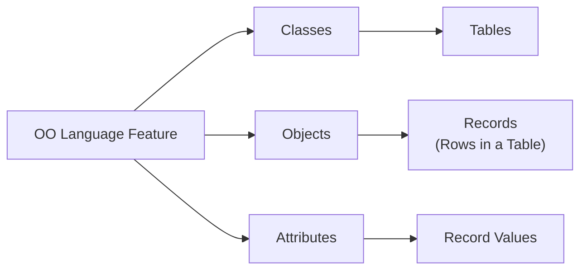
</details>

1.E-R图转换为关系模型

E-R图是由实体、属性和联系三要素构成，而关系模型中只有惟

一的结构--关系模式。

采用以下方法加以转换：

(1)实体向关系模式的转换  
(2)联系向关系模式的转换

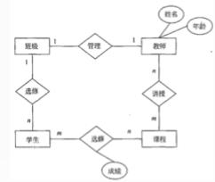

<details>
<summary>flowchart</summary>

```mermaid
graph TD
  A["教师"] --> B{"姓名\n年龄"}
  A --> C{"课程"}
  D["班级"] --> E{"管理"}
  F["学生"] --> G{"选择"}
  H["课程"] --> I{"课程"}
  C --> J{"选择"}
  K["讲师"] --> L{"选择"]
  M["讲师"] --> N{"选择"]
  O["讲师"] --> P{"选择"]
  Q["讲师"] --> R{"选择"]
  S["讲师"] --> T{"选择"]
  U["讲师"] --> V{"选择"]
  W["讲师"] --> X{"选择"]
  Y["讲师"] --> Z{"选择"]
  AA["讲师"] --> AB{"选择"]
  AC["讲师"] --> AD{"选择"]
  AE["讲师"] --> AF{"选择"]
  AG["讲师"] --> AH{"选择"]
  AI["讲师"] --> AJ{"选择"]
  AK["讲师"] --> AL{"选择"]
  AM["讲师"] --> AN{"选择"]
  AO["讲师"] --> AP{"选择"]
  AQ["讲师"] --> AR{"选择"]
  AS["讲师"] --> AT{"选择"]
  AU["讲师"] --> AV{"选择"]
  AW["讲师"] --> AX{"选择"]
  A --> Y
  A --> Z
  A --> AA
  A --> AB
  A --> AC
  A --> AD
  A --> AE
  A --> AF
  A --> AG
  A --> AH
  A --> AI
  A --> AJ
  A --> AK
  A --> AL
  A --> AM
  A --> AN
  A --> AO
  A --> AP
  A --> AQ
  A --> AS
  A --> AT
  A --> AU
  A --> AV
  A --> AW
  A --> AX
  A --> AQ
  A --> AS
  A --> AT
  A --> AU
  A --> AV
  A --> AW
  A --> AX
  A --> AQ
  A --> AS
  A --> AT
  A --> AU
  A --> AV
  A --> AW
  A --> AX
  A --> AQ
```
</details>


上人生路!

## Thank You